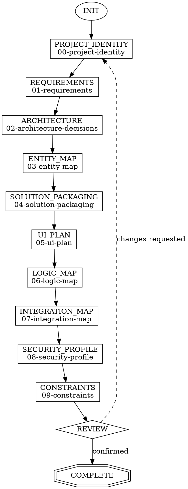

# Solution Discovery

solution-discovery is the entry point for all new work in pp-superpowers. It conducts a structured requirements conversation with the developer and produces the `.foundation/` directory — 10 markdown files defining project identity, requirements, architecture, entities, packaging, UI plan, logic map, integration map, security profile, and constraints. Every other skill reads from `.foundation/` at INIT.

**Announce:** "I'm using the solution-discovery skill to [create/resume/update] your project foundation."

---

## Mode Selection

At INIT, determine the operating mode:

```
IF .foundation/ does not exist → CREATE mode
IF .foundation/ exists AND .discovery-state.json stage != "COMPLETE" → RESUME mode
IF .foundation/ exists AND .discovery-state.json stage == "COMPLETE":
  → Ask: "Your foundation is complete. Would you like to update a section?"
  → If yes → UPDATE mode
  → If no → suggest downstream skill and exit
```

## Companion File Loading

<EXTREMELY-IMPORTANT>
Load companion files at the specified points. These are directives, not suggestions.

**CREATE mode:**
1. Read `./conversation-guide.md` now.
2. Read `./foundation-formats.md` before writing any section file.

**RESUME mode:**
1. Read `./state-spec.md` now.
2. Read `./conversation-guide.md` to continue from the first incomplete stage.
3. Read `./foundation-formats.md` before writing any section file.

**UPDATE mode:**
1. Read `./state-spec.md` now.
2. Read `./foundation-formats.md` before rewriting the updated section.
</EXTREMELY-IMPORTANT>

## CREATE Mode State Machine



**Fixed order.** Stages execute in the order shown. The developer cannot jump ahead or reorder — each stage builds on context from previous stages.

## Stage-Gate Summary

| Stage | Writes | Required | Can skip | Gate condition |
|---|---|---|---|---|
| INIT | — | — | No | Mode selected |
| PROJECT_IDENTITY | `00-project-identity.md` | Yes | No | Name, description, audience, project type answered |
| REQUIREMENTS | `01-requirements.md` | Yes | No | Problem, purpose, scope answered |
| ARCHITECTURE | `02-architecture-decisions.md` | Yes | No | App type confirmed (architecture-advisor recommendation) |
| ENTITY_MAP | `03-entity-map.md` | Yes | No | 2+ entities, 1+ relationship |
| SOLUTION_PACKAGING | `04-solution-packaging.md` | Yes | No | Packaging decision made (produces at least a default) |
| UI_PLAN | `05-ui-plan.md` | Conditional | Yes | 1+ persona, navigation confirmed — or placeholder |
| LOGIC_MAP | `06-logic-map.md` | Conditional | Yes | 1+ logic item — or placeholder |
| INTEGRATION_MAP | `07-integration-map.md` | Conditional | Yes | 1+ integration documented — or "none" — or placeholder |
| SECURITY_PROFILE | `08-security-profile.md` | Conditional | Yes | Security model selected — or placeholder |
| CONSTRAINTS | `09-constraints.md` | Yes | No | 1+ constraint or explicit "none identified" |
| REVIEW | — | — | No | Developer confirms foundation is complete |
| COMPLETE | Updates state | — | No | Suggest downstream skill, wait for confirmation |

### ARCHITECTURE Stage — Agent Dispatch

At the ARCHITECTURE stage, dispatch the **architecture-advisor** agent to analyze requirements and recommend an app type. Present the recommendation with rationale to the developer for confirmation. See the agent definition in `agents/` for the full analysis process.

## Red Flags

<HARD-GATE>
**Never do these:**

- Never skip a required section (00–03, 09) — these are Tier 1 foundation sections
- Never proceed past a stage gate without developer confirmation
- Never auto-start the next skill after COMPLETE — suggest, then wait
- Never modify an existing `.foundation/` in CREATE mode without asking first
- Never write a section file without the standard header (Status / Written by / Project)
- Never write an empty file for a skipped section — always write a placeholder using the template from `./foundation-formats.md`
</HARD-GATE>

## Integration

- **Upstream:** None — solution-discovery is the entry point
- **Downstream:** All skills consume `.foundation/` at their INIT stage
- **Pairs with:** solution-strategy (refines packaging when multi-solution complexity warrants it)
- **Agent:** architecture-advisor (dispatched at ARCHITECTURE stage)
