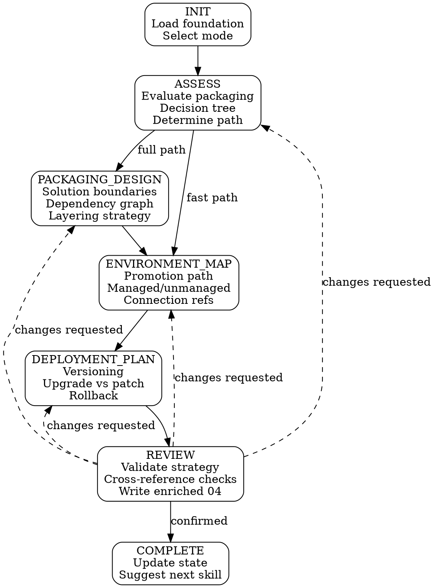

# Solution Strategy

solution-strategy refines the packaging decisions made during solution-discovery. It evaluates whether your single or multi-solution choice needs deeper architecture, then adds environment promotion paths, deployment planning, and dependency management to your `04-solution-packaging.md`.

**Announce:** "I'm using the solution-strategy skill to [create/resume/update] your solution strategy."

## Plan Mode Exit

<HARD-GATE>
This skill writes files at REVIEW and COMPLETE stages. If plan mode is active, tell the developer:
"solution-strategy needs to write files when we finish. Please exit plan mode (Shift+Tab) so I can proceed."
Do NOT continue past Mode Selection while plan mode is active.
</HARD-GATE>

---

## Prerequisites

<HARD-GATE>
Before proceeding, verify all of the following exist in `.foundation/`:
- `00-project-identity.md` (not placeholder)
- `01-requirements.md` (not placeholder)
- `02-architecture-decisions.md` (not placeholder)
- `04-solution-packaging.md` (not placeholder)

If ANY are missing or placeholder → STOP and tell the developer:
"I need a complete project foundation with solution packaging before I can proceed. Run solution-discovery first."

Also verify `.foundation/.discovery-state.json` shows `"stage": "COMPLETE"`.
If discovery is not complete → STOP:
"solution-discovery is still in progress (stage: [stage]). Complete discovery first, then run solution-strategy."
</HARD-GATE>

---

## Mode Selection

At INIT, determine the operating mode:

```
IF .foundation/ does not exist → BLOCK ("Run solution-discovery first.")
IF .foundation/04-solution-packaging.md missing or placeholder → BLOCK
IF .strategy-state.json does not exist → CREATE mode
IF .strategy-state.json exists AND stage != "COMPLETE" → RESUME mode
IF .strategy-state.json exists AND stage == "COMPLETE":
  → Ask: "Your solution strategy is complete. Would you like to update it?"
  → If yes → UPDATE mode
  → If no → suggest downstream skill and exit
```

## Companion File Loading

<EXTREMELY-IMPORTANT>
Load companion files at the specified points. These are directives, not suggestions.

**CREATE mode:**
1. Read `./conversation-guide.md` now.

**RESUME mode:**
1. Read `./conversation-guide.md` now.
2. Read `.foundation/.strategy-state.json` to determine resume point.

**UPDATE mode:**
1. Read `./conversation-guide.md` now.
2. Read `.foundation/04-solution-packaging.md` to present current state.
</EXTREMELY-IMPORTANT>

## CREATE Mode State Machine



## Stage-Gate Summary

| Stage | Gate Condition | Output |
|---|---|---|
| INIT | Foundation exists with complete 04-solution-packaging | Mode selected, foundation loaded |
| ASSESS | Decision tree completed, path (fast/full) determined | Assessment result stored in state |
| PACKAGING_DESIGN | Solutions defined with boundaries and dependencies (full path only) | Solution boundaries in state |
| ENVIRONMENT_MAP | ≥2 environments defined with states and promotion order | Environment map in state |
| DEPLOYMENT_PLAN | Versioning strategy selected, deployment type decided, rollback documented | Deployment plan in state |
| REVIEW | Developer confirms all decisions, cross-reference checks pass or acknowledged | Enriched `04-solution-packaging.md` written |
| COMPLETE | File written successfully | `.strategy-state.json` updated, next skill suggested |

## Fast Path vs Full Path

**Fast path** (single-solution, no ISV, single team):
- PACKAGING_DESIGN is **skipped entirely**
- ENVIRONMENT_MAP and DEPLOYMENT_PLAN use **abbreviated question sets** (3 focused questions instead of full rounds)
- REVIEW is the same but with fewer items to validate

**Full path** (multi-solution or ISV):
- All stages execute with full question rounds
- PACKAGING_DESIGN defines solution boundaries, dependency graph, and layering
- ISV branch adds customization boundary and distribution tier questions

## UPDATE Mode State Machine

```
INIT → ASPECT_SELECT → ASPECT_UPDATE → REVIEW → COMPLETE
```

The developer selects which aspect to update:
- **Packaging structure** — add/remove/modify solutions and dependencies
- **Environment map** — add/remove environments, change promotion path
- **Deployment plan** — change versioning, deployment type, or rollback procedure

After the update, REVIEW re-validates against foundation requirements and presents downstream impact warnings.

---

## Red Flags

<EXTREMELY-IMPORTANT>
- **NEVER** modify `04-solution-packaging.md` without the developer confirming at REVIEW
- **NEVER** delete or overwrite the original solution-discovery content in `04-solution-packaging.md` — always preserve and append
- **NEVER** auto-start a downstream skill after COMPLETE — present the suggestion and wait
- **NEVER** skip ASSESS — even if the developer says "just add environments," the assessment determines the correct path
- **NEVER** allow circular dependencies in the solution dependency graph
- **NEVER** write the enriched file before REVIEW confirmation — collect decisions in conversation context, write atomically at REVIEW
</EXTREMELY-IMPORTANT>

---

## Integration

- **Upstream:** solution-discovery — produces `.foundation/` and initial `04-solution-packaging.md`
- **Downstream:** alm-workflow (reads environment promotion map and deployment plan), environment-setup (reads connection references)
- **Cross-reference:** application-design may signal multi-solution need via bounded context tension check
- **Agents:** None
