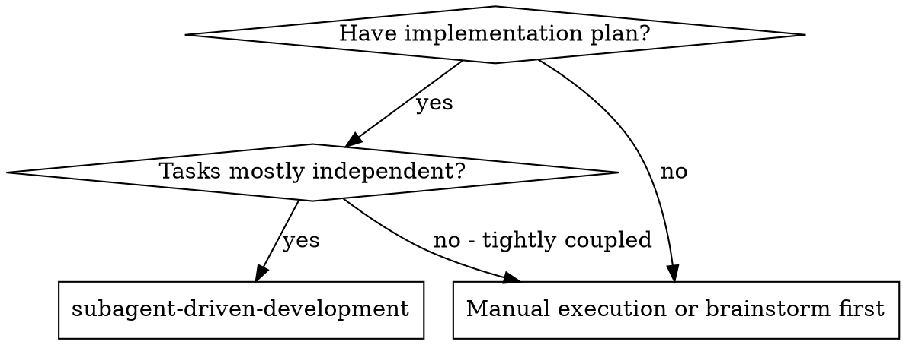
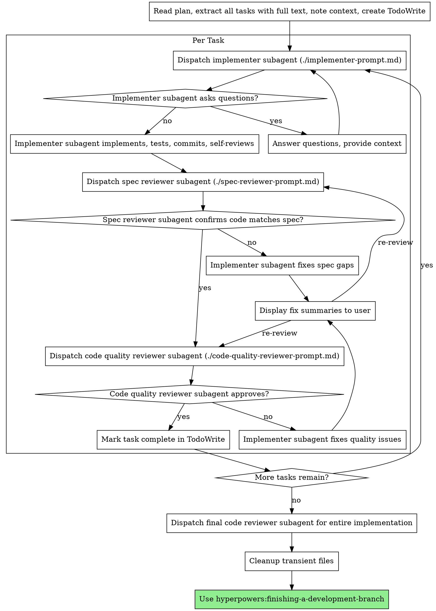

# Subagent-Driven Development

Execute plan by dispatching fresh subagent per task, with two-stage review after each: spec compliance review first, then code quality review.

**Core principle:** Fresh subagent per task + two-stage review (spec then quality) = high quality, fast iteration

## When to Use



**This is the standard approach for plan execution:**
- Same session (no context switch)
- Fresh subagent per task (no context pollution)
- Two-stage review after each task: spec compliance first, then code quality
- Faster iteration (no human-in-loop between tasks)

## The Process



## MANDATORY CHECKPOINT: Pre-Implementation Setup

**REQUIRED before the task loop. These offers MUST be presented - user decides execution.**

### Step 1: Branch Creation Offer (if not on feature branch)

Check if on main/master/develop:
```bash
git branch --show-current
```

**REQUIRED:** If on base branch, you MUST present the branch creation offer. Skipping this offer = incomplete setup.

If on base branch, dispatch issue-tracking agent:
```
Task(description: "Get branch convention",
     prompt: "Operation: get-branch-convention
Context: [plan goal/primary issue]",
     model: "haiku",
     subagent_type: "general-purpose")
```

**MUST use AskUserQuestion tool** to present offer to user:
```
AskUserQuestion(
  questions: [{
    question: "Create this branch?",
    header: "Branch",
    options: [
      {label: "Yes", description: "Create branch: feature/PROJ-123-add-user-auth"},
      {label: "Modify", description: "Let me specify a different branch name"},
      {label: "Skip", description: "Don't create a branch, stay on current"}
    ],
    multiSelect: false
  }]
)
```

Only execute after user approval via AskUserQuestion response.

### Step 2: Status Update Offer

**REQUIRED:** If primary issue exists (from plan header, branch name, or discovery), you MUST present the status update offer.

If primary issue identified, dispatch issue-tracking agent:
```
Task(description: "Prepare status update",
     prompt: "Operation: update-status
Issue: [primary issue ID]
New status: in-progress",
     model: "haiku",
     subagent_type: "general-purpose")
```

**MUST use AskUserQuestion tool** to present offer:
```
AskUserQuestion(
  questions: [{
    question: "Update issue PROJ-123 status to in-progress?",
    header: "Status",
    options: [
      {label: "Yes", description: "Update status to in-progress"},
      {label: "Skip", description: "Leave status unchanged"}
    ],
    multiSelect: false
  }]
)
```

Only execute after user approval via AskUserQuestion response.

### Discovered Work Tracking

During task execution, when work uncovers something that should be tracked, append to `docs/current-progress.md`:

```markdown
## Discovered Work
- [ ] "Need to add rate limiting to API" (discovered in Task 3)
- [ ] "Auth tokens should expire after 24h" (discovered in Task 5)
```

**No offers during execution.** Discovered work is batched for presentation at verification checkpoint.

### Pre-Implementation Checkpoint Gate

```
BEFORE starting task loop:

1. CHECK: On base branch?
   - YES → MUST present Branch Creation Offer
   - NO → Skip branch offer

2. CHECK: Primary issue exists?
   - YES → MUST present Status Update Offer
   - NO → Skip status offer

Skip presenting any required offer = incomplete pre-implementation setup
```

**Note:** User can decline any offer. The REQUIREMENT is presentation, not execution.

## Prompt Templates

- `./implementer-prompt.md` - Dispatch implementer subagent
- `./spec-reviewer-prompt.md` - Dispatch spec compliance reviewer subagent
- `./code-quality-reviewer-prompt.md` - Dispatch code quality reviewer subagent

## Model Selection (Strict)

| Subagent Type | Model | Rationale |
|---------------|-------|-----------|
| Implementer | `sonnet/opus` | Requires coding intelligence, TDD execution |
| Spec Reviewer | `haiku` | Validation task, pattern matching |
| Code Quality Reviewer | `haiku` | Validation task, checklist-based |
| Exploration | `haiku` | Quick reads, summarization |

**Do NOT use opus/sonnet for validation tasks** - wastes tokens, no quality improvement.

When dispatching subagents:
- `Task(implementer_prompt)` - inherits orchestrator model (sonnet/opus)
- `Task(spec_reviewer_prompt, model: "haiku")` - fast validation
- `Task(code_quality_reviewer_prompt, model: "haiku")` - fast validation

This pattern follows Anthropic's recommendation: orchestrator handles complex reasoning, Haiku handles validation subtasks.

## Example Workflow

```
You: I'm using Subagent-Driven Development to execute this plan.

[Read plan file once: docs/plans/feature-plan.md]
[Extract all 5 tasks with full text and context]
[Create TodoWrite with all tasks]

Task 1: Hook installation script

[Get Task 1 text and context (already extracted)]
[Dispatch implementation subagent with full task text + context]

Implementer: "Before I begin - should the hook be installed at user or system level?"

You: "User level (~/.config/hyperpowers/hooks/)"

Implementer: "Got it. Implementing now..."
[Later] Implementer:
  - Implemented install-hook command
  - Added tests, 5/5 passing
  - Self-review: Found I missed --force flag, added it
  - Committed

[Dispatch spec compliance reviewer]
Spec reviewer: ✅ Spec compliant - all requirements met, nothing extra

[Get git SHAs, dispatch code quality reviewer]
Code reviewer: Strengths: Good test coverage, clean. Issues: None. Approved.

[Mark Task 1 complete]

Task 2: Recovery modes

[Get Task 2 text and context (already extracted)]
[Dispatch implementation subagent with full task text + context]

Implementer: [No questions, proceeds]
Implementer:
  - Added verify/repair modes
  - 8/8 tests passing
  - Self-review: All good
  - Committed

[Dispatch spec compliance reviewer]
Spec reviewer: ❌ Issues:
  - Missing: Progress reporting (spec says "report every 100 items")
  - Extra: Added --json flag (not requested)

[Implementer fixes issues]
Implementer: Removed --json flag, added progress reporting

Fixed: Removed --json flag
- Why: Flag was not requested in spec; YAGNI violation
- Before:
    parser.add_argument('--json', action='store_true')
- After:
    [removed]

Fixed: Added progress reporting
- Why: Spec requires reporting every 100 items for user feedback
- Before:
    for item in items:
        process(item)
- After:
    for i, item in enumerate(items):
        if i % 100 == 0: print(f"Progress: {i}/{len(items)}")
        process(item)

[Re-reviewing spec compliance...]
[Spec reviewer reviews again]
Spec reviewer: ✅ Spec compliant now

[Dispatch code quality reviewer]
Code reviewer: Strengths: Solid. Issues (Important): Magic number (100)

[Implementer fixes]
Implementer: Extracted PROGRESS_INTERVAL constant

[Code reviewer reviews again]
Code reviewer: ✅ Approved

[Mark Task 2 complete]

...

[After all tasks]
[Dispatch final code-reviewer]
Final reviewer: All requirements met, ready to merge

Done!
```

## Advantages

**vs. Manual execution:**
- Subagents follow TDD naturally
- Fresh context per task (no confusion)
- Parallel-safe (subagents don't interfere)
- Subagent can ask questions (before AND during work)

**Efficiency gains:**
- No file reading overhead (controller provides full text)
- Controller curates exactly what context is needed
- Subagent gets complete information upfront
- Questions surfaced before work begins (not after)

**Quality gates:**
- Self-review catches issues before handoff
- Two-stage review: spec compliance, then code quality
- Review loops ensure fixes actually work
- Spec compliance prevents over/under-building
- Code quality ensures implementation is well-built

**Cost:**
- More subagent invocations (implementer + 2 reviewers per task)
- Controller does more prep work (extracting all tasks upfront)
- Review loops add iterations
- But catches issues early (cheaper than debugging later)

## Progress Tracking

Create `docs/current-progress.md` (gitignored) that agents update during execution:

```markdown
# Current Progress

## Active Task
Task 3: Add retry logic to API client

## Status
IN_PROGRESS

## Last Update
2025-01-15 14:32 - Implementer: Tests written, implementing retry wrapper

## Completed Tasks
- [x] Task 1: Setup project structure
- [x] Task 2: Add base API client

## Discovered Work
- [ ] "Need to add rate limiting to API" (discovered in Task 3)
- [ ] "Auth tokens should expire after 24h" (discovered in Task 5)
```

**Status flags:** `PENDING`, `IN_PROGRESS`, `READY_FOR_SPEC_REVIEW`, `READY_FOR_CODE_REVIEW`, `BLOCKED`, `DONE`

**Usage:**
- Orchestrator checks this file to understand state
- Agents update when transitioning
- Enables resumability if session interrupted

## Context Curation

Before dispatching a subagent, curate exactly what it needs.

**Original Issue Extraction:**

Before the task loop begins, extract the "## Original Issue" section from the plan:
1. Search plan for `## Original Issue` header
2. Parse the header metadata (ID, Title, Status)
3. Extract full body text
4. Store for inclusion in each implementer prompt

If no Original Issue block found in plan, note this and proceed without.

**Minimal Context Principle:** Each subagent receives ONLY what it needs for its specific task.

**Always include:**
- Full task text from plan (never make subagent read plan file)
- Relevant file paths it will work with
- Decisions from previous tasks that affect this one
- Original Issue context (if present in plan) with appropriate instruction

**Include if relevant:**
- Architectural constraints (from design doc)
- Existing patterns to follow (with example file path)
- Known gotchas or edge cases

**Never include:**
- Full plan (only the current task)
- Unrelated completed task details
- General project background (subagent reads CLAUDE.md)

**Rule of thumb:** If you're unsure whether to include something, provide the file path instead of the content. Let the subagent decide whether to read it.

**Structured Handoff Format:**

Use structured format, not free-form prose:

```
Task: [exact task from plan]
Files: [specific paths]
Context: [only relevant prior decisions]
Constraints: [any limitations]
```

## Context Pollution Warning

**Signs of context pollution:**
- Subagent asks about unrelated tasks
- Subagent references old, irrelevant context
- Subagent gets confused about current state
- Token usage growing unexpectedly

**Prevention:**
- Fresh subagent per task (no reuse)
- Explicit context curation before dispatch
- Don't forward full conversation history

## COMPULSORY: Task Loop Verification

Before each task:

**Context Curation Gate** (COMPULSORY):

- [ ] Full task text extracted from plan (not file path)
- [ ] Relevant file paths included
- [ ] Prior decisions affecting this task noted
- [ ] Original Issue context included (if present in plan)
- [ ] Appropriate instruction added (Authoritative: verify criteria; Reference Only: context only)
- [ ] Structured handoff format used

**STOP CONDITION:** If subagent needs to read plan file, STOP. Provide full text.

## COMPULSORY: Handoff Consumption Verification

**Implementer Consumption Gate** (COMPULSORY - enforced via prompt):

- [ ] Implementer prompt requires acknowledgment of handoff sections
- [ ] Implementer must state: "Received context for: [task name]"
- [ ] Implementer must reference specific files from handoff before modifying

**Orchestrator Verification** (COMPULSORY):

- [ ] Verify implementer's response references handoff content
- [ ] If implementer proceeds without acknowledgment, STOP and re-prompt

**STOP CONDITION:** If implementer output doesn't reference handoff, reject and re-dispatch with explicit consumption requirement.

After implementer completes:

**Review Sequence Gate** (COMPULSORY):

- [ ] Spec Compliance Review completed FIRST
- [ ] Spec issues fixed (if any)
- [ ] THEN Code Quality Review
- [ ] Quality issues fixed (if any)
- [ ] Both reviews approved

**STOP CONDITION:** If attempting Code Quality before Spec Compliance approved, STOP. Wrong order.

**Task Completion Gate** (COMPULSORY):

- [ ] Both reviews approved
- [ ] TodoWrite updated (task marked complete)
- [ ] Progress file updated

**STOP CONDITION:** If moving to next task without both reviews approved, STOP.

## Displaying Fix Summaries

After the implementer completes a fix cycle (before re-dispatching reviewer), the orchestrator:

1. **Read the handoff file** - Look for `## Fixes Applied` section in `docs/handoffs/task-N-impl.md`
2. **Parse the fix entries** - Extract each fix's title, why, before, after
3. **Display inline to user** - Format for terminal:

**Display format:**

```
Fixed: [Fix title from ### header]
- Why: [Content of Why field]
- Before:
    [Code from Before block, indented 4 spaces]
- After:
    [Code from After block, indented 4 spaces]

Fixed: [Next fix title]
...

[Re-reviewing spec/code quality...]
```

**Parsing guidance:**
- Look for `### Fix N:` headers
- Extract content between `- **Why:**` and the next field
- Extract code blocks after `- **Before:**` and `- **After:**`
- Skip malformed entries; log warning but continue

**If no Fixes Applied section found:**
- Display: "[Implementer reported no fixes to display]"
- Proceed to re-review (may indicate implementer didn't follow format)

## Red Flags

**Never:**
- **Use plain text questions instead of AskUserQuestion** - bypasses structured response UI
- Skip reviews (spec compliance OR code quality)
- **Skip presenting branch/status offers at session start** (offers are mandatory, execution is optional)
- **Skip displaying fixes to user** (orchestrator should always show what was fixed before re-review)
- Proceed with unfixed issues
- Dispatch multiple implementation subagents in parallel (conflicts)
- Make subagent read plan file (provide full text instead)
- Skip scene-setting context (subagent needs to understand where task fits)
- Ignore subagent questions (answer before letting them proceed)
- Accept "close enough" on spec compliance (spec reviewer found issues = not done)
- Skip review loops (reviewer found issues = implementer fixes = review again)
- Let implementer self-review replace actual review (both are needed)
- **Start code quality review before spec compliance is ✅** (wrong order)
- Move to next task while either review has open issues

**AskUserQuestion is MANDATORY** for all user interaction points (branch offers, status offers). Plain text questions are NOT acceptable.

**If subagent asks questions:**
- Answer clearly and completely
- Provide additional context if needed
- Don't rush them into implementation

**If reviewer finds issues:**
- Implementer (same subagent) fixes them
- Reviewer reviews again
- Repeat until approved
- Don't skip the re-review

**If subagent fails task:**
- Dispatch fix subagent with specific instructions
- Don't try to fix manually (context pollution)

## Integration

**Required workflow skills:**
- **hyperpowers:writing-plans** - Creates the plan this skill executes
- **hyperpowers:requesting-code-review** - Code review template for reviewer subagents
- **hyperpowers:finishing-a-development-branch** - Complete development after all tasks

**Subagents should use:**
- **hyperpowers:test-driven-development** - Subagents follow TDD for each task

## Cleanup

After final review passes and before using `hyperpowers:finishing-a-development-branch`, clean up transient files:

```bash
rm -rf docs/handoffs/
rm -f docs/current-progress.md
```

These files are gitignored and only needed during execution:
- `docs/handoffs/task-N-impl.md` - Implementation reports for reviewers
- `docs/current-progress.md` - Progress tracking for resumability

**Why cleanup?**
- Prevents stale context from affecting future sessions
- Keeps directory clean for next plan execution
- Files have no value after successful completion
