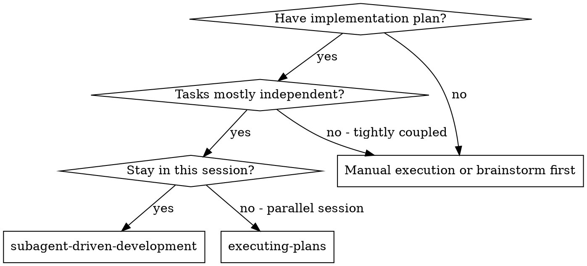
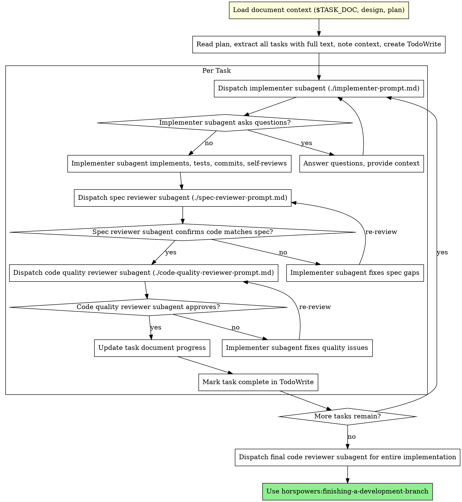

# Subagent-Driven Development

Execute plan by dispatching fresh subagent per task, with two-stage review after each: spec compliance review first, then code quality review.

**Core principle:** Fresh subagent per task + two-stage review (spec then quality) = high quality, fast iteration

**Announce at start:** "我正在使用子代理驱动开发技能来执行这个计划..." (I'm using subagent-driven development to execute this plan...)

## When to Use



**vs. Executing Plans (parallel session):**
- Same session (no context switch)
- Fresh subagent per task (no context pollution)
- Two-stage review after each task: spec compliance first, then code quality
- Faster iteration (no human-in-loop between tasks)

## The Process

### Step 0: Load Document Context (文档上下文传递)

**Before starting task execution:**

IF `.horspowers-config.yaml` exists AND `documentation.enabled: true`:

1. **Read task document path** (from writing-plans):
   ```bash
   # 检查任务文档是否存在
   if [ -n "$TASK_DOC" ] && [ -f "$TASK_DOC" ]; then
     echo "✅ 任务文档: $TASK_DOC"
     cat "$TASK_DOC"
   elif [ -n "$TASK_DOC" ]; then
     # 文档路径设置但文件不存在 - 增强处理
     echo "⚠️  警告: TASK_DOC 已设置但文件不存在: $TASK_DOC"
     echo ""

     # 尝试搜索相关文档
     echo "🔍 搜索相关文档..."
     RECENT_TASKS=$(find docs/active -name "task*.md" -mtime -7 2>/dev/null | head -3)
     if [ -n "$RECENT_TASKS" ]; then
       echo "最近的任务文档:"
       echo "$RECENT_TASKS"
     fi

     # 提供流程引导建议
     echo ""
     echo "💡 推荐工作流程:"
     echo "   新功能: brainstorming → writing-plans → (当前技能)"
     echo "   修复 bug: systematic-debugging → test-driven-development"
     echo ""

     # 检查文档系统是否初始化
     if [ ! -d "docs/active" ]; then
       echo "📋 文档系统未初始化。运行 'horspowers:document-management' 初始化文档系统。"
     fi

     echo "继续使用可用上下文执行..."
   fi
   ```

2. **Read related documents** (if specified in task document):
   ```bash
   # 设计文档 (如果在任务文档中链接)
   DESIGN_DOC="docs/plans/YYYY-MM-DD-design-<topic>.md"
   if [ -f "$DESIGN_DOC" ]; then
     echo "✅ 设计文档: $DESIGN_DOC"
     cat "$DESIGN_DOC"
   fi

   # 计划文档 (如果在任务文档中链接)
   PLAN_DOC="docs/plans/YYYY-MM-DD-<feature>.md"
   if [ -f "$PLAN_DOC" ]; then
     echo "✅ 计划文档: $PLAN_DOC"
     cat "$PLAN_DOC"
   fi
   ```

3. **Pass document paths to subagents**:
   Each subagent prompt should include relevant document paths for context

**Note:** 如果文档不存在，跳过加载并使用可用上下文继续执行任务。

**IF documentation is NOT enabled:**
- Skip document loading
- Proceed with plan execution



## Prompt Templates

- `./implementer-prompt.md` - Dispatch implementer subagent
- `./spec-reviewer-prompt.md` - Dispatch spec compliance reviewer subagent
- `./code-quality-reviewer-prompt.md` - Dispatch code quality reviewer subagent

## Example Workflow

```
You: I'm using Subagent-Driven Development to execute this plan.

[Read plan file once: docs/plans/feature-plan.md]
[Extract all 5 tasks with full text and context]
[Create TodoWrite with all tasks]

Task 1: Hook installation script

[Get Task 1 text and context (already extracted)]
[Dispatch implementation subagent with full task text + context]

Implementer: "Before I begin - should the hook be installed at user or system level?"

You: "User level (~/.config/superpowers/hooks/)"

Implementer: "Got it. Implementing now..."
[Later] Implementer:
  - Implemented install-hook command
  - Added tests, 5/5 passing
  - Self-review: Found I missed --force flag, added it
  - Committed

[Dispatch spec compliance reviewer]
Spec reviewer: ✅ Spec compliant - all requirements met, nothing extra

[Get git SHAs, dispatch code quality reviewer]
Code reviewer: Strengths: Good test coverage, clean. Issues: None. Approved.

[Mark Task 1 complete]

Task 2: Recovery modes

[Get Task 2 text and context (already extracted)]
[Dispatch implementation subagent with full task text + context]

Implementer: [No questions, proceeds]
Implementer:
  - Added verify/repair modes
  - 8/8 tests passing
  - Self-review: All good
  - Committed

[Dispatch spec compliance reviewer]
Spec reviewer: ❌ Issues:
  - Missing: Progress reporting (spec says "report every 100 items")
  - Extra: Added --json flag (not requested)

[Implementer fixes issues]
Implementer: Removed --json flag, added progress reporting

[Spec reviewer reviews again]
Spec reviewer: ✅ Spec compliant now

[Dispatch code quality reviewer]
Code reviewer: Strengths: Solid. Issues (Important): Magic number (100)

[Implementer fixes]
Implementer: Extracted PROGRESS_INTERVAL constant

[Code reviewer reviews again]
Code reviewer: ✅ Approved

[Mark Task 2 complete]

...

[After all tasks]
[Dispatch final code-reviewer]
Final reviewer: All requirements met, ready to merge

Done!
```

## Advantages

**vs. Manual execution:**
- Subagents follow TDD naturally
- Fresh context per task (no confusion)
- Parallel-safe (subagents don't interfere)
- Subagent can ask questions (before AND during work)

**vs. Executing Plans:**
- Same session (no handoff)
- Continuous progress (no waiting)
- Review checkpoints automatic

**Efficiency gains:**
- No file reading overhead (controller provides full text)
- Controller curates exactly what context is needed
- Subagent gets complete information upfront
- Questions surfaced before work begins (not after)

**Quality gates:**
- Self-review catches issues before handoff
- Two-stage review: spec compliance, then code quality
- Review loops ensure fixes actually work
- Spec compliance prevents over/under-building
- Code quality ensures implementation is well-built

**Cost:**
- More subagent invocations (implementer + 2 reviewers per task)
- Controller does more prep work (extracting all tasks upfront)
- Review loops add iterations
- But catches issues early (cheaper than debugging later)

## Red Flags

**Never:**
- Skip reviews (spec compliance OR code quality)
- Proceed with unfixed issues
- Dispatch multiple implementation subagents in parallel (conflicts)
- Make subagent read plan file (provide full text instead)
- Skip scene-setting context (subagent needs to understand where task fits)
- Ignore subagent questions (answer before letting them proceed)
- Accept "close enough" on spec compliance (spec reviewer found issues = not done)
- Skip review loops (reviewer found issues = implementer fixes = review again)
- Let implementer self-review replace actual review (both are needed)
- **Start code quality review before spec compliance is ✅** (wrong order)
- Move to next task while either review has open issues

**If subagent asks questions:**
- Answer clearly and completely
- Provide additional context if needed
- Don't rush them into implementation

**If reviewer finds issues:**
- Implementer (same subagent) fixes them
- Reviewer reviews again
- Repeat until approved
- Don't skip the re-review

**If subagent fails task:**
- Dispatch fix subagent with specific instructions
- Don't try to fix manually (context pollution)

## Task Completion

For each completed task:

1. **Update task document automatically:**
   IF `$TASK_DOC` is set AND documentation is enabled:
     ```bash
     # Update progress with task description
     node -e "
     const fs = require('fs');
     const path = require('path');

     const taskDoc = process.env.TASK_DOC;
     if (fs.existsSync(taskDoc)) {
         let content = fs.readFileSync(taskDoc, 'utf8');
         const timestamp = new Date().toISOString().slice(0, 10);
         const taskDesc = '[task-description]'; // Replace with actual task description

         // Update status to 进行中 if not already
         if (!content.includes('状态:进行中') && !content.includes('状态:已完成')) {
             content = content.replace(/- 状态[：:].+/, '- 状态: 进行中');
         }

         // Add progress entry
         const progressEntry = \`- \${timestamp}: \${taskDesc} 完成\`;

         if (content.includes('## 进展记录')) {
             // 已有进展记录，添加新条目
             content = content.replace(
                 /(## 进展记录\\n[\\s\\S]*?)(?=\\n##|\\Z)/,
                 '\$1\\n' + progressEntry
             );
         } else {
             // 没有进展记录，创建新的部分
             const lastHeaderMatch = content.lastIndexOf('\n## ');
             if (lastHeaderMatch > 0) {
                 const insertPoint = content.indexOf('\n', lastHeaderMatch);
                 const progressSection = \`\n## 进展记录\n\${progressEntry}\n\`;
                 content = content.slice(0, insertPoint + 1) + progressSection + content.slice(insertPoint + 1);
             }
         }

         fs.writeFileSync(taskDoc, content);
     }
     "
     ```

2. **Mark as complete when all tasks done:**
   IF all tasks completed AND `$TASK_DOC` is set:
     Update status to "已完成" and add final progress entry

## Integration

**Required workflow skills:**
- **horspowers:writing-plans** - Creates the plan this skill executes
- **horspowers:requesting-code-review** - Code review template for reviewer subagents
- **horspowers:finishing-a-development-branch** - Complete development after all tasks

**Subagents should use:**
- **horspowers:test-driven-development** - Subagents follow TDD for each task

**Alternative workflow:**
- **horspowers:executing-plans** - Use for parallel session instead of same-session execution
