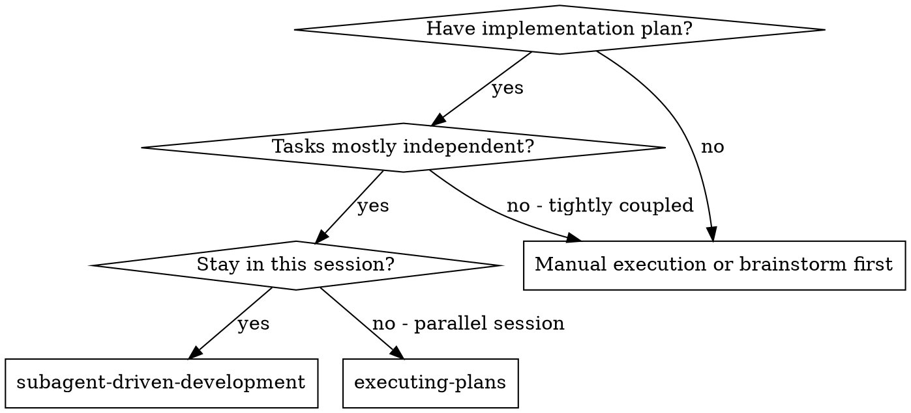
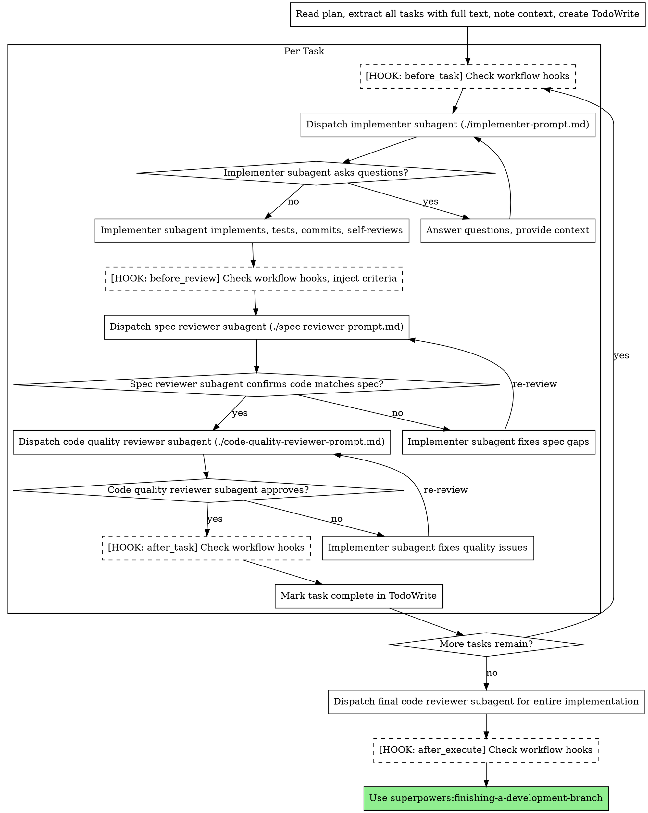

# Subagent-Driven Development

Execute plan by dispatching fresh subagent per task, with two-stage review after each: spec compliance review first, then code quality review.

**Core principle:** Fresh subagent per task + two-stage review (spec then quality) = high quality, fast iteration

## When to Use



**vs. Executing Plans (parallel session):**
- Same session (no context switch)
- Fresh subagent per task (no context pollution)
- Two-stage review after each task: spec compliance first, then code quality
- Faster iteration (no human-in-loop between tasks)

## The Process

**[HOOK: before_execute]** Before starting execution:
1. Look for `.claude/workflow-hooks.yaml` or `~/.claude/workflow-hooks.yaml`
2. If `before_execute` hooks are defined, invoke each skill where condition passes
3. For `mode: enforce` hooks (e.g., project-quality-setup), block execution until criteria met



## Workflow Hooks Detail

### [HOOK: before_execute]
**When:** After reading plan, before first task
**Purpose:** Verify prerequisites, enforce quality gates
**Example:** `project-quality-setup` with `mode: enforce` blocks execution until linting/formatting/CI are configured

### [HOOK: before_task]
**When:** Before dispatching implementer for each task
**Purpose:** Task-specific setup, context injection
**Example:** Skills that prepare environment for specific task types

### [HOOK: before_review]
**When:** After implementation complete, before dispatching reviewers
**Purpose:** Inject additional review criteria into reviewer prompts
**Example:** `functional-core-imperative-shell` and `react-best-practices` with `mode: inject` add their checklists to the code quality reviewer prompt

**For `mode: inject` hooks:** Read the skill's checklist/criteria section and append it to the reviewer prompt template before dispatching.

### [HOOK: after_task]
**When:** After task complete and all reviews pass
**Purpose:** Post-task cleanup, incremental improvements
**Example:** `boy-scout-rule` for refactoring, `visual-feedback-loop` for UI verification (with `condition: if_ui_changed`)

**Condition evaluation for `if_ui_changed`:** Check if the task's git diff includes files matching UI patterns (*.tsx, *.jsx, *.vue, *.svelte, *.css, components/).

### [HOOK: after_execute]
**When:** After all tasks complete, before finishing
**Purpose:** Final quality checks, documentation
**Example:** Skills that verify overall implementation quality

## Prompt Templates

- `./implementer-prompt.md` - Dispatch implementer subagent
- `./spec-reviewer-prompt.md` - Dispatch spec compliance reviewer subagent
- `./code-quality-reviewer-prompt.md` - Dispatch code quality reviewer subagent

## Example Workflow

```
You: I'm using Subagent-Driven Development to execute this plan.

[Read plan file once: docs/plans/feature-plan.md]
[Extract all 5 tasks with full text and context]
[Create TodoWrite with all tasks]

[HOOK: before_execute]
[Check ~/.claude/workflow-hooks.yaml - found before_execute hooks]
[Invoke dev-ethos:project-quality-setup (mode: enforce)]
[Project has linting, formatting, CI - criteria met, proceeding]

Task 1: Hook installation script

[HOOK: before_task]
[No before_task hooks configured, proceeding]

[Get Task 1 text and context (already extracted)]
[Dispatch implementation subagent with full task text + context]

Implementer: "Before I begin - should the hook be installed at user or system level?"

You: "User level (~/.config/superpowers/hooks/)"

Implementer: "Got it. Implementing now..."
[Later] Implementer:
  - Implemented install-hook command
  - Added tests, 5/5 passing
  - Self-review: Found I missed --force flag, added it
  - Committed

[HOOK: before_review]
[Check hooks - found before_review hooks with mode: inject]
[Read dev-ethos:functional-core-imperative-shell checklist]
[Append to code-quality-reviewer-prompt.md]

[Dispatch spec compliance reviewer]
Spec reviewer: ✅ Spec compliant - all requirements met, nothing extra

[Get git SHAs, dispatch code quality reviewer with injected criteria]
Code reviewer: Strengths: Good test coverage, clean.
  Issues: None (functional-core criteria checked - logic is pure)
  Approved.

[HOOK: after_task]
[Check hooks - found after_task hooks]
[Invoke dev-ethos:boy-scout-rule - apply refactoring checklist]
[No refactoring needed, code is clean]
[Check if_ui_changed condition - no UI files in diff, skip visual-feedback-loop]

[Mark Task 1 complete]

Task 2: Dashboard component

[HOOK: before_task]
[No before_task hooks, proceeding]

[Dispatch implementation subagent...]
...
[Implementation complete]

[HOOK: before_review]
[Inject functional-core + react-best-practices (if_react condition passes)]

[Reviews pass]

[HOOK: after_task]
[Invoke boy-scout-rule - no issues]
[Check if_ui_changed - YES, .tsx files in diff]
[Invoke visual-feedback-loop - screenshot, verify UI renders correctly]
[Invoke ux-visual-evaluation - check visual design quality]

[Mark Task 2 complete]

...

[After all tasks]
[Dispatch final code-reviewer]
Final reviewer: All requirements met, ready to merge

[HOOK: after_execute]
[No after_execute hooks, proceeding]

[Use superpowers:finishing-a-development-branch]
Done!
```

## Advantages

**vs. Manual execution:**
- Subagents follow TDD naturally
- Fresh context per task (no confusion)
- Parallel-safe (subagents don't interfere)
- Subagent can ask questions (before AND during work)

**vs. Executing Plans:**
- Same session (no handoff)
- Continuous progress (no waiting)
- Review checkpoints automatic

**Efficiency gains:**
- No file reading overhead (controller provides full text)
- Controller curates exactly what context is needed
- Subagent gets complete information upfront
- Questions surfaced before work begins (not after)

**Quality gates:**
- Self-review catches issues before handoff
- Two-stage review: spec compliance, then code quality
- Review loops ensure fixes actually work
- Spec compliance prevents over/under-building
- Code quality ensures implementation is well-built
- **Workflow hooks extend quality gates with external skills**

**Cost:**
- More subagent invocations (implementer + 2 reviewers per task)
- Controller does more prep work (extracting all tasks upfront)
- Review loops add iterations
- Hook invocations add overhead but catch issues early
- But catches issues early (cheaper than debugging later)

## Red Flags

**Never:**
- Start implementation on main/master branch without explicit user consent
- Skip reviews (spec compliance OR code quality)
- Proceed with unfixed issues
- Dispatch multiple implementation subagents in parallel (conflicts)
- Make subagent read plan file (provide full text instead)
- Skip scene-setting context (subagent needs to understand where task fits)
- Ignore subagent questions (answer before letting them proceed)
- Accept "close enough" on spec compliance (spec reviewer found issues = not done)
- Skip review loops (reviewer found issues = implementer fixes = review again)
- Let implementer self-review replace actual review (both are needed)
- **Start code quality review before spec compliance is ✅** (wrong order)
- Move to next task while either review has open issues
- **Skip workflow hooks** (they're configured for a reason)

**If subagent asks questions:**
- Answer clearly and completely
- Provide additional context if needed
- Don't rush them into implementation

**If reviewer finds issues:**
- Implementer (same subagent) fixes them
- Reviewer reviews again
- Repeat until approved
- Don't skip the re-review

**If subagent fails task:**
- Dispatch fix subagent with specific instructions
- Don't try to fix manually (context pollution)

## Integration

**Required workflow skills:**
- **superpowers:using-git-worktrees** - REQUIRED: Set up isolated workspace before starting
- **superpowers:writing-plans** - Creates the plan this skill executes
- **superpowers:requesting-code-review** - Code review template for reviewer subagents
- **superpowers:finishing-a-development-branch** - Complete development after all tasks

**Subagents should use:**
- **superpowers:test-driven-development** - Subagents follow TDD for each task

**Alternative workflow:**
- **superpowers:executing-plans** - Use for parallel session instead of same-session execution

## Workflow Hooks Reference

This skill supports these hook points (see `hooks/workflow-hooks.md`):

| Hook | When | Mode | Example Skills |
|------|------|------|----------------|
| `before_execute` | Start of execution | invoke/enforce | Project quality setup |
| `before_task` | Before each task | invoke | Task-specific setup |
| `before_review` | Before reviewers | inject | FCIS, React best practices |
| `after_task` | After task complete | invoke | Boy scout rule, visual feedback |
| `after_execute` | After all tasks | invoke | Final quality checks |

To configure hooks, create `.claude/workflow-hooks.yaml` or `~/.claude/workflow-hooks.yaml`.
