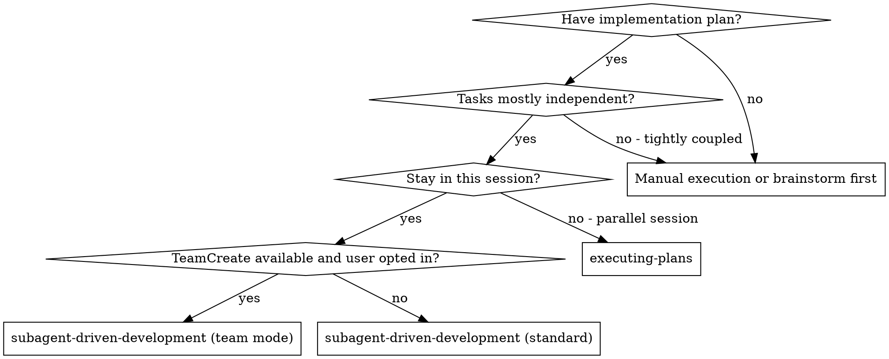
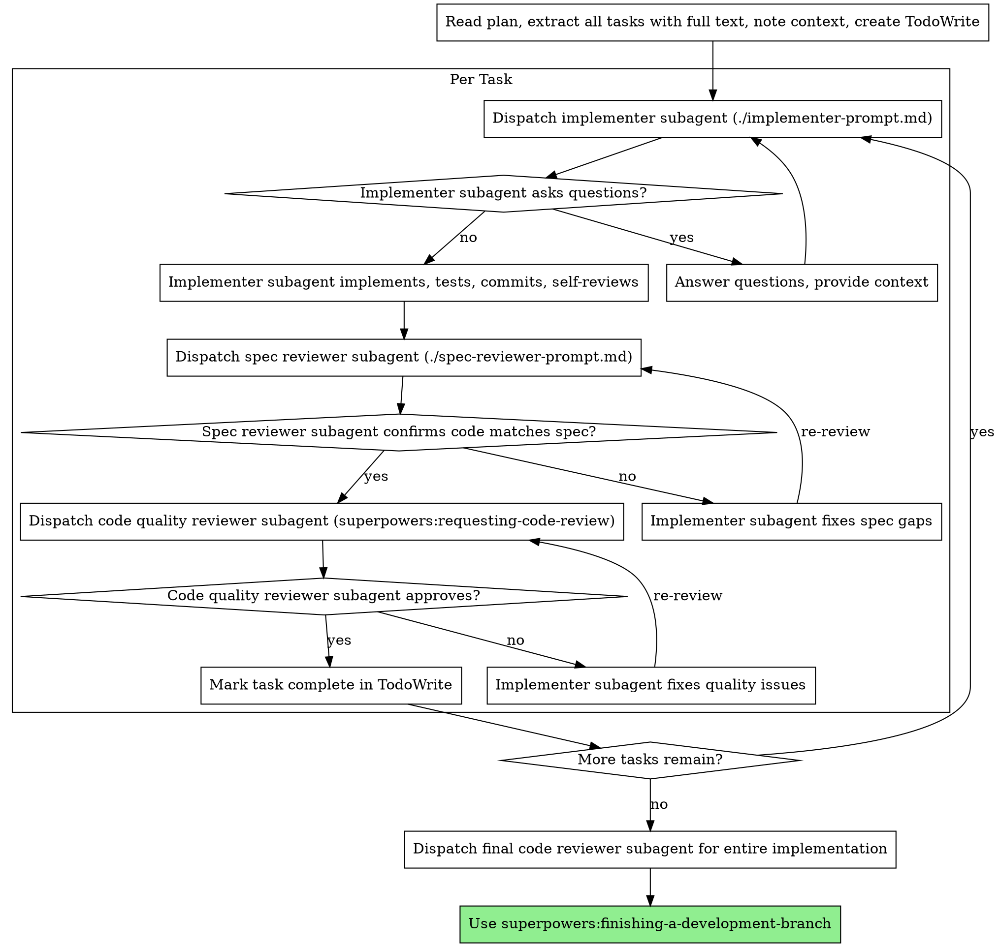
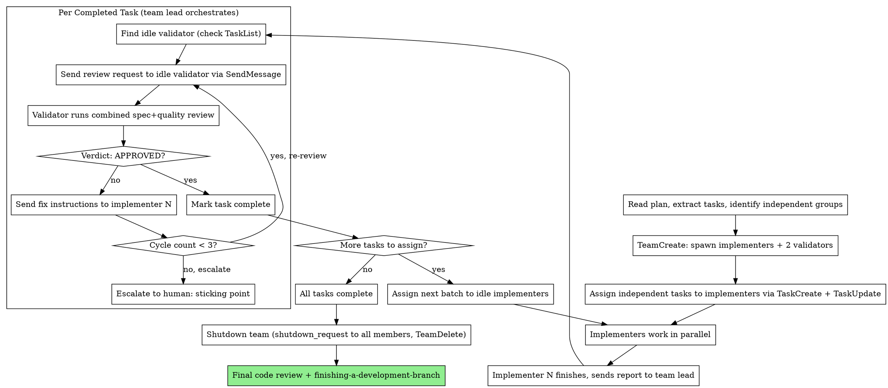

# Subagent-Driven Development

Execute plan by dispatching fresh subagent per task, with combined spec+quality review after each. In team mode: persistent validator agents eliminate per-review startup overhead and enable cross-task gap detection.

**Why subagents:** You delegate tasks to specialized agents with isolated context. By precisely crafting their instructions and context, you ensure they stay focused and succeed at their task. They should never inherit your session's context or history — you construct exactly what they need. This also preserves your own context for coordination work.

**Core principle:** Fresh subagent per task + evidence-cited review = high quality, fast iteration. Team mode adds persistent validators for speed and cross-task memory.

## When to Use


```dot
digraph when_to_use {
    "Have implementation plan?" [shape=diamond];
    "Tasks mostly independent?" [shape=diamond];
    "Stay in this session?" [shape=diamond];
    "TeamCreate available and user opted in?" [shape=diamond];
    "subagent-driven-development (team mode)" [shape=box];
    "subagent-driven-development (standard)" [shape=box];
    "executing-plans" [shape=box];
    "Manual execution or brainstorm first" [shape=box];

    "Have implementation plan?" -> "Tasks mostly independent?" [label="yes"];
    "Have implementation plan?" -> "Manual execution or brainstorm first" [label="no"];
    "Tasks mostly independent?" -> "Stay in this session?" [label="yes"];
    "Tasks mostly independent?" -> "Manual execution or brainstorm first" [label="no - tightly coupled"];
    "Stay in this session?" -> "TeamCreate available and user opted in?" [label="yes"];
    "Stay in this session?" -> "executing-plans" [label="no - parallel session"];
    "TeamCreate available and user opted in?" -> "subagent-driven-development (team mode)" [label="yes"];
    "TeamCreate available and user opted in?" -> "subagent-driven-development (standard)" [label="no"];
}
```

**vs. Executing Plans (parallel session):**
- Same session (no context switch)
- Fresh subagent per task (no context pollution)
- Evidence-cited review after each task (mandatory file:line citations)
- Faster iteration (no human-in-loop between tasks)

**Team mode vs. Standard mode:**
- True parallelism (multiple implementers working simultaneously on independent tasks)
- Persistent validators: no per-review startup overhead, cross-task gap detection
- Combined spec+quality review in a single pass (one agent call per task instead of two)
- Requires Claude Code with teams feature enabled

## The Process


```dot
digraph process {
    rankdir=TB;

    subgraph cluster_per_task {
        label="Per Task";
        "Dispatch implementer subagent (./implementer-prompt.md)" [shape=box];
        "Implementer subagent asks questions?" [shape=diamond];
        "Answer questions, provide context" [shape=box];
        "Implementer subagent implements, tests, commits, self-reviews" [shape=box];
        "Dispatch spec reviewer subagent (./spec-reviewer-prompt.md)" [shape=box];
        "Spec reviewer subagent confirms code matches spec?" [shape=diamond];
        "Implementer subagent fixes spec gaps" [shape=box];
        "Dispatch code quality reviewer subagent (superpowers:requesting-code-review)" [shape=box];
        "Code quality reviewer subagent approves?" [shape=diamond];
        "Implementer subagent fixes quality issues" [shape=box];
        "Mark task complete in TodoWrite" [shape=box];
    }

    "Read plan, extract all tasks with full text, note context, create TodoWrite" [shape=box];
    "More tasks remain?" [shape=diamond];
    "Dispatch final code reviewer subagent for entire implementation" [shape=box];
    "Use superpowers:finishing-a-development-branch" [shape=box style=filled fillcolor=lightgreen];

    "Read plan, extract all tasks with full text, note context, create TodoWrite" -> "Dispatch implementer subagent (./implementer-prompt.md)";
    "Dispatch implementer subagent (./implementer-prompt.md)" -> "Implementer subagent asks questions?";
    "Implementer subagent asks questions?" -> "Answer questions, provide context" [label="yes"];
    "Answer questions, provide context" -> "Dispatch implementer subagent (./implementer-prompt.md)";
    "Implementer subagent asks questions?" -> "Implementer subagent implements, tests, commits, self-reviews" [label="no"];
    "Implementer subagent implements, tests, commits, self-reviews" -> "Dispatch spec reviewer subagent (./spec-reviewer-prompt.md)";
    "Dispatch spec reviewer subagent (./spec-reviewer-prompt.md)" -> "Spec reviewer subagent confirms code matches spec?";
    "Spec reviewer subagent confirms code matches spec?" -> "Implementer subagent fixes spec gaps" [label="no"];
    "Implementer subagent fixes spec gaps" -> "Dispatch spec reviewer subagent (./spec-reviewer-prompt.md)" [label="re-review"];
    "Spec reviewer subagent confirms code matches spec?" -> "Dispatch code quality reviewer subagent (superpowers:requesting-code-review)" [label="yes"];
    "Dispatch code quality reviewer subagent (superpowers:requesting-code-review)" -> "Code quality reviewer subagent approves?";
    "Code quality reviewer subagent approves?" -> "Implementer subagent fixes quality issues" [label="no"];
    "Implementer subagent fixes quality issues" -> "Dispatch code quality reviewer subagent (superpowers:requesting-code-review)" [label="re-review"];
    "Code quality reviewer subagent approves?" -> "Mark task complete in TodoWrite" [label="yes"];
    "Mark task complete in TodoWrite" -> "More tasks remain?";
    "More tasks remain?" -> "Dispatch implementer subagent (./implementer-prompt.md)" [label="yes"];
    "More tasks remain?" -> "Dispatch final code reviewer subagent for entire implementation" [label="no"];
    "Dispatch final code reviewer subagent for entire implementation" -> "Use superpowers:finishing-a-development-branch";
}
```

## Model Selection

Use the least powerful model that can handle each role to conserve cost and increase speed.

**Mechanical implementation tasks** (isolated functions, clear specs, 1-2 files): use a fast, cheap model. Most implementation tasks are mechanical when the plan is well-specified.

**Integration and judgment tasks** (multi-file coordination, pattern matching, debugging): use a standard model.

**Architecture, design, and review tasks**: use the most capable available model.

**Task complexity signals:**
- Touches 1-2 files with a complete spec → cheap model
- Touches multiple files with integration concerns → standard model
- Requires design judgment or broad codebase understanding → most capable model

## Handling Implementer Status

Implementer subagents report one of four statuses. Handle each appropriately:

**DONE:** Proceed to spec compliance review.

**DONE_WITH_CONCERNS:** The implementer completed the work but flagged doubts. Read the concerns before proceeding. If the concerns are about correctness or scope, address them before review. If they're observations (e.g., "this file is getting large"), note them and proceed to review.

**NEEDS_CONTEXT:** The implementer needs information that wasn't provided. Provide the missing context and re-dispatch.

**BLOCKED:** The implementer cannot complete the task. Assess the blocker:
1. If it's a context problem, provide more context and re-dispatch with the same model
2. If the task requires more reasoning, re-dispatch with a more capable model
3. If the task is too large, break it into smaller pieces
4. If the plan itself is wrong, escalate to the human

**Never** ignore an escalation or force the same model to retry without changes. If the implementer said it's stuck, something needs to change.

## Prompt Templates

**Standard mode:**
- `./implementer-prompt.md` - Implementer subagent
- `./spec-reviewer-prompt.md` - Spec compliance reviewer (standard mode only)
- `./code-quality-reviewer-prompt.md` - Code quality reviewer (standard mode only, dispatched after spec passes)

**Team mode:**
- `./implementer-prompt.md` - Implementer subagent (same template)
- `./validator-prompt.md` - Persistent validator (combined spec+quality, used by validator team members)

## Team Mode (Claude Code Only)

When `TeamCreate` is available and the user opts in, use this flow instead of standard sequential execution.

**Pre-Flight:** Before spawning the team, run `/compact` if the current session has 20 or more turns. Team lead context bloat slows all orchestration turns — start lean. Implementer agents always start fresh, so compacting benefits the lead without affecting them.

**Prerequisite:** Run the SDK memory validation test (see design doc) before first use. Confirm team members retain conversation context between `SendMessage` calls.

**Core difference:** Persistent validator agents replace fresh-subagent-per-review. Validators accumulate codebase context across tasks and run combined spec+quality review in a single pass.

### Team Composition

- **Team Lead (you):** Orchestrates work, assigns tasks, routes reviews, handles escalations
- **Implementer agents:** One per independent task group, spawned as team members, work in parallel
- **Validator agents (2):** Persistent team members, each handles combined spec+quality review. Declared idle/busy via TaskUpdate.

```
Team:
  - team-lead (you)
  - implementer-1, implementer-2, implementer-3   ← parallel, one per task group
  - validator-1, validator-2                       ← persistent, combined spec+quality
```

### Team Mode Process


```dot
digraph team_process {
    rankdir=TB;

    "Read plan, extract tasks, identify independent groups" [shape=box];
    "TeamCreate: spawn implementers + 2 validators" [shape=box];
    "Assign independent tasks to implementers via TaskCreate + TaskUpdate" [shape=box];
    "Implementers work in parallel" [shape=box];
    "Implementer N finishes, sends report to team lead" [shape=box];

    subgraph cluster_per_task {
        label="Per Completed Task (team lead orchestrates)";
        "Find idle validator (check TaskList)" [shape=box];
        "Send review request to idle validator via SendMessage" [shape=box];
        "Validator runs combined spec+quality review" [shape=box];
        "Verdict: APPROVED?" [shape=diamond];
        "Send fix instructions to implementer N" [shape=box];
        "Cycle count < 3?" [shape=diamond];
        "Escalate to human: sticking point" [shape=box];
        "Mark task complete" [shape=box];
    }

    "More tasks to assign?" [shape=diamond];
    "Assign next batch to idle implementers" [shape=box];
    "All tasks complete" [shape=box];
    "Shutdown team (shutdown_request to all members, TeamDelete)" [shape=box];
    "Final code review + finishing-a-development-branch" [shape=box style=filled fillcolor=lightgreen];

    "Read plan, extract tasks, identify independent groups" -> "TeamCreate: spawn implementers + 2 validators";
    "TeamCreate: spawn implementers + 2 validators" -> "Assign independent tasks to implementers via TaskCreate + TaskUpdate";
    "Assign independent tasks to implementers via TaskCreate + TaskUpdate" -> "Implementers work in parallel";
    "Implementers work in parallel" -> "Implementer N finishes, sends report to team lead";
    "Implementer N finishes, sends report to team lead" -> "Find idle validator (check TaskList)";
    "Find idle validator (check TaskList)" -> "Send review request to idle validator via SendMessage";
    "Send review request to idle validator via SendMessage" -> "Validator runs combined spec+quality review";
    "Validator runs combined spec+quality review" -> "Verdict: APPROVED?";
    "Verdict: APPROVED?" -> "Send fix instructions to implementer N" [label="no"];
    "Send fix instructions to implementer N" -> "Cycle count < 3?";
    "Cycle count < 3?" -> "Send review request to idle validator via SendMessage" [label="yes, re-review"];
    "Cycle count < 3?" -> "Escalate to human: sticking point" [label="no, escalate"];
    "Verdict: APPROVED?" -> "Mark task complete" [label="yes"];
    "Mark task complete" -> "More tasks to assign?";
    "More tasks to assign?" -> "Assign next batch to idle implementers" [label="yes"];
    "Assign next batch to idle implementers" -> "Implementers work in parallel";
    "More tasks to assign?" -> "All tasks complete" [label="no"];
    "All tasks complete" -> "Shutdown team (shutdown_request to all members, TeamDelete)";
    "Shutdown team (shutdown_request to all members, TeamDelete)" -> "Final code review + finishing-a-development-branch";
}
```

### Routing a Review Request

When sending a review request to a validator via `SendMessage`, include:

```
Task spec: [FULL TEXT of task requirements]
Implementer report: [full report including test output, diff stat, files changed]
BASE_SHA: [commit before this task]
HEAD_SHA: [current HEAD after implementer's commit]
SHA map (for dependency re-reads): [dict of prior task → their HEAD_SHA, e.g. {"task-1": "abc123", "task-2": "def456"}]
```

The SHA map lets the validator re-read prior task diffs when it infers dependencies from the task spec. Team lead maintains this map as tasks complete.

### Validator Idle State Tracking

Validators use TaskUpdate to declare availability:
- On receiving a review request: `TaskUpdate(taskId: their-current-task-id, status: "in_progress")`
- After sending verdict: `TaskUpdate(status: "completed")`, then notify team lead

Team lead checks TaskList before routing. If both validators show `in_progress`, wait rather than double-sending.

### Re-Review Loop Bound

Maximum **3 review cycles per task.** After 3 rejections, team lead pauses plan execution, reports the sticking point (with full rejection history) to the human, and waits for guidance. Do not continue to other tasks while a task is stuck.

### Context Poisoning Mitigations

**Proactive (re-read rule):** When reviewing task N, validators must re-read the git diff of any prior task they infer as a dependency (from the task spec text). They use the SHA map from the review request. Memory of prior approvals is not substituted for reading source.

**Reactive (bounded re-open):** If a downstream task's review reveals an upstream approval was wrong, team lead may flag the upstream task for one re-review. Cap: one re-open per task.

**Re-open cascade:** When task N is re-opened:
- Downstream tasks in-progress: pause them (send hold instruction to implementer) until task N fix is confirmed
- Downstream tasks completed: flag them for re-review after task N fix is confirmed

**Validator rotation (large plans):** For plans with more than 8 tasks, replace a validator with a fresh one after every 5 tasks that validator has reviewed. Note: this partially resets cross-task memory for exactly the plans most likely to have cross-task gaps. The re-read rule still protects dependencies that are stated explicitly in the task spec; undeclared implicit dependencies may not be caught post-rotation. This tradeoff (bounded context cost vs. full cross-task coverage) is intentional.

### Validator Failure Recovery

If a validator does not respond within 60 seconds of receiving a review request:
1. Team lead sends one follow-up ping
2. If no response within 30 more seconds: treat validator as failed
3. Fall back to a fresh subagent review for that task using `validator-prompt.md`
4. Mark the failed validator's slot unavailable; do not reuse it

### Key Constraints in Team Mode

- **One implementer per task** — never assign two implementers to the same task (conflicts)
- **One validator per active review** — check TaskList before routing; don't double-send
- **Cycle cap is 3** — after 3 rejections, escalate to human, do not continue looping
- **SHA map is required** — team lead maintains it; validators cannot re-read dependencies without it
- **Team lead assigns via TaskUpdate** — implementers do not self-assign tasks
- **Shutdown protocol required** — always send `shutdown_request` to all members before `TeamDelete`
- **Never dispatch a fresh review subagent when a validator is available** — use the persistent validator
- **Validator approval of a re-opened task is required before re-reviewing its dependents**
- **Never skip context compaction** — run `/compact` before `TeamCreate` if session has 20+ turns

### Team Lifecycle

1. `/compact` if session has 20+ turns, then `TeamCreate`
2. Spawn implementers and 2 validators via Agent tool with `team_name`
3. Assign initial independent tasks via TaskCreate + TaskUpdate
4. As tasks complete: route to idle validator, handle verdict, assign next tasks
5. When all tasks complete: send `shutdown_request` to all, `TeamDelete`
6. Final code review + `finishing-a-development-branch`

## Example Workflow

```
You: I'm using Subagent-Driven Development to execute this plan.

[Read plan file once: docs/superpowers/plans/feature-plan.md]
[Extract all 5 tasks with full text and context]
[Create TodoWrite with all tasks]

Task 1: Hook installation script

[Get Task 1 text and context (already extracted)]
[Dispatch implementation subagent with full task text + context]

Implementer: "Before I begin - should the hook be installed at user or system level?"

You: "User level (~/.config/superpowers/hooks/)"

Implementer: "Got it. Implementing now..."
[Later] Implementer:
  - Implemented install-hook command
  - Added tests, 5/5 passing
  - Self-review: Found I missed --force flag, added it
  - Committed

[Route to validator-1 via SendMessage with task spec, implementer report, BASE_SHA, HEAD_SHA, SHA map]
Validator-1:
  Spec Compliance: ✅ all requirements cited
    - Evidence section → implementer-prompt.md:70 — `## Mandatory Evidence (Required Before Reporting)`
    - Rejection instruction → implementer-prompt.md:88 — `A report submitted without this evidence...`
  Code Quality: Strengths: Clean integration. Issues: None.
  ✅ APPROVED

[Mark Task 1 complete]

Task 2: Recovery modes

[Get Task 2 text and context (already extracted)]
[Dispatch implementation subagent with full task text + context]

Implementer: [No questions, proceeds]
Implementer:
  - Added verify/repair modes
  - 8/8 tests passing
  - Self-review: All good
  - Committed

[Route to validator-2 via SendMessage with task spec, report, SHAs, SHA map]
Validator-2:
  Spec Compliance:
    - Requirement "verify mode" → `src/recovery.py:15` — `def verify(items): ...`  ✅
    - Requirement "repair mode" → `src/recovery.py:42` — `def repair(items): ...`  ✅
    - Requirement "report every 100 items" → MISSING  ❌
  Code Quality: Issues: --json flag not in spec (extra feature)
  ❌ NEEDS FIXES — missing progress reporting, remove --json flag

[SendMessage to implementer: fix progress reporting, remove --json]
Implementer: Removed --json flag, added progress reporting, 10/10 tests passing

[Route to validator-2: re-review]
Validator-2:
    - Requirement "report every 100 items" → `src/recovery.py:58` — `if count % 100 == 0: report(count)`  ✅
  Code Quality: Strengths: Solid. Issues (Minor): Magic number 100 → extract constant
  ✅ APPROVED (minor noted, not blocking)

[Mark Task 2 complete]

...

[After all tasks]
[Dispatch final code-reviewer]
Final reviewer: All requirements met, ready to merge

Done!
```

### Team Mode Example Workflow

```
You: I'm using Subagent-Driven Development (team mode) for this plan.

[Compact context first — run /compact before spawning team]

[Read plan, extract 5 tasks, identify 3 independent groups]
[TeamCreate team "impl-plan"]
[Spawn: implementer-1, implementer-2, implementer-3, validator-1, validator-2]
[SHA map: {}  <- empty at start, grows as tasks complete]

[Assign Task 1 to implementer-1, Task 2 to implementer-2, Task 4 to implementer-3]
[Implementers work in parallel]

implementer-2 (Task 2 finishes first):
  - Added feature X
  - 8/8 tests passing, test output: [...]
  - git diff --stat: 3 files, +120/-5 lines
  - Committed (HEAD: abc1234)

[Check TaskList - validator-1 is idle]
[SendMessage to validator-1: Task 2 spec + report + BASE=..., HEAD=abc1234, SHA map={}]
[TaskUpdate validator-1 task: in_progress]

implementer-1 (Task 1 finishes):
  - Implemented hook installer
  - 5/5 tests passing
  - Committed (HEAD: def5678)

[Check TaskList - validator-2 is idle, validator-1 still reviewing Task 2]
[SendMessage to validator-2: Task 1 spec + report + BASE=..., HEAD=def5678, SHA map={}]

validator-1 (Task 2 verdict):
  Spec Compliance:
    Requirement "does X" -> `src/feature.py:42` - `def do_x(input): ...`  ✅
    Requirement "handles Y" -> MISSING - no implementation found
  Code Quality: Strengths: clean. Issues: none.
  Verdict: NEEDS FIXES - implement Y handling

[SHA map: {task-2: abc1234}]
[SendMessage to implementer-2: fix Y handling as specified in requirement 3]

validator-2 (Task 1 verdict):
  Spec Compliance:
    Requirement "installs hook" -> `scripts/install.sh:15` - `cp hook.sh ~/.config/...`  ✅
    Requirement "supports --force" -> `scripts/install.sh:28` - `if [[ "$1" == "--force" ]]`  ✅
  Code Quality: Strengths: good tests. Issues (Minor): no error on missing dir.
  Verdict: APPROVED (minor noted, not blocking)

[Mark Task 1 complete. SHA map: {task-1: def5678, task-2: abc1234}]
[Assign Task 3 to implementer-1 (now idle)]

implementer-2 (Task 2 fix):
  - Added Y handling, 10/10 tests passing
  - Committed (HEAD: ghi9012)

[SendMessage to validator-1: Task 2 re-review, HEAD=ghi9012, SHA map={task-1: def5678}]

validator-1 (Task 2 re-review):
  Requirement "handles Y" -> `src/feature.py:67` - `def handle_y(input): ...`  ✅
  Verdict: APPROVED

[Mark Task 2 complete. SHA map updated.]
...
```

## Advantages

**vs. Manual execution:**
- Subagents follow TDD naturally
- Fresh context per task (no confusion)
- Parallel-safe (subagents don't interfere)
- Subagent can ask questions (before AND during work)

**vs. Executing Plans:**
- Same session (no handoff)
- Continuous progress (no waiting)
- Review checkpoints automatic

**Team mode adds:**
- No per-review startup overhead (validators are already running)
- Combined spec+quality in one pass (one validator call per task)
- Cross-task gap detection (validators re-read dependencies from VCS, not memory)
- Reviews run concurrently with ongoing implementation
- Lean team lead context (compact before spawning keeps orchestration turns fast)

**Efficiency gains:**
- No file reading overhead (controller provides full text)
- Controller curates exactly what context is needed
- Subagent gets complete information upfront
- Questions surfaced before work begins (not after)

**Quality gates:**
- Self-review catches issues before handoff
- Two-stage review: spec compliance, then code quality
- Review loops ensure fixes actually work
- Spec compliance prevents over/under-building
- Code quality ensures implementation is well-built

**Cost:**
- Team mode: implementer invocations + 1 validator call per task (down from 2 in standard mode)
- Standard mode: implementer + 2 reviewer invocations per task
- Controller does more prep work (extracting all tasks upfront)
- Review loops add iterations
- Team lead context grows across tasks — compact before TeamCreate (20+ turns) to avoid orchestration slowdown
- But catches issues early (cheaper than debugging later)

## Red Flags

**Never:**
- Start implementation on main/master branch without explicit user consent
- Skip reviews (in standard mode: spec compliance AND quality; in team mode: the validator pass)
- Proceed with unfixed issues
- Dispatch multiple implementation subagents in parallel on the same task (conflicts)
- Make subagent read plan file (provide full text instead)
- Skip scene-setting context (subagent needs to understand where task fits)
- Ignore subagent questions (answer before letting them proceed)
- Accept "close enough" on spec compliance (citation missing = not done)
- Skip review loops (reviewer found issues = implementer fixes = review again)
- Let implementer self-review replace actual review (both are needed)
- **Standard mode only:** Start code quality review before spec compliance is ✅ (wrong order)
- Move to next task while any review has open issues
- **Team mode only:** Send a review to a validator that is already mid-review (check TaskList first)
- **Team mode only:** Dispatch a fresh review subagent when a validator is available (use the validator)
- **Team mode only:** Exceed 3 review cycles without escalating to human
- **Team mode only:** Skip the SHA map in review requests (validators cannot re-read dependencies without it)
- Accept a ✅ verdict that has no per-requirement file:line citations (invalid — request re-review)
- **Team mode only:** Skip context compaction before TeamCreate when context is large (20+ turns)

**If subagent asks questions:**
- Answer clearly and completely
- Provide additional context if needed
- Don't rush them into implementation

**If reviewer finds issues:**
- Implementer (same subagent) fixes them
- Reviewer reviews again
- Repeat until approved
- Don't skip the re-review

**If subagent fails task:**
- Dispatch fix subagent with specific instructions
- Don't try to fix manually (context pollution)

## Integration

**Required workflow skills:**
- **superpowers:using-git-worktrees** - REQUIRED: Set up isolated workspace before starting
- **superpowers:writing-plans** - Creates the plan this skill executes
- **superpowers:requesting-code-review** - Code review template for reviewer subagents
- **superpowers:finishing-a-development-branch** - Complete development after all tasks

**Subagents should use:**
- **superpowers:test-driven-development** - Subagents follow TDD for each task

**Alternative workflow:**
- **superpowers:executing-plans** - Use for parallel session instead of same-session execution
