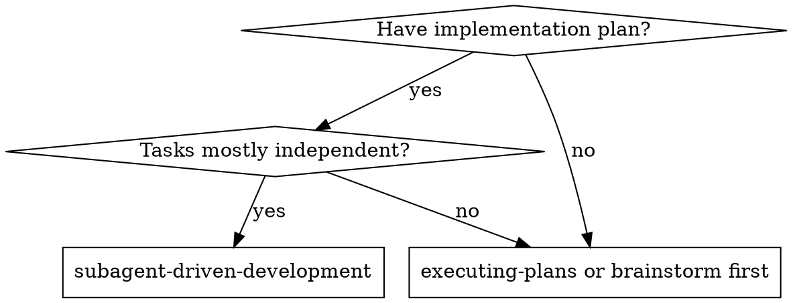
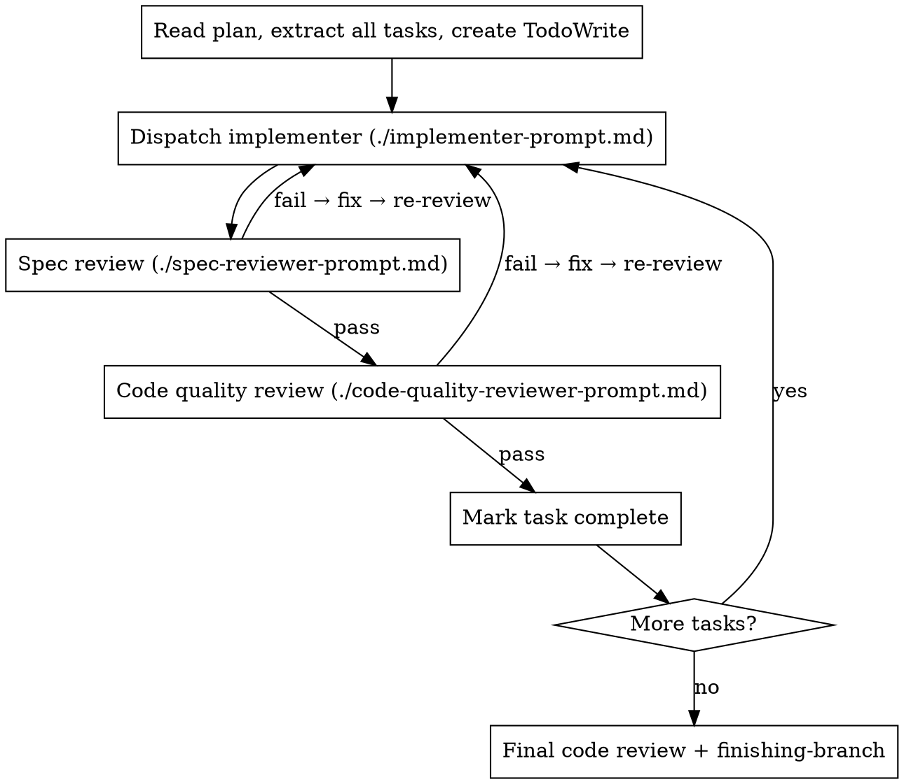

# Subagent-Driven Development

Execute plan by dispatching fresh subagent per task, with two-stage review after each: spec compliance first, then code quality.

**Why subagents:** Isolated context per task. You construct exactly what they need — they never inherit your session history.

**Core principle:** Fresh subagent per task + two-stage review = high quality, fast iteration

## When to Use

```dot
digraph when_to_use {
    "Have implementation plan?" [shape=diamond];
    "Tasks mostly independent?" [shape=diamond];
    "subagent-driven-development" [shape=box];
    "executing-plans or brainstorm first" [shape=box];

    "Have implementation plan?" -> "Tasks mostly independent?" [label="yes"];
    "Have implementation plan?" -> "executing-plans or brainstorm first" [label="no"];
    "Tasks mostly independent?" -> "subagent-driven-development" [label="yes"];
    "Tasks mostly independent?" -> "executing-plans or brainstorm first" [label="no"];
}
```

## The Process

```dot
digraph process {
    rankdir=TB;
    "Read plan, extract all tasks, create TodoWrite" [shape=box];
    "Dispatch implementer (./implementer-prompt.md)" [shape=box];
    "Spec review (./spec-reviewer-prompt.md)" [shape=box];
    "Code quality review (./code-quality-reviewer-prompt.md)" [shape=box];
    "Mark task complete" [shape=box];
    "More tasks?" [shape=diamond];
    "Final code review + finishing-branch" [shape=box];

    "Read plan, extract all tasks, create TodoWrite" -> "Dispatch implementer (./implementer-prompt.md)";
    "Dispatch implementer (./implementer-prompt.md)" -> "Spec review (./spec-reviewer-prompt.md)";
    "Spec review (./spec-reviewer-prompt.md)" -> "Code quality review (./code-quality-reviewer-prompt.md)" [label="pass"];
    "Spec review (./spec-reviewer-prompt.md)" -> "Dispatch implementer (./implementer-prompt.md)" [label="fail → fix → re-review"];
    "Code quality review (./code-quality-reviewer-prompt.md)" -> "Mark task complete" [label="pass"];
    "Code quality review (./code-quality-reviewer-prompt.md)" -> "Dispatch implementer (./implementer-prompt.md)" [label="fail → fix → re-review"];
    "Mark task complete" -> "More tasks?";
    "More tasks?" -> "Dispatch implementer (./implementer-prompt.md)" [label="yes"];
    "More tasks?" -> "Final code review + finishing-branch" [label="no"];
}
```

## Model Selection

| Task complexity | Model |
|----------------|-------|
| 1-2 files, complete spec | Fast/cheap model |
| Multi-file integration | Standard model |
| Architecture/design/review | Most capable model |

## Handling Implementer Status

**DONE:** Proceed to spec review.
**DONE_WITH_CONCERNS:** Read concerns. If correctness/scope → address before review. If observations → note and proceed.
**NEEDS_CONTEXT:** Provide missing context and re-dispatch.
**BLOCKED:** Assess: context problem → provide context; needs more reasoning → more capable model; too large → break it up; plan wrong → escalate to human.

## Red Flags

**Never:**
- Start on main/master without explicit consent
- Skip reviews (spec OR quality)
- Proceed with unfixed issues
- Dispatch parallel implementation subagents
- Make subagent read plan file (provide full text)
- Skip scene-setting context
- **Start code quality review before spec compliance passes**
- Move to next task with open review issues

**If subagent asks questions:** Answer clearly. Don't rush into implementation.
**If reviewer finds issues:** Implementer fixes → reviewer re-reviews → repeat until approved.

See `references/example-workflow.md` for a full walkthrough.

## Integration

- **sspower:using-git-worktrees** - REQUIRED: isolated workspace
- **sspower:writing-plans** - Creates the plan
- **sspower:requesting-code-review** - Review template
- **sspower:finishing-a-development-branch** - After all tasks complete
