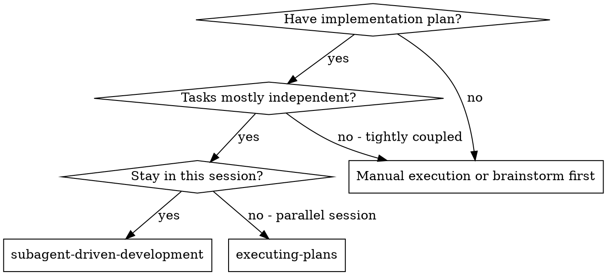
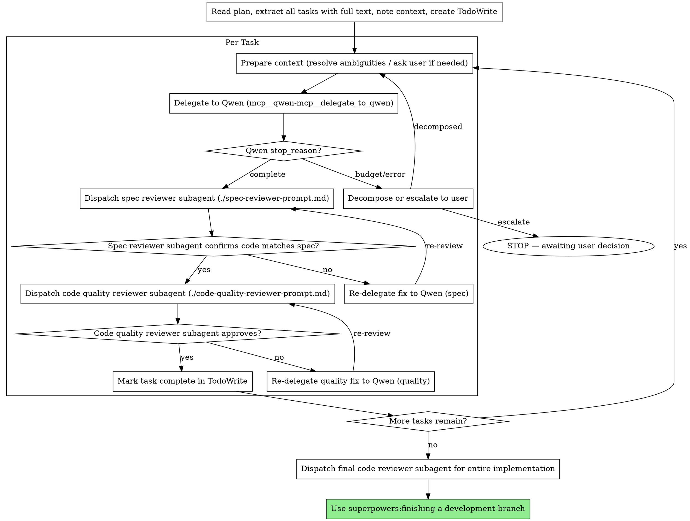

# Subagent-Driven Development

Execute plan by dispatching fresh subagent per task, with two-stage review after each: spec compliance review first, then code quality review.

**Why subagents:** You delegate tasks to specialized agents with isolated context. By precisely crafting their instructions and context, you ensure they stay focused and succeed at their task. They should never inherit your session's context or history — you construct exactly what they need. This also preserves your own context for coordination work.

**Core principle:** Fresh subagent per task + two-stage review (spec then quality) = high quality, fast iteration

**Continuous execution:** Do not pause to check in with your human partner between tasks. Execute all tasks from the plan without stopping. The only reasons to stop are: a Qwen delegation failure you cannot resolve after retry or decomposition, ambiguity that genuinely prevents progress, or all tasks complete. "Should I continue?" prompts and progress summaries waste their time — they asked you to execute the plan, so execute it.

## When to Use


```dot
digraph when_to_use {
    "Have implementation plan?" [shape=diamond];
    "Tasks mostly independent?" [shape=diamond];
    "Stay in this session?" [shape=diamond];
    "subagent-driven-development" [shape=box];
    "executing-plans" [shape=box];
    "Manual execution or brainstorm first" [shape=box];

    "Have implementation plan?" -> "Tasks mostly independent?" [label="yes"];
    "Have implementation plan?" -> "Manual execution or brainstorm first" [label="no"];
    "Tasks mostly independent?" -> "Stay in this session?" [label="yes"];
    "Tasks mostly independent?" -> "Manual execution or brainstorm first" [label="no - tightly coupled"];
    "Stay in this session?" -> "subagent-driven-development" [label="yes"];
    "Stay in this session?" -> "executing-plans" [label="no - parallel session"];
}
```

**vs. Executing Plans (parallel session):**
- Same session (no context switch)
- Fresh subagent per task (no context pollution)
- Two-stage review after each task: spec compliance first, then code quality
- Faster iteration (no human-in-loop between tasks)

## The Process


```dot
digraph process {
    rankdir=TB;

    subgraph cluster_per_task {
        label="Per Task";
        "Prepare context (resolve ambiguities / ask user if needed)" [shape=box];
        "Delegate to Qwen (mcp__qwen-mcp__delegate_to_qwen)" [shape=box];
        "Qwen stop_reason?" [shape=diamond];
        "Decompose or escalate to user" [shape=box];
        "Dispatch spec reviewer subagent (./spec-reviewer-prompt.md)" [shape=box];
        "Spec reviewer subagent confirms code matches spec?" [shape=diamond];
        "Re-delegate fix to Qwen (spec)" [shape=box];
        "Dispatch code quality reviewer subagent (./code-quality-reviewer-prompt.md)" [shape=box];
        "Code quality reviewer subagent approves?" [shape=diamond];
        "Re-delegate quality fix to Qwen (quality)" [shape=box];
        "Mark task complete in TodoWrite" [shape=box];
    }

    "Read plan, extract all tasks with full text, note context, create TodoWrite" [shape=box];
    "More tasks remain?" [shape=diamond];
    "Dispatch final code reviewer subagent for entire implementation" [shape=box];
    "Use superpowers:finishing-a-development-branch" [shape=box style=filled fillcolor=lightgreen];

    "Read plan, extract all tasks with full text, note context, create TodoWrite" -> "Prepare context (resolve ambiguities / ask user if needed)";
    "Prepare context (resolve ambiguities / ask user if needed)" -> "Delegate to Qwen (mcp__qwen-mcp__delegate_to_qwen)";
    "Delegate to Qwen (mcp__qwen-mcp__delegate_to_qwen)" -> "Qwen stop_reason?";
    "Qwen stop_reason?" -> "Decompose or escalate to user" [label="budget/error"];
    "Decompose or escalate to user" -> "Prepare context (resolve ambiguities / ask user if needed)" [label="decomposed"];
    "Decompose or escalate to user" -> "STOP — awaiting user decision" [label="escalate"];
    "Qwen stop_reason?" -> "Dispatch spec reviewer subagent (./spec-reviewer-prompt.md)" [label="complete"];
    "Dispatch spec reviewer subagent (./spec-reviewer-prompt.md)" -> "Spec reviewer subagent confirms code matches spec?";
    "Spec reviewer subagent confirms code matches spec?" -> "Re-delegate fix to Qwen (spec)" [label="no"];
    "Re-delegate fix to Qwen (spec)" -> "Dispatch spec reviewer subagent (./spec-reviewer-prompt.md)" [label="re-review"];
    "Spec reviewer subagent confirms code matches spec?" -> "Dispatch code quality reviewer subagent (./code-quality-reviewer-prompt.md)" [label="yes"];
    "Dispatch code quality reviewer subagent (./code-quality-reviewer-prompt.md)" -> "Code quality reviewer subagent approves?";
    "Code quality reviewer subagent approves?" -> "Re-delegate quality fix to Qwen (quality)" [label="no"];
    "Re-delegate quality fix to Qwen (quality)" -> "Dispatch code quality reviewer subagent (./code-quality-reviewer-prompt.md)" [label="re-review"];
    "Code quality reviewer subagent approves?" -> "Mark task complete in TodoWrite" [label="yes"];
    "Mark task complete in TodoWrite" -> "More tasks remain?";
    "More tasks remain?" -> "Prepare context (resolve ambiguities / ask user if needed)" [label="yes"];
    "More tasks remain?" -> "Dispatch final code reviewer subagent for entire implementation" [label="no"];
    "Dispatch final code reviewer subagent for entire implementation" -> "Use superpowers:finishing-a-development-branch";
}
```

## Model Selection

**Implementation:** Always use Qwen via `mcp__qwen-mcp__delegate_to_qwen`. Qwen runs locally and handles mechanical coding tasks — writing functions, adding tests, threading parameters.

**Review roles** still use Claude subagents. Use the most capable available model for spec compliance and code quality review — these roles require judgment and diff-reading that benefit from stronger reasoning.

## Handling Qwen stop_reason

Qwen returns a `stop_reason` field in every delegation response. Handle each value:

**`complete`:** Proceed to spec compliance review.

**`error`:** Connection or server failure. Check the `result` field for details. Retry once if it looks transient (connection reset, timeout on first attempt). If it fails again, treat as BLOCKED and escalate to the user with the `transcript_path` for diagnosis.

**`max_steps` / `timeout` / `token_limit`:** Budget exhausted with partial work. Inspect `result` and `files_changed`:
- If a clear remaining piece exists (e.g., implementation written but tests not written), decompose into sub-tasks and delegate each to Qwen separately.
- If the task is already atomic and cannot be split further, escalate to the user. Include the `transcript_path` so they can inspect what Qwen completed before deciding how to proceed.

**Never** ignore a non-`complete` stop_reason or proceed to spec review with partial work without assessing it first.

## Prompt Templates

- `./implementer-prompt.md` - Delegate implementation task to Qwen
- `./spec-reviewer-prompt.md` - Dispatch spec compliance reviewer subagent
- `./code-quality-reviewer-prompt.md` - Dispatch code quality reviewer subagent

## Example Workflow

```
You: I'm using Subagent-Driven Development to execute this plan.

[Read plan file once: docs/superpowers/plans/feature-plan.md]
[Extract all 5 tasks with full text and context]
[Create TodoWrite with all tasks]

Task 1: Hook installation script

[Get Task 1 text and context (already extracted)]
[Context prep: plan references hooks.py; no ambiguity — install path is explicit in spec]
[delegate_to_qwen(task=<full text + context>, working_dir=..., context_hints=[hooks.py])]

Qwen result:
  stop_reason: complete
  result: "Implemented install-hook command. Added 5 tests, all passing. Committed."
  files_changed: [hooks.py, tests/test_hooks.py]

[Dispatch spec compliance reviewer]
Spec reviewer: ✅ Spec compliant - all requirements met, nothing extra

[Get git SHAs, dispatch code quality reviewer]
Code reviewer: Strengths: Good test coverage, clean. Issues: None. Approved.

[Mark Task 1 complete]

Task 2: Recovery modes

[Get Task 2 text and context (already extracted)]
[Context prep: ambiguity — spec says "report progress" but doesn't say how often]
[Ask user: "How often should progress be reported during recovery?"]
You: "Every 100 items"
[delegate_to_qwen(task=<full text + context + "report every 100 items">, working_dir=..., context_hints=[recovery.py])]

Qwen result:
  stop_reason: complete
  result: "Added verify/repair modes with progress every 100 items. 8/8 tests passing. Committed."
  files_changed: [recovery.py, tests/test_recovery.py]

[Dispatch spec compliance reviewer]
Spec reviewer: ❌ Issues:
  - Missing: Progress reporting (spec says "report every 100 items")
  - Extra: Added --json flag (not requested)

[Re-delegate fix to Qwen (spec): remove --json flag, add progress reporting per spec]
Qwen result:
  stop_reason: complete
  result: "Removed --json flag, added progress reporting every 100 items. Committed."

[Spec reviewer reviews again]
Spec reviewer: ✅ Spec compliant now

[Dispatch code quality reviewer]
Code reviewer: Strengths: Solid. Issues (Important): Magic number (100)

[Re-delegate quality fix to Qwen (quality): extract magic number 100 to constant]
Qwen result:
  stop_reason: complete
  result: "Extracted PROGRESS_INTERVAL = 100 constant. Committed."

[Code reviewer reviews again]
Code reviewer: ✅ Approved

[Mark Task 2 complete]

...

[After all tasks]
[Dispatch final code-reviewer]
Final reviewer: All requirements met, ready to merge

Done!
```

## Advantages

**vs. Manual execution:**
- Subagents follow TDD naturally
- Fresh context per task (no confusion)
- Parallel-safe (subagents don't interfere)
- Context prep step ensures Qwen has everything it needs upfront

**vs. Executing Plans:**
- Same session (no handoff)
- Continuous progress (no waiting)
- Review checkpoints automatic

**Efficiency gains:**
- No file reading overhead (controller provides full text)
- Controller curates exactly what context is needed
- Subagent gets complete information upfront
- Questions surfaced before work begins (not after)

**Quality gates:**
- Two-stage review: spec compliance, then code quality
- Review loops ensure fixes actually work
- Spec compliance prevents over/under-building
- Code quality ensures implementation is well-built

**Cost:**
- More invocations per task (Qwen delegation + 2 reviewer subagents)
- Controller does more prep work (extracting all tasks upfront)
- Review loops add iterations
- But catches issues early (cheaper than debugging later)

## Red Flags

**Never:**
- Start implementation on main/master branch without explicit user consent
- Skip reviews (spec compliance OR code quality)
- Proceed with unfixed issues
- Delegate to Qwen without running the context preparation step first
- Make Qwen read the plan file (provide full text in the `task` string instead)
- Skip scene-setting context (Qwen needs to understand where the task fits)
- Leave genuine ambiguity unresolved before delegating (Qwen cannot ask questions)
- Accept "close enough" on spec compliance (spec reviewer found issues = not done)
- Skip review loops (reviewer found issues = implementer fixes = review again)
- Let Qwen's result summary replace actual review (both spec and quality review are required)
- **Start code quality review before spec compliance is ✅** (wrong order)
- Move to next task while either review has open issues

**If context prep reveals ambiguity:**
- Resolve from existing context if possible (don't ask the user unnecessarily)
- If you must ask the user, ask one question at a time
- Include the resolved answer inline in the `task` string — don't leave Qwen to guess

**If reviewer finds issues:**
- Re-delegate to Qwen with specific fix instructions
- Reviewer reviews again
- Repeat until approved
- Don't skip the re-review

**If Qwen delegation fails (stop_reason=error):**
- Retry once for transient failures
- If it fails again, escalate to the user — don't re-delegate without changing something

## Integration

**Required workflow skills:**
- **superpowers:using-git-worktrees** - Ensures isolated workspace (creates one or verifies existing)
- **superpowers:writing-plans** - Creates the plan this skill executes
- **superpowers:requesting-code-review** - Code review template for reviewer subagents
- **superpowers:finishing-a-development-branch** - Complete development after all tasks

**Subagents should use:**
- **superpowers:test-driven-development** - Subagents follow TDD for each task

**Alternative workflow:**
- **superpowers:executing-plans** - Use for parallel session instead of same-session execution
