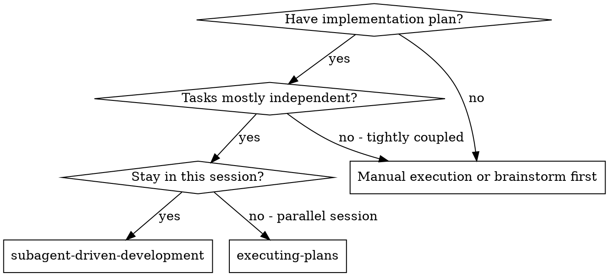
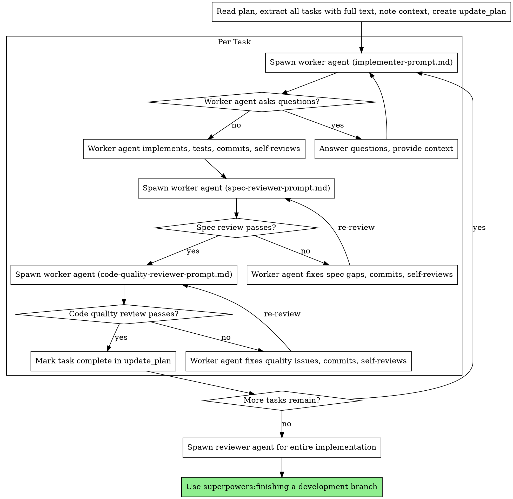

# Subagent-Driven Development

Execute a plan by dispatching a fresh Codex agent per task, then run two review stages after each task: spec compliance first, code quality second.

**Why subagents:** Fresh Codex agents keep task context narrow, preserve the coordinator's context window, and make review loops more reliable.

**Core principle:** Fresh subagent per task + two-stage review (spec then quality) = high quality, fast iteration

## When to Use


```dot
digraph when_to_use {
    "Have implementation plan?" [shape=diamond];
    "Tasks mostly independent?" [shape=diamond];
    "Stay in this session?" [shape=diamond];
    "subagent-driven-development" [shape=box];
    "executing-plans" [shape=box];
    "Manual execution or brainstorm first" [shape=box];

    "Have implementation plan?" -> "Tasks mostly independent?" [label="yes"];
    "Have implementation plan?" -> "Manual execution or brainstorm first" [label="no"];
    "Tasks mostly independent?" -> "Stay in this session?" [label="yes"];
    "Tasks mostly independent?" -> "Manual execution or brainstorm first" [label="no - tightly coupled"];
    "Stay in this session?" -> "subagent-driven-development" [label="yes"];
    "Stay in this session?" -> "executing-plans" [label="no - parallel session"];
}
```

**vs. Executing Plans (parallel session):**
- Same session (no context switch)
- Fresh subagent per task (no context pollution)
- Two-stage review after each task: spec compliance first, then code quality
- Faster iteration (no human-in-loop between tasks)

## The Process


```dot
digraph process {
    rankdir=TB;

    subgraph cluster_per_task {
        label="Per Task";
        "Spawn worker agent (implementer-prompt.md)" [shape=box];
        "Worker agent asks questions?" [shape=diamond];
        "Answer questions, provide context" [shape=box];
        "Worker agent implements, tests, commits, self-reviews" [shape=box];
        "Spawn worker agent (spec-reviewer-prompt.md)" [shape=box];
        "Spec review passes?" [shape=diamond];
        "Worker agent fixes spec gaps, commits, self-reviews" [shape=box];
        "Spawn worker agent (code-quality-reviewer-prompt.md)" [shape=box];
        "Code quality review passes?" [shape=diamond];
        "Worker agent fixes quality issues, commits, self-reviews" [shape=box];
        "Mark task complete in update_plan" [shape=box];
    }

    "Read plan, extract all tasks with full text, note context, create update_plan" [shape=box];
    "More tasks remain?" [shape=diamond];
    "Spawn reviewer agent for entire implementation" [shape=box];
    "Use superpowers:finishing-a-development-branch" [shape=box style=filled fillcolor=lightgreen];

    "Read plan, extract all tasks with full text, note context, create update_plan" -> "Spawn worker agent (implementer-prompt.md)";
    "Spawn worker agent (implementer-prompt.md)" -> "Worker agent asks questions?";
    "Worker agent asks questions?" -> "Answer questions, provide context" [label="yes"];
    "Answer questions, provide context" -> "Spawn worker agent (implementer-prompt.md)";
    "Worker agent asks questions?" -> "Worker agent implements, tests, commits, self-reviews" [label="no"];
    "Worker agent implements, tests, commits, self-reviews" -> "Spawn worker agent (spec-reviewer-prompt.md)";
    "Spawn worker agent (spec-reviewer-prompt.md)" -> "Spec review passes?";
    "Spec review passes?" -> "Worker agent fixes spec gaps, commits, self-reviews" [label="no"];
    "Worker agent fixes spec gaps, commits, self-reviews" -> "Spawn worker agent (spec-reviewer-prompt.md)" [label="re-review"];
    "Spec review passes?" -> "Spawn worker agent (code-quality-reviewer-prompt.md)" [label="yes"];
    "Spawn worker agent (code-quality-reviewer-prompt.md)" -> "Code quality review passes?";
    "Code quality review passes?" -> "Worker agent fixes quality issues, commits, self-reviews" [label="no"];
    "Worker agent fixes quality issues, commits, self-reviews" -> "Spawn worker agent (code-quality-reviewer-prompt.md)" [label="re-review"];
    "Code quality review passes?" -> "Mark task complete in update_plan" [label="yes"];
    "Mark task complete in update_plan" -> "More tasks remain?";
    "More tasks remain?" -> "Spawn worker agent (implementer-prompt.md)" [label="yes"];
    "More tasks remain?" -> "Spawn reviewer agent for entire implementation" [label="no"];
    "Spawn reviewer agent for entire implementation" -> "Use superpowers:finishing-a-development-branch";
}
```

## Model Selection

Use the least powerful model that can handle each role to conserve cost and increase speed.

**Mechanical implementation tasks** (isolated functions, clear specs, 1-2 files): use a fast, cheap model. Most implementation tasks are mechanical when the plan is well-specified.

**Integration and judgment tasks** (multi-file coordination, pattern matching, debugging): use a standard model.

**Architecture, design, and review tasks**: use the most capable available model.

**Task complexity signals:**
- Touches 1-2 files with a complete spec → cheap model
- Touches multiple files with integration concerns → standard model
- Requires design judgment or broad codebase understanding → most capable model

## Handling Implementer Status

Implementer worker agents report one of four statuses. Handle each appropriately:

**DONE:** Proceed to spec compliance review.

**DONE_WITH_CONCERNS:** The implementer completed the work but flagged doubts. Read the concerns before proceeding. If the concerns are about correctness or scope, address them before review. If they're observations (e.g., "this file is getting large"), note them and proceed to review.

**NEEDS_CONTEXT:** The implementer needs information that wasn't provided. Provide the missing context and re-dispatch.

**BLOCKED:** The implementer cannot complete the task. Assess the blocker:
1. If it's a context problem, provide more context and re-dispatch with the same model
2. If the task requires more reasoning, re-dispatch with a more capable model
3. If the task is too large, break it into smaller pieces
4. If the plan itself is wrong, escalate to the human

**Never** ignore an escalation or force the same model to retry without changes. If the implementer said it's stuck, something needs to change.

## Prompt Templates

- `implementer-prompt.md` - worker prompt for implementation
- `spec-reviewer-prompt.md` - worker prompt for spec compliance review
- `code-quality-reviewer-prompt.md` - worker prompt for code quality review

Read the template, substitute the task-specific values, and pass the final text directly to `spawn_agent`.

## Example Workflow

```
You: I'm using Subagent-Driven Development to execute this plan.

[Read plan file once: docs/superpowers/plans/feature-plan.md]
[Extract all 5 tasks with full text and context]
[Create update_plan with all tasks]

Task 1: Hook installation script

[Get Task 1 text and context (already extracted)]
[Spawn worker agent with full task text + context]

Implementer: "Before I begin - should the hook be installed at user or system level?"

You: "User level (~/.config/superpowers/hooks/)"

Implementer: "Got it. Implementing now..."
[Later] Implementer:
  - Implemented install-hook command
  - Added tests, 5/5 passing
  - Self-review: Found I missed --force flag, added it
  - Committed

[Spawn worker agent for spec compliance review]
Spec reviewer: ✅ Spec compliant - all requirements met, nothing extra

[Spawn worker agent for code quality review]
Quality reviewer: Findings: None. Summary: Ready to proceed.

[Mark Task 1 complete]

Task 2: Recovery modes

[Get Task 2 text and context (already extracted)]
[Spawn worker agent with full task text + context]

Implementer: [No questions, proceeds]
Implementer:
  - Added verify/repair modes
  - 8/8 tests passing
  - Self-review: All good
  - Committed

[Spawn worker agent for spec compliance review]
Spec reviewer: ❌ Issues:
  - Missing: Progress reporting (spec says "report every 100 items")
  - Extra: Added --json flag (not requested)

[Implementer fixes issues, commits, and self-reviews]
Implementer: Removed --json flag, added progress reporting, committed the fix

[Spec reviewer reviews again]
Spec reviewer: ✅ Spec compliant now

[Spawn worker agent for code quality review]
Quality reviewer: Findings:
  - Important: Magic number (100)
Summary: Fix before proceeding.

[Implementer fixes, commits, and self-reviews]
Implementer: Extracted PROGRESS_INTERVAL constant and committed the fix

[Code quality reviewer reviews again]
Quality reviewer: Findings: None. Summary: Ready to proceed.

[Mark Task 2 complete]

...

[After all tasks]
[Spawn reviewer agent]
Final reviewer: All requirements met, ready to merge

Done!
```

## Advantages

**vs. Manual execution:**
- Worker agents follow TDD naturally
- Fresh context per task (no confusion)
- Parallel-safe (agents don't interfere)
- Worker agent can ask questions (before AND during work)

**vs. Executing Plans:**
- Same session (no handoff)
- Continuous progress (no waiting)
- Review checkpoints automatic

**Efficiency gains:**
- No file reading overhead (controller provides full text)
- Controller curates exactly what context is needed
- Worker agent gets complete information upfront
- Questions surfaced before work begins (not after)

**Quality gates:**
- Self-review catches issues before handoff
- Two-stage review: spec compliance, then code quality
- Review loops ensure fixes actually work
- Spec compliance prevents over/under-building
- Code quality ensures implementation is well-built

**Cost:**
- More agent invocations (implementer + 2 reviewers per task)
- Controller does more prep work (extracting all tasks upfront)
- Review loops add iterations
- But catches issues early (cheaper than debugging later)

## Red Flags

**Never:**
- Start implementation on main/master branch without explicit user consent
- Skip reviews (spec compliance OR code quality)
- Proceed with unfixed issues
- Spawn multiple implementation worker agents in parallel (conflicts)
- Make worker agent read plan file (provide full text instead)
- Skip scene-setting context (worker agent needs to understand where task fits)
- Ignore worker agent questions (answer before letting them proceed)
- Accept "close enough" on spec compliance (spec reviewer found issues = not done)
- Skip review loops (reviewer found issues = implementer fixes = review again)
- Let implementer self-review replace actual review (both are needed)
- **Start code quality review before spec compliance is ✅** (wrong order)
- Move to next task while either review has open issues

**If worker agent asks questions:**
- Answer clearly and completely
- Provide additional context if needed
- Don't rush them into implementation

**If reviewer finds issues:**
- Implementer (same subagent) fixes them
- Reviewer reviews again
- Repeat until approved
- Don't skip the re-review

**If worker agent fails task:**
- Spawn worker agent with specific fix instructions
- Don't try to fix manually (context pollution)

## Integration

**Required workflow skills:**
- **superpowers:using-git-worktrees** - REQUIRED: Set up isolated workspace before starting
- **superpowers:writing-plans** - Creates the plan this skill executes
- **superpowers:requesting-code-review** - Code review template for reviewer agents
- **superpowers:finishing-a-development-branch** - Complete development after all tasks

**Agents should use:**
- **superpowers:test-driven-development** - Worker agents follow TDD for each task

**Alternative workflow:**
- **superpowers:executing-plans** - Use for parallel session instead of same-session execution
