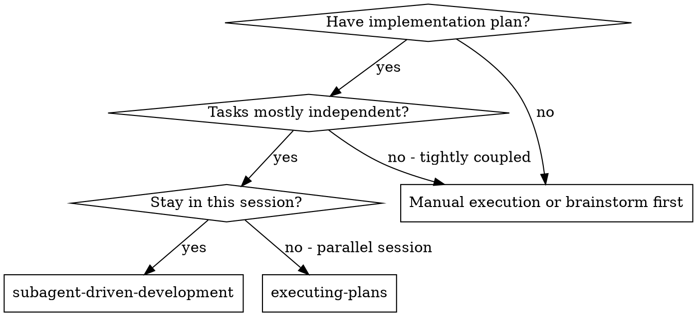
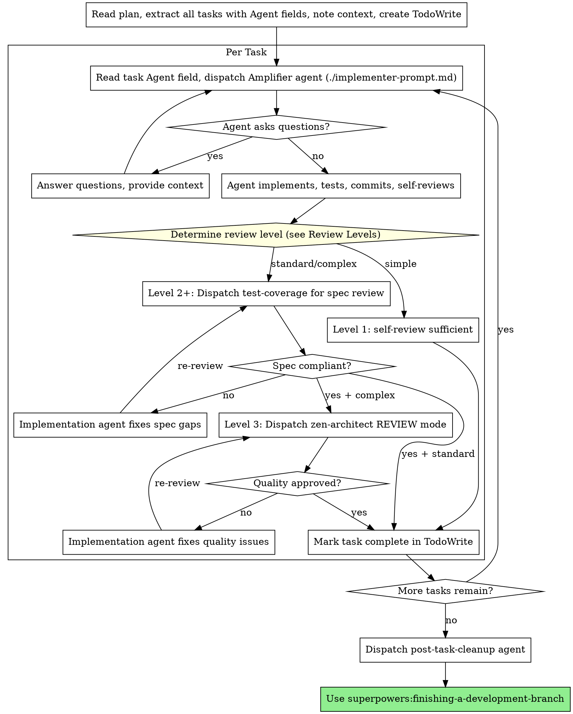

# Subagent-Driven Development

Execute plan by dispatching the Amplifier agent specified in each task, with two-stage review after each: spec compliance review first, then code quality review.

**Core principle:** Dispatch the right Amplifier specialist per task + two-stage review (spec then quality) = high quality, fast iteration

## When to Use


```dot
digraph when_to_use {
    "Have implementation plan?" [shape=diamond];
    "Tasks mostly independent?" [shape=diamond];
    "Stay in this session?" [shape=diamond];
    "subagent-driven-development" [shape=box];
    "executing-plans" [shape=box];
    "Manual execution or brainstorm first" [shape=box];

    "Have implementation plan?" -> "Tasks mostly independent?" [label="yes"];
    "Have implementation plan?" -> "Manual execution or brainstorm first" [label="no"];
    "Tasks mostly independent?" -> "Stay in this session?" [label="yes"];
    "Tasks mostly independent?" -> "Manual execution or brainstorm first" [label="no - tightly coupled"];
    "Stay in this session?" -> "subagent-driven-development" [label="yes"];
    "Stay in this session?" -> "executing-plans" [label="no - parallel session"];
}
```

**vs. Executing Plans (parallel session):**
- Same session (no context switch)
- Fresh Amplifier agent per task (specialist knowledge + no context pollution)
- Two-stage review after each task: spec compliance first, then code quality
- Faster iteration (no human-in-loop between tasks)

## Amplifier Agent Dispatch

Each task in the plan has an `Agent:` field. Use it as the `subagent_type` when dispatching:

1. Read the task's `Agent:` field (e.g., `modular-builder`, `bug-hunter`, `database-architect`)
2. **Dispatch using Task tool with `subagent_type` set to the Agent: field value.** Example: if the plan says `Agent: modular-builder`, call `Task(subagent_type="modular-builder", description="Implement Task N: ...", prompt="...")`
3. Pass the full task text + context in the prompt (never make subagent read the plan file)
4. The agent brings domain expertise to the implementation — `modular-builder` builds clean modules, `bug-hunter` does hypothesis-driven debugging, `database-architect` designs schemas

**Review agents (from `${CLAUDE_PLUGIN_ROOT}/AMPLIFIER-AGENTS.md`):**
- Spec compliance review → `Task(subagent_type="test-coverage", ...)`
- Code quality review → `Task(subagent_type="zen-architect", ...)` in REVIEW mode
- Security-sensitive tasks → add `Task(subagent_type="security-guardian", ...)` as third reviewer
- Parallel review is OK: spec-compliance and security reviews are read-only, they can run concurrently

**After all tasks complete:**
- Dispatch `post-task-cleanup` agent for codebase hygiene
- Then use superpowers:finishing-a-development-branch

## Review Levels

Not every task needs full two-stage review. Match review depth to task risk:

**Level 1 — Self-review only** (simple, low-risk tasks):
- Task touches 1-2 files with clear spec
- No security implications
- Agent self-reviews, tests pass, commit → done
- Examples: rename, add field, simple CRUD, config change

**Level 2 — Spec compliance review** (standard tasks):
- Task touches multiple files or has integration concerns
- Dispatch `test-coverage` agent for spec compliance after implementation
- Skip separate code quality review
- Examples: new feature module, API endpoint, database migration

**Level 3 — Full two-stage review** (complex or security-sensitive tasks):
- Task involves security, auth, data handling, or architectural decisions
- Dispatch `test-coverage` for spec compliance, THEN `zen-architect` for code quality
- Add `security-guardian` for security-sensitive work
- Examples: auth flow, payment handling, data migration, public API

**How to choose:** Default to Level 2. Upgrade to Level 3 for security/architecture. Downgrade to Level 1 only when the task is trivially simple.

## The Process


```dot
digraph process {
    rankdir=TB;

    subgraph cluster_per_task {
        label="Per Task";
        "Read task Agent field, dispatch Amplifier agent (./implementer-prompt.md)" [shape=box];
        "Agent asks questions?" [shape=diamond];
        "Answer questions, provide context" [shape=box];
        "Agent implements, tests, commits, self-reviews" [shape=box];
        "Determine review level (see Review Levels)" [shape=diamond style=filled fillcolor=lightyellow];
        "Level 1: self-review sufficient" [shape=box];
        "Level 2+: Dispatch test-coverage for spec review" [shape=box];
        "Spec compliant?" [shape=diamond];
        "Implementation agent fixes spec gaps" [shape=box];
        "Level 3: Dispatch zen-architect REVIEW mode" [shape=box];
        "Quality approved?" [shape=diamond];
        "Implementation agent fixes quality issues" [shape=box];
        "Mark task complete in TodoWrite" [shape=box];
    }

    "Read plan, extract all tasks with Agent fields, note context, create TodoWrite" [shape=box];
    "More tasks remain?" [shape=diamond];
    "Dispatch post-task-cleanup agent" [shape=box];
    "Use superpowers:finishing-a-development-branch" [shape=box style=filled fillcolor=lightgreen];

    "Read plan, extract all tasks with Agent fields, note context, create TodoWrite" -> "Read task Agent field, dispatch Amplifier agent (./implementer-prompt.md)";
    "Read task Agent field, dispatch Amplifier agent (./implementer-prompt.md)" -> "Agent asks questions?";
    "Agent asks questions?" -> "Answer questions, provide context" [label="yes"];
    "Answer questions, provide context" -> "Read task Agent field, dispatch Amplifier agent (./implementer-prompt.md)";
    "Agent asks questions?" -> "Agent implements, tests, commits, self-reviews" [label="no"];
    "Agent implements, tests, commits, self-reviews" -> "Determine review level (see Review Levels)";
    "Determine review level (see Review Levels)" -> "Level 1: self-review sufficient" [label="simple"];
    "Determine review level (see Review Levels)" -> "Level 2+: Dispatch test-coverage for spec review" [label="standard/complex"];
    "Level 1: self-review sufficient" -> "Mark task complete in TodoWrite";
    "Level 2+: Dispatch test-coverage for spec review" -> "Spec compliant?";
    "Spec compliant?" -> "Implementation agent fixes spec gaps" [label="no"];
    "Implementation agent fixes spec gaps" -> "Level 2+: Dispatch test-coverage for spec review" [label="re-review"];
    "Spec compliant?" -> "Level 3: Dispatch zen-architect REVIEW mode" [label="yes + complex"];
    "Spec compliant?" -> "Mark task complete in TodoWrite" [label="yes + standard"];
    "Level 3: Dispatch zen-architect REVIEW mode" -> "Quality approved?";
    "Quality approved?" -> "Implementation agent fixes quality issues" [label="no"];
    "Implementation agent fixes quality issues" -> "Level 3: Dispatch zen-architect REVIEW mode" [label="re-review"];
    "Quality approved?" -> "Mark task complete in TodoWrite" [label="yes"];
    "Mark task complete in TodoWrite" -> "More tasks remain?";
    "More tasks remain?" -> "Read task Agent field, dispatch Amplifier agent (./implementer-prompt.md)" [label="yes"];
    "More tasks remain?" -> "Dispatch post-task-cleanup agent" [label="no"];
    "Dispatch post-task-cleanup agent" -> "Use superpowers:finishing-a-development-branch";
}
```

## Dispatch Announcements

**Before every Task dispatch, output a visible status line to the user:**

```
>> Dispatching [agent-name] (model: [model]) for Task N: [short description]
>>   Review level: [1/2/3] | Files: [count] | Complexity: [simple/standard/complex]
```

For review dispatches:
```
>> Dispatching [reviewer-agent] (model: [model]) — [review type] review for Task N
```

This gives the user visibility into which specialist is handling what, at what cost tier, and what review depth applies. **Never dispatch silently.**

## Model Selection

Use the least powerful model that can handle each role. Map to the `model` parameter on the Task tool:

| Role | Model Parameter | When |
|------|----------------|------|
| `haiku` | Mechanical implementation | 1-2 files, clear spec, isolated function, config change |
| `sonnet` | Standard implementation | Multi-file, integration, pattern matching, debugging |
| `opus` | Architecture/design/review | Design judgment, broad codebase understanding, security review |

**Concrete mapping by agent type:**
- `modular-builder` with clear spec → `haiku` (upgrade to `sonnet` if multi-file)
- `bug-hunter` → `sonnet` (needs reasoning about root causes)
- `database-architect` → `sonnet` (schema design needs judgment)
- `test-coverage` (spec review) → `haiku` (checklist comparison)
- `zen-architect` (quality review) → `sonnet` (needs architecture judgment)
- `security-guardian` → `opus` (security requires deepest analysis)
- `post-task-cleanup` → `haiku` (mechanical cleanup)

**When to upgrade:** If a `haiku` agent returns BLOCKED or NEEDS_CONTEXT, re-dispatch with `sonnet`. If `sonnet` is blocked, try `opus`.

## Handling Implementer Status

Implementer subagents report one of four statuses. Handle each appropriately:

**DONE:** Proceed to spec compliance review.

**DONE_WITH_CONCERNS:** The implementer completed the work but flagged doubts. Read the concerns before proceeding. If the concerns are about correctness or scope, address them before review. If they're observations (e.g., "this file is getting large"), note them and proceed to review.

**NEEDS_CONTEXT:** The implementer needs information that wasn't provided. Provide the missing context and re-dispatch.

**BLOCKED:** The implementer cannot complete the task. Assess the blocker:
1. If it's a context problem, provide more context and re-dispatch with the same model
2. If the task requires more reasoning, re-dispatch with a more capable model
3. If the task is too large, break it into smaller pieces
4. If the plan itself is wrong, escalate to the human

**Never** ignore an escalation or force the same model to retry without changes. If the implementer said it's stuck, something needs to change.

## Prompt Templates

- `./implementer-prompt.md` - Dispatch implementation agent (includes agent-specific context)
- `./spec-reviewer-prompt.md` - Dispatch test-coverage agent for spec compliance
- `./code-quality-reviewer-prompt.md` - Dispatch zen-architect for code quality

## Example Workflow

```
You: I'm using Subagent-Driven Development to execute this plan.

[Read plan file once: docs/superpowers/plans/feature-plan.md]
[Extract all 5 tasks with full text, Agent fields, and context]
[Create TodoWrite with all tasks]

Task 1/5: Design auth module schema

>> Dispatching database-architect (model: sonnet) for Task 1: Design auth module schema
>>   Review level: 2 | Files: 3 | Complexity: standard

database-architect: "Should we use separate tables for roles and permissions, or a combined approach?"

You: "Separate tables — we need fine-grained permission assignment."

database-architect: "Got it. Implementing now..."
[Later] database-architect:
  Status: DONE
  - Created migration for users, roles, permissions tables
  - Added indexes for common query patterns
  - Tests: 4/4 passing
  - Committed

>> Dispatching test-coverage (model: haiku) — spec compliance review for Task 1
test-coverage: ✅ Spec compliant - schema matches requirements

[Mark Task 1 complete — Level 2 review passed, skipping quality review]

Task 2/5: Implement auth middleware

>> Dispatching modular-builder (model: haiku) for Task 2: Implement auth middleware
>>   Review level: 1 | Files: 1 | Complexity: simple

modular-builder: Status: DONE — implemented middleware with tests passing
[Mark Task 2 complete — Level 1 self-review sufficient]

Task 3/5: Add JWT token validation

>> Dispatching security-guardian (model: opus) for Task 3: Add JWT token validation
>>   Review level: 3 | Files: 4 | Complexity: complex (security-sensitive)

security-guardian: Status: DONE — implemented with OWASP best practices
>> Dispatching test-coverage (model: haiku) — spec compliance review for Task 3
>> Dispatching zen-architect (model: sonnet) — code quality review for Task 3
[Both reviews pass]
[Mark Task 3 complete]

...

>> Dispatching post-task-cleanup (model: haiku) for final hygiene pass
post-task-cleanup: Removed 2 unused imports, no other issues.

[Use superpowers:finishing-a-development-branch]
Done!
```

## Advantages

**vs. Manual execution:**
- Specialist agents bring domain expertise per task
- Fresh context per task (no confusion)
- Parallel-safe (subagents don't interfere)
- Subagent can ask questions (before AND during work)

**vs. Executing Plans:**
- Same session (no handoff)
- Continuous progress (no waiting)
- Review checkpoints automatic

**Efficiency gains:**
- No file reading overhead (controller provides full text)
- Controller curates exactly what context is needed
- Agent brings domain expertise (database-architect knows schema patterns)
- Questions surfaced before work begins (not after)

**Quality gates:**
- Self-review catches issues before handoff
- Spec compliance via test-coverage agent (testing expert verifies completeness)
- Code quality via zen-architect REVIEW mode (architecture expert verifies quality)
- Security review via security-guardian (when applicable)
- Post-task-cleanup ensures hygiene
- Review loops ensure fixes actually work

**Cost:**
- More subagent invocations (implementer + 1-3 reviewers depending on review level)
- Controller does more prep work (extracting all tasks upfront)
- Review loops add iterations
- But catches issues early (cheaper than debugging later)

## Red Flags

**Never:**
- Start implementation on main/master branch without explicit user consent
- Skip reviews entirely (even Level 1 tasks need self-review; Level 2+ need spec compliance)
- Proceed with unfixed issues
- Dispatch multiple implementation subagents in parallel (conflicts)
- Make subagent read plan file (provide full text instead)
- Skip scene-setting context (subagent needs to understand where task fits)
- Ignore subagent questions (answer before letting them proceed)
- Accept "close enough" on spec compliance (spec reviewer found issues = not done)
- Skip review loops (reviewer found issues = implementer fixes = review again)
- Let implementer self-review replace actual review on Level 2+ tasks (both are needed)
- Use Level 1 (self-review only) for security-sensitive tasks — always upgrade to Level 3
- **Start code quality review before spec compliance is ✅** (wrong order)
- Move to next task while either review has open issues
- Override the plan's Agent field without good reason

**If subagent asks questions:**
- Answer clearly and completely
- Provide additional context if needed
- Don't rush them into implementation

**If reviewer finds issues:**
- Implementer (same subagent) fixes them
- Reviewer reviews again
- Repeat until approved
- Don't skip the re-review

**If subagent fails task:**
- Dispatch fix subagent with specific instructions
- Don't try to fix manually (context pollution)

## Integration

**Required workflow skills:**
- **superpowers:using-git-worktrees** - REQUIRED: Set up isolated workspace before starting
- **superpowers:writing-plans** - Creates the plan this skill executes (with Agent: fields)
- **superpowers:requesting-code-review** - Code review template for reviewer subagents
- **superpowers:finishing-a-development-branch** - Complete development after all tasks

**Amplifier agents used:**
- **Implementation agents** - Per task's Agent: field (modular-builder, database-architect, etc.)
- **test-coverage** - Spec compliance reviewer
- **zen-architect** - Code quality reviewer (REVIEW mode)
- **security-guardian** - Security reviewer (when applicable)
- **post-task-cleanup** - Final hygiene pass

**Subagents should use:**
- **superpowers:test-driven-development** - Subagents follow TDD for each task

**Alternative workflow:**
- **superpowers:executing-plans** - Use for parallel session instead of same-session execution
