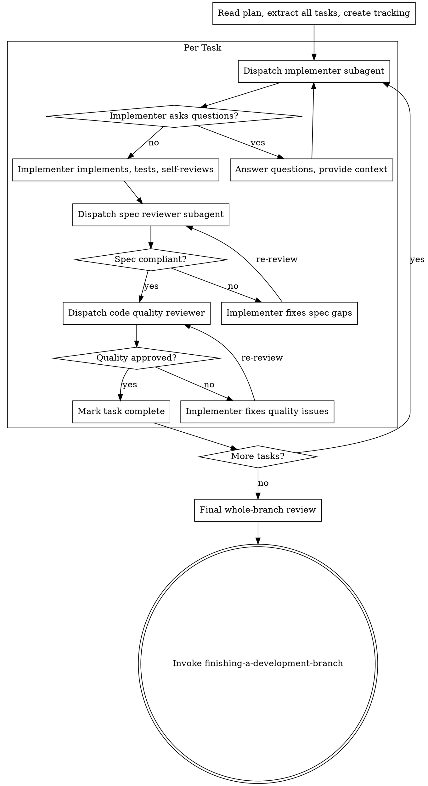

# Subagent-Driven Development

Execute a plan with fresh subagents per task and strict review gates.

## Required Start

Announce: `I'm using subagent-driven-development to execute this plan.`

**Why subagents:** You delegate tasks to specialized agents with isolated context. By precisely crafting their instructions and context, you ensure they stay focused and succeed at their task. They should never inherit your session's context or history — you construct exactly what they need. This also preserves your own context for coordination work.

**Core principle:** Fresh subagent per task + two-stage review (spec then quality) = high quality, fast iteration

**Continuous execution:** Do not pause to check in with your human partner between tasks. Execute all tasks from the plan without stopping. The only reasons to stop are: BLOCKED status you cannot resolve, ambiguity that genuinely prevents progress, or all tasks complete. "Should I continue?" prompts and progress summaries waste their time — they asked you to execute the plan, so execute it.

## Core Flow


```dot
digraph sdd_process {
    rankdir=TB;

    subgraph cluster_per_task {
        label="Per Task";
        "Dispatch implementer subagent" [shape=box];
        "Implementer asks questions?" [shape=diamond];
        "Answer questions, provide context" [shape=box];
        "Implementer implements, tests, self-reviews" [shape=box];
        "Dispatch spec reviewer subagent" [shape=box];
        "Spec compliant?" [shape=diamond];
        "Implementer fixes spec gaps" [shape=box];
        "Dispatch code quality reviewer" [shape=box];
        "Quality approved?" [shape=diamond];
        "Implementer fixes quality issues" [shape=box];
        "Mark task complete" [shape=box];
    }

    "Read plan, extract all tasks, create tracking" [shape=box];
    "More tasks?" [shape=diamond];
    "Final whole-branch review" [shape=box];
    "Invoke finishing-a-development-branch" [shape=doublecircle];

    "Read plan, extract all tasks, create tracking" -> "Dispatch implementer subagent";
    "Dispatch implementer subagent" -> "Implementer asks questions?";
    "Implementer asks questions?" -> "Answer questions, provide context" [label="yes"];
    "Answer questions, provide context" -> "Dispatch implementer subagent";
    "Implementer asks questions?" -> "Implementer implements, tests, self-reviews" [label="no"];
    "Implementer implements, tests, self-reviews" -> "Dispatch spec reviewer subagent";
    "Dispatch spec reviewer subagent" -> "Spec compliant?";
    "Spec compliant?" -> "Implementer fixes spec gaps" [label="no"];
    "Implementer fixes spec gaps" -> "Dispatch spec reviewer subagent" [label="re-review"];
    "Spec compliant?" -> "Dispatch code quality reviewer" [label="yes"];
    "Dispatch code quality reviewer" -> "Quality approved?";
    "Quality approved?" -> "Implementer fixes quality issues" [label="no"];
    "Implementer fixes quality issues" -> "Dispatch code quality reviewer" [label="re-review"];
    "Quality approved?" -> "Mark task complete" [label="yes"];
    "Mark task complete" -> "More tasks?";
    "More tasks?" -> "Dispatch implementer subagent" [label="yes"];
    "More tasks?" -> "Final whole-branch review" [label="no"];
    "Final whole-branch review" -> "Invoke finishing-a-development-branch";
}
```

1. Read the plan once and extract all tasks.
2. Create task tracking for all tasks.
3. For each task:
- Dispatch implementer subagent with full task text and minimal required context.
- Resolve implementer questions before coding.
- Require implementer verification evidence.
- Run spec-compliance review.
- If spec fails, return to implementer and re-review.
- Run code-quality review.
- If quality fails, return to implementer and re-review.
- Mark task complete: update the task’s checkbox in plan.md from `- [ ]` to `- [x]`. If `state.md` exists with a plan status section, update it to reflect the completed task.
   - For complex or high-risk tasks, validate the approach against requirements and consider simpler alternatives before or after the implementer’s work.
    - For tasks centered on frontend/UI, apply `frontend-design` standards to guide structure, styling, and accessibility.
    - For tasks involving React/Next.js code, apply `vercel-react-best-practices` for performance optimization, data fetching patterns, and bundle size.
4. Run final whole-branch review.
5. Invoke `finishing-a-development-branch`.

## Harness Integration

Before dispatching any implementer subagent:

1. Invoke `extract-boundary` to gather minimal context for the task's files.
2. Include in the implementer prompt: "After each change, run `npx ts-node tools/harness/cli.ts local` to verify."

### Pattern Injection
Include learned patterns in implementer and reviewer prompts:
- **Implementer**: Query patterns catalog for the task's module type, append `formatPatternsForContext(patterns)` output. Add: "⚠️ Known Patterns for this task: Apply these proactively."
- **Reviewer**: Append `formatPatternsForReview(patterns)` output. Add: "Verify implementation does NOT trigger known error patterns."

After each implementer completes:

1. Main Agent spawns ReviewerAgent subagent with the diff and relevant stack modules.
2. ReviewerAgent analyzes -> generates structured report.
3. If issues found -> Main Agent delegates fixes to the same implementer subagent.
4. Implementer fixes -> re-runs verify-local -> returns.
5. ReviewerAgent re-reviews only affected files -> approves or repeats loop.

After all tasks in a wave complete:

1. Main Agent merges all branches.
2. Main Agent runs `npx ts-node tools/harness/cli.ts all` (verify-all).
3. If verify-all fails -> delegate fixes to relevant subagents.
4. If verify-all passes -> proceed to `finishing-a-development-branch`.

## Parallel Waves (default for independent tasks)

When tasks are independent and touch disjoint files, dispatch them as a wave — this is the preferred mode, not a special case. Sequential execution is the fallback for dependent tasks, not the default.

**Decision rule:** Before starting execution, group tasks into waves based on file overlap and state dependencies. Tasks with no shared files and no sequential dependency belong in the same wave.

1. Build a wave of independent tasks.
2. Dispatch all implementers in a **single message** with multiple parallel Agent tool calls. Do not stagger across multiple messages.
3. Review each task with the same two-stage gate.
4. Run integration verification after the wave completes.
5. Update all completed task checkboxes in plan.md (`- [ ]` → `- [x]`) and sync state.md if present.
6. Proceed to the next wave.

If any overlap or shared-state risk exists within a wave, move the conflicting task to the next sequential wave.

**Why single-message dispatch matters for cost:** All subagents share the same cached system prompt prefix. Dispatching them simultaneously in one message means every agent gets a cache hit on that prefix and only pays for its small unique task prompt. Staggered dispatch provides no additional benefit and wastes wall-clock time.

## E2E Process Hygiene

When dispatching subagents that start background services (servers, databases, queues):

Subagents are stateless — they do not know about processes started by previous subagents. Accumulated background processes cause port conflicts, stale responses, and false test results.

Include in the subagent prompt for any E2E or service-dependent task:

**Unix/macOS:**
```
Before starting any service:
1. Kill existing instances: pkill -f "<service-pattern>" 2>/dev/null || true
2. Verify the port is free: lsof -i :<port> && echo "ERROR: port still in use" || echo "Port free"

After tests complete:
1. Kill the service you started.
2. Verify cleanup: pgrep -f "<service-pattern>" && echo "WARNING: still running" || echo "Cleanup verified"
```

**Windows:**
```
Before starting any service:
1. Kill existing instances: taskkill /F /IM "<process-name>" 2>nul || echo "No existing process"
2. Verify the port is free: netstat -ano | findstr :<port> && echo "ERROR: port still in use" || echo "Port free"

After tests complete:
1. Kill the service you started.
2. Verify cleanup: tasklist | findstr "<process-name>" && echo "WARNING: still running" || echo "Cleanup verified"
```

Exception: persistent dev servers the user explicitly keeps running — document them in `state.md`.

## Handling Implementer Status

Implementer subagents report one of four statuses. Handle each appropriately:

**DONE:** Proceed to spec compliance review.

**DONE_WITH_CONCERNS:** The implementer completed the work but flagged doubts. Read the concerns before proceeding. If the concerns are about correctness or scope, address them before review. If they're observations (e.g., "this file is getting large"), note them and proceed to review.

**NEEDS_CONTEXT:** The implementer needs information that wasn't provided. Provide the missing context and re-dispatch.

**BLOCKED:** The implementer cannot complete the task. Assess the blocker:
1. If it's a context problem, provide more context and re-dispatch with the same model.
2. If the task requires more reasoning, re-dispatch with a more capable model.
3. If the task is too large, break it into smaller pieces.
4. If the plan itself is wrong, escalate to the user.
5. If the user is unavailable and the task is non-critical: document the block in `state.md` and advance to the next independent task.

**Never** ignore an escalation or force the same model to retry without changes. If the implementer said it's stuck, something needs to change. Never silently skip or mark a blocked task complete.

## Hard Rules

- Do not execute implementation on `main`/`master` without explicit user permission.
- Do not skip spec review.
- Do not skip quality review.
- Do not accept unresolved review findings.
- Do not ask subagents to read long plan files when task text can be passed directly.

## Context Isolation

Never forward parent session context or history to subagents. Construct each subagent's prompt from scratch using only:
- Task text
- Acceptance criteria
- Needed file paths
- Relevant constraints

Exclude unrelated prior assistant analysis and old failed hypotheses. Subagents must not receive conversation history, prior reasoning chains, or context from other subagent runs.

**Why this is also the cache-optimal approach:** All subagents share the same system prompt prefix, which the API caches. Keeping each subagent's input as `[cached system prompt] + [small unique task prompt]` means every agent hits the cache for the heavy shared prefix and only pays full input token price for its small task-specific tail. Forwarding parent conversation history would make each subagent's prefix unique, breaking cache sharing and multiplying input costs across the wave.

**Harness context injection:** Use `extract-boundary` to provide only the types, interfaces, and function signatures the subagent needs. Do not include full file contents or implementation details from unrelated modules.

## Subagent Skill Leakage Prevention

Subagents can discover superpowers-prepared skills via filesystem access and invoke them, causing a focused implementer to behave as a workflow orchestrator. Every subagent prompt MUST include this instruction:

> You are a focused subagent. Do NOT invoke any skills from the superpowers-prepared plugin. Do NOT use the Skill tool. Your only job is the task described below.

## Model Selection for Agent Tool Calls

Use the least powerful model that can handle each role to conserve cost and increase speed.

**Mechanical implementation tasks** (isolated functions, clear specs, 1-2 files): use a fast, cheap model. Most implementation tasks are mechanical when the plan is well-specified.

**Integration and judgment tasks** (multi-file coordination, pattern matching, debugging): use a standard model.

**Architecture, design, and review tasks**: use the most capable available model.

**Task complexity signals:**
- Touches 1-2 files with a complete spec → cheap model
- Touches multiple files with integration concerns → standard model
- Requires design judgment or broad codebase understanding → most capable model

## Prompt Templates

Use:
- `./implementer-prompt.md`
- `./spec-reviewer-prompt.md`
- `./code-quality-reviewer-prompt.md`

## Example Workflow

```
You: I'm using Subagent-Driven Development to execute this plan.

[Read plan file once: docs/superpowers-prepared/plans/feature-plan.md]
[Extract all 5 tasks with full text and context]
[Create TodoWrite with all tasks]

Task 1: Hook installation script

[Get Task 1 text and context (already extracted)]
[Dispatch implementation subagent with full task text + context]

Implementer: "Before I begin - should the hook be installed at user or system level?"

You: "User level (~/.config/superpowers/hooks/)"

Implementer: "Got it. Implementing now..."
[Later] Implementer:
  - Implemented install-hook command
  - Added tests, 5/5 passing
  - Self-review: Found I missed --force flag, added it
  - Committed

[Dispatch spec compliance reviewer]
Spec reviewer: ✅ Spec compliant - all requirements met, nothing extra

[Get git SHAs, dispatch code quality reviewer]
Code reviewer: Strengths: Good test coverage, clean. Issues: None. Approved.

[Mark Task 1 complete]

Task 2: Recovery modes

[Get Task 2 text and context (already extracted)]
[Dispatch implementation subagent with full task text + context]

Implementer: [No questions, proceeds]
Implementer:
  - Added verify/repair modes
  - 8/8 tests passing
  - Self-review: All good
  - Committed

[Dispatch spec compliance reviewer]
Spec reviewer: ❌ Issues:
  - Missing: Progress reporting (spec says "report every 100 items")
  - Extra: Added --json flag (not requested)

[Implementer fixes issues]
Implementer: Removed --json flag, added progress reporting

[Spec reviewer reviews again]
Spec reviewer: ✅ Spec compliant now

[Dispatch code quality reviewer]
Code reviewer: Strengths: Solid. Issues (Important): Magic number (100)

[Implementer fixes]
Implementer: Extracted PROGRESS_INTERVAL constant

[Code reviewer reviews again]
Code reviewer: ✅ Approved

[Mark Task 2 complete]

...

[After all tasks]
[Dispatch final code-reviewer]
Final reviewer: All requirements met, ready to merge

Done!
```

## Advantages

**vs. Manual execution:**
- Subagents follow TDD naturally
- Fresh context per task (no confusion)
- Parallel-safe (subagents don't interfere)
- Subagent can ask questions (before AND during work)

**vs. Executing Plans:**
- Same session (no handoff)
- Continuous progress (no waiting)
- Review checkpoints automatic

**Efficiency gains:**
- No file reading overhead (controller provides full text)
- Controller curates exactly what context is needed
- Subagent gets complete information upfront
- Questions surfaced before work begins (not after)

**Quality gates:**
- Self-review catches issues before handoff
- Two-stage review: spec compliance, then code quality
- Review loops ensure fixes actually work
- Spec compliance prevents over/under-building
- Code quality ensures implementation is well-built

**Cost:**
- More subagent invocations (implementer + 2 reviewers per task)
- Controller does more prep work (extracting all tasks upfront)
- Review loops add iterations
- But catches issues early (cheaper than debugging later)

## Red Flags

**Never:**
- Start implementation on main/master branch without explicit user consent
- Skip reviews (spec compliance OR code quality)
- Proceed with unfixed issues
- Dispatch multiple implementation subagents in parallel (conflicts)
- Make subagent read plan file (provide full text instead)
- Skip scene-setting context (subagent needs to understand where task fits)
- Ignore subagent questions (answer before letting them proceed)
- Accept "close enough" on spec compliance (spec reviewer found issues = not done)
- Skip review loops (reviewer found issues = implementer fixes = review again)
- Let implementer self-review replace actual review (both are needed)
- **Start code quality review before spec compliance is ✅** (wrong order)
- Move to next task while either review has open issues

**If subagent asks questions:**
- Answer clearly and completely
- Provide additional context if needed
- Don't rush them into implementation

**If reviewer finds issues:**
- Implementer (same subagent) fixes them
- Reviewer reviews again
- Repeat until approved
- Don't skip the re-review

**If subagent fails task:**
- Dispatch fix subagent with specific instructions
- Don't try to fix manually (context pollution)

## Integration

**Required workflow skills:**
- `using-git-worktrees` - Setup workspace first
- `writing-plans` - Creates the plan this skill executes
- `requesting-code-review` - Use for quality review structure
- `finishing-a-development-branch` - Finish with this skill

**Subagents should use:**
- **test-driven-development** - Subagents follow TDD for each task

**Alternative workflow:**
- **executing-plans** - Use for parallel session instead of same-session execution