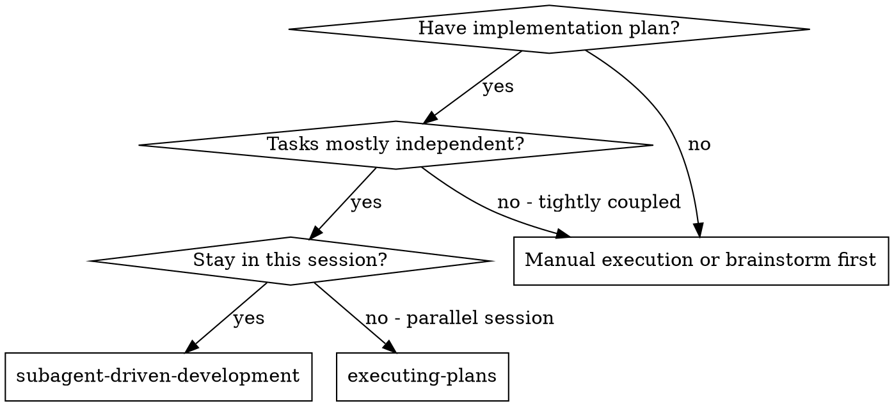

# Subagent-Driven Development

Execute plan by dispatching fresh subagent per task, with multi-stage review after each: TDD verification, spec compliance, code quality, and optional adversarial review with parallel agents.

**Why subagents:** You delegate tasks to specialized agents with isolated context. By precisely crafting their instructions and context, you ensure they stay focused and succeed at their task. They should never inherit your session's context or history — you construct exactly what they need. This also preserves your own context for coordination work.

**Core principle:** Fresh subagent per task + multi-stage review (TDD → spec → quality → adversarial) = high quality, fast iteration

## When to Use


```dot
digraph when_to_use {
    "Have implementation plan?" [shape=diamond];
    "Tasks mostly independent?" [shape=diamond];
    "Stay in this session?" [shape=diamond];
    "subagent-driven-development" [shape=box];
    "executing-plans" [shape=box];
    "Manual execution or brainstorm first" [shape=box];

    "Have implementation plan?" -> "Tasks mostly independent?" [label="yes"];
    "Have implementation plan?" -> "Manual execution or brainstorm first" [label="no"];
    "Tasks mostly independent?" -> "Stay in this session?" [label="yes"];
    "Tasks mostly independent?" -> "Manual execution or brainstorm first" [label="no - tightly coupled"];
    "Stay in this session?" -> "subagent-driven-development" [label="yes"];
    "Stay in this session?" -> "executing-plans" [label="no - parallel session"];
}
```

## Step 0: Opt-In Gates (Ask User BEFORE Starting)

Before extracting tasks or dispatching anything, ask the user which optional quality gates to activate. Present it clearly:

```
Before we begin, this plan has [N] tasks. I can activate optional quality gates:

1. **TDD Enforcement** — After each task, a verifier checks git history to confirm
   tests were written BEFORE production code (Red-Green-Refactor cycle).
   Cost: +1 subagent per task. Recommended for all tasks.

2. **Adversarial Review** — After quality review passes, parallel adversarial agents
   hunt for security holes, edge cases, and architecture violations.
   Cost: +2-3 parallel subagents per task (scaled by complexity).
   Recommended for tasks touching auth, data, APIs, or complex logic.

Which gates do you want active?
  (a) Both TDD + Adversarial [maximum quality]
  (b) TDD only [balanced — catches most issues]
  (c) Adversarial only [focused on security/robustness]
  (d) Neither [original fast mode — spec + quality review only]
```

Store the user's choice and apply it consistently across ALL tasks. Don't re-ask per task.

## The Process


```dot
digraph process {
    rankdir=TB;

    subgraph cluster_per_task {
        label="Per Task";
        "Dispatch implementer (./implementer-prompt.md)" [shape=box];
        "Implementer asks questions?" [shape=diamond];
        "Answer questions" [shape=box];
        "Implementer implements, tests, commits" [shape=box];

        "TDD gate active?" [shape=diamond style=filled fillcolor=lightyellow];
        "Dispatch TDD verifier (./tdd-verifier-prompt.md)" [shape=box style=filled fillcolor=lightyellow];
        "TDD verified?" [shape=diamond style=filled fillcolor=lightyellow];
        "Implementer re-does with proper TDD" [shape=box style=filled fillcolor=lightyellow];

        "Dispatch spec reviewer (./spec-reviewer-prompt.md)" [shape=box];
        "Spec compliant?" [shape=diamond];
        "Implementer fixes spec gaps" [shape=box];

        "Dispatch quality reviewer (./code-quality-reviewer-prompt.md)" [shape=box];
        "Quality approved?" [shape=diamond];
        "Implementer fixes quality issues" [shape=box];

        "Adversarial gate active?" [shape=diamond style=filled fillcolor=lightsalmon];
        "Classify task complexity" [shape=box style=filled fillcolor=lightsalmon];
        "Dispatch adversarial agents IN PARALLEL" [shape=box style=filled fillcolor=lightsalmon];
        "Any CRITICAL/HIGH findings?" [shape=diamond style=filled fillcolor=lightsalmon];
        "Dispatch fix agent (./adversarial-fix-prompt.md)" [shape=box style=filled fillcolor=lightsalmon];
        "Re-run failed adversarial reviewers" [shape=box style=filled fillcolor=lightsalmon];
        "Still has findings? (max 3 loops)" [shape=diamond style=filled fillcolor=lightsalmon];
        "Escalate to human" [shape=box style=filled fillcolor=lightsalmon];

        "Mark task complete" [shape=box];
    }

    "Read plan, extract tasks, ask opt-in gates, create TodoWrite" [shape=box];
    "More tasks?" [shape=diamond];
    "Final code reviewer for entire implementation" [shape=box];
    "superpowers:finishing-a-development-branch" [shape=box style=filled fillcolor=lightgreen];

    "Read plan, extract tasks, ask opt-in gates, create TodoWrite" -> "Dispatch implementer (./implementer-prompt.md)";
    "Dispatch implementer (./implementer-prompt.md)" -> "Implementer asks questions?";
    "Implementer asks questions?" -> "Answer questions" [label="yes"];
    "Answer questions" -> "Dispatch implementer (./implementer-prompt.md)";
    "Implementer asks questions?" -> "Implementer implements, tests, commits" [label="no"];

    "Implementer implements, tests, commits" -> "TDD gate active?";
    "TDD gate active?" -> "Dispatch TDD verifier (./tdd-verifier-prompt.md)" [label="yes"];
    "TDD gate active?" -> "Dispatch spec reviewer (./spec-reviewer-prompt.md)" [label="no"];
    "Dispatch TDD verifier (./tdd-verifier-prompt.md)" -> "TDD verified?";
    "TDD verified?" -> "Dispatch spec reviewer (./spec-reviewer-prompt.md)" [label="VERIFIED or PARTIAL"];
    "TDD verified?" -> "Implementer re-does with proper TDD" [label="NOT FOLLOWED"];
    "Implementer re-does with proper TDD" -> "Dispatch TDD verifier (./tdd-verifier-prompt.md)";

    "Dispatch spec reviewer (./spec-reviewer-prompt.md)" -> "Spec compliant?";
    "Spec compliant?" -> "Implementer fixes spec gaps" [label="no"];
    "Implementer fixes spec gaps" -> "Dispatch spec reviewer (./spec-reviewer-prompt.md)";
    "Spec compliant?" -> "Dispatch quality reviewer (./code-quality-reviewer-prompt.md)" [label="yes"];

    "Dispatch quality reviewer (./code-quality-reviewer-prompt.md)" -> "Quality approved?";
    "Quality approved?" -> "Implementer fixes quality issues" [label="no"];
    "Implementer fixes quality issues" -> "Dispatch quality reviewer (./code-quality-reviewer-prompt.md)";

    "Quality approved?" -> "Adversarial gate active?" [label="yes"];
    "Adversarial gate active?" -> "Classify task complexity" [label="yes"];
    "Adversarial gate active?" -> "Mark task complete" [label="no"];

    "Classify task complexity" -> "Dispatch adversarial agents IN PARALLEL";
    "Dispatch adversarial agents IN PARALLEL" -> "Any CRITICAL/HIGH findings?";
    "Any CRITICAL/HIGH findings?" -> "Mark task complete" [label="no — PASS"];
    "Any CRITICAL/HIGH findings?" -> "Dispatch fix agent (./adversarial-fix-prompt.md)" [label="yes"];
    "Dispatch fix agent (./adversarial-fix-prompt.md)" -> "Re-run failed adversarial reviewers";
    "Re-run failed adversarial reviewers" -> "Still has findings? (max 3 loops)";
    "Still has findings? (max 3 loops)" -> "Dispatch fix agent (./adversarial-fix-prompt.md)" [label="yes, loop < 3"];
    "Still has findings? (max 3 loops)" -> "Escalate to human" [label="3rd failure"];
    "Escalate to human" -> "Mark task complete";

    "Mark task complete" -> "More tasks?";
    "More tasks?" -> "Dispatch implementer (./implementer-prompt.md)" [label="yes"];
    "More tasks?" -> "Final code reviewer for entire implementation" [label="no"];
    "Final code reviewer for entire implementation" -> "superpowers:finishing-a-development-branch";
}
```

## Task Complexity Classification

Before dispatching adversarial reviewers, classify the task to determine how many and which agents to spawn. The classification happens automatically — you don't ask the user per task.

### Complexity Signals

| Signal | LOW | MEDIUM | HIGH |
|--------|-----|--------|------|
| Files changed | 1-2 | 3-5 | 6+ |
| Touches auth/security | No | Indirectly | Yes |
| Touches data/DB | No | Read-only | Write/mutations |
| External API calls | No | Existing integration | New integration |
| Concurrency concerns | No | Possible | Yes |
| User-facing input | No | Validated elsewhere | Direct handling |

### Agent Selection Matrix

| Complexity | Agents Spawned (in parallel) | Rationale |
|------------|------------------------------|-----------|
| **LOW** (config, docs, simple UI) | Security only | Minimal attack surface, just sanity check |
| **MEDIUM** (business logic, APIs, data reads) | Security + Edge Cases (2 parallel) | Real attack vectors and failure modes |
| **HIGH** (auth, payments, data mutations, new integrations) | Security + Edge Cases + Architecture (3 parallel) | Full adversarial coverage — these are where bugs cost the most |

### How to Classify

Read the task description and the files the implementer changed. Count the signals above. Use this logic:

```
if touches_auth OR touches_payment OR new_external_integration:
    complexity = HIGH
elif files_changed > 2 OR touches_data OR has_user_input:
    complexity = MEDIUM
else:
    complexity = LOW
```

When in doubt, round UP. A false positive (extra review) costs a subagent. A false negative (missed review) costs a production bug.

## Adversarial Review: The Parallel Dispatch

This is the key differentiator from the original flow. Instead of sequential reviews, adversarial agents run **in parallel** for speed.

### Dispatch Pattern

```
# For MEDIUM complexity — spawn 2 agents in ONE message:
Agent(adversarial-security-prompt.md) + Agent(adversarial-edge-cases-prompt.md)

# For HIGH complexity — spawn 3 agents in ONE message:
Agent(adversarial-security-prompt.md) + Agent(adversarial-edge-cases-prompt.md) + Agent(adversarial-architecture-prompt.md)

# For LOW complexity — spawn 1 agent:
Agent(adversarial-security-prompt.md)
```

Each agent gets ZERO context from the implementation session. They receive only:
1. The task requirements (full text)
2. The list of files changed
3. Nothing else — no implementer report, no prior review results

This isolation is intentional. Adversarial reviewers that know "the spec reviewer already approved" become complacent. Fresh eyes catch more.

### Processing Results

When all parallel agents return:

1. **Collect all findings** from all agents
2. **Deduplicate** — if Security and Edge Cases both found the same issue, keep the one with the better fix suggestion
3. **Filter by severity** — only CRITICAL and HIGH block progress
4. **If all PASS** → mark task complete
5. **If any FAIL** → dispatch fix agent with consolidated CRITICAL + HIGH findings

### Fix Loop (Max 3 Iterations)

```
Iteration 1: Fix agent applies fixes → Re-run ONLY the adversarial reviewers that FAILed
Iteration 2: If still failing → Fix agent tries again → Re-run failed reviewers
Iteration 3: If STILL failing → STOP. Present findings to user with:
  - What was found
  - What was attempted
  - Why it's not resolving
  - Proposed alternative approach
```

The 3-iteration cap prevents infinite loops. If a finding can't be fixed in 3 tries, it's likely a design issue that needs human judgment, not more automated fixing.

## Model Selection

Use the least powerful model that can handle each role to conserve cost and increase speed.

**Mechanical implementation tasks** (isolated functions, clear specs, 1-2 files): use a fast, cheap model. Most implementation tasks are mechanical when the plan is well-specified.

**Integration and judgment tasks** (multi-file coordination, pattern matching, debugging): use a standard model.

**Architecture, design, and review tasks**: use the most capable available model.

**Adversarial agents**: use a standard-to-capable model. They need to reason about attack vectors and failure modes, which requires more intelligence than mechanical coding. Don't use a cheap model for adversarial review — it defeats the purpose.

**Fix agents**: use a standard model. Targeted fixes with clear instructions don't need the most capable model, but do need competent reasoning.

**TDD verifier**: use a cheap model. It's mostly checking git history and file structure — mechanical work.

**Task complexity signals:**
- Touches 1-2 files with a complete spec → cheap model for implementer
- Touches multiple files with integration concerns → standard model
- Requires design judgment or broad codebase understanding → most capable model

## Handling Implementer Status

Implementer subagents report one of four statuses. Handle each appropriately:

**DONE:** If TDD gate is active, proceed to TDD verification. Otherwise, proceed to spec compliance review.

**DONE_WITH_CONCERNS:** The implementer completed the work but flagged doubts. Read the concerns before proceeding. If the concerns are about correctness or scope, address them before review. If they're observations (e.g., "this file is getting large"), note them and proceed to review.

**NEEDS_CONTEXT:** The implementer needs information that wasn't provided. Provide the missing context and re-dispatch.

**BLOCKED:** The implementer cannot complete the task. Assess the blocker:
1. If it's a context problem, provide more context and re-dispatch with the same model
2. If the task requires more reasoning, re-dispatch with a more capable model
3. If the task is too large, break it into smaller pieces
4. If the plan itself is wrong, escalate to the human

**Never** ignore an escalation or force the same model to retry without changes. If the implementer said it's stuck, something needs to change.

## Handling TDD Verifier Results

**✅ VERIFIED:** Proceed to spec compliance review normally.

**⚠️ PARTIAL:** Note the concern but proceed. TDD was partially followed — the tests exist and are decent, even if the commit order isn't perfect. Don't block progress for commit hygiene alone.

**❌ NOT FOLLOWED:** This IS a blocker. The implementer must redo the task with proper TDD. Re-dispatch the implementer with explicit instructions to follow Red-Green-Refactor. Include the verifier's evidence so the implementer understands what went wrong.

## Prompt Templates

- `./implementer-prompt.md` - Dispatch implementer subagent
- `./tdd-verifier-prompt.md` - Dispatch TDD verification subagent (opt-in)
- `./spec-reviewer-prompt.md` - Dispatch spec compliance reviewer subagent
- `./code-quality-reviewer-prompt.md` - Dispatch code quality reviewer subagent
- `./adversarial-security-prompt.md` - Dispatch security adversarial reviewer (opt-in)
- `./adversarial-edge-cases-prompt.md` - Dispatch edge-case adversarial reviewer (opt-in)
- `./adversarial-architecture-prompt.md` - Dispatch architecture adversarial reviewer (opt-in, HIGH complexity only)
- `./adversarial-fix-prompt.md` - Dispatch fix agent for adversarial findings (opt-in)

## Example Workflow (with all gates active)

```
You: I'm using Subagent-Driven Development to execute this plan.

Before we begin, this plan has 4 tasks. I can activate optional quality gates:
1. TDD Enforcement — verifies Red-Green-Refactor cycle. +1 subagent/task.
2. Adversarial Review — parallel agents hunt security/edge-case/arch issues. +2-3 subagents/task.

Which gates? (a) Both (b) TDD only (c) Adversarial only (d) Neither

User: a

You: Both gates active. Starting execution.

[Read plan, extract all 4 tasks, create TodoWrite]

Task 1: Add rate limiting to API endpoints (HIGH complexity — touches auth + user input)

[Dispatch implementer with full task text + context]
Implementer: DONE — Added rate limiter middleware, 6 tests passing, committed.

[TDD Gate: Dispatch TDD verifier]
TDD Verifier: ✅ VERIFIED — test files committed before middleware, 3 RED→GREEN cycles visible.

[Dispatch spec compliance reviewer]
Spec reviewer: ✅ Spec compliant.

[Dispatch code quality reviewer]
Code reviewer: ✅ Approved.

[Adversarial Gate: HIGH complexity → spawn 3 agents in parallel]
[Dispatch: security + edge-cases + architecture — all in ONE message, all run simultaneously]

Security reviewer: ❌ FAIL
  - CRITICAL: Rate limiter uses client IP from X-Forwarded-For without validation.
    Attacker can bypass by spoofing header. File: middleware/rate-limit.ts:23

Edge-case reviewer: ❌ FAIL
  - HIGH: No handling for Redis connection failure. Rate limiter crashes
    instead of gracefully degrading. File: middleware/rate-limit.ts:45

Architecture reviewer: ✅ PASS
  - MEDIUM: Rate limit config is hardcoded (recommend extracting to env vars)

[Consolidate: 1 CRITICAL + 1 HIGH = FAIL. Dispatch fix agent]
Fix agent: Fixed X-Forwarded-For validation (trust only last proxy hop),
  added Redis fallback (allow-all on connection failure with warning log).
  2 new tests added. All existing tests pass.

[Re-run security + edge-cases reviewers (architecture passed, skip it)]
Security reviewer: ✅ PASS — X-Forwarded-For properly validated now.
Edge-case reviewer: ✅ PASS — Redis failure handled gracefully.

[All adversarial reviewers pass. Mark Task 1 complete.]

Task 2: Add user preferences page (LOW complexity — simple UI, no auth)

[Dispatch implementer...]
Implementer: DONE — React component + tests.

[TDD Gate: Dispatch TDD verifier]
TDD Verifier: ⚠️ PARTIAL — Tests exist but committed in same batch as component.

[Note concern, proceed — tests are good quality even if order is imperfect]

[Spec + Quality reviews pass]

[Adversarial Gate: LOW complexity → spawn security only]
Security reviewer: ✅ PASS — No issues found.

[Mark Task 2 complete]

... Tasks 3-4 ...

[After all tasks: Dispatch final code reviewer for entire implementation]
[Use superpowers:finishing-a-development-branch]
```

## Advantages

**vs. Manual execution:**
- Subagents follow TDD naturally
- Fresh context per task (no confusion)
- Parallel-safe (subagents don't interfere)
- Subagent can ask questions (before AND during work)

**vs. Executing Plans:**
- Same session (no handoff)
- Continuous progress (no waiting)
- Review checkpoints automatic

**vs. Original Superpowers (without gates):**
- TDD enforcement catches "tests as afterthought" pattern
- Adversarial review catches security/edge-case issues early
- Parallel adversarial agents = minimal time overhead
- Fix loop resolves issues without human intervention (up to 3 tries)
- Complexity-based agent selection = pay only for what you need

**Efficiency gains:**
- No file reading overhead (controller provides full text)
- Controller curates exactly what context is needed
- Subagent gets complete information upfront
- Questions surfaced before work begins (not after)
- Adversarial agents run in parallel (not sequential)

**Quality gates:**
- Self-review catches issues before handoff
- TDD verification ensures tests drive implementation (opt-in)
- Spec compliance prevents over/under-building
- Code quality ensures implementation is well-built
- Adversarial review catches real-world failure modes (opt-in)
- Fix loop auto-resolves findings without human intervention
- 3-iteration cap prevents infinite loops

**Cost:**
- Base: implementer + 2 reviewers per task (same as before)
- TDD gate: +1 cheap subagent per task
- Adversarial gate: +1 to 3 subagents per task (parallel, by complexity)
- Fix loop: +1 fix agent + re-review per iteration (only when findings exist)
- Total worst case (HIGH complexity, 3 fix iterations): ~9 subagents per task
- Total best case (LOW complexity, no findings): ~4 subagents per task
- But catches issues early (cheaper than debugging in production)

## Red Flags

**Never:**
- Start implementation on main/master branch without explicit user consent
- Skip reviews (spec compliance OR code quality)
- Proceed with unfixed CRITICAL/HIGH adversarial findings
- Dispatch multiple implementation subagents in parallel (conflicts)
- Make subagent read plan file (provide full text instead)
- Skip scene-setting context (subagent needs to understand where task fits)
- Ignore subagent questions (answer before letting them proceed)
- Accept "close enough" on spec compliance (spec reviewer found issues = not done)
- Skip review loops (reviewer found issues = implementer fixes = review again)
- Let implementer self-review replace actual review (both are needed)
- **Start code quality review before spec compliance is ✅** (wrong order)
- **Start adversarial review before code quality is ✅** (wrong order)
- Move to next task while any review has open issues
- Run adversarial fix loop more than 3 times (escalate to human)
- Give adversarial reviewers context from the implementation session (isolation is key)
- Re-ask opt-in gates per task (ask once at start, apply to all)

**If subagent asks questions:**
- Answer clearly and completely
- Provide additional context if needed
- Don't rush them into implementation

**If reviewer finds issues:**
- Implementer (same subagent) fixes them
- Reviewer reviews again
- Repeat until approved
- Don't skip the re-review

**If adversarial reviewer finds issues:**
- Dispatch fix agent (NOT the original implementer) with consolidated findings
- Re-run ONLY the reviewers that failed
- Max 3 iterations then escalate

**If subagent fails task:**
- Dispatch fix subagent with specific instructions
- Don't try to fix manually (context pollution)

## Integration

**Required workflow skills:**
- **superpowers:using-git-worktrees** - REQUIRED: Set up isolated workspace before starting
- **superpowers:writing-plans** - Creates the plan this skill executes
- **superpowers:requesting-code-review** - Code review template for reviewer subagents
- **superpowers:finishing-a-development-branch** - Complete development after all tasks

**Subagents should use:**
- **superpowers:test-driven-development** - Subagents follow TDD for each task

**Alternative workflow:**
- **superpowers:executing-plans** - Use for parallel session instead of same-session execution
