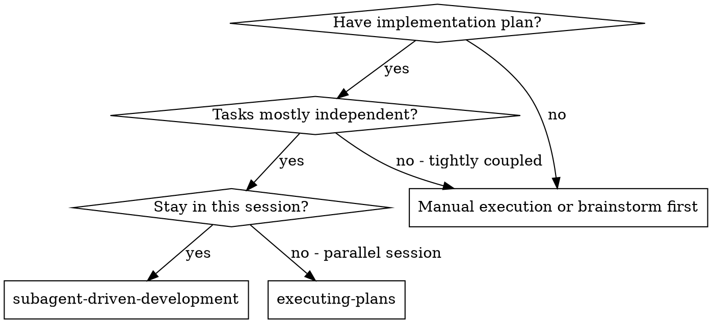

# Subagent-Driven Development

Execute an approved plan with Codex roles and a fixed review pipeline:

`worker -> spec_reviewer -> quality_reviewer -> monitor -> reviewer`

Not every task uses every role, but the order matters: scope first, quality
second, final integration review last.

**Core principle:** one focused worker per task, then independent review before
moving on.

## When to Use


```dot
digraph when_to_use {
    "Have implementation plan?" [shape=diamond];
    "Tasks mostly independent?" [shape=diamond];
    "Stay in this session?" [shape=diamond];
    "subagent-driven-development" [shape=box];
    "executing-plans" [shape=box];
    "Manual execution or brainstorm first" [shape=box];

    "Have implementation plan?" -> "Tasks mostly independent?" [label="yes"];
    "Have implementation plan?" -> "Manual execution or brainstorm first" [label="no"];
    "Tasks mostly independent?" -> "Stay in this session?" [label="yes"];
    "Tasks mostly independent?" -> "Manual execution or brainstorm first" [label="no - tightly coupled"];
    "Stay in this session?" -> "subagent-driven-development" [label="yes"];
    "Stay in this session?" -> "executing-plans" [label="no - parallel session"];
}
```

**vs. Executing Plans (parallel session):**

- same session, no handoff
- one focused worker per task
- explicit role handoff for scope and quality review
- faster iteration when the controller already understands the plan

## Role Pipeline

- `worker` implements the task inside an explicit file scope
- `spec_reviewer` checks exact scope compliance before quality review starts
- `quality_reviewer` checks correctness, tests, and maintenance after scope is approved
- `monitor` watches long-running verification or background commands when needed
- `reviewer` performs the final cross-task review of the implementation as a whole

## The Process

1. Read the approved plan once and extract the current task's full text.
2. Capture the task's file ownership and acceptance criteria before you dispatch
   anyone.
3. Dispatch `worker` with the full task text, explicit file scope, and local
   context. Do not make the worker rediscover the plan file.
4. If the worker needs clarification, keep the same thread alive and use
   `send_input`. Only use `resume_agent` when you need to reopen a closed thread.
5. When the worker reports completion, dispatch `spec_reviewer`.
6. If `spec_reviewer` finds missing or extra scope, send that feedback back to
   the same worker thread and re-run `spec_reviewer`.
7. Only after scope is approved, dispatch `quality_reviewer`.
8. If verification is long-running, dispatch `monitor` to wait on the relevant
   command or agent job instead of blocking the controller thread.
9. After all tasks are complete, dispatch `reviewer` for a final integration
   review across task boundaries.
10. Track task state with the platform-native mechanism. In Codex, use
    `update_plan` when available.

## Prompt Templates

Use the bundled templates for the role-specific prompts:

- `./implementer-prompt.md` - dispatch the `worker` role
- `./spec-reviewer-prompt.md` - dispatch the `spec_reviewer` role
- `./code-quality-reviewer-prompt.md` - dispatch the `quality_reviewer` role

For ready-to-paste orchestrator prompts, see
`.codex/examples/prompts/subagent-driven-development.md`.

## Worker Status Handling

Workers should report one of these statuses:

- `DONE` - proceed to `spec_reviewer`
- `DONE_WITH_CONCERNS` - read the concerns before review
- `NEEDS_CONTEXT` - use `send_input` to clarify and continue the same thread
- `BLOCKED` - change something meaningful before retrying

Never keep retrying the same blocked worker without changing the context, the
scope, or the approach.

## Example Prompt Shape

```text
Execute Task N from the approved plan.
Have worker implement it within the assigned file scope, spec_reviewer verify
exact scope compliance, quality_reviewer review correctness and tests, and
monitor wait on any long-running verification before reviewer summarizes
readiness.
```

## Advantages

- fresh context per task instead of one bloated controller thread
- explicit scope review before quality review
- easier reuse of the same worker thread when clarifying or fixing issues
- cleaner long-running verification via `monitor`

## Red Flags

**Never:**

- start code quality review before `spec_reviewer` has passed
- let multiple workers edit the same file scope in parallel
- make the worker rediscover the plan file when you can provide the task text
- skip the re-review loop after scope or quality issues
- treat `reviewer` as a substitute for `spec_reviewer`

## Integration

**Required workflow skills:**

- **superpowers:using-git-worktrees** - set up isolation before starting
- **superpowers:writing-plans** - create the plan this skill executes
- **superpowers:requesting-code-review** - run the final `reviewer` pass
- **superpowers:finishing-a-development-branch** - complete the work after all tasks

**Workers should use:**

- **superpowers:test-driven-development** - follow TDD for each task

**Alternative workflow:**

- **superpowers:executing-plans** - use when you want a separate execution session instead of a same-session controller
