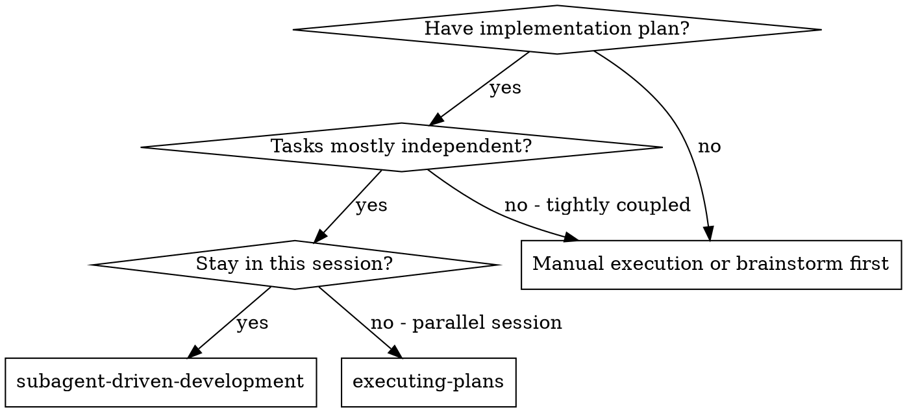
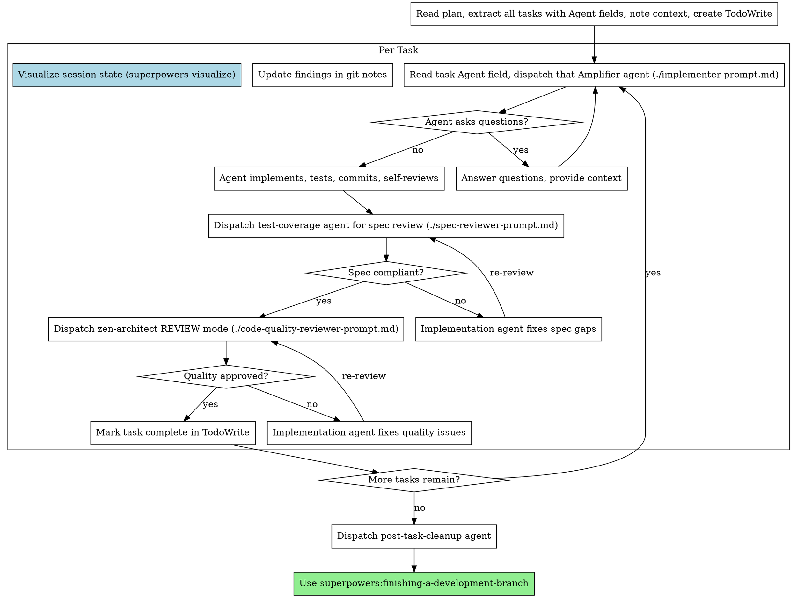

# Subagent-Driven Development

Execute plan by dispatching the Amplifier agent specified in each task, with two-stage review after each: spec compliance review first, then code quality review.

**Core principle:** Dispatch the right Amplifier specialist per task + two-stage review (spec then quality) = high quality, fast iteration

## When to Use


```dot
digraph when_to_use {
    "Have implementation plan?" [shape=diamond];
    "Tasks mostly independent?" [shape=diamond];
    "Stay in this session?" [shape=diamond];
    "subagent-driven-development" [shape=box];
    "executing-plans" [shape=box];
    "Manual execution or brainstorm first" [shape=box];

    "Have implementation plan?" -> "Tasks mostly independent?" [label="yes"];
    "Have implementation plan?" -> "Manual execution or brainstorm first" [label="no"];
    "Tasks mostly independent?" -> "Stay in this session?" [label="yes"];
    "Tasks mostly independent?" -> "Manual execution or brainstorm first" [label="no - tightly coupled"];
    "Stay in this session?" -> "subagent-driven-development" [label="yes"];
    "Stay in this session?" -> "executing-plans" [label="no - parallel session"];
}
```

**vs. Executing Plans (parallel session):**
- Same session (no context switch)
- Fresh Amplifier agent per task (specialist knowledge + no context pollution)
- Two-stage review after each task: spec compliance first, then code quality
- Faster iteration (no human-in-loop between tasks)

## Amplifier Agent Dispatch

Each task in the plan has an `Agent:` field. Use it to dispatch the right specialist:

1. Read the task's `Agent:` field (e.g., `modular-builder`, `bug-hunter`, `database-architect`)
2. Dispatch that agent via the Task tool
3. Pass the full task text + context (never make subagent read the plan file)
4. The agent brings domain expertise to the implementation

**Review agents (from AMPLIFIER-AGENTS.md):**
- Spec compliance review → dispatch `test-coverage` agent
- Code quality review → dispatch `zen-architect` agent (REVIEW mode)
- Security-sensitive tasks → add `security-guardian` as third reviewer
- Parallel review is OK: spec-compliance and security reviews are read-only, they can run concurrently

**After all tasks complete:**
- Dispatch `post-task-cleanup` agent for codebase hygiene
- Then use superpowers:finishing-a-development-branch

## The Process


```dot
digraph process {
    rankdir=TB;

    subgraph cluster_per_task {
        label="Per Task";
        "Read task Agent field, dispatch that Amplifier agent (./implementer-prompt.md)" [shape=box];
        "Agent asks questions?" [shape=diamond];
        "Answer questions, provide context" [shape=box];
        "Agent implements, tests, commits, self-reviews" [shape=box];
        "Dispatch test-coverage agent for spec review (./spec-reviewer-prompt.md)" [shape=box];
        "Spec compliant?" [shape=diamond];
        "Implementation agent fixes spec gaps" [shape=box];
        "Dispatch zen-architect REVIEW mode (./code-quality-reviewer-prompt.md)" [shape=box];
        "Quality approved?" [shape=diamond];
        "Implementation agent fixes quality issues" [shape=box];
        "Mark task complete in TodoWrite" [shape=box];
        "Update findings in git notes" [shape=box];
        "Visualize session state (superpowers visualize)" [shape=box style=filled fillcolor=lightblue];
    }

    "Read plan, extract all tasks with Agent fields, note context, create TodoWrite" [shape=box];
    "More tasks remain?" [shape=diamond];
    "Dispatch post-task-cleanup agent" [shape=box];
    "Use superpowers:finishing-a-development-branch" [shape=box style=filled fillcolor=lightgreen];

    "Read plan, extract all tasks with Agent fields, note context, create TodoWrite" -> "Read task Agent field, dispatch that Amplifier agent (./implementer-prompt.md)";
    "Read task Agent field, dispatch that Amplifier agent (./implementer-prompt.md)" -> "Agent asks questions?";
    "Agent asks questions?" -> "Answer questions, provide context" [label="yes"];
    "Answer questions, provide context" -> "Read task Agent field, dispatch that Amplifier agent (./implementer-prompt.md)";
    "Agent asks questions?" -> "Agent implements, tests, commits, self-reviews" [label="no"];
    "Agent implements, tests, commits, self-reviews" -> "Dispatch test-coverage agent for spec review (./spec-reviewer-prompt.md)";
    "Dispatch test-coverage agent for spec review (./spec-reviewer-prompt.md)" -> "Spec compliant?";
    "Spec compliant?" -> "Implementation agent fixes spec gaps" [label="no"];
    "Implementation agent fixes spec gaps" -> "Dispatch test-coverage agent for spec review (./spec-reviewer-prompt.md)" [label="re-review"];
    "Spec compliant?" -> "Dispatch zen-architect REVIEW mode (./code-quality-reviewer-prompt.md)" [label="yes"];
    "Dispatch zen-architect REVIEW mode (./code-quality-reviewer-prompt.md)" -> "Quality approved?";
    "Quality approved?" -> "Implementation agent fixes quality issues" [label="no"];
    "Implementation agent fixes quality issues" -> "Dispatch zen-architect REVIEW mode (./code-quality-reviewer-prompt.md)" [label="re-review"];
    "Quality approved?" -> "Mark task complete in TodoWrite" [label="yes"];
    "Mark task complete in TodoWrite" -> "More tasks remain?";
    "More tasks remain?" -> "Read task Agent field, dispatch that Amplifier agent (./implementer-prompt.md)" [label="yes"];
    "More tasks remain?" -> "Dispatch post-task-cleanup agent" [label="no"];
    "Dispatch post-task-cleanup agent" -> "Use superpowers:finishing-a-development-branch";
}
```

## Prompt Templates

- `./implementer-prompt.md` - Dispatch implementation agent (includes agent-specific context)
- `./spec-reviewer-prompt.md` - Dispatch test-coverage agent for spec compliance
- `./code-quality-reviewer-prompt.md` - Dispatch zen-architect for code quality

## Example Workflow

```
You: I'm using Subagent-Driven Development to execute this plan.

[Read plan file once: docs/plans/feature-plan.md]
[Extract all 5 tasks with full text, Agent fields, and context]
[Create TodoWrite with all tasks]

Task 1: Design auth module schema (Agent: database-architect)

[Dispatch database-architect agent with full task text + context]

database-architect: "Should we use separate tables for roles and permissions, or a combined approach?"

You: "Separate tables — we need fine-grained permission assignment."

database-architect: "Got it. Implementing now..."
[Later] database-architect:
  - Created migration for users, roles, permissions tables
  - Added indexes for common query patterns
  - Tests: 4/4 passing
  - Committed

[Dispatch test-coverage agent for spec compliance]
test-coverage: ✅ Spec compliant - schema matches requirements

[Dispatch zen-architect REVIEW mode for code quality]
zen-architect: Strengths: Clean schema. Issues: None. Approved.

[Mark Task 1 complete]

Task 2: Implement auth middleware (Agent: modular-builder)

[Dispatch modular-builder agent with full task text + context]

modular-builder: [No questions, proceeds with bricks-and-studs approach]
...

[After all tasks]
[Dispatch post-task-cleanup agent]
post-task-cleanup: Removed 2 unused imports, no other issues.

[Use superpowers:finishing-a-development-branch]
Done!
```

## Advantages

**vs. Manual execution:**
- Specialist agents bring domain expertise per task
- Fresh context per task (no confusion)
- Parallel-safe (subagents don't interfere)
- Subagent can ask questions (before AND during work)

**vs. Executing Plans:**
- Same session (no handoff)
- Continuous progress (no waiting)
- Review checkpoints automatic

**Efficiency gains:**
- No file reading overhead (controller provides full text)
- Controller curates exactly what context is needed
- Agent brings domain expertise (database-architect knows schema patterns)
- Questions surfaced before work begins (not after)

**Quality gates:**
- Self-review catches issues before handoff
- Spec compliance via test-coverage agent (testing expert verifies completeness)
- Code quality via zen-architect REVIEW mode (architecture expert verifies quality)
- Security review via security-guardian (when applicable)
- Post-task-cleanup ensures hygiene
- Review loops ensure fixes actually work

**Cost:**
- More subagent invocations (implementer + 2-3 reviewers per task)
- Controller does more prep work (extracting all tasks upfront)
- Review loops add iterations
- But catches issues early (cheaper than debugging later)

## Red Flags

**Never:**
- Start implementation on main/master branch without explicit user consent
- Skip reviews (spec compliance OR code quality)
- Proceed with unfixed issues
- Dispatch multiple implementation subagents in parallel (conflicts)
- Make subagent read plan file (provide full text instead)
- Skip scene-setting context (subagent needs to understand where task fits)
- Ignore subagent questions (answer before letting them proceed)
- Accept "close enough" on spec compliance (spec reviewer found issues = not done)
- Skip review loops (reviewer found issues = implementer fixes = review again)
- Let implementer self-review replace actual review (both are needed)
- **Start code quality review before spec compliance is ✅** (wrong order)
- Move to next task while either review has open issues
- Override the plan's Agent field without good reason

**If subagent asks questions:**
- Answer clearly and completely
- Provide additional context if needed
- Don't rush them into implementation

**If reviewer finds issues:**
- Implementer (same subagent) fixes them
- Reviewer reviews again
- Repeat until approved
- Don't skip the re-review

**If subagent fails task:**
- Dispatch fix subagent with specific instructions
- Don't try to fix manually (context pollution)

## Integration

**Required workflow skills:**
- **superpowers:using-git-worktrees** - REQUIRED: Set up isolated workspace before starting
- **superpowers:writing-plans** - Creates the plan this skill executes (with Agent: fields)
- **superpowers:requesting-code-review** - Code review template for reviewer subagents
- **superpowers:finishing-a-development-branch** - Complete development after all tasks

**Amplifier agents used:**
- **Implementation agents** - Per task's Agent: field (modular-builder, database-architect, etc.)
- **test-coverage** - Spec compliance reviewer
- **zen-architect** - Code quality reviewer (REVIEW mode)
- **security-guardian** - Security reviewer (when applicable)
- **post-task-cleanup** - Final hygiene pass

**Subagents should use:**
- **superpowers:test-driven-development** - Subagents follow TDD for each task

**Alternative workflow:**
- **superpowers:executing-plans** - Use for parallel session instead of same-session execution
