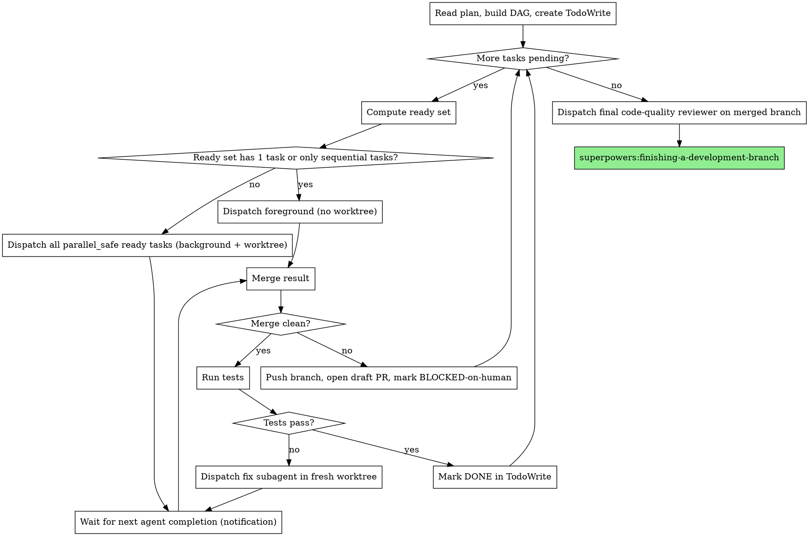

# Subagent-Driven Development

Execute a plan by dispatching one backgrounded subagent per ready task into its own git worktree, with full per-task review pipeline (implementer → spec review → code-quality review) running autonomously inside each worktree. Controller merges results as they arrive.

**Why parallel-by-default:** plans expose their structure as a DAG via `depends_on`. The controller computes the ready set each round and dispatches every parallel-safe ready task concurrently. Sequential is the fallback for chain DAGs and `parallel_safe: false` tasks, not the default.

**Why subagents:** you delegate tasks to specialized agents with isolated context. By precisely crafting their instructions and context, you ensure they stay focused and succeed at their task. They never inherit your session's context — you construct exactly what they need. This preserves your own context for coordination.

**Continuous execution:** do not pause to check in with your human partner between tasks. Execute all tasks from the plan without stopping. The only reasons to stop are: BLOCKED status you cannot resolve, ambiguity that genuinely prevents progress, or all tasks complete.

## When to Use

Default execution path for any plan with task `depends_on` metadata. For plans without `depends_on` declared on any task, see the **Sequential Mode** subsection below.

## The Process


```dot
digraph parallel_process {
    rankdir=TB;
    "Read plan, build DAG, create TodoWrite" [shape=box];
    "More tasks pending?" [shape=diamond];
    "Compute ready set" [shape=box];
    "Ready set has 1 task or only sequential tasks?" [shape=diamond];
    "Dispatch foreground (no worktree)" [shape=box];
    "Dispatch all parallel_safe ready tasks (background + worktree)" [shape=box];
    "Wait for next agent completion (notification)" [shape=box];
    "Merge result" [shape=box];
    "Merge clean?" [shape=diamond];
    "Run tests" [shape=box];
    "Tests pass?" [shape=diamond];
    "Push branch, open draft PR, mark BLOCKED-on-human" [shape=box];
    "Dispatch fix subagent in fresh worktree" [shape=box];
    "Mark DONE in TodoWrite" [shape=box];
    "Dispatch final code-quality reviewer on merged branch" [shape=box];
    "superpowers:finishing-a-development-branch" [shape=box style=filled fillcolor=lightgreen];

    "Read plan, build DAG, create TodoWrite" -> "More tasks pending?";
    "More tasks pending?" -> "Compute ready set" [label="yes"];
    "Compute ready set" -> "Ready set has 1 task or only sequential tasks?";
    "Ready set has 1 task or only sequential tasks?" -> "Dispatch foreground (no worktree)" [label="yes"];
    "Ready set has 1 task or only sequential tasks?" -> "Dispatch all parallel_safe ready tasks (background + worktree)" [label="no"];
    "Dispatch foreground (no worktree)" -> "Merge result";
    "Dispatch all parallel_safe ready tasks (background + worktree)" -> "Wait for next agent completion (notification)";
    "Wait for next agent completion (notification)" -> "Merge result";
    "Merge result" -> "Merge clean?";
    "Merge clean?" -> "Run tests" [label="yes"];
    "Merge clean?" -> "Push branch, open draft PR, mark BLOCKED-on-human" [label="no"];
    "Run tests" -> "Tests pass?";
    "Tests pass?" -> "Mark DONE in TodoWrite" [label="yes"];
    "Tests pass?" -> "Dispatch fix subagent in fresh worktree" [label="no"];
    "Dispatch fix subagent in fresh worktree" -> "Wait for next agent completion (notification)";
    "Push branch, open draft PR, mark BLOCKED-on-human" -> "More tasks pending?";
    "Mark DONE in TodoWrite" -> "More tasks pending?";
    "More tasks pending?" -> "Dispatch final code-quality reviewer on merged branch" [label="no"];
    "Dispatch final code-quality reviewer on merged branch" -> "superpowers:finishing-a-development-branch";
}
```

### Controller pseudocode

```
build DAG from plan
done = {}
blocked = {}
in_flight = {}

while (done | blocked | in_flight) != all_tasks:
    ready = {t for t in tasks
             if t not in done and t not in blocked and t not in in_flight
             and all(d in done for d in t.depends_on)}

    parallel_batch = [t for t in ready if t.parallel_safe]
    sequential     = [t for t in ready if not t.parallel_safe]

    for t in parallel_batch:
        Agent(isolation="worktree", run_in_background=true,
              prompt=per_task_pipeline_prompt(t))
        in_flight.add(t)

    for t in sequential:
        Agent(prompt=per_task_pipeline_prompt(t))   # foreground
        merge_result(t)                              # see merge step

    on each background completion:
        merge_result(t)                              # may mark DONE or BLOCKED
        in_flight.remove(t)

dispatch final code-quality reviewer on merged branch
hand off to superpowers:finishing-a-development-branch
```

The dispatch + merge mechanics live in `superpowers:dispatching-parallel-agents`. Read that skill for the worktree, background, and conflict-PR details. Do not duplicate them here.

### Per-task pipeline (inside each worktree)

The implementer prompt instructs the worktree subagent to run the full review pipeline itself before returning:

1. Implement + test + commit (TDD)
2. Self-review
3. Dispatch spec reviewer subagent (also background) — fix loop until ✅
4. Dispatch code-quality reviewer subagent (also background) — fix loop until ✅
5. Return DONE to controller

The controller never sees per-task review status — only the final pipeline status. Reviewer subagents are explicitly forbidden from escalating to the human (see reviewer prompts).

### Sequential Mode (fallback)

When the plan declares no `depends_on` on any task, run the original sequential flow: one task at a time, foreground, with per-task spec review and code-quality review surfaced to the controller. Use this for plans written before the DAG format existed and for any plan whose author chose pure sequential.

## Model Selection

Use the least powerful model that can handle each role to conserve cost and increase speed.

**Mechanical implementation tasks** (isolated functions, clear specs, 1-2 files): use a fast, cheap model. Most implementation tasks are mechanical when the plan is well-specified.

**Integration and judgment tasks** (multi-file coordination, pattern matching, debugging): use a standard model.

**Architecture, design, and review tasks**: use the most capable available model.

**Task complexity signals:**
- Touches 1-2 files with a complete spec → cheap model
- Touches multiple files with integration concerns → standard model
- Requires design judgment or broad codebase understanding → most capable model

## Handling Implementer Status

Implementer subagents report one of four statuses. Handle each appropriately:

**DONE:** Proceed to spec compliance review.

**DONE_WITH_CONCERNS:** The implementer completed the work but flagged doubts. Read the concerns before proceeding. If the concerns are about correctness or scope, address them before review. If they're observations (e.g., "this file is getting large"), note them and proceed to review.

**NEEDS_CONTEXT:** The implementer needs information that wasn't provided. Provide the missing context and re-dispatch.

**BLOCKED:** The implementer cannot complete the task. Assess the blocker:
1. If it's a context problem, provide more context and re-dispatch with the same model
2. If the task requires more reasoning, re-dispatch with a more capable model
3. If the task is too large, break it into smaller pieces
4. If the plan itself is wrong, escalate to the human

**Never** ignore an escalation or force the same model to retry without changes. If the implementer said it's stuck, something needs to change.

## Prompt Templates

- `./implementer-prompt.md` - Dispatch implementer subagent
- `./spec-reviewer-prompt.md` - Dispatch spec compliance reviewer subagent
- `./code-quality-reviewer-prompt.md` - Dispatch code quality reviewer subagent

## Example Workflow

```
You: I'm using Subagent-Driven Development to execute this plan.

[Read plan file once: docs/superpowers/plans/feature-plan.md]
[Extract all 5 tasks with full text and context]
[Create TodoWrite with all tasks]

Task 1: Hook installation script

[Get Task 1 text and context (already extracted)]
[Dispatch implementation subagent with full task text + context]

Implementer: "Before I begin - should the hook be installed at user or system level?"

You: "User level (~/.config/superpowers/hooks/)"

Implementer: "Got it. Implementing now..."
[Later] Implementer:
  - Implemented install-hook command
  - Added tests, 5/5 passing
  - Self-review: Found I missed --force flag, added it
  - Committed

[Dispatch spec compliance reviewer]
Spec reviewer: ✅ Spec compliant - all requirements met, nothing extra

[Get git SHAs, dispatch code quality reviewer]
Code reviewer: Strengths: Good test coverage, clean. Issues: None. Approved.

[Mark Task 1 complete]

Task 2: Recovery modes

[Get Task 2 text and context (already extracted)]
[Dispatch implementation subagent with full task text + context]

Implementer: [No questions, proceeds]
Implementer:
  - Added verify/repair modes
  - 8/8 tests passing
  - Self-review: All good
  - Committed

[Dispatch spec compliance reviewer]
Spec reviewer: ❌ Issues:
  - Missing: Progress reporting (spec says "report every 100 items")
  - Extra: Added --json flag (not requested)

[Implementer fixes issues]
Implementer: Removed --json flag, added progress reporting

[Spec reviewer reviews again]
Spec reviewer: ✅ Spec compliant now

[Dispatch code quality reviewer]
Code reviewer: Strengths: Solid. Issues (Important): Magic number (100)

[Implementer fixes]
Implementer: Extracted PROGRESS_INTERVAL constant

[Code reviewer reviews again]
Code reviewer: ✅ Approved

[Mark Task 2 complete]

...

[After all tasks]
[Dispatch final code-reviewer]
Final reviewer: All requirements met, ready to merge

Done!
```

## Advantages

**vs. Manual execution:**
- Subagents follow TDD naturally
- Fresh context per task (no confusion)
- Parallel-safe (subagents don't interfere)
- Subagent can ask questions (before AND during work)

**vs. Executing Plans:**
- Same session (no handoff)
- Continuous progress (no waiting)
- Review checkpoints automatic

**Efficiency gains:**
- No file reading overhead (controller provides full text)
- Controller curates exactly what context is needed
- Subagent gets complete information upfront
- Questions surfaced before work begins (not after)

**Quality gates:**
- Self-review catches issues before handoff
- Two-stage review: spec compliance, then code quality
- Review loops ensure fixes actually work
- Spec compliance prevents over/under-building
- Code quality ensures implementation is well-built

**Cost:**
- More subagent invocations (implementer + 2 reviewers per task)
- Controller does more prep work (extracting all tasks upfront)
- Review loops add iterations
- But catches issues early (cheaper than debugging later)

## Red Flags

**Never:**
- Start implementation on main/master branch without explicit user consent
- Skip reviews (spec compliance OR code quality)
- Proceed with unfixed issues
- Dispatch multiple parallel implementation subagents WITHOUT worktree isolation (conflicts)
- Mark a task `parallel_safe: false` without justifying why in the plan's Parallelism analysis
- Halt the entire pipeline because one task hit a merge conflict (other ready tasks should continue)
- Make subagent read plan file (provide full text instead)
- Skip scene-setting context (subagent needs to understand where task fits)
- Ignore subagent questions (answer before letting them proceed)
- Accept "close enough" on spec compliance (spec reviewer found issues = not done)
- Skip review loops (reviewer found issues = implementer fixes = review again)
- Let implementer self-review replace actual review (both are needed)
- **Start code quality review before spec compliance is ✅** (wrong order)
- Move to next task while either review has open issues

**If subagent asks questions:**
- Answer clearly and completely
- Provide additional context if needed
- Don't rush them into implementation

**If reviewer finds issues:**
- Implementer (same subagent) fixes them
- Reviewer reviews again
- Repeat until approved
- Don't skip the re-review

**If subagent fails task:**
- Dispatch fix subagent with specific instructions
- Don't try to fix manually (context pollution)

## Integration

**Required workflow skills:**
- **superpowers:using-git-worktrees** - Ensures isolated workspace (creates one or verifies existing)
- **superpowers:dispatching-parallel-agents** - Worktree + background dispatch mechanics (canonical reference)
- **superpowers:writing-plans** - Creates the plan this skill executes
- **superpowers:requesting-code-review** - Code review template for reviewer subagents
- **superpowers:finishing-a-development-branch** - Complete development after all tasks

**Subagents should use:**
- **superpowers:test-driven-development** - Subagents follow TDD for each task

**Alternative workflow:**
- **superpowers:executing-plans** - Use for parallel session instead of same-session execution
