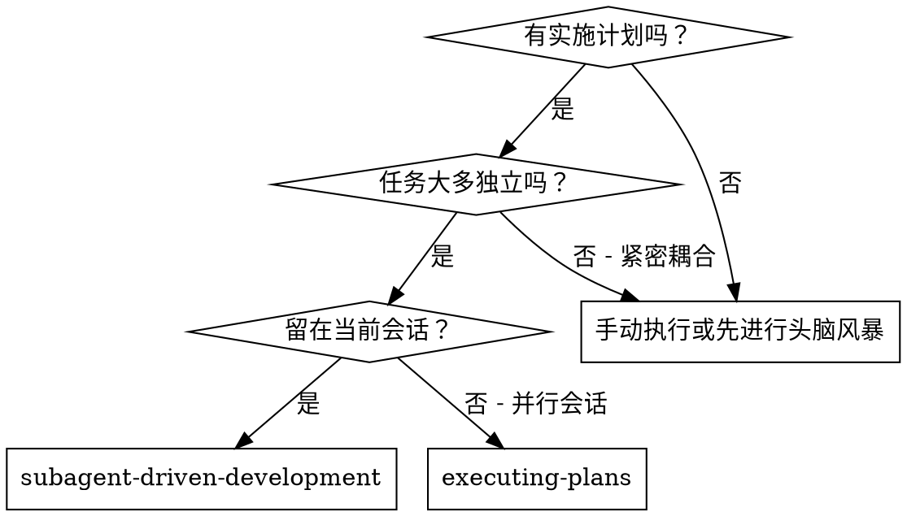
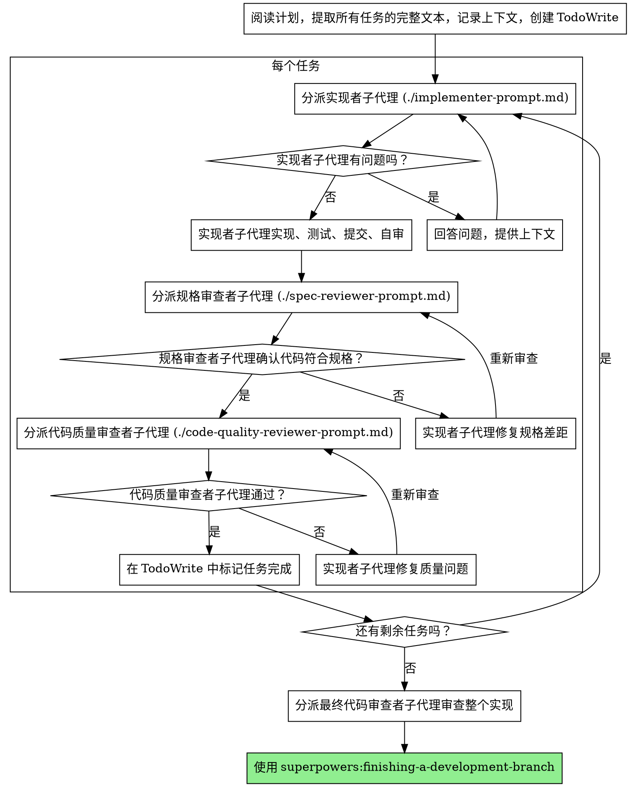

# 子代理驱动开发

通过为每个任务分派一个全新的子代理来执行计划，每个任务完成后进行两阶段审查：先审查规格合规性，再审查代码质量。

**核心原则：** 每个任务使用全新子代理 + 两阶段审查（先规格后质量）= 高质量、快速迭代

## 何时使用


```dot
digraph when_to_use {
    "有实施计划吗？" [shape=diamond];
    "任务大多独立吗？" [shape=diamond];
    "留在当前会话？" [shape=diamond];
    "subagent-driven-development" [shape=box];
    "executing-plans" [shape=box];
    "手动执行或先进行头脑风暴" [shape=box];

    "有实施计划吗？" -> "任务大多独立吗？" [label="是"];
    "有实施计划吗？" -> "手动执行或先进行头脑风暴" [label="否"];
    "任务大多独立吗？" -> "留在当前会话？" [label="是"];
    "任务大多独立吗？" -> "手动执行或先进行头脑风暴" [label="否 - 紧密耦合"];
    "留在当前会话？" -> "subagent-driven-development" [label="是"];
    "留在当前会话？" -> "executing-plans" [label="否 - 并行会话"];
}
```

**与执行计划（并行会话）的对比：**
- 同一会话（无上下文切换）
- 每个任务使用全新子代理（无上下文污染）
- 每个任务完成后进行两阶段审查：先审查规格合规性，再审查代码质量
- 更快的迭代（任务之间无需人工介入）

## 流程


```dot
digraph process {
    rankdir=TB;

    subgraph cluster_per_task {
        label="每个任务";
        "分派实现者子代理 (./implementer-prompt.md)" [shape=box];
        "实现者子代理有问题吗？" [shape=diamond];
        "回答问题，提供上下文" [shape=box];
        "实现者子代理实现、测试、提交、自审" [shape=box];
        "分派规格审查者子代理 (./spec-reviewer-prompt.md)" [shape=box];
        "规格审查者子代理确认代码符合规格？" [shape=diamond];
        "实现者子代理修复规格差距" [shape=box];
        "分派代码质量审查者子代理 (./code-quality-reviewer-prompt.md)" [shape=box];
        "代码质量审查者子代理通过？" [shape=diamond];
        "实现者子代理修复质量问题" [shape=box];
        "在 TodoWrite 中标记任务完成" [shape=box];
    }

    "阅读计划，提取所有任务的完整文本，记录上下文，创建 TodoWrite" [shape=box];
    "还有剩余任务吗？" [shape=diamond];
    "分派最终代码审查者子代理审查整个实现" [shape=box];
    "使用 superpowers:finishing-a-development-branch" [shape=box style=filled fillcolor=lightgreen];

    "阅读计划，提取所有任务的完整文本，记录上下文，创建 TodoWrite" -> "分派实现者子代理 (./implementer-prompt.md)";
    "分派实现者子代理 (./implementer-prompt.md)" -> "实现者子代理有问题吗？";
    "实现者子代理有问题吗？" -> "回答问题，提供上下文" [label="是"];
    "回答问题，提供上下文" -> "分派实现者子代理 (./implementer-prompt.md)";
    "实现者子代理有问题吗？" -> "实现者子代理实现、测试、提交、自审" [label="否"];
    "实现者子代理实现、测试、提交、自审" -> "分派规格审查者子代理 (./spec-reviewer-prompt.md)";
    "分派规格审查者子代理 (./spec-reviewer-prompt.md)" -> "规格审查者子代理确认代码符合规格？";
    "规格审查者子代理确认代码符合规格？" -> "实现者子代理修复规格差距" [label="否"];
    "实现者子代理修复规格差距" -> "分派规格审查者子代理 (./spec-reviewer-prompt.md)" [label="重新审查"];
    "规格审查者子代理确认代码符合规格？" -> "分派代码质量审查者子代理 (./code-quality-reviewer-prompt.md)" [label="是"];
    "分派代码质量审查者子代理 (./code-quality-reviewer-prompt.md)" -> "代码质量审查者子代理通过？";
    "代码质量审查者子代理通过？" -> "实现者子代理修复质量问题" [label="否"];
    "实现者子代理修复质量问题" -> "分派代码质量审查者子代理 (./code-quality-reviewer-prompt.md)" [label="重新审查"];
    "代码质量审查者子代理通过？" -> "在 TodoWrite 中标记任务完成" [label="是"];
    "在 TodoWrite 中标记任务完成" -> "还有剩余任务吗？";
    "还有剩余任务吗？" -> "分派实现者子代理 (./implementer-prompt.md)" [label="是"];
    "还有剩余任务吗？" -> "分派最终代码审查者子代理审查整个实现" [label="否"];
    "分派最终代码审查者子代理审查整个实现" -> "使用 superpowers:finishing-a-development-branch";
}
```

## 提示模板

- `./implementer-prompt.md` - 分派实现者子代理
- `./spec-reviewer-prompt.md` - 分派规格合规审查者子代理
- `./code-quality-reviewer-prompt.md` - 分派代码质量审查者子代理

## 工作流程示例

```
你：我正在使用子代理驱动开发来执行此计划。

[读取一次计划文件：docs/plans/feature-plan.md]
[提取所有 5 个任务的完整文本和上下文]
[创建包含所有任务的 TodoWrite]

任务 1：钩子安装脚本

[获取任务 1 的文本和上下文（已提取）]
[分派实现子代理，提供完整任务文本 + 上下文]

实现者："在我开始之前——钩子应该安装在用户级别还是系统级别？"

你："用户级别（~/.config/superpowers/hooks/）"

实现者："明白了。正在实现..."
[稍后] 实现者：
  - 实现了 install-hook 命令
  - 添加了测试，5/5 通过
  - 自审：发现遗漏了 --force 标志，已添加
  - 已提交

[分派规格合规审查者]
规格审查者：✅ 符合规格 - 所有需求已满足，无多余内容

[获取 git SHA，分派代码质量审查者]
代码审查者：优点：测试覆盖良好，代码整洁。问题：无。通过。

[标记任务 1 完成]

任务 2：恢复模式

[获取任务 2 的文本和上下文（已提取）]
[分派实现子代理，提供完整任务文本 + 上下文]

实现者：[无问题，直接进行]
实现者：
  - 添加了验证/修复模式
  - 8/8 测试通过
  - 自审：一切正常
  - 已提交

[分派规格合规审查者]
规格审查者：❌ 发现问题：
  - 缺失：进度报告（规格要求"每 100 个项目报告一次"）
  - 多余：添加了 --json 标志（未要求）

[实现者修复问题]
实现者：移除了 --json 标志，添加了进度报告

[规格审查者再次审查]
规格审查者：✅ 现在符合规格

[分派代码质量审查者]
代码审查者：优点：扎实。问题（重要）：魔法数字（100）

[实现者修复]
实现者：提取了 PROGRESS_INTERVAL 常量

[代码审查者再次审查]
代码审查者：✅ 通过

[标记任务 2 完成]

...

[所有任务完成后]
[分派最终代码审查者]
最终审查者：所有需求已满足，可以合并

完成！
```

## 优势

**与手动执行相比：**
- 子代理自然遵循 TDD
- 每个任务使用全新上下文（不会混淆）
- 并行安全（子代理之间不会互相干扰）
- 子代理可以提问（工作前和工作中都可以）

**与执行计划相比：**
- 同一会话（无交接）
- 持续推进（无需等待）
- 审查检查点自动化

**效率提升：**
- 无文件读取开销（控制器提供完整文本）
- 控制器精确策划所需上下文
- 子代理预先获得完整信息
- 问题在工作开始前浮现（而非工作完成后）

**质量关卡：**
- 自审在交接前捕获问题
- 两阶段审查：规格合规性，然后代码质量
- 审查循环确保修复确实有效
- 规格合规性防止过度/不足构建
- 代码质量确保实现质量良好

**成本：**
- 更多子代理调用（每个任务需要实现者 + 2 个审查者）
- 控制器需要更多准备工作（预先提取所有任务）
- 审查循环增加迭代次数
- 但能及早发现问题（比后期调试更经济）

## 警示事项

**绝不：**
- 未经用户明确同意就在 main/master 分支上开始实现
- 跳过审查（无论是规格合规还是代码质量）
- 在未修复问题的情况下继续推进
- 并行分派多个实现子代理（会产生冲突）
- 让子代理自行读取计划文件（应提供完整文本）
- 跳过场景设定上下文（子代理需要理解任务所处的位置）
- 忽视子代理的问题（在让他们继续之前先回答）
- 在规格合规性上接受"差不多就行"（规格审查者发现问题 = 未完成）
- 跳过审查循环（审查者发现问题 = 实现者修复 = 再次审查）
- 让实现者的自审替代正式审查（两者都不可少）
- **在规格合规通过 ✅ 之前就开始代码质量审查**（顺序错误）
- 在任一审查仍有未解决问题时就进入下一个任务

**如果子代理提问：**
- 清晰完整地回答
- 必要时提供额外上下文
- 不要催促他们进入实现阶段

**如果审查者发现问题：**
- 实现者（同一子代理）修复问题
- 审查者再次审查
- 重复直到通过
- 不要跳过重新审查

**如果子代理无法完成任务：**
- 分派修复子代理并提供具体指令
- 不要尝试手动修复（避免上下文污染）

## 集成

**所需工作流技能：**
- **superpowers:using-git-worktrees** - 必需：开始之前先设置隔离工作空间
- **superpowers:writing-plans** - 创建本技能执行的计划
- **superpowers:requesting-code-review** - 审查者子代理的代码审查模板
- **superpowers:finishing-a-development-branch** - 所有任务完成后收尾开发

**子代理应使用：**
- **superpowers:test-driven-development** - 子代理在每个任务中遵循 TDD

**替代工作流：**
- **superpowers:executing-plans** - 用于并行会话执行，而非同一会话执行
