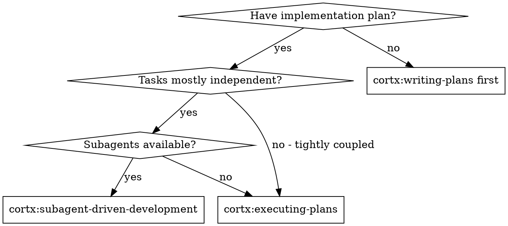
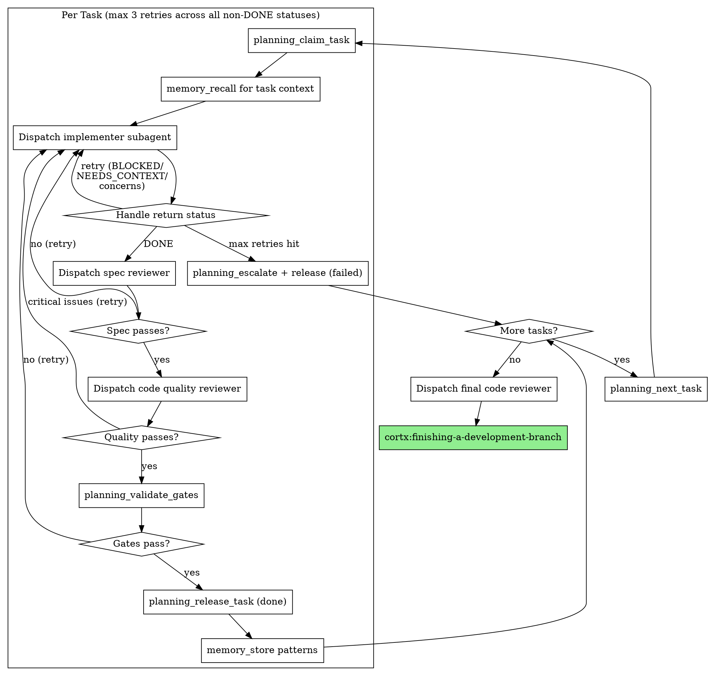

# Subagent-Driven Development

Execute a plan by dispatching fresh subagent per task, with two-stage review
after each: spec compliance first, then code quality. All progress tracked on
the cortx board, all commands through `proxy_exec`.

**Why subagents:** You delegate tasks to specialized agents with isolated
context. By precisely crafting their instructions and context, you ensure they
stay focused and succeed at their task. They never inherit your session's
context or history -- you construct exactly what they need. This also preserves
your own context for coordination work.

**Core principle:** Fresh subagent per task + two-stage review + cortx board
tracking + gate validation = high quality, fast iteration.

**Announce at start:** "I'm using the subagent-driven-development skill to
execute this plan."

## When to Use


```dot
digraph when_to_use {
    "Have implementation plan?" [shape=diamond];
    "Tasks mostly independent?" [shape=diamond];
    "Subagents available?" [shape=diamond];
    "cortx:subagent-driven-development" [shape=box];
    "cortx:executing-plans" [shape=box];
    "cortx:writing-plans first" [shape=box];

    "Have implementation plan?" -> "Tasks mostly independent?" [label="yes"];
    "Have implementation plan?" -> "cortx:writing-plans first" [label="no"];
    "Tasks mostly independent?" -> "Subagents available?" [label="yes"];
    "Tasks mostly independent?" -> "cortx:executing-plans" [label="no - tightly coupled"];
    "Subagents available?" -> "cortx:subagent-driven-development" [label="yes"];
    "Subagents available?" -> "cortx:executing-plans" [label="no"];
}
```

**vs. cortx:executing-plans (inline execution):**
- Fresh subagent per task (no context pollution)
- Two-stage review after each task: spec compliance first, then code quality
- Faster iteration (controller coordinates, subagents execute)
- Same cortx board tracking and gate validation

## Prerequisites

Before starting execution, ensure:

1. **Plan file exists** -- a written plan produced by `cortx:writing-plans`
2. **Tasks on the board** -- created via `planning_decompose` during planning
3. **Worktree ready** -- isolated workspace set up via `cortx:using-git-worktrees`

## The Process


```dot
digraph process {
    rankdir=TB;

    subgraph cluster_per_task {
        label="Per Task (max 3 retries across all non-DONE statuses)";
        "planning_claim_task" [shape=box];
        "memory_recall for task context" [shape=box];
        "Dispatch implementer subagent" [shape=box];
        "Handle return status" [shape=diamond];
        "Dispatch spec reviewer" [shape=box];
        "Spec passes?" [shape=diamond];
        "Dispatch code quality reviewer" [shape=box];
        "Quality passes?" [shape=diamond];
        "planning_validate_gates" [shape=box];
        "Gates pass?" [shape=diamond];
        "planning_release_task (done)" [shape=box];
        "memory_store patterns" [shape=box];
        "planning_escalate + release (failed)" [shape=box];
    }

    "planning_next_task" [shape=box];
    "More tasks?" [shape=diamond];
    "Dispatch final code reviewer" [shape=box];
    "cortx:finishing-a-development-branch" [shape=box style=filled fillcolor=lightgreen];

    "planning_next_task" -> "planning_claim_task";
    "planning_claim_task" -> "memory_recall for task context";
    "memory_recall for task context" -> "Dispatch implementer subagent";
    "Dispatch implementer subagent" -> "Handle return status";
    "Handle return status" -> "Dispatch spec reviewer" [label="DONE"];
    "Handle return status" -> "Dispatch implementer subagent" [label="retry (BLOCKED/\nNEEDS_CONTEXT/\nconcerns)"];
    "Handle return status" -> "planning_escalate + release (failed)" [label="max retries hit"];
    "Dispatch spec reviewer" -> "Spec passes?";
    "Spec passes?" -> "Dispatch code quality reviewer" [label="yes"];
    "Spec passes?" -> "Dispatch implementer subagent" [label="no (retry)"];
    "Dispatch code quality reviewer" -> "Quality passes?";
    "Quality passes?" -> "planning_validate_gates" [label="yes"];
    "Quality passes?" -> "Dispatch implementer subagent" [label="critical issues (retry)"];
    "planning_validate_gates" -> "Gates pass?";
    "Gates pass?" -> "planning_release_task (done)" [label="yes"];
    "Gates pass?" -> "Dispatch implementer subagent" [label="no (retry)"];
    "planning_release_task (done)" -> "memory_store patterns";
    "memory_store patterns" -> "More tasks?";
    "planning_escalate + release (failed)" -> "More tasks?";
    "More tasks?" -> "planning_next_task" [label="yes"];
    "More tasks?" -> "Dispatch final code reviewer" [label="no"];
    "Dispatch final code reviewer" -> "cortx:finishing-a-development-branch";
}
```

### 1. CLAIM

Call `planning_next_task` to get the next task in board DAG order. Then call
`planning_claim_task` with that task ID.

### 2. CONTEXT

Call `memory_recall` with queries relevant to the task -- file paths, domain
terms, error patterns. Use the returned context as hints for the implementer.

### 3. DISPATCH IMPLEMENTER

Dispatch a fresh implementer subagent (see `./implementer-prompt.md`) with:

- **Full task text** -- extracted from the plan, NOT a file path
- **Memory context** -- hints from `memory_recall`
- **Scene-setting** -- where this task fits in the plan, what tasks completed
  before it, any patterns or constraints discovered so far
- **Constraint** -- all shell commands must go through `proxy_exec`

### 4. HANDLE RETURN STATUS

The implementer reports one of four statuses:

**DONE** -- proceed to step 5 (spec review).

**DONE_WITH_CONCERNS** -- read the concerns. If they are blocking (correctness,
scope), treat as BLOCKED. If they are observations ("this file is getting
large"), note them and proceed to step 5. This counts as a retry only when
treated as BLOCKED.

**NEEDS_CONTEXT** -- enrich context via `memory_recall` + grep for the missing
information. Re-dispatch a FRESH implementer with the enriched context. Counts
as a retry.

**BLOCKED** -- re-dispatch a FRESH implementer with the error context and any
additional information gathered. Counts as a retry. Consider:
1. If context problem -- provide more context
2. If reasoning problem -- use a more capable model
3. If task too large -- break into smaller pieces

**Max retries: 3** across ALL non-DONE statuses combined (BLOCKED,
NEEDS_CONTEXT, spec failures, quality failures, gate failures). When hit:
- Call `planning_escalate` with attempt count, errors, and suggested next step
- Call `planning_release_task` with status `failed`
- Move to the next task

### 5. SPEC REVIEW

Dispatch a fresh spec-reviewer subagent (see `./spec-reviewer-prompt.md`).
The reviewer checks that the implementation matches the spec exactly -- nothing
missing, nothing extra.

If the spec reviewer finds issues, re-dispatch a FRESH implementer with the
reviewer feedback. This counts toward the retry limit.

### 6. CODE QUALITY REVIEW

Dispatch a fresh code-quality-reviewer subagent (see
`./code-quality-reviewer-prompt.md`). The reviewer evaluates implementation
quality, patterns, and maintainability.

If the reviewer finds critical issues, re-dispatch a FRESH implementer with the
reviewer feedback. This counts toward the retry limit.

### 7. VALIDATE GATES

Run quality checks via `proxy_exec`:
- `cargo clippy --workspace -- -D warnings`
- `cargo test --workspace`
- `cargo build --workspace`

All gates must pass. If any gate fails, re-dispatch a FRESH implementer with
the error output. This counts toward the retry limit.

### 8. RELEASE

Call `planning_release_task` with the task ID and status `done`.

Call `memory_store` with any patterns, gotchas, or solutions discovered during
this task's implementation.

## Model Selection

Use the least powerful model that can handle each role.

- **Mechanical** (1-2 files, clear spec): cheap model
- **Integration** (multi-file coordination, debugging): standard model
- **Architecture/design/review**: most capable model

## After All Tasks

When `planning_next_task` returns no remaining tasks:

1. **Dispatch a final code reviewer** for the entire implementation -- this
   reviewer looks at cross-task integration, consistency, and overall quality.
2. **Invoke `cortx:finishing-a-development-branch`** to verify the full build,
   present options to the user, and complete the branch.

## Prompt Templates

- `./implementer-prompt.md` -- dispatch implementer subagent
- `./spec-reviewer-prompt.md` -- dispatch spec compliance reviewer subagent
- `./code-quality-reviewer-prompt.md` -- dispatch code quality reviewer subagent

## Example Workflow

```
Controller: I'm using the subagent-driven-development skill to execute this plan.

[Read plan file, extract all tasks with full text and context]

--- Task 1: Hook installation script ---

[planning_next_task -> "task-1"]
[planning_claim_task("task-1")]
[memory_recall("hook installation, config paths")]
[Dispatch implementer with task text + memory hints + scene-setting]

Implementer: DONE - implemented install-hook, 5/5 tests, committed

[Dispatch spec reviewer]  -> Spec compliant
[Dispatch code quality reviewer] -> Approved
[proxy_exec: clippy, test, build -- all pass]
[planning_release_task("task-1", done)]
[memory_store("install-hook uses ~/.config/cortx/hooks/")]

--- Task 2: Recovery modes ---

[planning_next_task -> "task-2"]
[planning_claim_task("task-2")]
[memory_recall("recovery modes, verify, repair")]
[Dispatch implementer] -> DONE - added verify/repair, 8/8 tests

[Dispatch spec reviewer] -> Issues: missing progress reporting, extra --json flag
[Re-dispatch FRESH implementer with feedback]              (retry 1/3)
  -> DONE - removed --json, added progress reporting
[Dispatch spec reviewer again] -> Spec compliant

[Dispatch code quality reviewer] -> Magic number 100 should be constant
[Re-dispatch FRESH implementer with feedback]              (retry 2/3)
  -> DONE - extracted PROGRESS_INTERVAL constant
[Dispatch code quality reviewer again] -> Approved

[proxy_exec: clippy, test, build -- all pass]
[planning_release_task("task-2", done)]
[memory_store("use named constants for magic numbers")]

--- No remaining tasks ---

[Dispatch final code reviewer for entire implementation]
[Invoke cortx:finishing-a-development-branch]
```

## Red Flags

**Never:**
- Start implementation on main/master branch without explicit user consent
- Skip reviews (spec compliance OR code quality)
- Skip gates -- every task must pass clippy, test, and build
- Dispatch an implementer without claiming the task first
- Use Bash directly -- all commands go through `proxy_exec`
- Proceed with unfixed issues
- Dispatch multiple implementation subagents in parallel (conflicts)
- Make subagent read plan file (provide full text instead)
- Skip scene-setting context (subagent needs to understand where task fits)
- Ignore subagent questions (answer before letting them proceed)
- Accept "close enough" on spec compliance (reviewer found issues = not done)
- Skip review loops (reviewer found issues = implementer fixes = review again)
- Let implementer self-review replace actual review (both are needed)
- Start code quality review before spec compliance passes (wrong order)
- Move to next task while any review has open issues
- Force the same model to retry without changes when it reported BLOCKED

**If reviewer finds issues:** dispatch a FRESH implementer with feedback,
reviewer reviews the fix, repeat until approved or retry limit hit.

**If subagent is blocked:** dispatch a FRESH subagent with enriched context.
Never reuse a stuck subagent -- fresh context is the point.

## Integration

**Required cortx skills:**
- `cortx:using-git-worktrees` -- isolated workspace before starting
- `cortx:writing-plans` -- produces the plan and board tasks this skill executes
- `cortx:finishing-a-development-branch` -- completes development after all tasks
- `cortx:using-cortx` -- cortx tool reference (proxy_exec, memory, planning)

**Subagents should use:**
- `cortx:test-driven-development` -- subagents follow TDD for each task

**Alternative workflow:**
- `cortx:executing-plans` -- inline execution without subagents
