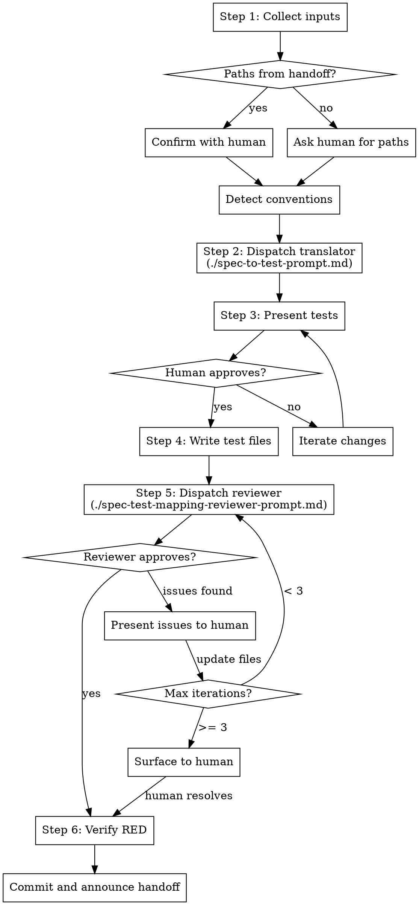

# Subagent-Driven Test Development

Translate an approved scenario spec (markdown tables) into RED (failing) test functions, validate 1:1 coverage between spec rows and tests, and commit. This skill sits between scenario spec authoring and implementation:

```
writing-test-scenario-specs -> subagent-driven-test-development -> subagent-driven-development
```

The output is committed, failing test files. No production code is written.

<HARD-GATE>
Do NOT write production/implementation code, invoke subagent-driven-development,
or make any test pass. This skill produces RED (failing) test functions only.
GREEN implementation is handled by subagent-driven-development after this skill
completes.
</HARD-GATE>

## Checklist

Complete these steps in order:

1. **Collect inputs** -- confirm or request spec and plan paths, detect project conventions
2. **Generate test code** -- dispatch Spec-to-Test Translator subagent
3. **Coarse approval** -- present generated tests in chat, iterate with human
4. **Write test files** -- write to derived paths after human confirmation
5. **Mapping review** -- dispatch Spec-Test Mapping Reviewer, handle gaps
6. **Commit and handoff** -- verify RED, commit, announce subagent-driven-development

## Project Detection

At activation (Step 1), detect the project's language and test framework by reading:

- `CLAUDE.md` and project configuration files
- Build/dependency files (`pyproject.toml`, `package.json`, `pom.xml`, `build.gradle`, `Cargo.toml`, `go.mod`, etc.)
- Test framework configuration (pytest config, Jest config, JUnit setup, Go test conventions)
- Existing test directory structure and naming patterns
- Style rules from linter/formatter config

**Framework adaptation table:**

| Concept | Python (pytest) | JavaScript (Jest) | Java (JUnit 5) | Go (testing) |
|---------|-----------------|-------------------|----------------|--------------|
| Test naming | `test_<name>` | `test("name", ...)` | `@Test void name()` | `func TestName(t *testing.T)` |
| Categorization | `@pytest.mark.unit` | `describe` blocks / tags | `@Tag("unit")` | Build tags |
| Data-driven | `@pytest.mark.parametrize` | `test.each` | `@ParameterizedTest` | Table-driven tests |
| Shared setup | `conftest.py` fixtures | `beforeAll`/`beforeEach` | `@BeforeAll`/`@BeforeEach` | `TestMain` / helpers |
| File naming | `test_<unit>.py` | `<unit>.test.ts` | `<Unit>Test.java` | `<unit>_test.go` |

The skill MUST NOT hard-code any framework-specific patterns. All framework-specific behavior flows from what is detected in Step 1.

Summarize findings to the human: "Detected: [language] with [framework], tests in [dir], naming pattern [pattern], categorization via [mechanism]."

## Flow Diagram



## Step-by-Step Instructions

### Step 1 -- Collect Inputs

**What:** Gather the scenario spec, implementation plan, and detect project conventions.

**How:**

1. Check if the conversation context contains paths from a prior `writing-test-scenario-specs` handoff. If yes, confirm with the human: "I see the scenario spec at `<path>` and the plan at `<path>`. Ready to proceed?"
2. If no paths are available (fresh session), ask: "Please provide the paths to (1) the scenario spec and (2) the implementation plan."
3. Read both files to verify they exist and are well-formed.
4. Detect project conventions:
   - Read `CLAUDE.md` for code style rules, test commands, and project structure
   - Read build/dependency files to identify language and test framework
   - Read test framework config (e.g., `pyproject.toml` `[tool.pytest]`, `jest.config.*`, JUnit platform config)
   - Scan existing test directory structure for naming patterns and organization
5. Summarize to the human: "Detected: [language] with [framework], tests in [dir], naming pattern [pattern], categorization via [mechanism]."

**When to proceed:** Human confirms inputs and you have detected conventions.

### Step 2 -- Generate Test Code

**What:** Dispatch the Spec-to-Test Translator subagent to generate RED test functions from the scenario spec.

**How:**

1. Read `./spec-to-test-prompt.md` (the template lives in this skill's directory)
2. Fill the template placeholders:
   - `[SCENARIO_SPEC_CONTENT]` -- read the scenario spec file and paste its full content inline
   - `[PLAN_CONTENT]` -- read the implementation plan file and paste its full content inline
   - `[CONVENTIONS]` -- write a summary of detected conventions from Step 1 (language, framework, naming patterns, categorization mechanism, test directory structure, style rules)
3. Dispatch as Agent tool (general-purpose) with description "Translate scenario spec into RED test functions"
4. Receive generated test files with target paths and a coverage summary

**When to proceed:** Translator returns generated files (status DONE or DONE_WITH_CONCERNS). If NEEDS_CONTEXT or BLOCKED, provide missing information and re-dispatch.

### Step 3 -- Coarse Approval

**What:** Present generated tests to the human for review before writing any files.

**How:**

1. Present each generated file as a fenced code block with its target path:
   ```
   ### File: `tests/unit/test_guardrail_service.py`
   ```python
   <generated content>
   ```
   ```
2. Ask: "Review the generated tests. Change anything -- names, assertions, data-driven expansions, file organization -- or say 'looks good' to proceed."
3. If the human requests changes, apply them and re-present the affected files.
4. Iterate until the human approves.

**When to proceed:** Human explicitly approves (e.g., "looks good", "proceed", "approved").

### Step 4 -- Write Test Files

**What:** Write the approved test files to disk.

**How:**

1. Confirm target paths with the human one final time: "Writing files to: [list of paths]. Confirm?"
2. Write each test file to its target path.
3. Create shared setup files from the spec's Test Data section (1.0) -- e.g., `conftest.py`, test helper modules, shared fixture files.
4. Create any framework-required boilerplate for new test directories (e.g., `__init__.py` files for Python, package declarations for Java).

**When to proceed:** All files are written to disk.

### Step 5 -- Mapping Review

**What:** Dispatch the Spec-Test Mapping Reviewer subagent to validate 1:1 coverage between spec rows and test functions.

**How:**

1. Read `./spec-test-mapping-reviewer-prompt.md` (the template lives in this skill's directory)
2. Fill the template placeholders:
   - `[SCENARIO_SPEC_CONTENT]` -- read the scenario spec file and paste its full content inline
   - `[TEST_FILES_CONTENT]` -- read all generated test files from disk and paste their contents inline, each prefixed with its file path
3. Dispatch as Agent tool (general-purpose) with description "Validate spec-to-test mapping coverage"
4. Handle the reviewer's response:

**If Approved:** Proceed to Step 6.

**If Issues Found:** Present each issue to the human:
- **Gaps** (scenario rows with no matching test): Show the reviewer's draft test code. Ask the human to accept, modify, or reject each.
- **Orphans** (tests with no matching scenario row): Ask the human to remove or justify each.
- **Weak assertions** (assertions weaker than the spec requires): Show the reviewer's suggested fix. Ask the human to accept or modify.

After resolving issues, update the test files on disk and re-dispatch the reviewer. Maximum 3 iterations. If issues persist after 3 iterations, surface the remaining issues to the human for manual resolution.

**When to proceed:** Reviewer returns "Approved" or human manually resolves all remaining issues.

### Step 6 -- Commit and Handoff

**What:** Verify all tests are RED, commit, and announce the handoff.

**How:**

1. Run the test suite to confirm all new tests fail:
   - For interpreted languages (Python, JS): run the test command and verify failures
   - For compiled languages (Go, Java): compile and verify compilation failure (non-compiling IS the RED state)
2. Flag any unexpectedly passing test -- this indicates a problem (the test should fail because imports reference unimplemented code). Do not proceed until resolved.
3. Commit all test files (including shared setup and boilerplate):
   ```bash
   git add <all test files>
   git commit -m "test: add RED test functions from scenario spec <spec-name>"
   ```
4. Announce the handoff:
   > RED tests committed. Next step: invoke `superpowers:subagent-driven-development` to implement GREEN.
   >
   > Paths for handoff:
   > - Scenario spec: `<spec-path>`
   > - Implementation plan: `<plan-path>`
   > - Test files: `<list of committed test file paths>`

**When complete:** Tests are committed and handoff message is delivered.

## TDD Discipline

This skill enforces strict TDD RED phase:

- **Tests are literal translations** of the scenario spec -- real imports, real method calls, real assertions
- **Unresolved imports are the first valid failure** -- they drive the implementer to create modules (e.g., `ImportError` in Python, compile error in Go/Java, `Cannot find module` in JS)
- **No stubs, no mocks, no skips** -- tests reference the planned production API as-is
- **No implementation code** -- the skill never writes production code or module skeletons
- **Verified RED before commit** -- Step 6 runs the test suite to confirm all new tests fail

**Compiled languages:** In Go, Java, and other compiled languages, RED means the code does not compile because the referenced types/functions do not exist yet. This is the equivalent of Python's `ImportError`. The skill commits the test files even though they do not compile; the implementation phase creates the production code to make them compile and pass.

## Anti-Patterns

Rationalizations the skill must counter:

| Rationalization | Counter |
|-----------------|---------|
| "The spec is clear enough, skip the translator" | Translator enforces consistent structure, naming, traceability. |
| "Let me write the implementation too so tests go GREEN" | RED tests only. GREEN is subagent-driven-development's job. |
| "These tests are trivial, no need for mapping review" | Trivial tests are where gaps hide. Run the reviewer. |
| "I'll add a few extra tests the spec didn't mention" | No invention. Spec gap means fix in Phase 1. |
| "Unresolved import isn't a real test failure" | It is. TDD starts with the first failure. |
| "Let me stub out the modules so tests fail on assertions instead" | Stubs pre-decide structure. Let tests drive implementation. |
| "Skip the coarse approval, just write the files" | Human must see code before it is written. Non-negotiable. |
| "The design doc says X but the spec doesn't cover it" | Spec is the source of truth. Fix gaps in Phase 1. |

## Subagent Prompts

- `./spec-to-test-prompt.md` -- Spec-to-Test Translator (dispatched in Step 2)
- `./spec-test-mapping-reviewer-prompt.md` -- Spec-Test Mapping Reviewer (dispatched in Step 5)

## Integration

**Workflow position:**
```
brainstorming -> writing-plans -> writing-test-scenario-specs -> subagent-driven-test-development -> subagent-driven-development -> finishing-a-development-branch
```

**Predecessor:** `writing-test-scenario-specs` hands off the scenario spec path and plan path.

**Successor:** `subagent-driven-development` receives committed RED tests and implements GREEN.
