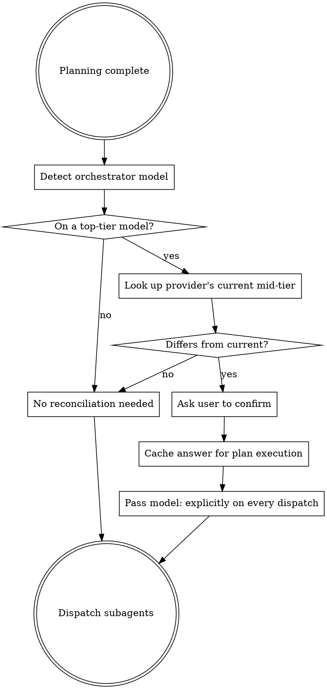

# Subagent Model Reconciliation

## Overview

When the orchestrator is running on a top-tier model (the most capable model the current provider offers), subagents dispatched without an explicit model parameter will frequently inherit that same top-tier model. That is almost never what you want for implementer, spec-reviewer, code-quality-reviewer, or `Explore`-style subagents — those are mid-tier-appropriate roles. Burning top-tier inference on rote work is slow and expensive, and the orchestrator's own context can be churned for no quality gain.

**Core principle:** The orchestrator decides the model for each subagent. Don't let a subagent silently inherit a top-tier model just because dispatch syntax allowed it.

This skill is provider-agnostic. It works for any harness that supports per-subagent model selection (Claude Code, Codex, Copilot CLI, Gemini CLI, etc.) and for any provider's model lineup (Anthropic, OpenAI, Google, etc.).

## When to Use

Run this reconciliation step:

- **After** planning / spec writing is complete (e.g., after `writing-plans` finishes).
- **Before** the first subagent dispatch in `subagent-driven-development`, `dispatching-parallel-agents`, `executing-plans`, or any other flow that fans out to subagents.
- **Once** per plan execution — cache the user's answer for the rest of the run.

Skip this skill when:

- The current harness does not support per-subagent model selection (the orchestrator and subagents always run on the same model). In that case, model choice is a session-start concern, not a dispatch-time concern.
- The orchestrator is already on a mid-tier or smaller model. There is nothing to reconcile.

## The Reconciliation Step

### Step 1: Detect the orchestrator's current model

Most harnesses expose this in the system prompt or via a built-in environment lookup. If you genuinely cannot determine the current model, ask the user — don't guess. A wrong assumption here defeats the whole reconciliation.

### Step 2: Decide whether reconciliation is needed

If the orchestrator is on a **top-tier model** for the current provider (the provider's most capable production model), reconciliation is needed. Otherwise, skip this skill.

The category — top-tier vs. mid-tier vs. small — is what matters, not the exact name. Provider lineups shift quickly; what was "top-tier" six months ago may be "mid-tier" today.

### Step 3: Look up the provider's current mid-tier model

**Do not rely on training-data memory for the model name.** Look it up at decision time:

- Web search for the provider's current model lineup.
- Check the provider's own documentation or pricing page.
- Check the harness's documentation for the canonical model identifier string.

The mid-tier model is the one that's appropriate for implementer / reviewer / `Explore` subagents — fast and cheap enough that running many of them is reasonable, capable enough to handle bounded, well-specified tasks. Examples (correct as of writing, but verify at runtime — these change):

- Anthropic: Sonnet sits below Opus and above Haiku.
- OpenAI: the current "fast" general-purpose tier sits below the flagship reasoning model.
- Google: the current Flash tier sits below the flagship Pro tier.

Do not hardcode any of those names into your dispatch. Look them up.

### Step 4: Confirm with the user if it differs

If the looked-up mid-tier model is different from the orchestrator's current model, surface the choice to the user before dispatching:

> I'm orchestrating on `<orchestrator_model>`. For implementer / reviewer / Explore subagents, the appropriate mid-tier on `<provider>` looks to be `<looked_up_model>` — that's what I'd recommend so we don't burn top-tier inference on rote work. Use `<looked_up_model>` for subagents? **[yes / no — stay on `<orchestrator_model>` / different — name another]**

Wait for an answer. Do not dispatch in the meantime.

### Step 5: Cache the answer for the duration of plan execution

Once the user picks a model (or confirms staying on the orchestrator's), use that choice for **every** subsequent subagent dispatch in this plan execution. Do not re-prompt before each task. The user's answer applies to:

- All implementer dispatches
- All reviewer dispatches (spec compliance, code quality)
- All `Explore` / research dispatches
- All parallel fan-out dispatches

If the plan's nature changes mid-execution (e.g., the user asks you to switch to a fundamentally different kind of work), it's reasonable to re-run reconciliation — but treat that as the exception, not the default.

### Step 6: Pass `model:` explicitly on every dispatch

Every Agent / Task / equivalent dispatch in the flow must carry an explicit model parameter. The exact syntax depends on the harness — see the **Harness Syntax** section below — but the discipline is the same: don't rely on inheritance.

The one exception is the orchestrator → orchestrator case (a sub-flow that genuinely should stay on the orchestrator's model). Even then, prefer making the choice explicit so a future reader doesn't have to infer it.

## Harness Syntax

Different harnesses expose model selection differently. Confirm against your harness's current documentation; the names below are illustrative only.

- **Claude Code** — `Task(..., subagent_type: "...", model: "<model-id>")` or `Agent(..., model: "<model-id>")`. The `model:` field overrides the agent definition's frontmatter and any inheritance from the parent.
- **Codex** — see the Codex tool reference for the dispatch tool's `model` parameter.
- **Copilot CLI / Gemini CLI / others** — check the harness's subagent tool documentation for the equivalent field.

If your harness genuinely lacks a per-dispatch model parameter, this skill cannot be applied as written — surface that to the user and stop. Don't pretend the dispatch is reconciled when it isn't.

## Briefing Subagents Without a Model Field

If you must dispatch on a harness that lacks per-dispatch model selection, tell the user during reconciliation. The fallback is for the user to start the harness on the desired mid-tier model and run the orchestration there — not for the orchestrator to silently push top-tier work onto every subagent.

## Anti-Patterns

- ❌ Hardcoding `model: "sonnet"` (or any other specific name) in a skill, plan, or prompt template. Provider lineups shift; the specific name will rot.
- ❌ Skipping reconciliation because "I think I know what the mid-tier is." Look it up. Memory of the lineup is wrong often enough to matter.
- ❌ Re-asking the user before every dispatch. Cache the answer once per plan run.
- ❌ Letting subagents inherit silently because the dispatch syntax made it easy. The default is *explicit*.
- ❌ Running reconciliation *before* planning. The plan's shape can change which model is appropriate; reconcile after the plan is fixed.

## Integration

**Required before any subagent dispatch in:**

- `subagent-driven-development` — fires once before the first implementer dispatch
- `dispatching-parallel-agents` — fires once before the parallel fan-out
- `executing-plans` — fires once before invoking subagent dispatches in the plan
- Any custom flow that dispatches subagents

**Pairs with:**

- `writing-plans` — reconciliation runs *after* `writing-plans` finishes, before any executor skill picks up.
- `using-superpowers` — the bootstrap that surfaces this skill at the right moment.
