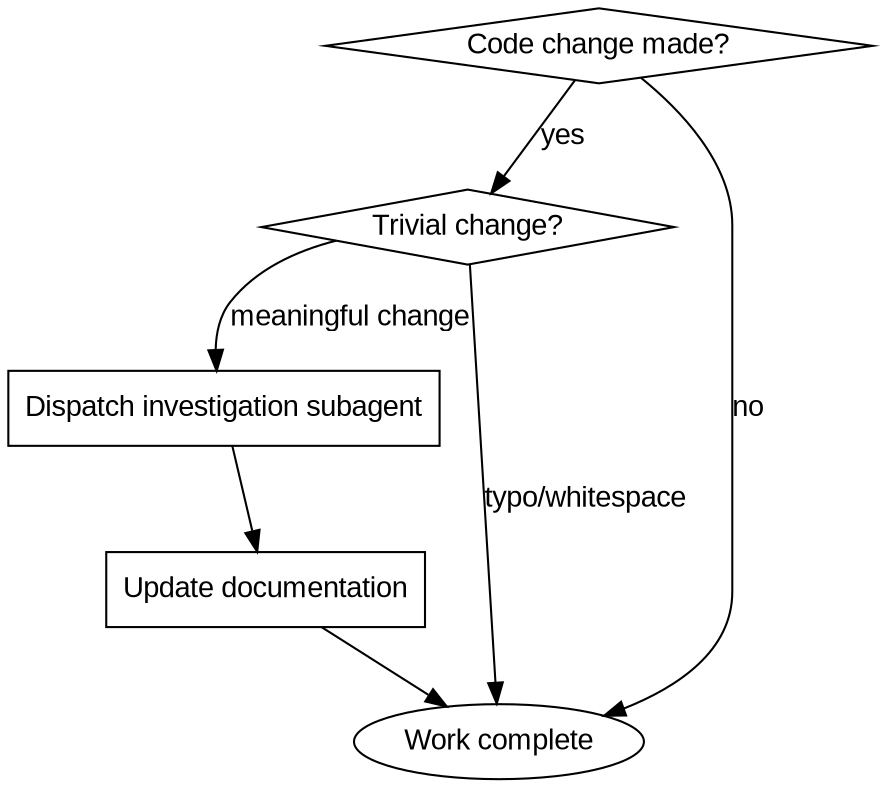

# Syncing Documentation

## Overview
Documentation is not optional overhead—it is part of completing the work. Every meaningful code change requires corresponding documentation updates, investigated via subagent dispatch before making changes.

## When to Use



**Trivial changes exempt:** Typo fixes, whitespace only, variable renames with no API impact.

**Meaningful changes require docs:**
- New/modified/deleted functions, methods, classes
- Changed behavior or side effects
- New configuration options
- Security-related changes
- Architecture or refactoring that affects how code works

## Core Pattern

### Before (Without Discipline)

```javascript
// Agent adds method
addNewFeature() { ... }

// Done! Moves to next task
// Documentation: never updated
```

### After (With Discipline)

```
1. Code change completed
2. Dispatch subagent to investigate: "What documentation exists for this module? What changed? What docs need updating?"
3. Review findings and identify affected .md files
4. Update documentation with current state
5. Work now complete
```

## Quick Reference

| Change Type | Investigation Target | Documentation Action |
|-------------|---------------------|---------------------|
| New API method | Search for API_REFERENCE.md, module docs | Add method signature, description, example |
| Refactored module | Search for module name across all .md files | Update explanations, examples, architecture |
| Security fix | Check SECURITY.md, security/ docs | Update threat model, mitigations |
| New feature | Check README.md, docs/, guides/ | Add feature overview, usage, migration |
| Bug fix | Check TROUBLESHOOTING.md, issue references | Add resolved issue, workaround if applicable |
| Config change | Check deployment/, config docs | Update environment variables, options |

## Implementation

### Step 1: Recognize Completion is Not Done

When code changes are complete, you are NOT done. Documentation is the final step of implementation.

### Step 2: Dispatch Investigation Subagent

Always dispatch a subagent to gather context:

```
Subagent prompt: "Investigate the documentation for [module/feature].
Find all relevant .md files. Identify what documentation exists,
what changed in the code, and what specifically needs updating.
Return: file paths and specific sections needing updates."
```

**Required subagent scope:** The subagent must search the entire codebase for:
- All .md files that reference the changed code
- API documentation
- Architecture docs
- User guides
- Troubleshooting guides

### Step 3: Review and Identify

Review the subagent's findings. Confirm which files need updates and what changes are required.

### Step 4: Update Documentation

Make the necessary documentation updates. Ensure:
- Examples match current code
- API references are accurate
- Behavior descriptions match implementation
- Deprecation notices if applicable

### Step 5: Confirm Completion

Only after documentation is updated is the work complete.

## Common Mistakes

| Mistake | Why It's Wrong | Fix |
|---------|----------------|-----|
| "Code is self-documenting" | Cleaner code ≠ obvious to others | Docs explain what code cannot |
| "User said skip docs" | User may not realize doc impact | Always push back: "Code changes affect docs at X, Y, Z" |
| "I'll do it later" | Later = never, context fades | Docs while code is fresh in memory |
| "Just a quick change" | Quick accumulates, docs rot | Every meaningful change gets docs |
| "JSDoc is enough" | JSDoc ≠ user-facing documentation | Separate .md files required for users |
| "Too tired after refactor" | Fatigue causes permanent gaps | Doc sync is part of the work, not extra |

## Red Flags - STOP and Doc

You are rationalizing if you think:

- "This is quick/simple" → **Quick changes still need docs**
- "Code speaks for itself" → **Only to you, not to others**
- "User said not to worry about docs" → **Push back with specific impact**
- "I'm too tired after this work" → **Fatigue is not a valid excuse**
- "I'll do it before committing" → **You'll forget, do it now**
- "It's just a small refactor" → **Refactors change how code works**
- "Docs are someone else's job" → **Whoever changes code updates docs**

**All of these mean: Stop. Dispatch investigation subagent. Update docs.**

## The Iron Law

```
MEANINGFUL CODE CHANGE WITHOUT DOC UPDATE = INCOMPLETE WORK
```

No exceptions. No rationalizations. No "later."

**Violating the letter of this rule is violating the spirit of this rule.**
