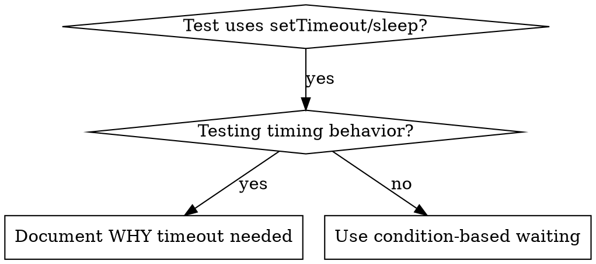

# Condition-Based Waiting

## Overview

Flaky tests often guess at timing with arbitrary delays. This creates race conditions where tests pass on fast machines but fail under load or in CI.

**Core principle:** Wait for the actual condition you care about, not a guess about how long it takes.

## When to Use



**Use when:**
- Tests have arbitrary delays (`setTimeout`, `sleep`, `time.sleep()`)
- Tests are flaky (pass sometimes, fail under load)
- Tests timeout when run in parallel
- Waiting for async operations to complete

**Don't use when:**
- Testing actual timing behavior (debounce, throttle intervals)
- Always document WHY if using arbitrary timeout

## Core Pattern

```ruby
# ❌ BEFORE: Guessing at timing
sleep 0.05
result = get_result
assert result

# ✅ AFTER: Waiting for condition
wait_for { get_result }
result = get_result
assert result
```

## Quick Patterns

| Scenario | Pattern |
|----------|---------|
| Wait for event | `wait_for { events.find { _1[:type] == "DONE" } }` |
| Wait for state | `wait_for { machine.state == :ready }` |
| Wait for count | `wait_for { items.length >= 5 }` |
| Wait for file | `wait_for { File.exist?(path) }` |
| Complex condition | `wait_for { obj.ready? && obj.value > 10 }` |

## Implementation

Generic polling helper:
```ruby
def wait_for(description: "condition", timeout: 5)
  deadline = Process.clock_gettime(Process::CLOCK_MONOTONIC) + timeout
  loop do
    result = yield
    return result if result
    if Process.clock_gettime(Process::CLOCK_MONOTONIC) > deadline
      raise "Timeout waiting for #{description} after #{timeout}s"
    end
    sleep 0.01  # poll every 10ms
  end
end
```

See `condition-based-waiting-example.rb` in this directory for a complete implementation with domain-specific helpers (`wait_for_event`, `wait_for_event_count`, `wait_for_event_match`) from an actual debugging session.

## Common Mistakes

**❌ Polling too fast:** `setTimeout(check, 1)` - wastes CPU
**✅ Fix:** Poll every 10ms

**❌ No timeout:** Loop forever if condition never met
**✅ Fix:** Always include timeout with clear error

**❌ Stale data:** Cache state before loop
**✅ Fix:** Call getter inside loop for fresh data

## When Arbitrary Timeout IS Correct

```ruby
# Tool ticks every 100ms - need 2 ticks to verify partial output
wait_for_event(manager, :tool_started)  # First: wait for condition
sleep 0.2                               # Then: wait for timed behavior
# 0.2s = 2 ticks at 100ms intervals — documented and justified
```

**Requirements:**
1. First wait for triggering condition
2. Based on known timing (not guessing)
3. Comment explaining WHY

## Real-World Impact

From debugging session (2025-10-03):
- Fixed 15 flaky tests across 3 files
- Pass rate: 60% → 100%
- Execution time: 40% faster
- No more race conditions
