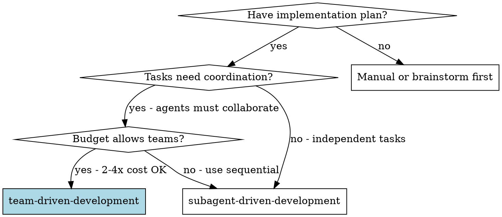
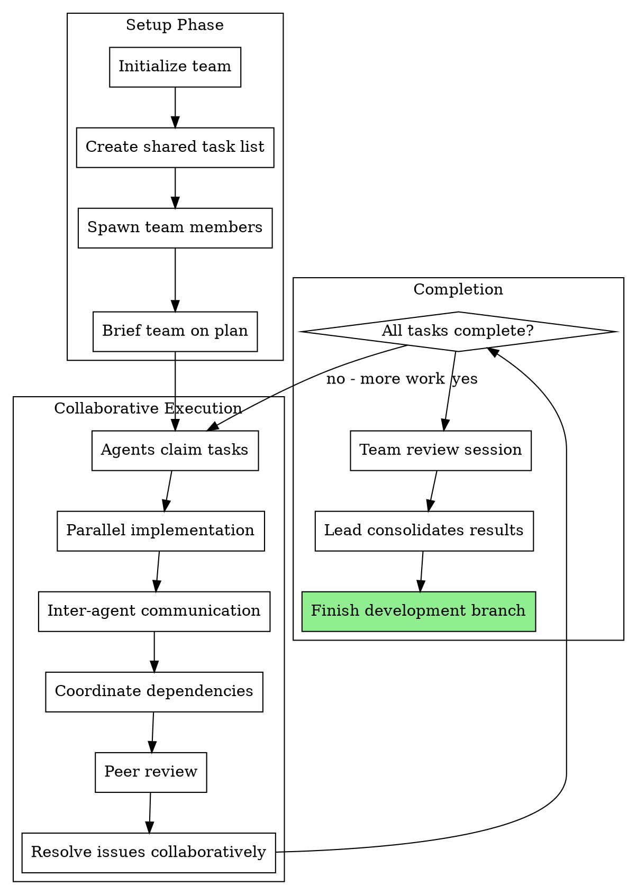

# Team-Driven Development

Execute implementation plans using collaborative agent teams with direct inter-agent communication, shared task lists, and self-coordination.

**Core principle:** Multiple agents with independent contexts + direct communication + shared task state = collaborative problem-solving for complex coordinated work

**⚠️ EXPERIMENTAL:** Requires Claude Code with Opus 4.6+ and `CLAUDE_CODE_EXPERIMENTAL_AGENT_TEAMS=1`

## When to Use



**Use agent teams when:**
- Tasks have emergent dependencies that need negotiation
- Multiple perspectives improve quality (adversarial review)
- Agents benefit from discussing approaches
- Coordination overhead would be high through lead agent only
- Real-time collaboration adds value
- Wall-clock time is more important than token cost

**Use subagents instead when:**
- Tasks are clearly independent (no coordination needed)
- Sequential execution is acceptable
- Budget is constrained (teams cost 2-4x more)
- Simple hub-and-spoke review suffices
- Well-established patterns with clear specs

**Cost reality:**
- Each teammate is a **full Claude instance** (separate session)
- 3-agent team = 3x base cost + message overhead
- Teams trade tokens for speed and collaboration quality
- Budget $50-200+ per team session depending on complexity

## Agent Teams vs Subagents

| Aspect | Subagents | Agent Teams |
|--------|-----------|-------------|
| **Communication** | Hub-and-spoke (only through lead) | Peer-to-peer (direct messages) |
| **Context** | Fresh per task | Persistent per agent |
| **Coordination** | Lead orchestrates everything | Self-organize with shared task list |
| **Execution** | Sequential (one task at a time) | Parallel (multiple concurrent tasks) |
| **Cost** | 3-5 subagent calls per task | N full sessions + overhead |
| **Best for** | Independent sequential tasks | Coordinated collaborative work |
| **Review model** | Two-stage (spec, then quality) | Peer review with discussion |

## Prerequisites

### 1. Environment Setup

Enable agent teams in Claude Code:

```bash
# Option 1: Environment variable
export CLAUDE_CODE_EXPERIMENTAL_AGENT_TEAMS=1

# Option 2: Claude Code settings (~/.claude/settings.json)
{
  "env": {
    "CLAUDE_CODE_EXPERIMENTAL_AGENT_TEAMS": "1"
  }
}
```

Verify enabled:
```bash
claude --version  # Should show Opus 4.6+
echo $CLAUDE_CODE_EXPERIMENTAL_AGENT_TEAMS  # Should show: 1
```

### 2. Plan Preparation

Your implementation plan should identify:
- Which tasks can run in parallel vs need sequencing
- Which tasks have dependencies on each other
- Where coordination between agents is beneficial
- Suggested team composition (roles needed)

## Team Composition

### Recommended Roles

**Team Lead (required):**
- Orchestrates team and manages shared task list
- Resolves conflicts and escalates to human when needed
- Monitors progress and ensures completion
- Does NOT implement - delegates to teammates

**Implementer(s) (1-3):**
- Claim and implement tasks from shared list
- Communicate dependencies and blockers
- Request reviews from reviewer teammates
- Follow TDD and existing patterns

**Reviewer(s) (1-2):**
- Review completed implementations
- Provide feedback via direct messages
- Collaborate with implementers on fixes
- Ensure quality before marking tasks complete

**Researcher (optional):**
- Explores uncertain areas
- Evaluates multiple approaches
- Shares findings with team
- Helps make architectural decisions

### Team Size Guidelines

- **Small tasks (2-5 tasks):** 1 lead + 1 implementer + 1 reviewer = 3 agents
- **Medium projects (6-15 tasks):** 1 lead + 2 implementers + 1 reviewer = 4 agents
- **Large projects (15+ tasks):** 1 lead + 2-3 implementers + 2 reviewers = 5-6 agents

**Never exceed 6 agents** - coordination overhead dominates beyond this

## The Process



## Step-by-Step Guide

### 1. Initialize Team

```markdown
Team name: feature-authentication
Plan file: docs/plans/authentication-feature.md

Team composition:
- Lead: You (orchestrator)
- Teammate: implementer-1 (backend)
- Teammate: implementer-2 (frontend)  
- Teammate: reviewer-1 (security focus)

Create team structure:
~/.claude/teams/feature-authentication/
  ├── tasks.json
  └── inboxes/
      ├── lead.json
      ├── implementer-1.json
      ├── implementer-2.json
      └── reviewer-1.json
```

### 2. Create Shared Task List

Extract tasks from plan into `tasks.json`:

```json
{
  "tasks": [
    {
      "id": "task-1",
      "name": "JWT token generation",
      "description": "Implement secure JWT token generation with refresh tokens",
      "status": "available",
      "dependencies": [],
      "assignee": null,
      "estimated_tokens": 5000,
      "requires_coordination": false
    },
    {
      "id": "task-2", 
      "name": "Login API endpoint",
      "description": "Create POST /api/auth/login endpoint with validation",
      "status": "available",
      "dependencies": ["task-1"],
      "assignee": null,
      "estimated_tokens": 4000,
      "requires_coordination": true
    },
    {
      "id": "task-3",
      "name": "Login UI component",
      "description": "Build React login form with error handling",
      "status": "available", 
      "dependencies": ["task-2"],
      "assignee": null,
      "estimated_tokens": 6000,
      "requires_coordination": false
    }
  ]
}
```

### 3. Spawn Team Members

Use prompt templates from `./team-*-prompt.md` files:

```
# Lead agent (you) - Already active

# Spawn implementer-1
Task tool (general-purpose):
  description: "Backend implementer for auth feature"
  prompt: [Use ./team-implementer-prompt.md with team context]

# Spawn implementer-2  
Task tool (general-purpose):
  description: "Frontend implementer for auth feature"
  prompt: [Use ./team-implementer-prompt.md with team context]

# Spawn reviewer-1
Task tool (general-purpose):
  description: "Security reviewer for auth feature"
  prompt: [Use ./team-reviewer-prompt.md with team context]
```

### 4. Team Coordination

**Lead responsibilities:**
- Monitor shared task list for claimed/completed tasks
- Read incoming messages from teammates
- Resolve conflicts when multiple agents claim same task
- Answer questions and provide clarifications
- Escalate to human when blocked

**Teammate workflow:**
1. Read shared task list
2. Claim available task (or wait if dependencies not met)
3. Implement task following TDD
4. Communicate blockers or questions to relevant teammate
5. Request review when complete
6. Address review feedback
7. Mark task complete in shared list

### 5. Message Passing Patterns

**Request dependency info:**
```
From: implementer-2 (frontend)
To: implementer-1 (backend)
Subject: Login API response format

I'm implementing the login UI (task-3) and need to know the exact 
response format from POST /api/auth/login. Can you share the schema?
```

**Report blocker:**
```
From: implementer-1 (backend)
To: lead
Subject: Blocked on JWT library choice

Task-1 (JWT generation) is blocked. Need decision on library:
- Option A: jsonwebtoken (mature, widely used)
- Option B: jose (modern, better types)

Which should we use? This affects task-2 as well.
```

**Request review:**
```
From: implementer-1 (backend)
To: reviewer-1 (security)
Subject: Review needed: JWT implementation

Completed task-1 (JWT token generation). Please review:
- Files: src/auth/jwt.ts, tests/auth/jwt.test.ts
- Commits: abc123..def456
- Focus areas: Token expiry, refresh token rotation, signing key management

Let me know if you find any security issues.
```

**Provide review feedback:**
```
From: reviewer-1 (security)
To: implementer-1 (backend)
Subject: Re: JWT implementation - Issues found

Security concerns in task-1:

CRITICAL:
- Signing key is hardcoded (jwt.ts:15) - Use environment variable
- Token expiry too long (jwt.ts:23) - Reduce from 7d to 15m
- No refresh token rotation (jwt.ts:45) - Implement rotation

Please fix and request re-review.
```

### 6. Completion

When all tasks marked complete:

1. **Team review session** - Lead coordinates final review
2. **Conflict resolution** - If multiple agents modified same files
3. **Integration testing** - Run full test suite
4. **Lead consolidates** - Creates summary of what was accomplished
5. **Use finishing-a-development-branch** - Standard completion workflow

## Communication Best Practices

### When to Message vs Execute

**Message another agent when:**
- You need information they have (API schema, interface contract)
- Blocked on their work (dependency not complete)
- Found issue in their code (security flaw, bug)
- Need architectural decision (affects multiple tasks)
- Uncertain about approach (want second opinion)

**Just execute when:**
- Task is clearly specified and unblocked
- No coordination needed with other agents
- Following established patterns
- Review can happen after completion

### Message Structure

Good messages are:
- **Specific:** Reference exact files, lines, task IDs
- **Actionable:** Clear what response is needed
- **Concise:** Respect other agent's context limit
- **Timestamped:** For async coordination

### Escalation to Human

Escalate to human when:
- Agents disagree on architectural approach
- Multiple approaches seem equally valid
- Blocked on external decision (API design, library choice)
- Cost is escalating beyond expected (need budget check)
- Task taking much longer than estimated

## Red Flags

**Never:**
- Start team without enabling `CLAUDE_CODE_EXPERIMENTAL_AGENT_TEAMS`
- Exceed 6 agents (coordination overhead too high)
- Let agents claim same task (race condition)
- Skip the shared task list (how do agents coordinate?)
- Ignore messages from teammates (breaks collaboration)
- Mix team and subagent approaches in same workflow
- Forget to budget for full sessions per agent

**If agents conflict:**
- Lead arbitrates based on plan requirements
- Prefer simpler approach unless complex has clear benefit
- Escalate to human if no clear winner

**If coordination is failing:**
- Too many messages = task too tightly coupled (should be sequential)
- No messages = tasks too independent (use subagents instead)
- Long message chains = architectural decision needed (escalate)

## Integration

**Required workflow skills:**
- **superpowers:using-git-worktrees** - REQUIRED: Isolated workspace for team
- **superpowers:writing-plans** - Creates plan, identifies coordination needs
- **superpowers:test-driven-development** - Teammates follow TDD
- **superpowers:finishing-a-development-branch** - Complete after team done

**Alternative workflows:**
- **superpowers:subagent-driven-development** - Use for independent tasks instead
- **superpowers:dispatching-parallel-agents** - Use for truly independent parallel work
- **superpowers:executing-plans** - Use for sequential manual execution

## Cost Management

### Estimation

**Before starting, estimate:**
```
Base cost per task: ~$1-3 (depends on complexity)
Number of tasks: 10
Team size: 4 agents (1 lead + 2 implementers + 1 reviewer)

Subagent approach:
  10 tasks × 3 subagents/task × $2 = ~$60

Team approach:
  4 agents × full sessions × ~$40/session = ~$160
  Plus message overhead: ~$20
  Total: ~$180

Multiplier: 3x cost for team approach
Justified if: Coordination saves >3 hours of human time
             or quality improvement worth >$120
```

### Cost Control

**Reduce costs by:**
- Smaller team (minimum: lead + implementer + reviewer = 3)
- Shorter session (clear task boundaries, exit when done)
- Fewer messages (provide full context upfront)
- Clear task specs (reduce back-and-forth)

**When to abort:**
- Costs exceeding 5x estimate (something wrong)
- Agents looping on coordination (architectural issue)
- More messages than implementations (too much overhead)

## Real-World Example

See `./example-auth-feature.md` for a complete walkthrough of using team-driven development for an authentication feature. This example shows:
- 8 tasks executed by 4 agents (lead + 2 implementers + reviewer)
- Inter-agent coordination for API contracts
- Security review catching 8 issues through adversarial discussion
- Parallel implementation reducing wall-clock time
- Cost comparison: $180 (teams) vs $70 (subagents), justified by security value and 75min time savings

## Troubleshooting

**"Agent teams not available"**
- Check Claude Code version: `claude --version` (need Opus 4.6+)
- Verify environment: `echo $CLAUDE_CODE_EXPERIMENTAL_AGENT_TEAMS`
- Try explicit enable: `export CLAUDE_CODE_EXPERIMENTAL_AGENT_TEAMS=1`

**"Agents claiming same task"**
- Implement task locking in shared task list
- Lead assigns tasks explicitly instead of let agents claim
- Smaller team (less contention)

**"Too many messages, no progress"**
- Tasks too tightly coupled - break dependencies
- Architectural decision needed - escalate to human
- Consider sequential execution instead

**"Costs exploding"**
- Check message count (excessive coordination?)
- Verify team size is reasonable (<= 6 agents)
- Consider switching to subagent approach mid-flight

## Success Metrics

Track to evaluate if teams worth it:
- **Cost efficiency:** Cost per task vs subagent baseline
- **Quality:** Defect rate, review cycles
- **Speed:** Wall-clock time vs sequential
- **Collaboration value:** Issues found by peer review that would be missed

Compare against subagent-driven-development to decide which approach works better for your task types.
