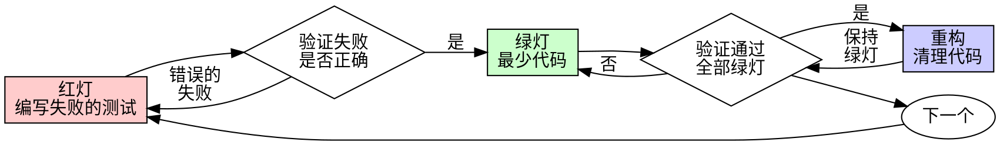

# 测试驱动开发（TDD）

## 概述

先写测试。观察它失败。编写最少的代码使其通过。

**核心原则：** 如果你没有看到测试失败，你就不知道它是否测试了正确的东西。

**违反规则的字面意思就是违反规则的精神。**

## 何时使用

**始终使用：**
- 新功能
- 缺陷修复
- 重构
- 行为变更

**例外情况（请咨询你的人类搭档）：**
- 一次性原型
- 生成的代码
- 配置文件

想着"就这一次跳过 TDD"？停下来。那是在自我合理化。

## 铁律

```
没有先写失败的测试，就不能编写生产代码
```

先写了代码再写测试？删掉它。重新开始。

**没有例外：**
- 不要把它留作"参考"
- 不要在编写测试时"调整"它
- 不要看它
- 删除就是删除

从测试出发，重新实现。句号。

## 红-绿-重构



### 红灯 - 编写失败的测试

编写一个最小的测试，展示期望的行为。

<Good>
```typescript
test('对失败的操作重试 3 次', async () => {
  let attempts = 0;
  const operation = () => {
    attempts++;
    if (attempts < 3) throw new Error('fail');
    return 'success';
  };

  const result = await retryOperation(operation);

  expect(result).toBe('success');
  expect(attempts).toBe(3);
});
```
清晰的命名，测试真实行为，只测一件事
</Good>

<Bad>
```typescript
test('重试有效', async () => {
  const mock = jest.fn()
    .mockRejectedValueOnce(new Error())
    .mockRejectedValueOnce(new Error())
    .mockResolvedValueOnce('success');
  await retryOperation(mock);
  expect(mock).toHaveBeenCalledTimes(3);
});
```
命名模糊，测试的是模拟对象而非代码
</Bad>

**要求：**
- 只测一个行为
- 命名清晰
- 使用真实代码（除非不可避免才使用模拟对象）

### 验证红灯 - 观察它失败

**必须执行。绝不跳过。**

```bash
npm test path/to/test.test.ts
```

确认：
- 测试失败（不是报错）
- 失败信息符合预期
- 因为功能缺失而失败（不是拼写错误）

**测试通过了？** 你在测试已有的行为。修改测试。

**测试报错了？** 修复错误，重新运行直到它正确地失败。

### 绿灯 - 最少代码

编写最简单的代码使测试通过。

<Good>
```typescript
async function retryOperation<T>(fn: () => Promise<T>): Promise<T> {
  for (let i = 0; i < 3; i++) {
    try {
      return await fn();
    } catch (e) {
      if (i === 2) throw e;
    }
  }
  throw new Error('unreachable');
}
```
刚好够通过测试
</Good>

<Bad>
```typescript
async function retryOperation<T>(
  fn: () => Promise<T>,
  options?: {
    maxRetries?: number;
    backoff?: 'linear' | 'exponential';
    onRetry?: (attempt: number) => void;
  }
): Promise<T> {
  // 你不会需要它（YAGNI）
}
```
过度设计
</Bad>

不要添加功能、重构其他代码，或在测试之外进行"改进"。

### 验证绿灯 - 观察它通过

**必须执行。**

```bash
npm test path/to/test.test.ts
```

确认：
- 测试通过
- 其他测试仍然通过
- 输出干净（无错误、无警告）

**测试失败了？** 修复代码，不要修改测试。

**其他测试失败了？** 立即修复。

### 重构 - 清理代码

仅在绿灯之后：
- 消除重复
- 改善命名
- 提取辅助函数

保持测试绿灯。不要添加新行为。

### 循环

为下一个功能编写下一个失败的测试。

## 好的测试

| 质量 | 好的做法 | 不好的做法 |
|------|---------|-----------|
| **最小化** | 只测一件事。名称中有"和"？拆分它。 | `test('验证邮箱和域名和空格')` |
| **清晰** | 名称描述行为 | `test('test1')` |
| **表达意图** | 展示期望的 API | 模糊代码应该做什么 |

## 为什么顺序很重要

**"我会在之后写测试来验证它是否工作"**

事后编写的测试会立即通过。立即通过说明不了任何问题：
- 可能测试了错误的东西
- 可能测试的是实现细节，而非行为
- 可能遗漏了你忘记的边界情况
- 你从未看到它捕获缺陷

先写测试迫使你看到测试失败，证明它确实在测试某些东西。

**"我已经手动测试了所有边界情况"**

手动测试是随意的。你以为测试了所有情况，但：
- 没有测试记录
- 代码更改时无法重新运行
- 在压力下容易遗漏场景
- "我试过了没问题" ≠ 全面测试

自动化测试是系统性的。它们每次都以相同的方式运行。

**"删除 X 小时的工作太浪费了"**

沉没成本谬误。时间已经过去了。你现在的选择是：
- 删除并用 TDD 重写（再花 X 小时，高置信度）
- 保留并事后添加测试（30 分钟，低置信度，可能有缺陷）

真正的"浪费"是保留你无法信任的代码。没有真正测试的可工作代码就是技术债务。

**"TDD 太教条主义了，务实意味着灵活变通"**

TDD 就是务实的：
- 在提交前发现缺陷（比事后调试更快）
- 防止回归（测试立即捕获破坏性变更）
- 记录行为（测试展示如何使用代码）
- 支持重构（自由修改，测试捕获破坏性变更）

"务实的"捷径 = 在生产环境中调试 = 更慢。

**"事后测试能达到相同的目标——重要的是精神而非形式"**

不对。事后测试回答的是"这段代码做了什么？"先写测试回答的是"这段代码应该做什么？"

事后测试会受到实现的影响。你测试的是你构建的东西，而不是需求。你验证的是你记得的边界情况，而不是发现的边界情况。

先写测试迫使你在实现之前发现边界情况。事后测试验证你是否记住了所有情况（你没有）。

事后花 30 分钟写的测试 ≠ TDD。你得到了覆盖率，却失去了测试有效的证明。

## 常见的自我合理化

| 借口 | 现实 |
|------|------|
| "太简单了不需要测试" | 简单的代码也会出错。测试只需 30 秒。 |
| "我之后再测试" | 测试立即通过说明不了任何问题。 |
| "事后测试能达到相同的目标" | 事后测试 = "这做了什么？" 先写测试 = "这应该做什么？" |
| "已经手动测试过了" | 随意 ≠ 系统性。无记录，无法重新运行。 |
| "删除 X 小时的工作太浪费了" | 沉没成本谬误。保留未验证的代码才是技术债务。 |
| "保留作参考，先写测试" | 你会去调整它的。那就是事后测试。删除就是删除。 |
| "需要先探索一下" | 可以。扔掉探索成果，用 TDD 重新开始。 |
| "测试很难写 = 设计不清晰" | 听从测试的反馈。难以测试 = 难以使用。 |
| "TDD 会拖慢我" | TDD 比调试更快。务实 = 先写测试。 |
| "手动测试更快" | 手动测试无法证明边界情况。每次修改你都得重新测试。 |
| "现有代码没有测试" | 你正在改进它。为现有代码添加测试。 |

## 危险信号 - 停下来，重新开始

- 先写代码再写测试
- 实现之后才写测试
- 测试立即通过
- 无法解释测试为什么失败
- 测试"以后再"添加
- 自我合理化"就这一次"
- "我已经手动测试过了"
- "事后测试能达到相同的目的"
- "重要的是精神而非形式"
- "保留作参考"或"调整现有代码"
- "已经花了 X 小时了，删除太浪费"
- "TDD 太教条了，我在务实地变通"
- "这次不一样，因为……"

**以上所有情况都意味着：删除代码。用 TDD 重新开始。**

## 示例：缺陷修复

**缺陷：** 空邮箱被接受

**红灯**
```typescript
test('拒绝空邮箱', async () => {
  const result = await submitForm({ email: '' });
  expect(result.error).toBe('Email required');
});
```

**验证红灯**
```bash
$ npm test
FAIL: expected 'Email required', got undefined
```

**绿灯**
```typescript
function submitForm(data: FormData) {
  if (!data.email?.trim()) {
    return { error: 'Email required' };
  }
  // ...
}
```

**验证绿灯**
```bash
$ npm test
PASS
```

**重构**
如有需要，提取验证逻辑以处理多个字段。

## 验证清单

在标记工作完成之前：

- [ ] 每个新函数/方法都有测试
- [ ] 在实现之前观察了每个测试失败
- [ ] 每个测试因预期的原因失败（功能缺失，而非拼写错误）
- [ ] 为每个测试编写了最少的代码使其通过
- [ ] 所有测试通过
- [ ] 输出干净（无错误、无警告）
- [ ] 测试使用真实代码（仅在不可避免时使用模拟对象）
- [ ] 边界情况和错误场景已覆盖

无法勾选所有项？你跳过了 TDD。重新开始。

## 遇到困难时

| 问题 | 解决方案 |
|------|---------|
| 不知道如何测试 | 编写你期望的 API。先写断言。咨询你的人类搭档。 |
| 测试太复杂 | 设计太复杂。简化接口。 |
| 必须模拟所有东西 | 代码耦合度太高。使用依赖注入。 |
| 测试准备工作巨大 | 提取辅助函数。仍然复杂？简化设计。 |

## 调试集成

发现缺陷了？编写一个失败的测试来重现它。遵循 TDD 循环。测试证明修复有效并防止回归。

绝不在没有测试的情况下修复缺陷。

## 测试反模式

在添加模拟对象或测试工具时，阅读 @testing-anti-patterns.md 以避免常见陷阱：
- 测试模拟对象的行为而非真实行为
- 向生产类添加仅用于测试的方法
- 在不理解依赖关系的情况下使用模拟对象

## 最终规则

```
生产代码 → 测试必须存在且先失败
否则 → 不是 TDD
```

未经你的人类搭档许可，没有例外。
