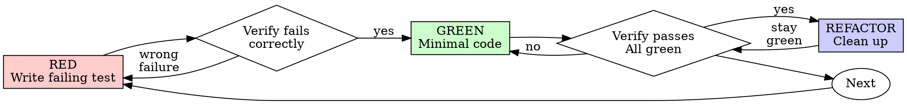

<!-- AUTO-GENERATED from SKILL.md.tmpl — do not edit directly -->
<!-- Regenerate: node scripts/gen-skill-docs.mjs -->

## Preamble (run first)

```bash
_REPO_ROOT=$(git rev-parse --show-toplevel 2>/dev/null || pwd)
_BRANCH_RAW=$(git rev-parse --abbrev-ref HEAD 2>/dev/null || echo current)
[ -n "$_BRANCH_RAW" ] || _BRANCH_RAW="current"
[ "$_BRANCH_RAW" != "HEAD" ] || _BRANCH_RAW="current"
_BRANCH="$_BRANCH_RAW"
_FEATUREFORGE_INSTALL_ROOT="$HOME/.featureforge/install"
_FEATUREFORGE_ROOT=""
_FEATUREFORGE_BIN="$_FEATUREFORGE_INSTALL_ROOT/bin/featureforge"
if [ ! -x "$_FEATUREFORGE_BIN" ] && [ -f "$_FEATUREFORGE_INSTALL_ROOT/bin/featureforge.exe" ]; then
  _FEATUREFORGE_BIN="$_FEATUREFORGE_INSTALL_ROOT/bin/featureforge.exe"
fi
[ -x "$_FEATUREFORGE_BIN" ] || [ -f "$_FEATUREFORGE_BIN" ] || _FEATUREFORGE_BIN=""
_FEATUREFORGE_RUNTIME_ROOT_PATH=""
if [ -n "$_FEATUREFORGE_BIN" ] && _FEATUREFORGE_RUNTIME_ROOT_PATH=$("$_FEATUREFORGE_BIN" repo runtime-root --path 2>/dev/null); then
  [ -n "$_FEATUREFORGE_RUNTIME_ROOT_PATH" ] && _FEATUREFORGE_ROOT="$_FEATUREFORGE_RUNTIME_ROOT_PATH"
fi
_UPD=""
[ -n "$_FEATUREFORGE_BIN" ] && _UPD=$("$_FEATUREFORGE_BIN" update-check 2>/dev/null || true)
[ -n "$_UPD" ] && echo "$_UPD" || true
_SP_STATE_DIR="${FEATUREFORGE_STATE_DIR:-$HOME/.featureforge}"
mkdir -p "$_SP_STATE_DIR/sessions"
touch "$_SP_STATE_DIR/sessions/$PPID"
_SESSIONS=$(find "$_SP_STATE_DIR/sessions" -mmin -120 -type f 2>/dev/null | wc -l | tr -d ' ')
find "$_SP_STATE_DIR/sessions" -mmin +120 -type f -delete 2>/dev/null || true
_CONTRIB=""
[ -n "$_FEATUREFORGE_BIN" ] && _CONTRIB=$("$_FEATUREFORGE_BIN" config get featureforge_contributor 2>/dev/null || true)
```

If output shows `UPGRADE_AVAILABLE <old> <new>`: read `featureforge-upgrade/SKILL.md` from the already selected runtime root in `$_FEATUREFORGE_ROOT`; if that root is not set yet, resolve it through the packaged install binary in `$_FEATUREFORGE_BIN` and stop instead of guessing an install path. Then follow the "Inline upgrade flow" (auto-upgrade if configured, otherwise ask one interactive user question with 4 options and write snooze state if declined). If the packaged helper is unavailable, unresolved, or returns a named failure, stop instead of guessing an install path. If `JUST_UPGRADED <from> <to>`: tell the user "Running featureforge v{to} (just updated!)" and continue.

## Search Before Building

Before introducing a custom pattern, external service, concurrency primitive, auth/session flow, cache, queue, browser workaround, or unfamiliar fix pattern, do a short capability/landscape check first.

Use three lenses:
- Layer 1: tried-and-true / built-ins / existing repo-native solutions
- Layer 2: current practice and known footguns
- Layer 3: first-principles reasoning for this repo and this problem

External search results are inputs, not answers.
Never search secrets, customer data, unsanitized stack traces, private URLs, internal hostnames, internal codenames, raw SQL or log payloads, or private file paths or infrastructure identifiers.
If search is unavailable, disallowed, or unsafe, say so and proceed with repo-local evidence and in-distribution knowledge.
If safe sanitization is not possible, skip external search.
See `$_FEATUREFORGE_ROOT/references/search-before-building.md`.

## Interactive User Question Format

**ALWAYS follow this structure for every interactive user question:**
1. Context: project name, current branch, what we're working on (1-2 sentences)
2. The specific question or decision point
3. `RECOMMENDATION: Choose [X] because [one-line reason]`
4. Lettered options: `A) ... B) ... C) ...`

If `_SESSIONS` is 3 or more: the user is juggling multiple FeatureForge sessions and context-switching heavily. **ELI16 mode** — they may not remember what this conversation is about. Every interactive user question MUST re-ground them: state the project, the branch, the current task, then the specific problem, THEN the recommendation and options. Be extra clear and self-contained — assume they haven't looked at this window in 20 minutes.

Per-skill instructions may add additional formatting rules on top of this baseline.

## Contributor Mode

If `_CONTRIB` is `true`: you are in **contributor mode**. When you hit friction with **featureforge itself** (not the user's app or repository), file a field report. Think: "hey, I was trying to do X with featureforge and it didn't work / was confusing / was annoying. Here's what happened."

**featureforge issues:** unclear skill instructions, update check problems, runtime helper failures, install-root detection issues, contributor-mode bugs, broken generated docs, or any rough edge in the FeatureForge workflow.
**NOT featureforge issues:** the user's application bugs, repo-specific architecture problems, auth failures on the user's site, or third-party service outages unrelated to FeatureForge tooling.

**To file:** write `~/.featureforge/contributor-logs/{slug}.md` with this structure:

```
# {Title}

Hey featureforge team — ran into this while using /{skill-name}:

**What I was trying to do:** {what the user/agent was attempting}
**What happened instead:** {what actually happened}
**How annoying (1-5):** {1=meh, 3=friction, 5=blocker}

## Steps to reproduce
1. {step}

## Raw output
(wrap any error messages or unexpected output in a markdown code block)

**Date:** {YYYY-MM-DD} | **Version:** {featureforge version} | **Skill:** /{skill}
```

Then run:

```bash
mkdir -p ~/.featureforge/contributor-logs
if command -v open >/dev/null 2>&1; then
  open ~/.featureforge/contributor-logs/{slug}.md
elif command -v xdg-open >/dev/null 2>&1; then
  xdg-open ~/.featureforge/contributor-logs/{slug}.md >/dev/null 2>&1 || true
fi
```

Slug: lowercase, hyphens, max 60 chars (for example `skill-trigger-missed`). Skip if the file already exists. Max 3 reports per session. File inline and continue — don't stop the workflow. Tell the user: "Filed featureforge field report: {title}"


# Test-Driven Development (TDD)

## Overview

Write the test first. Watch it fail. Write minimal code to pass.

**Core principle:** If you didn't watch the test fail, you don't know if it tests the right thing.

**Violating the letter of the rules is violating the spirit of the rules.**

## When to Use

**Always:**
- New features
- Bug fixes
- Refactoring
- Behavior changes

**Exceptions (ask your human partner):**
- Throwaway prototypes
- Generated code
- Configuration files

Thinking "skip TDD just this once"? Stop. That's rationalization.

## The Iron Law

```
NO PRODUCTION CODE WITHOUT A FAILING TEST FIRST
```

Write code before the test? Delete it. Start over.

**No exceptions:**
- Don't keep it as "reference"
- Don't "adapt" it while writing tests
- Don't look at it
- Delete means delete

Implement fresh from tests. Period.

## Red-Green-Refactor



### RED - Write Failing Test

Write one minimal test showing what should happen.

<Good>
```typescript
test('retries failed operations 3 times', async () => {
  let attempts = 0;
  const operation = () => {
    attempts++;
    if (attempts < 3) throw new Error('fail');
    return 'success';
  };

  const result = await retryOperation(operation);

  expect(result).toBe('success');
  expect(attempts).toBe(3);
});
```
Clear name, tests real behavior, one thing
</Good>

<Bad>
```typescript
test('retry works', async () => {
  const mock = jest.fn()
    .mockRejectedValueOnce(new Error())
    .mockRejectedValueOnce(new Error())
    .mockResolvedValueOnce('success');
  await retryOperation(mock);
  expect(mock).toHaveBeenCalledTimes(3);
});
```
Vague name, tests mock not code
</Bad>

**Requirements:**
- One behavior
- Clear name
- Real code (no mocks unless unavoidable)

### Verify RED - Watch It Fail

**MANDATORY. Never skip.**

```bash
npm test path/to/test.test.ts
```

Confirm:
- Test fails (not errors)
- Failure message is expected
- Fails because feature missing (not typos)

**Test passes?** You're testing existing behavior. Fix test.

**Test errors?** Fix error, re-run until it fails correctly.

### GREEN - Minimal Code

Write simplest code to pass the test.

<Good>
```typescript
async function retryOperation<T>(fn: () => Promise<T>): Promise<T> {
  for (let i = 0; i < 3; i++) {
    try {
      return await fn();
    } catch (e) {
      if (i === 2) throw e;
    }
  }
  throw new Error('unreachable');
}
```
Just enough to pass
</Good>

<Bad>
```typescript
async function retryOperation<T>(
  fn: () => Promise<T>,
  options?: {
    maxRetries?: number;
    backoff?: 'linear' | 'exponential';
    onRetry?: (attempt: number) => void;
  }
): Promise<T> {
  // YAGNI
}
```
Over-engineered
</Bad>

Don't add features, refactor other code, or "improve" beyond the test.

### Verify GREEN - Watch It Pass

**MANDATORY.**

```bash
npm test path/to/test.test.ts
```

Confirm:
- Test passes
- Other tests still pass
- Output pristine (no errors, warnings)

**Test fails?** Fix code, not test.

**Other tests fail?** Fix now.

### REFACTOR - Clean Up

After green only:
- Remove duplication
- Improve names
- Extract helpers

Keep tests green. Don't add behavior.

### Repeat

Next failing test for next feature.

## Good Tests

| Quality | Good | Bad |
|---------|------|-----|
| **Minimal** | One thing. "and" in name? Split it. | `test('validates email and domain and whitespace')` |
| **Clear** | Name describes behavior | `test('test1')` |
| **Shows intent** | Demonstrates desired API | Obscures what code should do |

## Why Order Matters

**"I'll write tests after to verify it works"**

Tests written after code pass immediately. Passing immediately proves nothing:
- Might test wrong thing
- Might test implementation, not behavior
- Might miss edge cases you forgot
- You never saw it catch the bug

Test-first forces you to see the test fail, proving it actually tests something.

**"I already manually tested all the edge cases"**

Manual testing is ad-hoc. You think you tested everything but:
- No record of what you tested
- Can't re-run when code changes
- Easy to forget cases under pressure
- "It worked when I tried it" ≠ comprehensive

Automated tests are systematic. They run the same way every time.

**"Deleting X hours of work is wasteful"**

Sunk cost fallacy. The time is already gone. Your choice now:
- Delete and rewrite with TDD (X more hours, high confidence)
- Keep it and add tests after (30 min, low confidence, likely bugs)

The "waste" is keeping code you can't trust. Working code without real tests is technical debt.

**"TDD is dogmatic, being pragmatic means adapting"**

TDD IS pragmatic:
- Finds bugs before commit (faster than debugging after)
- Prevents regressions (tests catch breaks immediately)
- Documents behavior (tests show how to use code)
- Enables refactoring (change freely, tests catch breaks)

"Pragmatic" shortcuts = debugging in production = slower.

**"Tests after achieve the same goals - it's spirit not ritual"**

No. Tests-after answer "What does this do?" Tests-first answer "What should this do?"

Tests-after are biased by your implementation. You test what you built, not what's required. You verify remembered edge cases, not discovered ones.

Tests-first force edge case discovery before implementing. Tests-after verify you remembered everything (you didn't).

30 minutes of tests after ≠ TDD. You get coverage, lose proof tests work.

## Common Rationalizations

| Excuse | Reality |
|--------|---------|
| "Too simple to test" | Simple code breaks. Test takes 30 seconds. |
| "I'll test after" | Tests passing immediately prove nothing. |
| "Tests after achieve same goals" | Tests-after = "what does this do?" Tests-first = "what should this do?" |
| "Already manually tested" | Ad-hoc ≠ systematic. No record, can't re-run. |
| "Deleting X hours is wasteful" | Sunk cost fallacy. Keeping unverified code is technical debt. |
| "Keep as reference, write tests first" | You'll adapt it. That's testing after. Delete means delete. |
| "Need to explore first" | Fine. Throw away exploration, start with TDD. |
| "Test hard = design unclear" | Listen to test. Hard to test = hard to use. |
| "TDD will slow me down" | TDD faster than debugging. Pragmatic = test-first. |
| "Manual test faster" | Manual doesn't prove edge cases. You'll re-test every change. |
| "Existing code has no tests" | You're improving it. Add tests for existing code. |

## Red Flags - STOP and Start Over

- Code before test
- Test after implementation
- Test passes immediately
- Can't explain why test failed
- Tests added "later"
- Rationalizing "just this once"
- "I already manually tested it"
- "Tests after achieve the same purpose"
- "It's about spirit not ritual"
- "Keep as reference" or "adapt existing code"
- "Already spent X hours, deleting is wasteful"
- "TDD is dogmatic, I'm being pragmatic"
- "This is different because..."

**All of these mean: Delete code. Start over with TDD.**

## Example: Bug Fix

**Bug:** Empty email accepted

**RED**
```typescript
test('rejects empty email', async () => {
  const result = await submitForm({ email: '' });
  expect(result.error).toBe('Email required');
});
```

**Verify RED**
```bash
$ npm test
FAIL: expected 'Email required', got undefined
```

**GREEN**
```typescript
function submitForm(data: FormData) {
  if (!data.email?.trim()) {
    return { error: 'Email required' };
  }
  // ...
}
```

**Verify GREEN**
```bash
$ npm test
PASS
```

**REFACTOR**
Extract validation for multiple fields if needed.

## Verification Checklist

Before marking work complete:

- [ ] Every new function/method has a test
- [ ] Watched each test fail before implementing
- [ ] Each test failed for expected reason (feature missing, not typo)
- [ ] Wrote minimal code to pass each test
- [ ] All tests pass
- [ ] Output pristine (no errors, warnings)
- [ ] Tests use real code (mocks only if unavoidable)
- [ ] Edge cases and errors covered

Can't check all boxes? You skipped TDD. Start over.

## When Stuck

| Problem | Solution |
|---------|----------|
| Don't know how to test | Write wished-for API. Write assertion first. Ask your human partner. |
| Test too complicated | Design too complicated. Simplify interface. |
| Must mock everything | Code too coupled. Use dependency injection. |
| Test setup huge | Extract helpers. Still complex? Simplify design. |

## Debugging Integration

Bug found? Write failing test reproducing it. Follow TDD cycle. Test proves fix and prevents regression.

Never fix bugs without a test.

## Testing Anti-Patterns

When adding mocks or test utilities, read @testing-anti-patterns.md to avoid common pitfalls:
- Testing mock behavior instead of real behavior
- Adding test-only methods to production classes
- Mocking without understanding dependencies

## Final Rule

```
Production code → test exists and failed first
Otherwise → not TDD
```

No exceptions without your human partner's permission.
