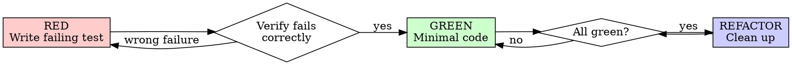

# Test-Driven Development (TDD)

Write the test first. Watch it fail. Write minimal code to pass.

**Core principle:** If you didn't watch the test fail, you don't know if it tests the right thing.

**Violating the letter of the rules is violating the spirit of the rules.**

## The Iron Law

```
NO PRODUCTION CODE WITHOUT A FAILING TEST FIRST
```

Write code before the test? Delete it. Start over. No exceptions — don't keep as "reference", don't "adapt" it, don't look at it. Delete means delete.

## Red-Green-Refactor



**RED:** Write one minimal test. Requirements: one behavior, clear name, real code (no mocks unless unavoidable). **Verify it fails** — MANDATORY. Confirm failure is because feature is missing, not typos.

**GREEN:** Write simplest code to pass. Don't add features, refactor other code, or "improve" beyond the test. **Verify it passes** — MANDATORY. Other tests still pass? Output pristine?

**REFACTOR:** After green only. Remove duplication, improve names, extract helpers. Keep tests green. Don't add behavior.

## Good Tests

| Quality | Good | Bad |
|---------|------|-----|
| **Minimal** | One thing. "and" in name? Split. | `test('validates email and domain and whitespace')` |
| **Clear** | Name describes behavior | `test('test1')` |
| **Shows intent** | Demonstrates desired API | Obscures what code should do |

## Red Flags — STOP and Start Over

- Code before test
- Test passes immediately
- Can't explain why test failed
- "Just this once" / "This is different because..."
- "Keep as reference" / "Already spent X hours"
- "Tests after achieve the same purpose"
- "It's about spirit not ritual"

**All mean: Delete code. Start over with TDD.**

See `references/rationalizations.md` for full rationalization table, "why order matters" arguments, and troubleshooting.

## Verification Checklist

- [ ] Every new function/method has a test
- [ ] Watched each test fail before implementing
- [ ] Each test failed for expected reason
- [ ] Wrote minimal code to pass
- [ ] All tests pass, output pristine
- [ ] Tests use real code (mocks only if unavoidable)
- [ ] Edge cases and errors covered

## Testing Anti-Patterns

Read @testing-anti-patterns.md to avoid: testing mock behavior instead of real behavior, adding test-only methods to production classes, mocking without understanding dependencies.

## Final Rule

```
Production code → test exists and failed first
Otherwise → not TDD
```

No exceptions without your human partner's permission.
