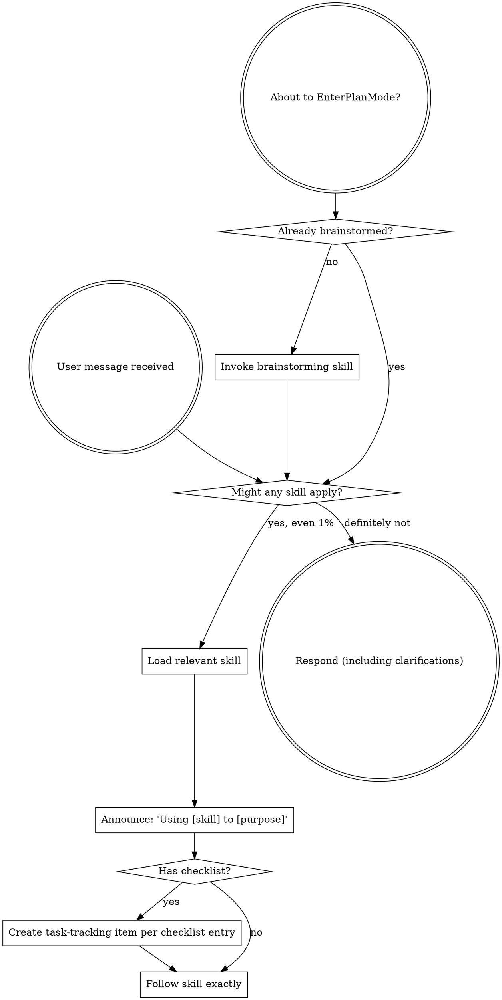

<!-- AUTO-GENERATED from SKILL.md.tmpl — do not edit directly -->
<!-- Regenerate: node scripts/gen-skill-docs.mjs -->

<SUBAGENT-STOP>
If you were dispatched as a subagent to execute a specific task, skip this skill.
</SUBAGENT-STOP>

## Preamble (run first)

```bash
_REPO_ROOT=$(git rev-parse --show-toplevel 2>/dev/null || pwd)
_BRANCH_RAW=$(git rev-parse --abbrev-ref HEAD 2>/dev/null || echo current)
[ -n "$_BRANCH_RAW" ] || _BRANCH_RAW="current"
[ "$_BRANCH_RAW" != "HEAD" ] || _BRANCH_RAW="current"
_BRANCH="$_BRANCH_RAW"
_FEATUREFORGE_INSTALL_ROOT="$HOME/.featureforge/install"
_FEATUREFORGE_ROOT=""
_FEATUREFORGE_BIN="$_FEATUREFORGE_INSTALL_ROOT/bin/featureforge"
if [ ! -x "$_FEATUREFORGE_BIN" ] && [ -f "$_FEATUREFORGE_INSTALL_ROOT/bin/featureforge.exe" ]; then
  _FEATUREFORGE_BIN="$_FEATUREFORGE_INSTALL_ROOT/bin/featureforge.exe"
fi
[ -x "$_FEATUREFORGE_BIN" ] || [ -f "$_FEATUREFORGE_BIN" ] || _FEATUREFORGE_BIN=""
_FEATUREFORGE_RUNTIME_ROOT_PATH=""
if [ -n "$_FEATUREFORGE_BIN" ] && _FEATUREFORGE_RUNTIME_ROOT_PATH=$("$_FEATUREFORGE_BIN" repo runtime-root --path 2>/dev/null); then
  [ -n "$_FEATUREFORGE_RUNTIME_ROOT_PATH" ] && _FEATUREFORGE_ROOT="$_FEATUREFORGE_RUNTIME_ROOT_PATH"
fi
_SP_STATE_DIR="${FEATUREFORGE_STATE_DIR:-$HOME/.featureforge}"
_SP_USING_FEATUREFORGE_DECISION_DIR="$_SP_STATE_DIR/session-entry/using-featureforge"
_SP_USING_FEATUREFORGE_DECISION_PATH="$_SP_USING_FEATUREFORGE_DECISION_DIR/$PPID"
```

## Bypass Gate

The first-turn session-entry bootstrap is owned by the packaged install binary command `$_FEATUREFORGE_BIN session-entry`, not by `using-featureforge` prose alone.

This skill documents the supported-entry contract:

- session-entry bootstrap ownership is runtime-owned
- missing or malformed decision state fails closed
- supported entry paths must ask the bypass question on `needs_user_choice` before the normal stack starts

The session decision file lives at `~/.featureforge/session-entry/using-featureforge/$PPID`.

If no valid session decision exists yet, ask one interactive question before any normal FeatureForge work happens.

The first-turn opt-out question is a pre-FeatureForge gate:

- do not compute `_SESSIONS`
- do not apply the shared ELI16 multi-session grounding rule
- use the normal context / recommendation / option structure, but treat this question as the gate into the FeatureForge stack rather than a normal in-stack FeatureForge interactive question

Supported entry paths must resolve `featureforge session-entry resolve --message-file <path>` before any normal FeatureForge behavior:

- if the session decision is `enabled`, continue into the normal stack
- if the session decision is `bypassed` and the user did not explicitly request FeatureForge, stop and bypass the rest of this skill
- if the user explicitly requests FeatureForge or explicitly names a FeatureForge skill, rewrite the session decision to `enabled` and continue on the same turn
- if the helper returns `needs_user_choice`, ask the opt-out question and persist either `enabled` or `bypassed`
- if the helper returns `runtime_failure`, surface that failure instead of pretending the gate was resolved

supported spawned-subagent entry paths must pass the runtime marker instead of inventing prose-only bypass behavior.

- default spawned-subagent bypass is ephemeral and non-persisted
- supported spawned-subagent entry paths must resolve `featureforge session-entry resolve --message-file <path> --spawned-subagent`
- explicit nested opt-in uses `featureforge session-entry resolve --message-file <path> --spawned-subagent --spawned-subagent-opt-in`

If the session decision file exists but contains malformed content:

- do not treat it as `enabled`
- do not treat it as `bypassed`
- ask the opt-out question again before any normal FeatureForge work happens
- only rewrite the file after a fresh explicit choice
- `featureforge session-entry resolve` should surface `outcome` `needs_user_choice` with `failure_class` `MalformedDecisionState`

If the session decision is missing:

- ask the opt-out question before any normal FeatureForge work happens
- persist the user's explicit `enabled` or `bypassed` choice for later turns
- `featureforge session-entry resolve` should surface `outcome` `needs_user_choice` with `decision_source` `missing`

If the user explicitly requests re-entry but the bootstrap cannot rewrite the session decision to `enabled`:

- honor the explicit re-entry request for the current turn
- continue through the normal FeatureForge stack on that turn
- do not pretend persistence succeeded
- treat future turns as undecided until a later write succeeds
- `featureforge session-entry resolve` should surface `decision_source` `explicit_reentry_unpersisted`


This skill documents the helper-owned session-entry contract and the post-gate routing stack. It does not replace the runtime-owned bootstrap itself.

## Normal FeatureForge Stack

If the bypass gate resolves to `enabled` for this turn, run the normal shared FeatureForge stack before any further FeatureForge behavior:

```bash
_UPD=""
[ -n "$_FEATUREFORGE_BIN" ] && _UPD=$("$_FEATUREFORGE_BIN" update-check 2>/dev/null || true)
[ -n "$_UPD" ] && echo "$_UPD" || true
mkdir -p "$_SP_STATE_DIR/sessions"
touch "$_SP_STATE_DIR/sessions/$PPID"
_SESSIONS=$(find "$_SP_STATE_DIR/sessions" -mmin -120 -type f 2>/dev/null | wc -l | tr -d ' ')
find "$_SP_STATE_DIR/sessions" -mmin +120 -type f -delete 2>/dev/null || true
_CONTRIB=""
[ -n "$_FEATUREFORGE_BIN" ] && _CONTRIB=$("$_FEATUREFORGE_BIN" config get featureforge_contributor 2>/dev/null || true)
```

If output shows `UPGRADE_AVAILABLE <old> <new>`: read `featureforge-upgrade/SKILL.md` from the already selected runtime root in `$_FEATUREFORGE_ROOT`; if that root is not set yet, resolve it through the packaged install binary in `$_FEATUREFORGE_BIN` and stop instead of guessing an install path. Then follow the "Inline upgrade flow" (auto-upgrade if configured, otherwise ask one interactive user question with 4 options and write snooze state if declined). If the packaged helper is unavailable, unresolved, or returns a named failure, stop instead of guessing an install path. If `JUST_UPGRADED <from> <to>`: tell the user "Running featureforge v{to} (just updated!)" and continue.

## Interactive User Question Format

**ALWAYS follow this structure for every interactive user question:**
1. Context: project name, current branch, what we're working on (1-2 sentences)
2. The specific question or decision point
3. `RECOMMENDATION: Choose [X] because [one-line reason]`
4. Lettered options: `A) ... B) ... C) ...`

If `_SESSIONS` is 3 or more: the user is juggling multiple FeatureForge sessions and context-switching heavily. **ELI16 mode** — they may not remember what this conversation is about. Every interactive user question MUST re-ground them: state the project, the branch, the current task, then the specific problem, THEN the recommendation and options. Be extra clear and self-contained — assume they haven't looked at this window in 20 minutes.

Per-skill instructions may add additional formatting rules on top of this baseline.

## Contributor Mode

If `_CONTRIB` is `true`: you are in **contributor mode**. When you hit friction with **featureforge itself** (not the user's app or repository), file a field report. Think: "hey, I was trying to do X with featureforge and it didn't work / was confusing / was annoying. Here's what happened."

**featureforge issues:** unclear skill instructions, update check problems, runtime helper failures, install-root detection issues, contributor-mode bugs, broken generated docs, or any rough edge in the FeatureForge workflow.
**NOT featureforge issues:** the user's application bugs, repo-specific architecture problems, auth failures on the user's site, or third-party service outages unrelated to FeatureForge tooling.

**To file:** write `~/.featureforge/contributor-logs/{slug}.md` with this structure:

```
# {Title}

Hey featureforge team — ran into this while using /{skill-name}:

**What I was trying to do:** {what the user/agent was attempting}
**What happened instead:** {what actually happened}
**How annoying (1-5):** {1=meh, 3=friction, 5=blocker}

## Steps to reproduce
1. {step}

## Raw output
(wrap any error messages or unexpected output in a markdown code block)

**Date:** {YYYY-MM-DD} | **Version:** {featureforge version} | **Skill:** /{skill}
```

Then run:

```bash
mkdir -p ~/.featureforge/contributor-logs
if command -v open >/dev/null 2>&1; then
  open ~/.featureforge/contributor-logs/{slug}.md
elif command -v xdg-open >/dev/null 2>&1; then
  xdg-open ~/.featureforge/contributor-logs/{slug}.md >/dev/null 2>&1 || true
fi
```

Slug: lowercase, hyphens, max 60 chars (for example `skill-trigger-missed`). Skip if the file already exists. Max 3 reports per session. File inline and continue — don't stop the workflow. Tell the user: "Filed featureforge field report: {title}"


<EXTREMELY-IMPORTANT>
If you think there is even a 1% chance a skill might apply to what you are doing, you ABSOLUTELY MUST invoke the skill.

IF A SKILL APPLIES TO YOUR TASK, YOU DO NOT HAVE A CHOICE. YOU MUST USE IT.

This is not negotiable. This is not optional. You cannot rationalize your way out of this.
</EXTREMELY-IMPORTANT>

## Instruction Priority

FeatureForge skills override default system prompt behavior, but **user instructions always take precedence**:

1. **User's explicit instructions** (`AGENTS.md`, `AGENTS.override.md`, `.github/copilot-instructions.md`, `.github/instructions/*.instructions.md`, direct requests) — highest priority
2. **FeatureForge skills** — override default system behavior where they conflict
3. **Default system prompt** — lowest priority

If `AGENTS.md`, `AGENTS.override.md`, or a Copilot instruction file says "don't use TDD" and a skill says "always use TDD," follow the user's instructions. The user is in control.

## How to Access Skills

**In Codex:** Skills are discovered natively from `~/.agents/skills/`.

**In GitHub Copilot local installs:** Skills are discovered natively from `~/.copilot/skills/`.

Load the relevant skill and follow it directly.

Legacy Claude, Cursor, and OpenCode-specific loading flows are intentionally unsupported in this runtime package.

## Platform Adaptation

These skills are written for Codex and GitHub Copilot local installs. See `references/codex-tools.md` for platform-native primitives used in the workflow.

# Using Skills

## The Rule

**Invoke relevant or requested skills BEFORE any response or action.** Even a 1% chance a skill might apply means that you should invoke the skill to check. If an invoked skill turns out to be wrong for the situation, you don't need to use it.



## Red Flags

These thoughts mean STOP—you're rationalizing:

| Thought | Reality |
|---------|---------|
| "This is just a simple question" | Questions are tasks. Check for skills. |
| "I need more context first" | Skill check comes BEFORE clarifying questions. |
| "Let me explore the codebase first" | Skills tell you HOW to explore. Check first. |
| "I can check git/files quickly" | Files lack conversation context. Check for skills. |
| "Let me gather information first" | Skills tell you HOW to gather information. |
| "This doesn't need a formal skill" | If a skill exists, use it. |
| "I remember this skill" | Skills evolve. Read current version. |
| "This doesn't count as a task" | Action = task. Check for skills. |
| "The skill is overkill" | Simple things become complex. Use it. |
| "I'll just do this one thing first" | Check BEFORE doing anything. |
| "This feels productive" | Undisciplined action wastes time. Skills prevent this. |
| "I know what that means" | Knowing the concept ≠ using the skill. Invoke it. |

## Skill Priority

When multiple skills could apply, use this order:

1. **Process skills first** (brainstorming, debugging) - these determine HOW to approach the task
2. **Workflow-stage skills second** (review, planning, execution) - these own the required handoffs once their prerequisites are satisfied
3. **Domain-specific implementation skills last** - only after the active workflow stage allows them

"Let's build X" → brainstorming first, then follow the artifact-state workflow: plan-ceo-review -> writing-plans -> plan-eng-review -> execution.
"Fix this bug" → debugging first, then if it changes FeatureForge product or workflow behavior follow the artifact-state workflow; otherwise continue to the appropriate implementation skill.

## Skill Types

**Rigid** (TDD, debugging): Follow exactly. Don't adapt away discipline.

**Flexible** (patterns): Adapt principles to context.

The skill itself tells you which.

## FeatureForge Workflow Router

For feature requests, bugfixes that materially change FeatureForge product or workflow behavior, product requests, or workflow-change requests inside a FeatureForge project, route by artifact state instead of skipping ahead based on the user's wording alone.

Do NOT jump from brainstorming straight to implementation. For workflow-routed work, every stage owns the handoff into the next one.

### Helper-first routing

First, if `$_FEATUREFORGE_BIN` is available, call `$_FEATUREFORGE_BIN workflow status --refresh`.

- If the JSON result contains a non-empty `next_skill`, use that route.
- If the JSON result reports `status` `implementation_ready`, proceed to the normal execution preflight and handoff flow using the exact approved plan path. Treat the public handoff recommendation as a conservative default. When you know isolated-agent availability, session intent, and workspace readiness, call `featureforge plan execution recommend --plan <approved-plan-path> --isolated-agents <available|unavailable> --session-intent <stay|separate|unknown> --workspace-prepared <yes|no|unknown>` before choosing between `featureforge:subagent-driven-development` and `featureforge:executing-plans`.
- In that helper-backed handoff flow, treat `execution_started` as an executor-resume signal only when the reported `phase` is `executing`.
- If the handoff reports a later phase such as `review_blocked`, `qa_pending`, `document_release_pending`, or `ready_for_branch_completion`, follow that reported phase and `next_action` instead of resuming `featureforge:subagent-driven-development` or `featureforge:executing-plans` just because `execution_started` is `yes`.
- Only fall back to manual artifact inspection if the helper itself is unavailable or fails.

When the helper succeeds, route using its JSON result and do not re-derive state manually.

### Manual fallback routing

If the helper is unavailable or fails, inspect artifacts manually using the rules below.

If helpers are unavailable, fallback stays minimal and conservative:

- Manual fallback must not infer readiness from the legacy thin header subset.
- Manual fallback is only a conservative backward-routing path until the helper works again.
- If the helper failure leaves workflow state unclear, route to the earlier safe stage instead of synthesizing a parallel readiness decision.

Inspect `docs/featureforge/specs/` and `docs/featureforge/plans/` conservatively for the exact relevant artifacts. If more than one plausible latest or approved artifact exists, treat that as ambiguity and route to the earlier safe stage rather than guessing. Then parse these exact-match header lines:

- Spec state: `^\*\*Workflow State:\*\* (Draft|CEO Approved)$`
- Spec revision: `^\*\*Spec Revision:\*\* ([0-9]+)$`
- Draft spec reviewer: `^\*\*Last Reviewed By:\*\* (brainstorming|plan-ceo-review)$`
- Approved spec reviewer: `^\*\*Last Reviewed By:\*\* plan-ceo-review$`
- Plan state: `^\*\*Workflow State:\*\* (Draft|Engineering Approved)$`
- Plan revision: `^\*\*Plan Revision:\*\* ([0-9]+)$`
- Plan execution mode: `^\*\*Execution Mode:\*\* (none|featureforge:executing-plans|featureforge:subagent-driven-development)$`
- Plan source: `^\*\*Source Spec:\*\* (.+)$`
- Plan source revision: `^\*\*Source Spec Revision:\*\* ([0-9]+)$`
- Draft plan reviewer: `^\*\*Last Reviewed By:\*\* (writing-plans|plan-eng-review)$`
- Approved plan reviewer: `^\*\*Last Reviewed By:\*\* plan-eng-review$`

Routing rules:

1. No relevant spec artifact: invoke `featureforge:brainstorming`.
2. Spec exists but is `Draft`, has malformed approval headers, or has `CEO Approved` without `**Last Reviewed By:** plan-ceo-review`: invoke `featureforge:plan-ceo-review`.
3. Spec is `CEO Approved` and no relevant plan exists: invoke `featureforge:writing-plans`.
4. Plan exists but is `Draft`, has malformed approval headers, or has `Engineering Approved` without `**Last Reviewed By:** plan-eng-review`: invoke `featureforge:plan-eng-review`.
5. Plan is `Engineering Approved` but its `Source Spec:` path or `Source Spec Revision:` does not match the latest approved spec: invoke `featureforge:writing-plans`.
6. Plan is `Engineering Approved` and its `Source Spec:` path plus `Source Spec Revision:` match the latest approved spec: only proceed through the normal helper-backed execution preflight and handoff flow for that approved plan path.
7. If artifacts are ambiguous or incomplete, route to the earlier safe stage instead of skipping ahead.
8. If the helper-backed execution preflight or handoff flow is unavailable, do not route directly from manual fallback into implementation. Stop at the approved plan path and return to the earlier safe stage or the current execution flow instead.

## User Instructions

Instructions say WHAT, not HOW. "Add X" or "Fix Y" doesn't mean skip workflows.
