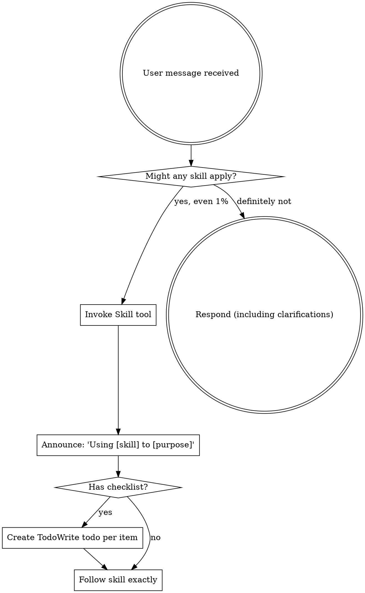

<EXTREMELY-IMPORTANT>
If you think there is even a 1% chance a skill might apply to what you are doing, you ABSOLUTELY MUST invoke the skill.

IF A SKILL APPLIES TO YOUR TASK, YOU DO NOT HAVE A CHOICE. YOU MUST USE IT.

This is not negotiable. This is not optional. You cannot rationalize your way out of it.
</EXTREMELY-IMPORTANT>

## How to Access Skills

**In Claude Code:** Use the `Skill` tool. When you invoke a skill, its content is loaded and presented to you—follow it directly. Never use the Read tool on skill files.

**In other environments:** Check your platform's documentation for how skills are loaded.

# Using Horspowers Skills

## About Horspowers

**Horspowers** is a Chinese-enhanced fork of [obra/superpowers](https://github.com/obra/superpowers), a composable skills library for Claude Code. It provides complete development workflows with full Chinese language support.

This skill was originally called `using-superpowers` in the upstream project. For backward compatibility, you may also invoke it using `horspowers:using-superpowers`.

## The Rule

**Invoke relevant or requested skills BEFORE any response or action.** Even a 1% chance a skill might apply means that you should invoke the skill to check. If an invoked skill turns out to be wrong for the situation, you don't need to use it.



## Red Flags

These thoughts mean STOP—you're rationalizing:

| Thought | Reality |
|---------|---------|
| "This is just a simple question" | Questions are tasks. Check for skills. |
| "I need more context first" | Skill check comes BEFORE clarifying questions. |
| "Let me explore the codebase first" | Skills tell you HOW to explore. Check first. |
| "I can check git/files quickly" | Files lack conversation context. Check for skills. |
| "Let me gather information first" | Skills tell you HOW to gather information. |
| "This doesn't need a formal skill" | If a skill exists, use it. |
| "I remember this skill" | Skills evolve. Read current version. |
| "This doesn't count as a task" | Action = task. Check for skills. |
| "The skill is overkill" | Simple things become complex. Use it. |
| "I'll just do this one thing first" | Check BEFORE doing anything. |
| "This feels productive" | Undisciplined action wastes time. Skills prevent this. |
| "I know what that means" | Knowing the concept ≠ using the skill. Invoke it. |

## Skill Priority

When multiple skills could apply, use this order:

1. **Process skills first** (brainstorming, debugging) - these determine HOW to approach the task
2. **Implementation skills second** (frontend-design, mcp-builder) - these guide execution

"Let's build X" → brainstorming first, then implementation skills.
"Fix this bug" → debugging first, then domain-specific skills.

## Skill Types

**Rigid** (TDD, debugging): Follow exactly. Don't adapt away discipline.

**Flexible** (patterns): Adapt principles to context.

The skill itself tells you which.

## User Instructions

Instructions say WHAT, not HOW. "Add X" or "Fix Y" doesn't mean skip workflows.

## Configuration System (Personal/Team Modes)

**Check for configuration marker on session start:**

When this skill is injected via session start hook, check for configuration status markers:

**If `<config-needs-init>true</config-needs-init>`:**
- On your FIRST response to the user, you MUST guide them through initial configuration
- Use AskUserQuestion to ask about their development preferences:

```
欢迎使用 Horspowers！检测到这是首次使用，需要配置开发模式。

**请选择你的开发模式：**

1. **个人开发者** - 单人开发，使用简化的工作流程：
   - 使用普通分支而非 worktree
   - 本地合并而非创建 PR
   - 可选的测试（可以写完代码再测试）

2. **团队协作** - 团队开发，使用完整的工程化流程：
   - 使用 worktree 隔离环境
   - 创建 PR 进行代码审查
   - 严格的 TDD 流程

请选择 1 或 2：
```

- After user selects, use Node.js to create config file:
```javascript
const { initializeConfig } = require('./lib/config-manager.js');
const mode = userSelection === 1 ? 'personal' : 'team';
const result = initializeConfig(process.cwd(), mode);
```

**After config is created, check for docs initialization:**
```
✅ 配置文件已创建！

Horspowers 默认启用文档系统功能，可以帮助你追踪任务和进度。

是否立即初始化文档系统（创建 docs/ 目录结构）？
```

- If user confirms "yes":
  ```bash
  node -e "
  const { UnifiedDocsManager } = require('\${CLAUDE_PLUGIN_ROOT}/lib/docs-core.js');
  const manager = new UnifiedDocsManager(process.cwd());
  const result = manager.init();
  console.log(result.message);
  "
  ```
- If user says "no":
  ```
  好的，你可以稍后使用 `/docs init` 命令或运行 Skill: `horspowers:document-management` 来初始化文档系统。
  ```

**If `<config-needs-migration>true</config-needs-migration>`:**
- On your FIRST response, inform user about migration:
```
⚠️ **检测到旧版配置文件**: 发现 `.superpowers-config.yaml` 需要迁移到新版格式。

新版配置文件 `.horspowers-config.yaml` 将：
- 更新配置版本到 {{CONFIG_VERSION}}
- 保留您现有的配置设置
- 自动添加新的可选字段（如 documentation.enabled）

是否现在执行迁移？
```

- If user confirms, use: `migrateOldConfig(oldPath, projectDir)`
- Migration path provided in `<config-old-path>` marker

**After migration, check for docs initialization (same prompt as above):**
- If config now has `documentation.enabled: true` but docs/ doesn't exist, prompt to initialize

**If `<config-needs-update>true</config-needs-update>`:**
- On your FIRST response, inform user about update:
```
⚠️ **配置文件需要更新**: 

是否现在更新配置文件？
```

- If user confirms, use: `updateConfig(projectDir, currentConfig)`

**After update, check for docs initialization:**
- If config now has `documentation.enabled: true` but docs/ doesn't exist, prompt to initialize

**If `<config-invalid>true</config-invalid>`:**
- On your FIRST response, inform user about validation errors:
```
⚠️ **配置文件无效**: 配置文件存在但验证失败。

错误信息：{{errors}}

建议修复配置文件或删除后重新初始化。
```

**If `<config-valid>true</config-valid>`:**
- Configuration is valid and up to date - read `<config-detected>` marker for current settings
- Store these settings in memory for use by other skills
- Don't mention configuration unless user asks or a skill needs to make a decision

## Document System Initialization Check

**IMPORTANT:** After confirming config is valid, ALWAYS check document system status:

**Check if docs/ directory exists:**
```bash
ls docs/ 2>/dev/null || echo "Not initialized"
```

**If `documentation.enabled: true` but docs/ directory does NOT exist:**
```
📄 **文档系统已启用但未初始化**

检测到你在配置文件中启用了文档系统，但 docs/ 目录尚未创建。

是否现在初始化文档系统？这将创建以下目录结构：
- docs/plans/      - 静态文档（设计、计划）
- docs/active/     - 活跃状态追踪文档
- docs/archive/    - 已归档文档
- docs/context/    - 上下文文档
- docs/.docs-metadata/ - 元数据和会话状态
```

- If user confirms "yes":
  ```bash
  node -e "
  const { UnifiedDocsManager } = require('\${CLAUDE_PLUGIN_ROOT}/lib/docs-core.js');
  const manager = new UnifiedDocsManager(process.cwd());
  const result = manager.init();
  console.log(result.message);
  "
  ```
- If user says "no":
  ```
  好的，文档系统暂不初始化。

  你可以稍后使用以下方式手动初始化：
  - 运行 `/docs init` 命令
  - 或直接调用 Skill: `horspowers:document-management`
  ```

**If `documentation.enabled` is NOT true or does NOT exist:**
```
📄 **文档系统集成提示**

Horspowers 提供文档系统功能，可以帮助你：
- 追踪任务、Bug 和设计文档
- 记录会话状态和进度
- 自动归档完成的文档

是否启用文档系统？
```

- If user confirms "yes":
  1. Use Node.js to update config:
  ```javascript
  const { readConfig, updateConfig } = require('./lib/config-manager.js');
  const config = readConfig(process.cwd());
  config.documentation = { enabled: true };
  updateConfig(process.cwd(), config);
  ```
  2. Then initialize the docs directory (as shown above)
- If user says "no":
  ```
  好的，文档系统暂不启用。

  你可以随时在 .horspowers-config.yaml 中添加以下配置来启用：
  ```yaml
  documentation:
    enabled: true
  ```

  或使用 `/docs init` 命令时再询问是否启用配置。
  ```

**If `documentation.enabled: true` AND docs/ directory exists:**
- Document system is ready - no action needed
- Store in memory: `docsSystemReady: true`

**Config usage by other skills:**
- Skills should read the configuration from session context
- At decision points, show "根据当前配置（<development_mode>），建议：..." with confirmation
- Always allow user to override the suggestion
