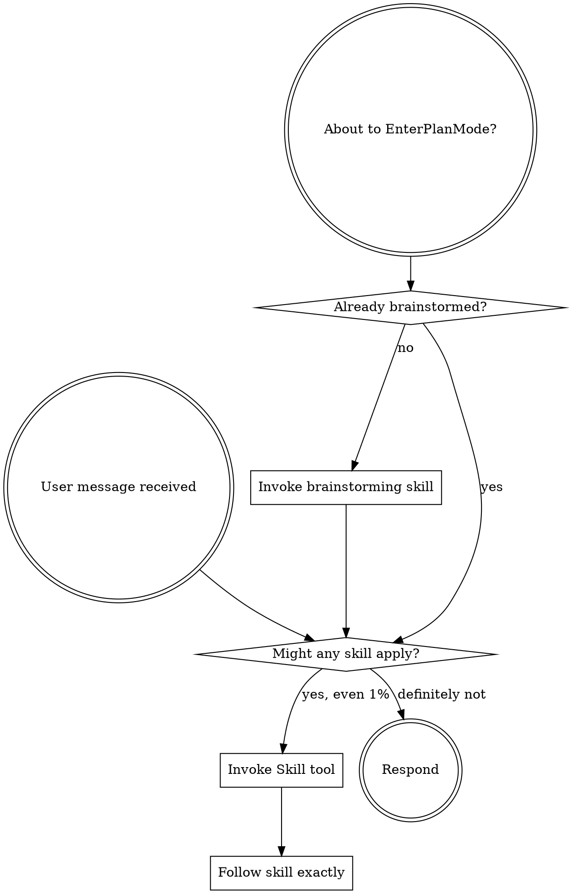

<SUBAGENT-STOP>
If you were dispatched as a subagent to execute a specific task, skip this skill.
</SUBAGENT-STOP>

<EXTREMELY-IMPORTANT>
If there is even a 1% chance a skill might apply, you MUST invoke it. This is not negotiable.
</EXTREMELY-IMPORTANT>

## The Rule

**Invoke relevant skills BEFORE any response or action.** Even 1% chance means invoke the skill. If it turns out wrong, you don't need to use it.

## Skill Priority

1. **Process skills first** (brainstorming, debugging) — determine HOW to approach
2. **Implementation skills second** — guide execution

## Skill Types

**Rigid** (TDD, debugging): Follow exactly. **Flexible** (patterns): Adapt to context.

See `references/red-flags-table.md` for the full rationalization table, instruction priority, and platform adaptation details.
