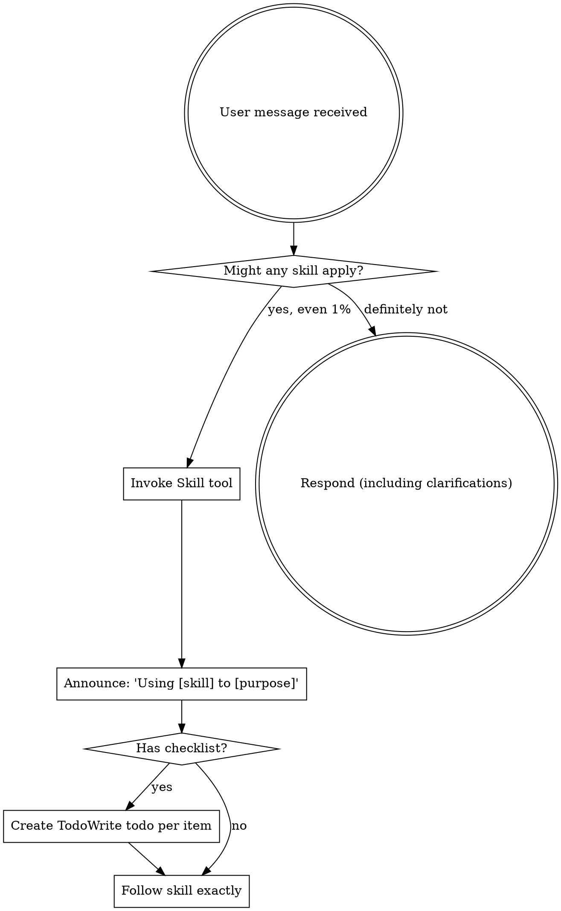

<EXTREMELY-IMPORTANT>
If you think there is even a 1% chance a skill might apply to what you are doing, you ABSOLUTELY MUST invoke the skill.

IF A SKILL APPLIES TO YOUR TASK, YOU DO NOT HAVE A CHOICE. YOU MUST USE IT.

This is not negotiable. This is not optional. You cannot rationalize your way out of this.
</EXTREMELY-IMPORTANT>

## How to Access Skills

**In Claude Code:** Use the `Skill` tool. When you invoke a skill, its content is loaded and presented to you—follow it directly. Never use the Read tool on skill files.

**In other environments:** Check your platform's documentation for how skills are loaded.

# Using Skills

## The Rule

**Invoke relevant or requested skills BEFORE any response or action.** Even a 1% chance a skill might apply means that you should invoke the skill to check. If an invoked skill turns out to be wrong for the situation, you don't need to use it.



## Red Flags

These thoughts mean STOP—you're rationalizing:

| Thought | Reality |
|---------|---------|
| "This is just a simple question" | Questions are tasks. Check for skills. |
| "I need more context first" | Skill check comes BEFORE clarifying questions. |
| "Let me explore the codebase first" | Skills tell you HOW to explore. Check first. |
| "I can check git/files quickly" | Files lack conversation context. Check for skills. |
| "Let me gather information first" | Skills tell you HOW to gather information. |
| "This doesn't need a formal skill" | If a skill exists, use it. |
| "I remember this skill" | Skills evolve. Read current version. |
| "This doesn't count as a task" | Action = task. Check for skills. |
| "The skill is overkill" | Simple things become complex. Use it. |
| "I'll just do this one thing first" | Check BEFORE doing anything. |
| "This feels productive" | Undisciplined action wastes time. Skills prevent this. |
| "I know what that means" | Knowing the concept ≠ using the skill. Invoke it. |

## Skill Priority

When multiple skills could apply, use this order:

1. **Process skills first** (brainstorming, debugging) - these determine HOW to approach the task
2. **Implementation skills second** (frontend-design, mcp-builder) - these guide execution

"Let's build X" → brainstorming first, then implementation skills.
"Fix this bug" → debugging first, then domain-specific skills.

## Skill Types

**Rigid** (TDD, debugging): Follow exactly. Don't adapt away discipline.

**Flexible** (patterns): Adapt principles to context.

The skill itself tells you which.

## User Instructions

Instructions say WHAT, not HOW. "Add X" or "Fix Y" doesn't mean skip workflows.

## Configuration System (Personal/Team Modes)

**Check for configuration marker on session start:**

When this skill is injected via session start hook, check for `<config-exists>` marker:

**If `<config-exists>false</config-exists>`:**
- On your FIRST response to the user, you MUST guide them through initial configuration
- Use AskUserQuestion to ask about their development preferences:

```
欢迎使用 Superpowers！检测到这是首次使用，需要配置开发模式。

**请选择你的开发模式：**

1. **个人开发者** - 单人开发，使用简化的工作流程：
   - 使用普通分支而非 worktree
   - 本地合并而非创建 PR
   - 可选的测试（可以写完代码再测试）

2. **团队协作** - 团队开发，使用完整的工程化流程：
   - 使用 worktree 隔离环境
   - 创建 PR 进行代码审查
   - 严格的 TDD 流程

请选择 1 或 2：
```

- After user selects, create `.superpowers-config.yaml` in current directory with appropriate settings
- Personal mode: `development_mode: personal`, `branch_strategy: simple`, `testing_strategy: test-after`, `completion_strategy: merge`
- Team mode: `development_mode: team`, `branch_strategy: worktree`, `testing_strategy: tdd`, `completion_strategy: pr`

**If `<config-exists>true</config-exists>`:**
- Configuration file exists - read `<config-detected>` marker for current settings
- Store these settings in memory for use by other skills
- Don't mention configuration unless user asks or a skill needs to make a decision

**Config usage by other skills:**
- Skills should read the configuration from session context
- At decision points, show "根据当前配置（<mode>），建议：..." with confirmation
- Always allow user to override the suggestion
