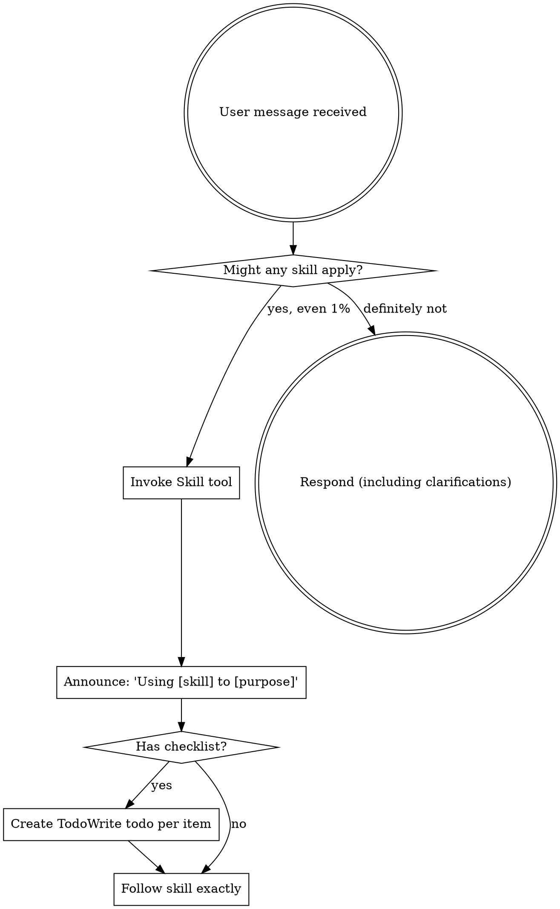

<EXTREMELY-IMPORTANT>
If you think there is even a 1% chance a skill might apply to what you are doing, you ABSOLUTELY MUST invoke the skill.

IF A SKILL APPLIES TO YOUR TASK, YOU DO NOT HAVE A CHOICE. YOU MUST USE IT.

This is not negotiable. This is not optional. You cannot rationalize your way out of this.
</EXTREMELY-IMPORTANT>

## How to Access Skills

**In Claude Code:** Use the `Skill` tool. When you invoke a skill, its content is loaded and presented to you—follow it directly. Never use the Read tool on skill files.

**In other environments:** Check your platform's documentation for how skills are loaded.

# Using Skills

## The Rule

**Invoke relevant or requested skills BEFORE any response or action.** Even a 1% chance a skill might apply means that you should invoke the skill to check. If an invoked skill turns out to be wrong for the situation, you don't need to use it.

## Red Flags

These thoughts mean STOP—you're rationalizing:

| Thought | Reality |
|---------|---------|
| "This is just a simple question" | Questions are tasks. Check for skills. |
| "I need more context first" | Skill check comes BEFORE clarifying questions. |
| "Let me explore the codebase first" | Skills tell you HOW to explore. Check first. |
| "I can check git/files quickly" | Files lack conversation context. Check for skills. |
| "Let me gather information first" | Skills tell you HOW to gather information. |
| "This doesn't need a formal skill" | If a skill exists, use it. |
| "I remember this skill" | Skills evolve. Read current version. |
| "This doesn't count as a task" | Action = task. Check for skills. |
| "The skill is overkill" | Simple things become complex. Use it. |
| "I'll just do this one thing first" | Check BEFORE doing anything. |
| "This feels productive" | Undisciplined action wastes time. Skills prevent this. |
| "I know what that means" | Knowing the concept ≠ using the skill. Invoke it. |

## Skill Priority

When multiple skills could apply, use this order:

1. **Process skills first** (brainstorming, debugging) - these determine HOW to approach the task
2. **Implementation skills second** (frontend-design, mcp-builder) - these guide execution

"Let's build X" → brainstorming first, then implementation skills.
"Fix this bug" → debugging first, then domain-specific skills.

## Skill Types

**Rigid** (TDD, debugging): Follow exactly. Don't adapt away discipline.

**Flexible** (patterns): Adapt principles to context.

The skill itself tells you which.

## Executing Skills

When you invoke a skill via the Skill tool:

1. **The skill content is loaded and presented to you** - it's not in your training data
2. **Read it completely before starting** - don't work from memory or assumptions
3. **Follow documented steps exactly** - don't improvise or skip steps
4. **Check "Success Criteria" section** to verify completion
5. **For rigid skills, every step is mandatory** - no shortcuts

**Common mistake:** Invoking a skill but then working from assumed understanding instead of following the loaded content step-by-step.

## Model Selection for Skills

**IMPORTANT**: Always use the appropriate model for each skill to balance quality and cost.

**Design & Architecture Skills (Use OPUS):**
- `superpowers:brainstorming` → **Opus** - Architectural decisions, exploring approaches, creative problem-solving
- Use Task tool with `model="opus"` instead of Skill tool when invoking these

**Planning Skills (Use SONNET):**
- `superpowers:writing-plans` → **Sonnet** - Structured planning, breaking down tasks, writing implementation steps
- `superpowers:requesting-code-review` → **Sonnet** - Code analysis, quality assessment, suggesting improvements

**Execution Skills (Use HAIKU):**
- `superpowers:executing-plans` → **Haiku** - Following explicit plan instructions, mechanical implementation
- `superpowers:subagent-driven-development` → **Haiku** - Task-by-task execution with supervision
- `superpowers:test-driven-development` → **Haiku** - Writing tests and implementation following TDD pattern
- `superpowers:verification-before-completion` → **Haiku** - Running tests, checking outputs

**Debugging Skills (Use SONNET):**
- `superpowers:systematic-debugging` → **Sonnet** - Investigating bugs, analyzing failures, root cause analysis
- `superpowers:receiving-code-review` → **Sonnet** - Understanding feedback, verifying suggestions

**General Guidelines:**
- **Opus** (💎 Highest cost, highest quality): Architectural decisions, ambiguous requirements, creative design
- **Sonnet** (⚖️ Balanced): Structured planning, code review, debugging, general development
- **Haiku** (⚡ Lowest cost): Mechanical execution, following explicit instructions, straightforward tasks

## User Instructions

Instructions say WHAT, not HOW. "Add X" or "Fix Y" doesn't mean skip workflows.

## Common Trigger Phrases

Recognize these user phrases as skill invocation triggers:

| User Says | Skill to Invoke | Why |
|-----------|----------------|-----|
| "let's complete this", "finish this work", "wrap this up", "we're done", "finalize this" | `finishing-a-development-branch` | Completion signals require proper workflow (documentation, tests, git integration) |
| "this is broken", "tests are failing", "not working" | `systematic-debugging` | Issues require root cause investigation before fixes |
| "add feature X", "implement Y" | `brainstorming` first | Design decisions before implementation |
| "plan this out", "how should we approach this" | `writing-plans` | Multi-step tasks need structured planning |
| "is this ready to merge", "can we ship this" | `verification-before-completion` | Claims require evidence |

**Exception:** Only skip skill if user explicitly says "skip the workflow" or "just commit it".
