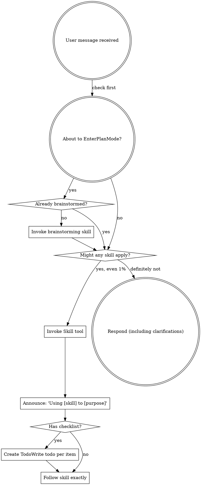
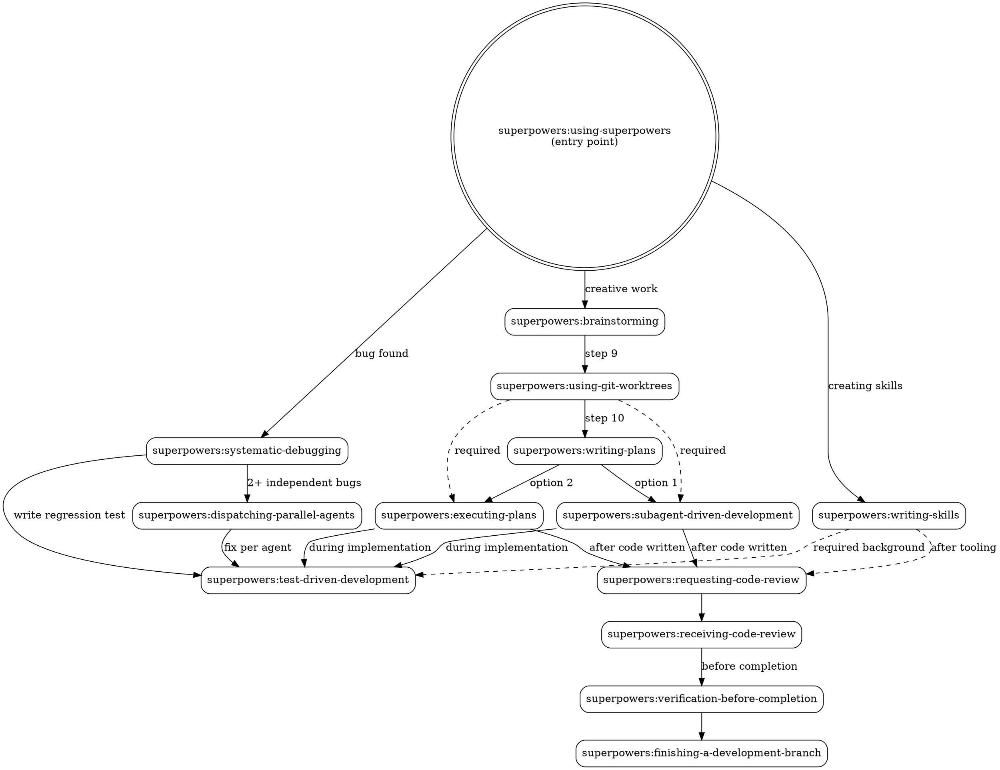

<SUBAGENT-STOP>
If you were dispatched as a subagent to execute a specific task, skip this skill.
</SUBAGENT-STOP>

<EXTREMELY-IMPORTANT>
If you think there is even a 1% chance a skill might apply to what you are doing, you ABSOLUTELY MUST invoke the skill.

IF A SKILL APPLIES TO YOUR TASK, YOU DO NOT HAVE A CHOICE. YOU MUST USE IT.

This is not negotiable. This is not optional. You cannot rationalize your way out of this.
</EXTREMELY-IMPORTANT>

## Instruction Priority

Superpowers skills override default system prompt behavior, but **user instructions always take precedence**:

1. **User's explicit instructions** (CLAUDE.md, GEMINI.md, AGENTS.md, direct requests) — highest priority
2. **Superpowers skills** — override default system behavior where they conflict
3. **Default system prompt** — lowest priority

If CLAUDE.md, GEMINI.md, or AGENTS.md says "don't use TDD" and a skill says "always use TDD," follow the user's instructions. The user is in control.

## How to Access Skills

**In Claude Code:** Use the `Skill` tool. When you invoke a skill, its content is loaded and presented to you—follow it directly. Never use the Read tool on skill files.

**In Gemini CLI:** Skills activate via the `activate_skill` tool. Gemini loads skill metadata at session start and activates the full content on demand.

**In other environments:** Check your platform's documentation for how skills are loaded.

## Platform Adaptation

Skills use Claude Code tool names. Non-CC platforms: see `references/codex-tools.md` (Codex) for tool equivalents. Gemini CLI users get the tool mapping loaded automatically via GEMINI.md.

# Using Skills

## The Rule

**Invoke relevant or requested skills BEFORE any response or action.** Even a 1% chance a skill might apply means that you should invoke the skill to check. If an invoked skill turns out to be wrong for the situation, you don't need to use it.

```dot
digraph skill_flow {
    "User message received" [shape=doublecircle];
    "About to EnterPlanMode?" [shape=doublecircle];
    "Already brainstormed?" [shape=diamond];
    "Invoke brainstorming skill" [shape=box];
    "Might any skill apply?" [shape=diamond];
    "Invoke Skill tool" [shape=box];
    "Announce: 'Using [skill] to [purpose]'" [shape=box];
    "Has checklist?" [shape=diamond];
    "Create TodoWrite todo per item" [shape=box];
    "Follow skill exactly" [shape=box];
    "Respond (including clarifications)" [shape=doublecircle];

    "User message received" -> "About to EnterPlanMode?" [label="check first"];
    "About to EnterPlanMode?" -> "Already brainstormed?" [label="yes"];
    "About to EnterPlanMode?" -> "Might any skill apply?" [label="no"];
    "Already brainstormed?" -> "Invoke brainstorming skill" [label="no"];
    "Already brainstormed?" -> "Might any skill apply?" [label="yes"];
    "Invoke brainstorming skill" -> "Might any skill apply?";
    "Might any skill apply?" -> "Invoke Skill tool" [label="yes, even 1%"];
    "Might any skill apply?" -> "Respond (including clarifications)" [label="definitely not"];
    "Invoke Skill tool" -> "Announce: 'Using [skill] to [purpose]'";
    "Announce: 'Using [skill] to [purpose]'" -> "Has checklist?";
    "Has checklist?" -> "Create TodoWrite todo per item" [label="yes"];
    "Has checklist?" -> "Follow skill exactly" [label="no"];
    "Create TodoWrite todo per item" -> "Follow skill exactly";
}
```

## Red Flags

These thoughts mean STOP—you're rationalizing:

| Thought | Reality |
|---------|---------|
| "This is just a simple question" | Questions are tasks. Check for skills. |
| "I need more context / let me explore first / let me gather info" | Skills tell you HOW to explore and gather. Skill check comes BEFORE clarifying questions. |
| "I can check git/files/docs quickly on my own" | Files lack conversation context. Check for skills. |
| "This doesn't need a formal skill / the skill is overkill" | If a skill exists, use it. Simple things become complex. |
| "I remember this skill / I know what that means" | Skills evolve. Knowing the concept is not the same as using the skill. Read the current version. |
| "I'll just do this one thing first / this feels productive" | Undisciplined action wastes time. Check BEFORE doing anything. |

## Skill Priority

When multiple skills could apply, use this order:

1. **Process skills first** (brainstorming, debugging) - these determine HOW to approach the task
2. **Implementation skills second** (frontend-design, mcp-builder) - these guide execution

"Let's build X" → brainstorming first, then implementation skills.
"Fix this bug" → debugging first, then domain-specific skills.

## Skill Dependency Map

This graph shows how all 14 skills connect. Use it to understand skill sequencing.

```dot
digraph superpowers_dependencies {
    rankdir=TB;
    node [shape=box, style=rounded];

    "superpowers:using-superpowers" [shape=doublecircle, label="superpowers:using-superpowers\n(entry point)"];
    "superpowers:brainstorming";
    "superpowers:writing-plans";
    "superpowers:using-git-worktrees";
    "superpowers:subagent-driven-development";
    "superpowers:executing-plans";
    "superpowers:test-driven-development";
    "superpowers:systematic-debugging";
    "superpowers:requesting-code-review";
    "superpowers:receiving-code-review";
    "superpowers:verification-before-completion";
    "superpowers:finishing-a-development-branch";
    "superpowers:dispatching-parallel-agents";
    "superpowers:writing-skills";

    // writing-skills dependencies
    "superpowers:writing-skills" -> "superpowers:test-driven-development" [style=dashed, label="required background"];
    "superpowers:writing-skills" -> "superpowers:requesting-code-review" [style=dashed, label="after tooling"];

    // Entry
    "superpowers:using-superpowers" -> "superpowers:brainstorming" [label="creative work"];
    "superpowers:using-superpowers" -> "superpowers:systematic-debugging" [label="bug found"];
    "superpowers:using-superpowers" -> "superpowers:writing-skills" [label="creating skills"];

    // Creative work pipeline (sequential: brainstorm -> worktree -> plan -> execute)
    "superpowers:brainstorming" -> "superpowers:using-git-worktrees" [label="step 9"];
    "superpowers:using-git-worktrees" -> "superpowers:writing-plans" [label="step 10"];
    "superpowers:writing-plans" -> "superpowers:subagent-driven-development" [label="option 1"];
    "superpowers:writing-plans" -> "superpowers:executing-plans" [label="option 2"];

    // Worktree required before implementation
    "superpowers:using-git-worktrees" -> "superpowers:executing-plans" [style=dashed, label="required"];
    "superpowers:using-git-worktrees" -> "superpowers:subagent-driven-development" [style=dashed, label="required"];

    // During implementation
    "superpowers:executing-plans" -> "superpowers:test-driven-development" [label="during implementation"];
    "superpowers:subagent-driven-development" -> "superpowers:test-driven-development" [label="during implementation"];

    // Bug found during implementation
    "superpowers:systematic-debugging" -> "superpowers:test-driven-development" [label="write regression test"];

    // After code written
    "superpowers:executing-plans" -> "superpowers:requesting-code-review" [label="after code written"];
    "superpowers:subagent-driven-development" -> "superpowers:requesting-code-review" [label="after code written"];
    "superpowers:requesting-code-review" -> "superpowers:receiving-code-review";

    // Before completion
    "superpowers:receiving-code-review" -> "superpowers:verification-before-completion" [label="before completion"];
    "superpowers:verification-before-completion" -> "superpowers:finishing-a-development-branch";

    // Multiple independent failures
    "superpowers:systematic-debugging" -> "superpowers:dispatching-parallel-agents" [label="2+ independent bugs"];
    "superpowers:dispatching-parallel-agents" -> "superpowers:test-driven-development" [label="fix per agent"];
}
```

## Rule Priority

When skills conflict or time is constrained, apply this priority order:

1. **superpowers:verification-before-completion** — non-negotiable. Never skip verification.
2. **superpowers:test-driven-development** — tests are the next most important discipline.
3. **superpowers:systematic-debugging** — structured debugging prevents wasted cycles.
4. **All other skills** — apply as normal when time permits.

When time-constrained: verification is always required, TDD is next, debugging process is next. Other skills can be abbreviated but these three cannot.

## Skill Types

**Rigid** (TDD, debugging, verification): Follow exactly. Do not adapt away discipline. Their strict tone is deliberate — these skills enforce non-negotiable disciplines where shortcuts cause compounding damage.

**Flexible** (brainstorming, patterns): Adapt principles to context. Their conversational tone reflects that creative and exploratory processes benefit from situational judgment.

The skill itself tells you which type it is.

## User Instructions

Instructions say WHAT, not HOW. "Add X" or "Fix Y" doesn't mean skip workflows.

## Integration

- **Loaded by:** Claude Code at conversation start
- **Triggers:** Every user message — check for applicable skills before responding
- **Leads to:** Any superpowers skill depending on task type (see Skill Dependency Map above)
- **Key rule:** Invoke skills BEFORE any response, including clarifying questions
