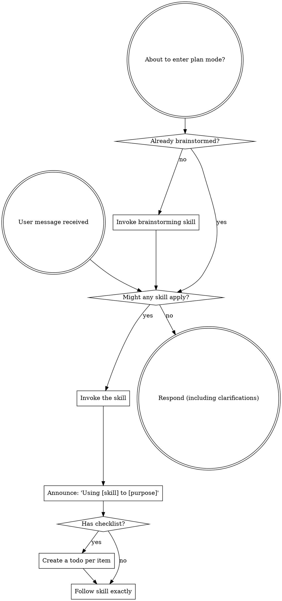

<SUBAGENT-STOP>
If you were dispatched as a subagent to execute a specific task, skip this skill.
</SUBAGENT-STOP>

## Instruction Priority

1. **User's explicit instructions** (direct requests, project rules) — highest priority
2. **Superpowers skills** — override default system behavior where they conflict
3. **Default system prompt** — lowest priority

If the user says "don't use TDD" and a skill says "always use TDD," follow the user. The user is in control.

## Skill Invocation Rule

If a skill's description matches your current task, you MUST invoke it. This is not optional. If an invoked skill turns out to be wrong for the situation, you don't need to use it.

**Terminology:** "your human partner" = the user who gave you the task. When a skill says "ask your human partner," it means ask the user in the current conversation.

## First-Run Setup

On first invocation in a git repository, Superpowers installs a `pre-commit` hook that blocks accidental commits to `main`/`master` branches.

```bash
bash skills/using-superpowers/scripts/setup-git-hooks.sh
```

**On first use in a git repo:** Run `bash skills/using-superpowers/scripts/setup-git-hooks.sh` to install branch protection hooks. The setup is idempotent and safe to re-run.

**What it does:**
1. Creates `.githooks/pre-commit` in the repository root
2. Sets `core.hooksPath` to `.githooks/`
3. Skips if already installed (checks for "Superpowers" marker)

**If you need to commit on main** (releases, hotfixes with explicit approval):
```bash
git commit --no-verify
```

The `--no-verify` flag bypasses the hook. Use deliberately, not habitually.

## How to Access Skills

Never read skill files manually with file tools — always use your platform's skill-loading mechanism so the skill is properly activated.

**In Letta Code:** Use the `Skill` tool. When you invoke a skill, its content is loaded and presented to you—follow it directly.

**In Copilot:** Use the `@skills` command to load a skill.

**In Gemini CLI:** Use the `/skill` command to load a skill.

**In Codex:** Skills load natively. Follow the instructions presented when a skill activates.

Skills speak in actions rather than naming any one runtime's tools. For per-platform tool equivalents, see the references in `skills/using-superpowers/references/` (platform-specific tool name mappings).

# Using Skills

## The Rule

**Invoke relevant or requested skills BEFORE any response or action.** If a skill's description matches your current task, invoke it. If an invoked skill turns out to be wrong for the situation, you don't need to use it.


```dot
digraph skill_flow {
    "User message received" [shape=doublecircle];
    "About to enter plan mode?" [shape=doublecircle];
    "Already brainstormed?" [shape=diamond];
    "Invoke brainstorming skill" [shape=box];
    "Might any skill apply?" [shape=diamond];
    "Invoke the skill" [shape=box];
    "Announce: 'Using [skill] to [purpose]'" [shape=box];
    "Has checklist?" [shape=diamond];
    "Create a todo per item" [shape=box];
    "Follow skill exactly" [shape=box];
    "Respond (including clarifications)" [shape=doublecircle];

    "About to enter plan mode?" -> "Already brainstormed?";
    "Already brainstormed?" -> "Invoke brainstorming skill" [label="no"];
    "Already brainstormed?" -> "Might any skill apply?" [label="yes"];
    "Invoke brainstorming skill" -> "Might any skill apply?";

    "User message received" -> "Might any skill apply?";
    "Might any skill apply?" -> "Invoke the skill" [label="yes"];
    "Might any skill apply?" -> "Respond (including clarifications)" [label="no"];
    "Invoke the skill" -> "Announce: 'Using [skill] to [purpose]'";
    "Announce: 'Using [skill] to [purpose]'" -> "Has checklist?";
    "Has checklist?" -> "Create a todo per item" [label="yes"];
    "Has checklist?" -> "Follow skill exactly" [label="no"];
    "Create a todo per item" -> "Follow skill exactly";
}
```

## Red Flags

These thoughts mean STOP—you're rationalizing:

| Thought | Reality |
|---------|---------|
| "This is just a simple question" | Questions are tasks. Check for skills. |
| "I need more context first" | Skill check comes BEFORE clarifying questions. |
| "Let me explore the codebase first" | Skills tell you HOW to explore. Check first. |
| "This doesn't need a formal skill" | If a skill exists, use it. |
| "I'll just do this one thing first" | Check BEFORE doing anything. |
| "The skill is overkill" | Simple things become complex. Use it. |

## Skill Decision Ladder

Go through these questions in order. Pick the **first match**:

```
1. Is this a bug, test failure, or unexpected behavior?
   └─ YES → systematic-debugging (find root cause first)

2. Is this a new feature, behavior change, or creative work?
   └─ YES → brainstorming (design before implementation)

3. Do you have an approved spec/design and need a workspace?
   └─ YES → using-git-worktrees (isolate from main)

4. Do you have a spec and need to break it into tasks?
   └─ YES → writing-plans (create implementation plan)

5. Do you have a plan and need to implement it?
   ├─ SAME SESSION + subagents available?
   │  └─ YES → subagent-driven-development
   └─ SEPARATE SESSION or no subagents?
      └─ YES → executing-plans

6. Are there 2+ independent issues (no shared state)?
   └─ YES → dispatching-parallel-agents (parallelize investigation)

7. Are you implementing any feature or bugfix?
   └─ YES → test-driven-development (TDD) (RED-GREEN-REFACTOR)

8. About to claim something is done or working?
   └─ YES → verification-before-completion (run the command, read the output, THEN claim)

9. Implementation complete? Want quality gate before proceeding?
   └─ YES → requesting-code-review (recommended before merge)

9b. Received external review feedback?
   └─ YES → receiving-code-review (respond with technical rigor)

10. Tests pass and ready to integrate?
   └─ YES → finishing-a-development-branch (choose merge/PR/keep)

10b. Merge produced conflicts?
   └─ YES → merge-conflict-resolution (classify, resolve, verify)

11. Creating a new release or tag?
   └─ YES → releasing (version, release notes, GitHub release)

12. Creating or editing a skill?
   └─ YES → skill-authoring-tdd (TDD for skills)
```

**Key disambiguations:**
- `systematic-debugging` BEFORE `test-driven-development` for bugs (diagnose first, then TDD to fix)
- `brainstorming` BEFORE `writing-plans` for features (design first)
- `using-git-worktrees` BEFORE execution skills (workspace setup)
- `subagent-driven-development` for same-session plan execution
- `executing-plans` for separate-session or no-subagent environments
- `verification-before-completion` BEFORE any completion claim (run it, then say it)
- `requesting-code-review` BEFORE `finishing-a-development-branch` for quality gate
- `receiving-code-review` when processing external review feedback

## Hard Gates

- **No code before design** — brainstorming MUST complete first
- **No execution without worktree** — using-git-worktrees required before execution skills
- **3 failed fixes → stop** — question architecture, don't keep patching

## When to Parallelize

**Use `dispatching-parallel-agents` when:**
- 2+ independent tasks (no shared state)
- Different files/subsystems
- Each problem understood without other context

**Do NOT parallelize:**
- Implementation tasks touching same files
- Sequential skill chain (brainstorming → plans → execute)
- Tasks with dependencies between them

## Built-in Skill Overlap

Letta Code has built-in skills with similar purposes. Use the superpowers versions:

| Trigger | Use This Skill | NOT This |
|---------|---------------|-----------|
| "Create/write a skill" | `skill-authoring-tdd` | Built-in `creating-skills` |
| "Work on multiple features" | `using-git-worktrees` | Built-in `working-in-parallel` |
| "Parallel Letta subagents" | `dispatching-parallel-agents` | (no conflict) |
| "External Claude/Codex" | Built-in `dispatching-coding-agents` | (no conflict) |

**Why:** Superpowers skills integrate with the full workflow chain (worktree setup, review, cleanup). Built-in alternatives lack detection, consent, setup, and verification steps, and break integration with other superpowers skills.

## User Instructions

Instructions say WHAT, not HOW. "Add X" or "Fix Y" doesn't mean skip workflows.
