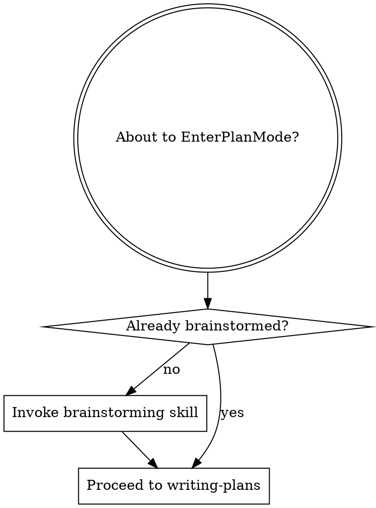

<SUBAGENT-STOP>
If you were dispatched as a subagent to execute a specific task, skip this skill.
</SUBAGENT-STOP>

<EXTREMELY-IMPORTANT>
If you think there is even a 1% chance a skill might apply to what you are doing, you ABSOLUTELY MUST invoke the skill.

IF A SKILL APPLIES TO YOUR TASK, YOU DO NOT HAVE A CHOICE. YOU MUST USE IT.

This is not negotiable. This is not optional. You cannot rationalize your way out of this.
</EXTREMELY-IMPORTANT>

## How to Access Skills

**In Claude Code:** Use the `Skill` tool. When you invoke a skill, its content is loaded and presented to you—follow it directly. Never use the Read tool on skill files.

**In Copilot CLI:** Use the `skill` tool. Skills are auto-discovered from installed plugins. The `skill` tool works the same as Claude Code's `Skill` tool.

**In Gemini CLI:** Skills activate via the `activate_skill` tool. Gemini loads skill metadata at session start and activates the full content on demand.

**In other environments:** Check your platform's documentation for how skills are loaded.

## Platform Adaptation

Skills use Claude Code tool names. Non-CC platforms: see `references/copilot-tools.md` (Copilot CLI), `references/codex-tools.md` (Codex) for tool equivalents. Gemini CLI users get the tool mapping loaded automatically via GEMINI.md.

## Trigger Conditions

This skill MUST be invoked when any of the following occur:

- A new session starts with a technical request
- The user gives a new task or changes topic mid-session
- Any technical work is about to begin without a skill selected
- The user asks "what should I use" or "which workflow"

**Exception:** Micro tasks (typo fix, single variable rename, 1-line config change) can skip the entry sequence entirely. Just do them.

## When the User Names a Specific Skill

If the user's prompt references a skill by name (e.g., "use brainstorming," "use context management," "run verification"), that is a **Skill tool invocation request**:

1. Still complete Entry Sequence steps 1–6 (token-efficiency, staleness check, etc.) — these are always-on prerequisites, not routing.
2. **Invoke the named skill via the `Skill` tool.** Do not re-implement the skill's purpose with ad-hoc agents, manual file reads, or improvised workflows. The skill contains tested, structured logic — use it.
3. Skip complexity classification and routing (step 7) — the user already chose the route.

This is the most common cause of entry sequence bypass: the AI interprets "use X skill" as a goal to achieve creatively rather than as a tool invocation. It is always a tool invocation.

## Instruction Priority (highest to lowest)

1. Explicit user instructions in the current conversation
2. Project-level CLAUDE.md / AGENTS.md
3. Superpowers skill instructions
3. **Default system prompt** — lowest priority

If CLAUDE.md, GEMINI.md, or AGENTS.md says "don't use TDD" and a skill says "always use TDD," follow the user's instructions. The user is in control.

## Core Rule

Before technical execution, select workflow skills explicitly and follow them.

Technical execution includes code edits, debugging, planning, review, test status claims, and branch integration actions.

## Entry Sequence

1. Invoke `token-efficiency` at session start — applies to all sessions, always.
2. **Fresh project gate** — evaluate both conditions in order:
   - The user's request contains creation/build intent: any of "build", "create", "make", "implement", "scaffold", "set up", "write", "generate", "develop", "start"
   - Run a filesystem check: `ls project-map.md 2>/dev/null` — gate only fires if the file does **not** exist

   If both are true, **pause before proceeding** and tell the user exactly this:

   > Before I start: this directory has no memory files set up yet. That matters for how well I perform across sessions.
   >
   > **Without setup, every future session on this project starts from scratch:**
   > - I re-explore the project structure even if I mapped it last session
   > - I re-read files I already understood
   > - I may re-propose approaches that were already tried and rejected
   > - I lose the "why" behind every decision the moment the session ends
   >
   > **A ~30-second setup changes that permanently:**
   > - `git init` — enables staleness tracking so I only re-read files that actually changed *(creates `.git` only, nothing else)*
   > - `project-map.md` — I read this at every future session start instead of re-exploring blind
   > - `session-log.md` — auto-captures what was built and decided, so future sessions start with: *"I see from last session that X was rejected because Y — building with that constraint already applied"* instead of rediscovering it
   >
   > **Set this up before we build, or start immediately?**

   Wait for the user's answer before continuing.
   - **If they confirm:** run `git init --quiet` directly (do not ask again — the user just confirmed), then invoke `context-management` for map generation only. Return to step 3 when done. Note: `context-snapshot.json` will not be created in this session — the context-engine hook already ran at session start before git existed. It will be created on the next session start, provided the session is opened from this project's root directory. If no commits exist yet it will be mostly empty; it populates fully after the first commit.
   - **If they decline:** proceed to step 3.

   **Step 2b — Existing project memory check** (runs only when step 2 did NOT fire):
   If the user's request is non-trivial (not micro) AND `project-map.md` does not exist AND the project has 10+ files:
   - Mention once (do not block): *"Note: this project has no project-map.md. I'll work fine without it, but if you want faster orientation in future sessions, I can generate one after this task. Just say 'map this project'."*
   - Do not repeat this notice in subsequent tasks within the same session.

3. Classify the task as **micro**, **lightweight**, or **full** (see Complexity Classification below).
4. If resuming work from a prior session, read `state.md` if it exists. Before ending any session where significant decisions were made (design choices, rejected approaches, non-obvious constraints discovered), invoke `context-management` to write a `[saved]` entry — even if the work is complete. This is the only mechanism that preserves the "why" across sessions.
5. If `known-issues.md` exists at the project root, read it to avoid rediscovering known error→solution mappings.
6. If `project-map.md` exists at the project root, read it to orient to the project structure without re-globbing or re-reading known files. The map tells you what exists and where — when you need a file's actual content (for modification, comparison, or debugging), read it directly with the Read tool. Staleness is detected automatically by the session-start hook: if the map is stale, a `<project-map-stale>` tag is injected into session context with the mismatched hashes. When you see that tag:
   - **With git:** run `git diff --name-only <map_hash> HEAD` to find changed files. Re-read only those; everything else in the map is still valid. Update the corresponding Key Files entries in `project-map.md` and refresh the git hash and date in the header.
   - **Without git:** compare the map's generation timestamp to the modification time of files listed in the map's Hot Files section. Re-read any that are newer than the map. Then update their Key Files entries and refresh the generation timestamp in the header.
7. Follow the path for the classified complexity level.

## Complexity Classification

Classify every task into one of three levels. Do not invoke a separate skill for this — decide inline.

### Hard overrides — check these first, before anything else

If any of the following are true, classify as **full** immediately — do not evaluate the lightweight criteria:

- The change adds, modifies, or removes a condition, gate, or trigger that determines when behavior fires
- The change affects what the user sees or experiences (excluding cosmetic text changes to existing UI — e.g., updating a label, rewording a message, or changing static copy that doesn't alter flow or behavior)
- The change modifies a file that other components depend on (routing rules, entry sequences, config registries, shared hooks)
- The change introduces a path or outcome that didn't exist before

**When in doubt, classify as full.** An unnecessary brainstorming session costs one extra round. Skipping brainstorming on a task that needed it ships a gap. The asymmetry is not equal — always err toward full.

### Micro (skip everything)
- Typo fix, single variable rename, 1-line config change
- **Action:** Just do it. No skills needed.

### Lightweight (fast path)
All of these must be true:
- Change scope is small (~2 files or fewer)
- No new behavior or architecture change
- No cross-module dependency risk
- No migration or data-shape change

**Before classifying as lightweight:** explicitly state in one sentence why each of the four criteria above is satisfied. Do not assume. If you cannot articulate any one of them clearly, classify as full.

**Action:** Go directly to implementation. Only gate: invoke `verification-before-completion` when done. Skip brainstorming, planning, worktrees, and parallel dispatch.

**Exception:** If a dedicated implementation skill exists for this specific task (check the Routing Guide), invoke it — lightweight skips workflow overhead, not implementation skills.

### Full (complete pipeline)
Anything that doesn't qualify as micro or lightweight.

**Action:** Follow the Routing Guide below for the full skill pipeline.

## EnterPlanMode Intercept

If Claude is about to enter plan mode (`EnterPlanMode`), check whether brainstorming has been completed for the current task:

- **No brainstorming done for this task**: invoke `brainstorming` first — plan mode without a validated design leads to plans built on unexamined assumptions.
- **Brainstorming already completed and design approved**: proceed to plan mode / `writing-plans`.

```dot
digraph planmode_intercept {
    "About to EnterPlanMode?" [shape=doublecircle];
    "Already brainstormed?" [shape=diamond];
    "Invoke brainstorming skill" [shape=box];
    "Proceed to writing-plans" [shape=box];

    "About to EnterPlanMode?" -> "Already brainstormed?";
    "Already brainstormed?" -> "Invoke brainstorming skill" [label="no"];
    "Already brainstormed?" -> "Proceed to writing-plans" [label="yes"];
    "Invoke brainstorming skill" -> "Proceed to writing-plans";
}
```

## Routing Guide

- Uncertain whether work should exist at all: `premise-check` (run before brainstorming or planning)
- Complex decision with unclear options or possible mis-framing: `deliberation` → `brainstorming` → `writing-plans`
- New behavior or architecture (problem is well-framed): `brainstorming` → `writing-plans`
- Plan execution (same session, with optional parallel waves): `subagent-driven-development`
- Plan execution (separate session): `executing-plans`
- Experimental or risky work needing branch isolation: `using-git-worktrees` (run before implementation)
- Bug/test failure: `systematic-debugging` → `test-driven-development`
- Completion claim: `verification-before-completion`
- Branch integration: `finishing-a-development-branch`
- Code review (includes security): `requesting-code-review` / `receiving-code-review`
- Independent parallel tasks outside of plan execution: `dispatching-parallel-agents`
- Cross-session state persistence: `context-management`
- Known issue tracking / save recurring fixes: `error-recovery`
- Code restructuring without behavior change: `refactoring` (lock behavior with tests, then restructure incrementally)
- Performance issues (slow, high memory/CPU, latency): `performance-investigation` (measure → profile → fix → re-measure)
- Dependency updates, security vulnerabilities, migrations: `dependency-management` (audit → assess impact → update incrementally → verify)
- UI/frontend implementation: apply `frontend-design` standards
- CLAUDE.md / AGENTS.md creation or update: `claude-md-creator` (applies at any complexity level — never implement directly)
- *(Internal skills — not directly routed):* `self-consistency-reasoner` is invoked internally by `systematic-debugging` and `verification-before-completion`; do not invoke it directly. `token-efficiency` is always-on and invoked at step 1 of the Entry Sequence.

## Context Hygiene

For subagent handoffs, include only current task scope, constraints, evidence, and references to `state.md` when needed.

Avoid carrying forward long assistant reasoning chains unless they contain required artifacts.

## Structured Output Preference

When output feeds another agent/tool step, prefer JSON or YAML schemas defined by the active skill.

## Red Flags

| Thought | Reality |
|---------|---------|
| "This is just a simple question" | Questions are tasks. Check for skills. |
| "I need more context first" | Skill check comes BEFORE clarifying questions. |
| "Let me explore the codebase first" | Skills tell you HOW to explore. Check first. |
| "I can check git/files quickly" | Files lack conversation context. Check for skills. |
| "Let me gather information first" | Skills tell you HOW to gather information. |
| "This doesn't need a formal skill" | If a skill exists, use it. |
| "I remember this skill" | Skills evolve. Read current version. |
| "This doesn't count as a task" | Action = task. Check for skills. |
| "The skill is overkill" | Simple things become complex. Use it. |
| "I'll just do this one thing first" | Check BEFORE doing anything. |
| "This feels productive" | Undisciplined action wastes time. Skills prevent this. |
| "I know what that means" | Knowing the concept ≠ using the skill. Invoke it. |

If a red flag appears, restart from Entry Sequence.

## Skill Priority

When multiple skills could apply, use this order:

1. **Process skills first** (brainstorming, debugging) - these determine HOW to approach the task
2. **Implementation skills second** (frontend-design, mcp-builder) - these guide execution

"Let's build X" → brainstorming first, then implementation skills.
"Fix this bug" → debugging first, then domain-specific skills.

## Skill Types

**Rigid** (TDD, debugging): Follow exactly. Don't adapt away discipline.

**Flexible** (patterns): Adapt principles to context.

The skill itself tells you which.

## User Instructions

Instructions say WHAT, not HOW. "Add X" or "Fix Y" doesn't mean skip workflows.