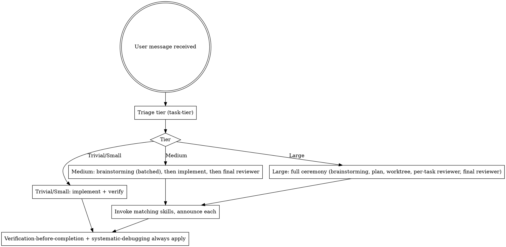

<SUBAGENT-STOP>
If you were dispatched as a subagent to execute a specific task, skip this skill.
</SUBAGENT-STOP>

<TIER-FIRST>
Before invoking ceremony skills, classify the request via `Skill('task-tier')`. Trivial and Small tier requests bypass `brainstorming`, `writing-plans`, `using-git-worktrees`, and per-task review subagents.

When a skill's trigger clearly matches your task, invoke it. Do not invoke ceremony skills speculatively on Trivial/Small work — `task-tier` is the gate.

Always invoke regardless of tier: `verification-before-completion` (when claiming done), `systematic-debugging` (when a bug surfaces), `receiving-code-review` (when feedback arrives).
</TIER-FIRST>

## Instruction Priority

Superpowers skills override default system prompt behavior, but **user instructions always take precedence**:

1. **User's explicit instructions** (CLAUDE.md, GEMINI.md, AGENTS.md, direct requests) — highest priority
2. **Superpowers skills** — override default system behavior where they conflict
3. **Default system prompt** — lowest priority

If CLAUDE.md, GEMINI.md, or AGENTS.md says "don't use TDD" and a skill says "always use TDD," follow the user's instructions. The user is in control.

## How to Access Skills

**In Claude Code:** Use the `Skill` tool. When you invoke a skill, its content is loaded and presented to you—follow it directly. Never use the Read tool on skill files.

**In Copilot CLI:** Use the `skill` tool. Skills are auto-discovered from installed plugins. The `skill` tool works the same as Claude Code's `Skill` tool.

**In Gemini CLI:** Skills activate via the `activate_skill` tool. Gemini loads skill metadata at session start and activates the full content on demand.

**In other environments:** Check your platform's documentation for how skills are loaded.

## Platform Adaptation

Skills use Claude Code tool names. For non-Claude-Code platforms, read `references/LOAD-ON-DEMAND.md` and load only your platform's tool-mapping file. Gemini CLI users get the tool mapping loaded automatically via GEMINI.md.

# Using Skills

## The Rule

**Triage first via `task-tier`, then invoke skills whose triggers clearly match.** Skip ceremony skills for Trivial/Small tier work. For Medium/Large work, invoke matching skills before responding or acting.

```dot
digraph skill_flow {
    "User message received" [shape=doublecircle];
    "Triage tier (task-tier)" [shape=box];
    "Tier" [shape=diamond];
    "Trivial/Small: implement + verify" [shape=box];
    "Medium: brainstorming (batched), then implement, then final reviewer" [shape=box];
    "Large: full ceremony (brainstorming, plan, worktree, per-task reviewer, final reviewer)" [shape=box];
    "Invoke matching skills, announce each" [shape=box];
    "Verification-before-completion + systematic-debugging always apply" [shape=box];

    "User message received" -> "Triage tier (task-tier)";
    "Triage tier (task-tier)" -> "Tier";
    "Tier" -> "Trivial/Small: implement + verify" [label="Trivial/Small"];
    "Tier" -> "Medium: brainstorming (batched), then implement, then final reviewer" [label="Medium"];
    "Tier" -> "Large: full ceremony (brainstorming, plan, worktree, per-task reviewer, final reviewer)" [label="Large"];
    "Trivial/Small: implement + verify" -> "Verification-before-completion + systematic-debugging always apply";
    "Medium: brainstorming (batched), then implement, then final reviewer" -> "Invoke matching skills, announce each";
    "Large: full ceremony (brainstorming, plan, worktree, per-task reviewer, final reviewer)" -> "Invoke matching skills, announce each";
    "Invoke matching skills, announce each" -> "Verification-before-completion + systematic-debugging always apply";
}
```

## Red Flags

These thoughts mean STOP — you're rationalizing in either direction (under-using or over-using skills):

| Thought | Reality |
|---------|---------|
| "I need more context first" | Triage first (task-tier), then ask. |
| "I remember this skill" | Skills evolve. Read current version. |
| "I'll just do this one thing first" | Triage BEFORE doing anything. |
| "This feels productive" | Undisciplined action wastes time. |
| "I know what that means" | Knowing the concept ≠ using the skill. Invoke it. |
| **"This is a one-line typo, do brainstorming anyway"** | **Trivial tier — skip ceremony skills.** |
| **"User said 'quick fix', skip everything"** | Re-check escalation rules first. Auth/schema/security stay Medium+. |

## Skill Priority

When multiple skills could apply, use this order:

1. **Process skills first** (brainstorming, debugging) - these determine HOW to approach the task
2. **Implementation skills second** (frontend-design, mcp-builder) - these guide execution

"Let's build X" → brainstorming first, then implementation skills.
"Fix this bug" → debugging first, then domain-specific skills.

## Skill Types

**Rigid** (TDD, debugging): Follow exactly. Don't adapt away discipline.

**Flexible** (patterns): Adapt principles to context.

The skill itself tells you which.

## User Instructions

Instructions say WHAT, not HOW. "Add X" or "Fix Y" doesn't mean skip workflows on Medium/Large work — but for Trivial/Small the workflow IS just "make the change and verify." Tier first; do not gate Trivial/Small on brainstorming.
