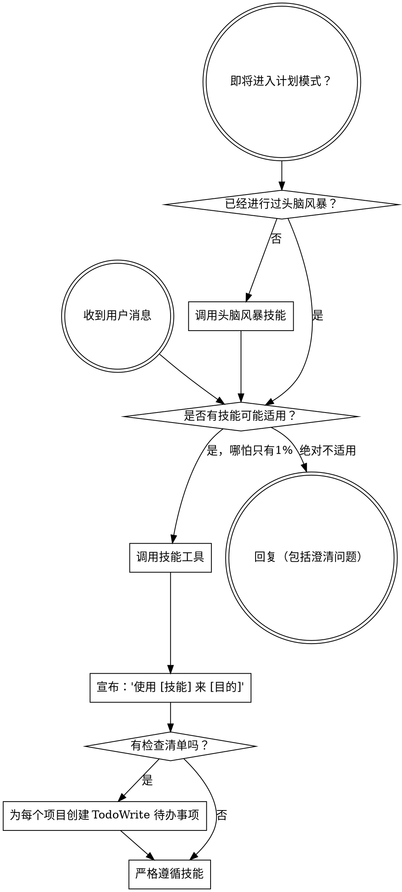

<EXTREMELY-IMPORTANT>
如果你认为某个技能哪怕有1%的可能性适用于你正在做的事情，你绝对必须调用该技能。

如果某个技能适用于你的任务，你没有选择。你必须使用它。

这不可协商。这不是可选的。你不能为自己找借口逃避这一点。
</EXTREMELY-IMPORTANT>

## 如何访问技能

**在 Claude Code 中：** 使用 `Skill` 工具。当你调用一个技能时，其内容会被加载并呈现给你——直接遵循即可。切勿使用 Read 工具读取技能文件。

**在其他环境中：** 请查阅你的平台文档了解技能的加载方式。

# 使用技能

## 规则

**在任何回复或操作之前调用相关或被请求的技能。** 即使某个技能只有1%的可能性适用，你也应该调用该技能进行检查。如果调用后发现该技能不适用于当前情况，你无需使用它。

```dot
digraph skill_flow {
    "收到用户消息" [shape=doublecircle];
    "即将进入计划模式？" [shape=doublecircle];
    "已经进行过头脑风暴？" [shape=diamond];
    "调用头脑风暴技能" [shape=box];
    "是否有技能可能适用？" [shape=diamond];
    "调用技能工具" [shape=box];
    "宣布：'使用 [技能] 来 [目的]'" [shape=box];
    "有检查清单吗？" [shape=diamond];
    "为每个项目创建 TodoWrite 待办事项" [shape=box];
    "严格遵循技能" [shape=box];
    "回复（包括澄清问题）" [shape=doublecircle];

    "即将进入计划模式？" -> "已经进行过头脑风暴？";
    "已经进行过头脑风暴？" -> "调用头脑风暴技能" [label="否"];
    "已经进行过头脑风暴？" -> "是否有技能可能适用？" [label="是"];
    "调用头脑风暴技能" -> "是否有技能可能适用？";

    "收到用户消息" -> "是否有技能可能适用？";
    "是否有技能可能适用？" -> "调用技能工具" [label="是，哪怕只有1%"];
    "是否有技能可能适用？" -> "回复（包括澄清问题）" [label="绝对不适用"];
    "调用技能工具" -> "宣布：'使用 [技能] 来 [目的]'";
    "宣布：'使用 [技能] 来 [目的]'" -> "有检查清单吗？";
    "有检查清单吗？" -> "为每个项目创建 TodoWrite 待办事项" [label="是"];
    "有检查清单吗？" -> "严格遵循技能" [label="否"];
    "为每个项目创建 TodoWrite 待办事项" -> "严格遵循技能";
}
```

## 危险信号

以下想法意味着停下来——你在自我合理化：

| 想法 | 现实 |
|------|------|
| "这只是一个简单的问题" | 问题就是任务。检查是否有技能可用。 |
| "我需要先了解更多上下文" | 技能检查在澄清问题之前。 |
| "让我先探索一下代码库" | 技能会告诉你如何探索。先检查。 |
| "我可以快速查看一下 git/文件" | 文件缺乏对话上下文。检查是否有技能可用。 |
| "让我先收集一些信息" | 技能会告诉你如何收集信息。 |
| "这不需要正式的技能" | 如果技能存在，就使用它。 |
| "我记得这个技能" | 技能会更新迭代。阅读当前版本。 |
| "这不算是一个任务" | 行动 = 任务。检查是否有技能可用。 |
| "这个技能大材小用了" | 简单的事情会变得复杂。使用它。 |
| "让我先做这一件事" | 在做任何事情之前先检查。 |
| "这感觉很有成效" | 不加约束的行动浪费时间。技能可以防止这种情况。 |
| "我知道那是什么意思" | 知道概念 ≠ 使用技能。调用它。 |

## 技能优先级

当多个技能可能适用时，按以下顺序使用：

1. **先使用流程类技能**（头脑风暴、调试）——它们决定如何处理任务
2. **再使用实现类技能**（前端设计、MCP 构建器）——它们指导执行

"让我们构建 X" → 先头脑风暴，再使用实现类技能。
"修复这个 bug" → 先调试，再使用领域特定技能。

## 技能类型

**严格型**（TDD、调试）：严格遵循。不要因适应性调整而丧失纪律性。

**灵活型**（模式）：根据上下文调整原则。

技能本身会告诉你它属于哪种类型。

## 用户指令

指令说明的是做什么，而不是怎么做。"添加 X"或"修复 Y"并不意味着跳过工作流程。
