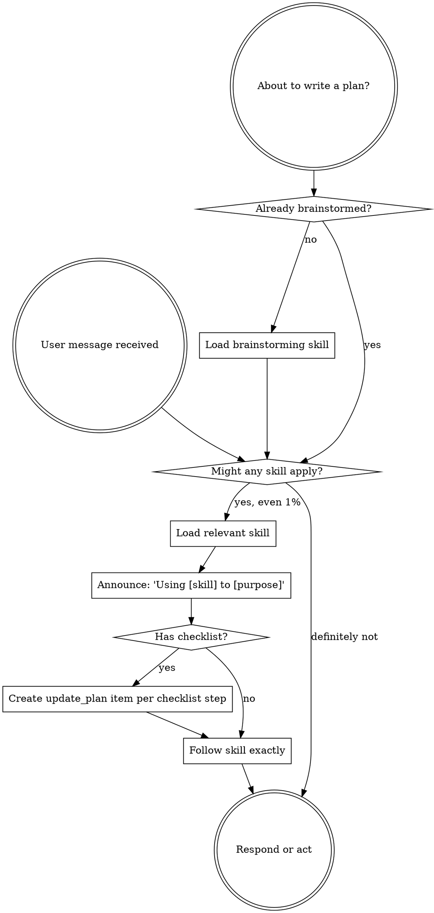

<SUBAGENT-STOP>
If you were dispatched as a subagent to execute a specific task, skip this skill.
</SUBAGENT-STOP>

<EXTREMELY-IMPORTANT>
If you think there is even a 1% chance a skill might apply to what you are doing, you ABSOLUTELY MUST load and follow it.

IF A SKILL APPLIES TO YOUR TASK, YOU DO NOT HAVE A CHOICE. YOU MUST USE IT.

This is not negotiable. This is not optional. You cannot rationalize your way out of this.
</EXTREMELY-IMPORTANT>

## Instruction Priority

Superpowers skills override default Codex behavior, but user instructions always take precedence:

1. User's explicit instructions (`AGENTS.md`, direct requests)
2. Relevant Superpowers skills
3. Default Codex behavior

If `AGENTS.md` or a direct user request says "don't use TDD" and a skill says "always use TDD," follow the user's instructions. The user is in control.

## How Codex Accesses Skills

Codex discovers installed personal skills from `$HOME/.agents/skills`, and teams can also check shared skills into `.agents/skills` inside a repository.

This fork keeps its source skills in `skills/` and exposes them to Codex through the installed Superpowers bundle. Do not assume every repository with Superpowers source files is itself using repo-local `.agents/skills`.

When a relevant skill exists:

- load the current `SKILL.md` content
- follow it directly
- never rely on memory or a stale summary of the skill

## Codex-Native Rule

Do not translate from another platform's tool model.

Use Codex-native mechanisms directly:

- native skill discovery and explicit skill mention
- `update_plan` for checklist tracking
- `spawn_agent` for delegated work
- native file and shell tools for editing and verification

# Using Skills

## The Rule

**Invoke relevant or requested skills BEFORE any response or action.** Even a 1% chance a skill might apply means you must load it and check. If a loaded skill turns out not to apply to the situation, you can stop using it.

```dot
digraph skill_flow {
    "User message received" [shape=doublecircle];
    "About to write a plan?" [shape=doublecircle];
    "Already brainstormed?" [shape=diamond];
    "Load brainstorming skill" [shape=box];
    "Might any skill apply?" [shape=diamond];
    "Load relevant skill" [shape=box];
    "Announce: 'Using [skill] to [purpose]'" [shape=box];
    "Has checklist?" [shape=diamond];
    "Create update_plan item per checklist step" [shape=box];
    "Follow skill exactly" [shape=box];
    "Respond or act" [shape=doublecircle];

    "About to write a plan?" -> "Already brainstormed?";
    "Already brainstormed?" -> "Load brainstorming skill" [label="no"];
    "Already brainstormed?" -> "Might any skill apply?" [label="yes"];
    "Load brainstorming skill" -> "Might any skill apply?";
    "User message received" -> "Might any skill apply?";
    "Might any skill apply?" -> "Load relevant skill" [label="yes, even 1%"];
    "Might any skill apply?" -> "Respond or act" [label="definitely not"];
    "Load relevant skill" -> "Announce: 'Using [skill] to [purpose]'";
    "Announce: 'Using [skill] to [purpose]'" -> "Has checklist?";
    "Has checklist?" -> "Create update_plan item per checklist step" [label="yes"];
    "Has checklist?" -> "Follow skill exactly" [label="no"];
    "Create update_plan item per checklist step" -> "Follow skill exactly";
    "Follow skill exactly" -> "Respond or act";
}
```

If you are about to use `writing-plans`, stop and verify that brainstorming already produced an approved spec. If not, use `brainstorming` first.

## Red Flags

These thoughts mean STOP. You're rationalizing:

| Thought | Reality |
|---------|---------|
| "This is just a simple question" | Questions are tasks. Check for skills. |
| "I need more context first" | Skill check comes BEFORE clarifying questions. |
| "Let me explore the codebase first" | Skills tell you HOW to explore. Check first. |
| "I can check git/files quickly" | Files lack conversation context. Check for skills. |
| "Let me gather information first" | Skills tell you HOW to gather information. |
| "This doesn't need a formal skill" | If a skill exists, use it. |
| "I remember this skill" | Skills evolve. Read the current version. |
| "This doesn't count as a task" | Action = task. Check for skills. |
| "The skill is overkill" | Simple things become complex. Use it. |
| "I'll just do this one thing first" | Check BEFORE doing anything. |
| "This feels productive" | Undisciplined action wastes time. Skills prevent this. |
| "I know what that means" | Knowing the concept is not the same as using the skill. |

## Skill Priority

When multiple skills could apply, use this order:

1. Process skills first (brainstorming, debugging) because they determine how to approach the task
2. Execution skills second (writing-plans, subagent-driven-development, test-driven-development)
3. Domain-specific or support skills last

"Let's build X" means brainstorming first, then execution skills.
"Fix this bug" means debugging first, then domain-specific skills.

## Skill Types

**Rigid** (`test-driven-development`, `systematic-debugging`, `verification-before-completion`): Follow exactly. Do not adapt away the discipline.

**Flexible** (patterns and references): Adapt the principles to the current context.

The skill itself tells you which kind it is.

## Checklist Tracking

If a skill has a checklist, create one `update_plan` item per checklist item before proceeding.

## User Instructions

Instructions say WHAT, not HOW. "Add X" or "Fix Y" does not mean skip workflows.

## Reference

If you need extra repository-specific Codex guidance, read `references/codex-conventions.md`.
