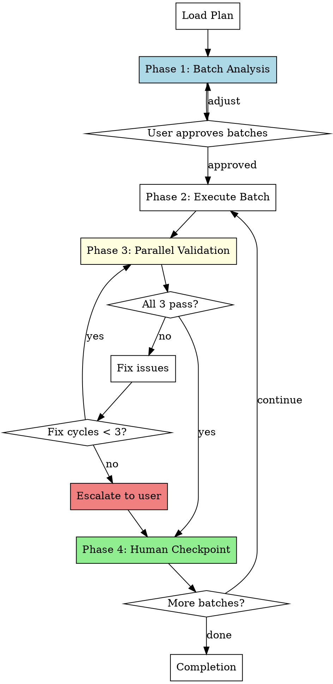

# Validated Batch Development

Execute plans by grouping tasks into buildable batches, then validating each batch in parallel before proceeding.

**Core principle:** Intelligent batching based on buildability + parallel 3-validator dispatch after each batch.

<requirements>
## Requirements

1. Dispatch batch analyzer before execution. Fixed-size batches ignore buildability.
2. Three validators in parallel after each batch. Sequential validation wastes time.
3. Max 3 fix cycles per batch before escalating. Infinite loops degrade quality.
4. Human checkpoint after each batch. EU AI Act requires human oversight.
</requirements>

## When to Use

- Executing implementation plans where buildability matters
- Want parallel validation (build + spec + code review) after each batch
- Prefer speed of parallel validation over sequential human review per task
- Have plans with interdependent tasks that need buildability boundaries

## Arguments

- Plan path: First argument (e.g., `docs/hyperpowers/plans/feature.md`)

## The Process



## Phase 1: Batch Analysis

**Purpose:** Group tasks into batches where each batch leaves the codebase in a buildable, testable state.

### Dispatch Batch Analyzer

```
Task(description: "Analyze plan for batch boundaries",
     prompt: "[Use batch-analyzer-prompt.md template]",
     model: "haiku",
     subagent_type: "general-purpose")
```

**Analyzer Input:**
- Full plan document text
- Project file structure (`tree -L 2`)
- Build system detection (package.json, Cargo.toml, pyproject.toml, etc.)

**Analyzer Output:**
```markdown
## Proposed Batches

### Batch 1 (Tasks 1-3)
- Task 1: Create data model
- Task 2: Add database migration
- Task 3: Implement repository layer
**Rationale:** Creates complete data layer that can be built and tested independently.

### Batch 2 (Tasks 4-5)
- Task 4: Add API endpoint
- Task 5: Add request validation
**Rationale:** Adds HTTP layer on top of data layer.
```

### User Approval Flow

Present proposed batches via AskUserQuestion:

```
AskUserQuestion(
  questions: [{
    question: "Proposed batch boundaries based on buildability. How do you want to proceed?",
    header: "Batches",
    options: [
      {label: "Approve", description: "Accept these batch boundaries"},
      {label: "Adjust", description: "I want to specify different groupings"}
    ],
    multiSelect: false
  }]
)
```

If user selects "Adjust":
- Ask for free-text description of desired changes
- Re-dispatch analyzer with adjustments
- Present new boundaries for approval

<verification>
### Batch Analysis Gate

Before proceeding to execution:

- [ ] Analyzer dispatched with plan + file structure + build system
- [ ] User approved batch boundaries via AskUserQuestion
- [ ] Batches documented in progress file

Proceeding without user-approved batches defeats the intelligent batching purpose.
</verification>

## Phase 2: Execution

**Purpose:** Main agent implements all tasks in the current batch directly.

**Key Principle:** The main agent writes code directly, not through subagents. This preserves:
- Full context across tasks (no context loss from fresh subagents)
- Ability to make cross-task adjustments as implementation reveals issues
- Direct feedback loop between implementation and validation

### Execution Flow

1. Mark batch as in-progress (update TodoWrite)
2. For each task in batch:
   - Mark task as in-progress
   - Implement the task following plan specifications
   - Run task-level tests if specified
   - Mark task as completed
3. When all tasks in batch complete, proceed to validation

### What the Main Agent Does

- Follow plan specifications exactly
- Write tests as part of implementation (when plan includes them)
- Use existing patterns from codebase exploration
- Note any deviations from plan for spec review

### What the Main Agent Does NOT Do

- Dispatch implementation subagents (preserves context)
- Run full build/tests (validation phase handles this)
- Ask user for approval mid-batch (checkpoint is after validation)

### Progress Tracking

Update `docs/hyperpowers/current-progress.md` after each task:

```markdown
## Validated Batch Development Progress

**Plan:** docs/hyperpowers/plans/feature-plan.md
**Status:** Batch 2/4 in progress

### Approved Batches
- Batch 1 (Tasks 1-3): Complete
- Batch 2 (Tasks 4-6): In Progress ← current
- Batch 3 (Tasks 7-8): Pending
- Batch 4 (Tasks 9-10): Pending

### Completed Tasks
- [x] Task 1: Setup project structure
- [x] Task 2: Add base API client
- [x] Task 3: Add error handling

### Current Batch Tasks
- [x] Task 4: Add retry logic ← just completed
- [ ] Task 5: Add rate limiting ← in progress
- [ ] Task 6: Add tests

### Fix Cycles This Batch
0/3

### Discovered Work
- [ ] "Need timeout configuration" (discovered in Task 4)
```

<verification>
### Batch Execution Gate

Before proceeding to validation:

- [ ] All batch tasks executed (not skipped)
- [ ] Progress file updated with completed tasks
- [ ] Discovered work appended (if any found)

Incomplete batch execution produces incomplete validation.
</verification>

## Phase 3: Parallel Validation

**Purpose:** Validate the batch implementation through 3 parallel subagents.

### Parallel Dispatch

All three validators dispatched in a single message for true parallelism:

```
Task(description: "Build + test validation",
     prompt: "[Use build-validator-prompt.md template]",
     model: "haiku",
     subagent_type: "general-purpose")

Task(description: "Spec compliance review",
     prompt: "[Use spec-validator-prompt.md template]",
     model: "haiku",
     subagent_type: "general-purpose")

Task(description: "Code quality review",
     prompt: "[Use code-quality-validator-prompt.md template]",
     model: "haiku",
     subagent_type: "general-purpose")
```

### Validator 1: Build + Tests (haiku)

- Run project build command
- Run test suite
- Report: pass/fail with output
- If fail: list specific errors

### Validator 2: Spec Compliance (haiku)

- Read plan tasks for this batch
- Read implemented code
- Verify: implementation matches spec, nothing extra, nothing missing
- Report: compliant/issues with specific findings

### Validator 3: Code Quality (haiku)

- Review code changes in this batch
- Check: naming, patterns, error handling, maintainability
- Check: OWASP Top 10 security patterns (per Veracode research: 45% AI code fails security)
- Report: clean/issues with specific findings

### Failure Handling

1. Collect all three reports
2. If any issues found:
   - Present consolidated findings to main agent
   - Main agent fixes issues
   - Increment fix cycle counter
   - Re-run ALL THREE validations (full re-validation, not incremental)
3. Repeat until all three pass OR fix cycles >= 3

### 3-Strike Escalation

After 3 fix cycles without all validators passing:

```
AskUserQuestion(
  questions: [{
    question: "3 fix cycles completed but validation still failing. How do you want to proceed?",
    header: "Escalate",
    options: [
      {label: "Continue trying", description: "Reset counter and continue fix cycles"},
      {label: "Skip validation", description: "Proceed to checkpoint with current state"},
      {label: "Stop", description: "Pause execution, I'll investigate"}
    ],
    multiSelect: false
  }]
)
```

<verification>
### Parallel Validation Gate

Before proceeding to human checkpoint:

- [ ] All 3 validators dispatched in SINGLE message (parallel execution)
- [ ] All 3 validators returned results
- [ ] All 3 validators passed OR user chose to skip after escalation
- [ ] Fix cycles <= 3 OR user approved continuation

Sequential validator dispatch serializes execution. Multiple messages = not parallel.
</verification>

## Phase 4: Human Checkpoint

**Purpose:** Present validation results and get user approval or feedback before proceeding.

### Checkpoint Presentation

Display batch completion summary:

```
## Batch N Complete

**Tasks completed:**
- Task 1: [name] ✓
- Task 2: [name] ✓
- Task 3: [name] ✓

**Validation Results:**
- Build + Tests: ✓ Passed
- Spec Compliance: ✓ Approved
- Code Quality: ✓ Clean

**Fix Cycles Used:** 1/3

**Remaining:** X batches, Y tasks
```

### User Options

```
AskUserQuestion(
  questions: [{
    question: "Batch complete and validated. How should I proceed?",
    header: "Continue",
    options: [
      {label: "Continue", description: "Proceed to next batch"},
      {label: "Feedback", description: "I have feedback on this batch"},
      {label: "Pause", description: "Stop here, can resume later"},
      {label: "Stop", description: "Abort remaining work"}
    ],
    multiSelect: false
  }]
)
```

### Feedback Flow

When user selects "Feedback":
1. User provides feedback text
2. Main agent addresses the feedback
3. Re-run all 3 parallel validations (reset fix cycle counter)
4. Present updated checkpoint
5. Repeat until user selects Continue/Pause/Stop

### Iteration Rules

- After "Continue": begin next batch's execution phase
- After "Feedback": address feedback → re-validate → present checkpoint again
- After final batch: proceed to completion phase
- After "Pause"/"Stop": save progress, offer partial commit

<verification>
### Human Checkpoint Gate

After presenting checkpoint:

- [ ] Used AskUserQuestion tool (NOT plain text)
- [ ] Waited for explicit user response via tool
- [ ] Incorporated feedback before next batch (if "Feedback" selected)

Proceeding without AskUserQuestion response bypasses human control.
</verification>

## Resume After Pause

When resuming a paused execution:

### Step 1: Check for Progress File

```bash
cat docs/hyperpowers/current-progress.md 2>/dev/null || echo "No progress file found"
```

### Step 2: If Progress File Exists

Present resume options:

```
AskUserQuestion(
  questions: [{
    question: "Found saved progress: Batch 2/4 complete, 5 tasks done. How do you want to proceed?",
    header: "Resume",
    options: [
      {label: "Continue", description: "Resume from Batch 3"},
      {label: "Re-validate", description: "Re-validate Batch 2 before continuing"},
      {label: "Start fresh", description: "Ignore progress, start from Batch 1"}
    ],
    multiSelect: false
  }]
)
```

### Step 3: If No Progress File

Proceed with Phase 1 (Batch Analysis) as normal.

## Completion

After all batches complete:

### Step 1: Final Verification

Use `hyperpowers:verification-before-completion`:
- Evidence-based completion checklist
- Discovered work offers
- Original issue update offer

### Step 2: Cleanup Transient Files

```bash
rm -f docs/hyperpowers/current-progress.md
```

Note: This file is gitignored.

### Step 3: Finish

Use `hyperpowers:finishing-a-development-branch` skill:
- Offers 4 completion options (merge, PR, continue, stash)
- Issue close offer (if primary issue tracked)
- Worktree cleanup offer (if in worktree)

## Red Flags

| Violation | Consequence | Recovery |
|-----------|-------------|----------|
| Fixed batch sizes (ignoring buildability) | Batches may not build | Re-run batch analyzer |
| Sequential validator dispatch | Wastes time | Dispatch all 3 in single message |
| > 3 fix cycles without escalation | Quality degrades | Escalate to user |
| Skip human checkpoint | Violates oversight requirement | Use AskUserQuestion |
| Implement via subagent | Loses context | Main agent implements directly |
| Plain text questions | No structured response | Use AskUserQuestion |
| Proceeding after "Pause" | Ignores user intent | Wait for resume |

## Integration

**Required workflow skills:**
- **hyperpowers:writing-plans** - Creates the plan this skill executes
- **hyperpowers:verification-before-completion** - Final evidence-based verification
- **hyperpowers:finishing-a-development-branch** - Complete development after all tasks

**Prompt templates (in this directory):**
- `${CLAUDE_SKILL_DIR}/batch-analyzer-prompt.md` - Dispatch batch analyzer subagent
- `${CLAUDE_SKILL_DIR}/build-validator-prompt.md` - Dispatch build+test validator subagent
- `${CLAUDE_SKILL_DIR}/spec-validator-prompt.md` - Dispatch spec compliance validator subagent
- `${CLAUDE_SKILL_DIR}/code-quality-validator-prompt.md` - Dispatch code quality validator subagent

## Comparison with Other Execution Skills

| Aspect | batch-development | subagent-driven | validated-batch |
|--------|-------------------|-----------------|-----------------|
| Batching | Fixed size (N tasks) | Per task | Buildability-based |
| Implementation | Main agent | Subagent per task | Main agent |
| Validation | Human review | Two-stage review | 3 parallel validators |
| Checkpoint | After N tasks | After each task | After each batch |
| Context | Preserved | Fresh per task | Preserved |

<requirements>
## Requirements Reminder

1. Dispatch batch analyzer before execution. Fixed-size batches ignore buildability.
2. Three validators in parallel after each batch. Sequential validation wastes time.
3. Max 3 fix cycles per batch before escalating. Infinite loops degrade quality.
4. Human checkpoint after each batch. EU AI Act requires human oversight.
</requirements>