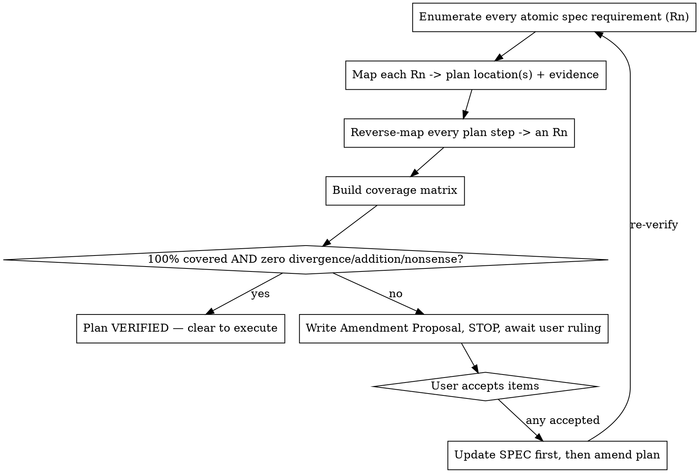

# Verifying Plan Coverage

## Overview

A plan is only as trustworthy as its coverage of the spec. This skill proves a freshly-written plan covers **100%** of its spec with **zero divergence**, and routes every gap, contradiction, or addition to the user as a structured decision — it never silently fixes the plan or the spec.

**Core principle: the spec is the contract. The plan must implement all of it and nothing it didn't agree to. You verify and propose; the user decides; only then do you amend.**

**Violating the letter of the spec is violating the spirit of the spec.** "Close enough," "I'll cover that implicitly," and "this addition is obviously good" are all divergence.

## When to Use

- Right after superpowers:writing-plans writes a plan, before any execution.
- Re-run after every amendment, until the matrix is fully green and no proposal is open.
- Any time you doubt a plan faithfully reflects its spec.

## The Iron Rule

**You do not amend the plan or the spec yourself. You produce a proposal; the user rules on it; then you apply the ruling.**

The baseline failure this skill exists to prevent: a reviewer who spots a gap and immediately rewrites the plan ("Phase 1: change X to Y…"). That hides the decision from the user and lets unapproved scope leak in. Surface it. Stop. Wait.

**This holds even when the gap is "trivial," a one-liner, or a requirement already written verbatim in the spec.** A Missing or Partial item is a *verification failure*, not a typo. "It's already in the spec, so restoring it isn't new scope" is the most seductive version of this failure — and it is still you amending the plan after it failed verification. Silently patching it hides from the user that the plan drifted, and a plan that quietly dropped one "obvious" requirement is evidence it may have misread others. Put it in the proposal. Approval costs the user one word.

**Standing "just fix small stuff yourself" authority does not apply while this skill is in force.** That authority covers prose typos and obvious mechanical edits during normal work. It does not extend to coverage gaps in a plan you are verifying for 100% fidelity: the plan *failed verification*, and whether a gap is "small enough to patch" is exactly the judgment this skill removes from you. Every gap is a proposal item — no size exemption, no source exemption.

## Process



### 1. Enumerate every atomic requirement — exhaustively, not from memory
Read the spec top to bottom and extract EVERY atomic, testable requirement into a numbered list (R1, R2, …). One obligation per line. Include implicit-but-stated constraints (file splits, naming, "no comments", verification gates, done-criteria). Do not skim; do not summarize clusters into one line. This enumeration is the anti-context-pollution mechanism — coverage you can point at, not coverage you feel.

### 2. Map spec → plan (forward)
For each Rn, find where the plan satisfies it. Record the plan location (phase/step) as evidence. Mark status:
- **Covered** — a concrete plan step implements it.
- **Partial** — touched but incomplete (e.g. half a requirement, or "light/dark" reduced to "light").
- **Missing** — no plan step implements it.
- **Divergent** — a plan step contradicts it (does it differently than the spec says).

### 3. Map plan → spec (reverse)
For each plan step, trace it back to an Rn. Flag:
- **Addition** — a plan step not required by any Rn (possible scope creep).
- **Nonsense** — a step that is contradictory, impossible, ordered wrong, or technically doesn't make sense.

### 4. Coverage matrix
Produce the matrix (every Rn with status + evidence) and the reverse-map flags. This is the artifact; it must be complete.

### 5. Verdict
Plan is **VERIFIED** only if: every Rn is **Covered**, and there are **zero** Partial/Missing/Divergent/Addition/Nonsense items. Anything else → not verified.

### 6. If not verified: Amendment Proposal (for the user)
Write a structured proposal and **STOP**. Do not edit the plan or spec. Every Missing/Partial/Divergent/Addition/Nonsense item goes here — including uncontested, mechanical, one-line, or already-in-the-spec gaps. "Uncontested" and "obvious" are not exemptions from the proposal; they are just the items the user approves fastest. Each item is a discrete decision for the user:

```
## Amendment Proposal — <plan> vs <spec>

Coverage: <X/Y requirements fully covered>. Status: NOT VERIFIED.

### A. Missing / Partial coverage (must fix to reach 100%)
- [Rn] <requirement> — not covered by the plan. Proposed plan change: <…>

### B. Divergences (plan contradicts spec)
- [Rn] Spec says <…>; plan does <…>. Resolve by: (a) amend plan to match spec, or (b) change the spec.

### C. Unrequested additions (in plan, not in spec)
- <plan step> — not in spec. Decision: (a) drop from plan, or (b) accept and add to spec as new requirement.

### D. Doesn't make sense
- <plan step> — <why>. Proposed correction: <…>

Each item needs your ruling. On acceptance I update the SPEC first, then amend the plan, then re-verify.
```

### 7. Apply rulings, then re-verify
Only after the user rules: update the **spec first** (so it stays the contract), then amend the plan to match, then return to step 1. Loop until VERIFIED with no open proposal.

## Red Flags — STOP

- You're editing the plan to fix a gap you found → STOP. That's the user's decision. Propose it.
- You're adding a requirement to the spec on your own judgment → STOP. Propose it.
- You enumerated requirements "from what I remember of the spec" → re-read and extract atomically.
- You marked something Covered without a plan-location citation → it's not Covered.
- You collapsed "light and dark" / "A, B and C" into one checkmark → split into separate Rn.
- You're tempted to call 95% "ready to execute" → not verified. 100% or a proposal.
- You're about to patch a gap because "it's already in the spec, so it isn't really an amendment" → STOP. Missing coverage is a proposal item regardless of where it came from.
- You're about to patch a gap because it's "trivial / a one-liner / just a missing test case" → STOP. "Small" is not your call; the plan failed verification. Propose it.
- You're leaning on standing "fix small stuff yourself" authority to skip the proposal → that authority does not cover coverage gaps while this skill is in force.

## Rationalization Table

| Excuse | Reality |
|--------|---------|
| "This gap is minor, I'll just patch the plan" | Patching hides the decision. Surface it; the user owns scope. |
| "This addition is obviously beneficial" | Then it's an easy yes for the user — propose it, don't smuggle it. |
| "I read the spec, I know it's covered" | Reading ≠ enumerating. Extract every Rn and cite plan locations. |
| "The plan captures the spirit" | Letter = spirit. Map each requirement explicitly. |
| "Re-verifying after the amendment is overkill" | Amendments introduce new drift. Loop until clean. |
| "It's a verbatim spec line the plan just dropped — restoring it isn't new scope" | Still a failed-verification finding. Silently restoring it hides that the plan drifted. Propose it; approval is one word. |
| "I have standing authority to fix small things myself" | That covers prose typos, not coverage gaps in a plan under 100%-fidelity verification. The plan failed; "small" isn't your call. |
| "Escalating a one-line uncontested gap is overkill / bugging the user" | The proposal IS the escalation, and it's one line plus "accept?". It preserves the user's view of every drift — the whole point. |

## Output

Always emit: (1) the numbered requirement enumeration, (2) the coverage matrix with evidence, (3) the verdict, and (4) if not verified, the Amendment Proposal. Never emit a silent fix.
