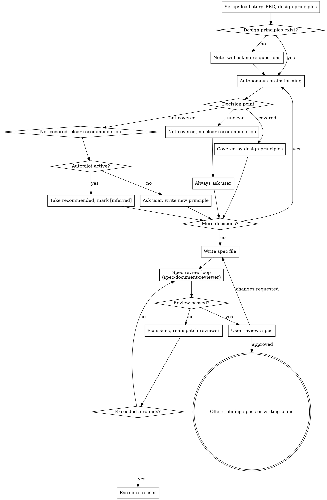

# Write Spec

Autonomous spec generation for a single story, guided by design-principles. Like brainstorming but design-principles-aware — consults established decisions instead of asking the user, only escalating when necessary.

**Core principle:** Consult design-principles first, ask the user only when you must.

**Announce at start:** "I'm using the write-spec skill to generate a spec for this story."

## When to Use

- Have a story definition (GitHub issue, file, or roadmap section)
- Want faster spec generation with fewer interactive questions
- Have design-principles.md from identify-design-principles (optional but recommended)

## When NOT to Use

- No story definition exists — help the user write one first
- Exploring an idea without a defined story — use brainstorming instead
- Need to establish design principles across many stories — use identify-design-principles first

## Graceful Degradation

write-spec works without identify-design-principles having been run. Without design-principles.md, it asks more questions, degrading gracefully to something closer to current brainstorming. It also works with a manually written design-principles.md.

## The Process

You MUST create a task for each phase step and complete in order.



### Step 1: Setup

1. Accept story definition (GitHub issue number, file path, or roadmap section reference)
2. Load story content from the appropriate source
3. Load PRD (auto-detect from `docs/` or ask user)
4. Load `docs/superpowers/design-principles.md` if it exists
5. Scan `docs/superpowers/specs/` for existing spec files matching `*-design.md`. Load all matching specs as contextual background. The skill does not require or use a dependency graph — it loads whatever specs exist to inform its decisions.
6. If design-principles.md doesn't exist, inform user: "No design-principles found. I'll ask more questions as we go. You can run identify-design-principles first if you prefer to establish cross-cutting decisions upfront."

### Step 2: Autonomous Brainstorming

Work through the same stages as the brainstorming skill:
- Purpose and constraints
- Success criteria
- Scope boundaries
- Architecture decisions
- Component design
- Data flow
- Error handling
- Testing strategy

No subagent is dispatched for this phase — the skill's main agent handles it directly.

At each decision point, follow this logic:

**Decision Handling — Three Modes:**

| Scenario | Default Mode | Autopilot Mode |
|----------|-------------|----------------|
| Covered by design-principles | Use it silently | Use it silently |
| Not covered, clear recommendation exists | Ask user; on confirmation write new principle to design-principles.md + check assumption impacts | Take recommended approach, mark as `[inferred]` in spec. Do NOT update design-principles |
| Not covered, no clear recommendation | Always ask user | Always ask user |

**When writing a new principle (default mode, user-confirmed):**
- Decision: from the user's answer
- Context: the story that triggered it
- Assumptions: inferred from the single-story context
- Implications: inferred from the decision
- Note: these will be less comprehensive than principles from identify-design-principles since they derive from single-story context

### Step 3: Autopilot Mode

At any point when the skill asks a question, the user can activate autopilot by expressing intent (e.g., "autopilot for the rest", "just pick the recommended", "go autonomous"). Detect by intent, not literal phrase match.

**On activation, confirm:** "Switching to autopilot — I'll take recommended approaches and mark them as [inferred]. I'll still ask if there's no clear recommendation. OK?"

Upon confirmation:
- Take recommended approach for all subsequent decisions
- Mark these as `[inferred]` in the spec
- Do NOT update design-principles (no human confirmation)
- Exception: still ask the user when there is no clear recommendation

The user can deactivate autopilot by expressing intent to resume manual control. Confirm the mode switch in both directions.

### Step 4: Output

Write spec file to `docs/superpowers/specs/YYYY-MM-DD-<story>-design.md`

### The `[inferred]` Tag

When autopilot takes a recommended approach, mark the decision inline:

```markdown
**Database:** PostgreSQL with row-level security [inferred]
```

The tag appears at the end of any decision line not confirmed by a human. Same convention as refine-specs and refine-plans skills.

### Step 5: Spec Review Loop

Reuse the existing `spec-document-reviewer` from brainstorming:

```
Agent tool:
  subagent_type: "general-purpose"
  prompt: [use skills/brainstorming/spec-document-reviewer-prompt.md template,
    inject {SPEC_FILE_PATH}]
```

When dispatching the reviewer, insert the design-principles block at the top of the `prompt:` value, before the line "You are a spec document reviewer." The injected block reads: "Also verify that spec decisions do not contradict these design principles: {design_principles_content}". This injects design-principles as additional context in the prompt body itself, not as a template parameter — the existing reviewer template is reused without modification.

Iterate until approved (max 5 rounds, then escalate to user).

### Step 6: User Reviews Spec

> "Spec written and committed to `<path>`. `[inferred]` decisions are highlighted for your scrutiny. Please review and let me know if you want changes before we write the implementation plan."

Wait for user response. If changes requested, make them and re-run spec review loop.

After user approves the spec, offer a choice: "Spec approved. Two options: (1) Refine spec — run refining-specs to pressure-test before planning. (2) Generate plan — invoke writing-plans to create the implementation plan. Which approach?"

### Assumption Impact Check

Same mechanism as identify-design-principles. When saving a new principle in default mode:
1. Check all existing principles' Assumptions sections
2. If new decision contradicts an assumption, flag to user
3. Recommend adjustment, user confirms
4. If adjusted, re-run impact check on adjusted principle only (single-pass, one cascade level)
5. Save updated principles together

## Invocation

One story at a time. The user invokes write-spec per story. The skill works through that single story and produces one spec file.

## Context

The skill receives:
- Story definition
- PRD
- `design-principles.md` (if exists)
- Existing specs for dependent stories (if they exist)

**The terminal state is invoking either refining-specs or writing-plans.** After user approves the spec, offer the choice between pressure-testing via refining-specs or proceeding to writing-plans.

## Red Flags

**Never:**
- Skip consulting design-principles when they exist
- Update design-principles in autopilot mode (no human confirmation = no principle update)
- Mark a decision as `[inferred]` in default mode (user confirmed = not inferred)
- Proceed past the spec review loop without approval
- Skip the user review step
- Run autonomous brainstorming without loading available context first

## Remember

- Consult design-principles first — ask users only when you must
- Autopilot means `[inferred]` tags and no principle updates
- Default mode means ask user and write principle on confirmation
- No clear recommendation = always ask, regardless of mode
- Spec reviewer gets design-principles path for contradiction checking
- The terminal state is invoking either refining-specs or writing-plans — offer the user the choice
