# Writing Plans

## Overview

Write comprehensive implementation plans assuming the engineer has zero context for our codebase and questionable taste. Document everything they need to know: which files to touch for each task, code, testing, docs they might need to check, how to test it. Give them the whole plan as bite-sized tasks. DRY. YAGNI. TDD. Frequent commits.

Assume they are a skilled developer, but know almost nothing about our toolset or problem domain. Assume they don't know good test design very well.

**Announce at start:** "I'm using the writing-plans skill. Starting with request clarification to ensure the plan addresses your needs, followed by extensive context gathering across three phases."

**Context:** This should be run in a dedicated worktree (created by brainstorming skill).

**Save plans to:** `docs/plans/YYYY-MM-DD-<feature-name>.md`

## Phase 0: Request Clarification

**Before ANY context gathering, validate the request is clear.**

This phase prevents wasted effort by catching ambiguity early. Codebase exploration uses a single Explore subagent; decision-making and user interaction remain in the orchestrator.

### Clarification Flow

1. **Analyze the request**: Identify goal, scope, success criteria, constraints
2. **Dispatch exploration subagent**: Single Explore subagent (haiku) for 30-second project structure scan
3. **Read exploration findings**: Parse subagent's returned findings (orchestrator writes to handoff file)
4. **Detect ambiguity**: Flag vague terms, missing boundaries, unclear success criteria using exploration context
5. **Ask OR proceed**: Use AskUserQuestion for 2-3 targeted questions if unclear; proceed if clear
6. **Document findings**: Write combined findings to `docs/handoffs/context-clarification.md`

### When to Ask Questions

Ask when request has:

- Multiple valid interpretations
- Vague terms ("improve", "better", "robust")
- No explicit scope boundaries
- Unclear success criteria

Proceed without asking when:

- User explicitly said "don't ask, just plan"
- User provided comprehensive spec document AND you verified it addresses Why/What/Who/Where/When/How
- All Six Questions unambiguously answered in user's request

**Do NOT skip clarification because:**

- "The request seems clear enough" - Simple requests often hide complex requirements
- "I can infer the scope from the codebase" - State assumptions explicitly, don't guess
- "Questions slow things down" - Wrong assumptions waste far more time than 2-3 questions
- "The spec file looks complete" - Verify it explicitly addresses scope/success criteria
- "This is a common pattern" - Common patterns have many valid implementations

### Question Design

- **2-3 questions maximum** - quality over quantity
- **Multiple choice preferred** - reduces cognitive load
- **Context-aware** - reference codebase findings, not generic templates
- **One focus per question** - goal, scope, or constraints

Use template: `./request-clarification-prompt.md`

### Clarification Exploration Subagent

Dispatch a single Explore subagent before asking questions:

- **Type:** `Explore` (read-only, fast)
- **Model:** `haiku` (cheapest, sufficient for structure scanning)
- **Template:** `./clarification-explorer-prompt.md`
- **Dispatch:** Synchronous (wait for results before proceeding)

The subagent returns findings as text. Orchestrator writes findings to `docs/handoffs/context-clarification-exploration.md` then uses them for question design.

**Why subagent?**
- Saves orchestrator credits (exploration runs on cheaper haiku model)
- Keeps orchestrator context clean (search results stay in subagent)
- Follows Phase 1-3 pattern (consistent architecture)

### Output

Write clarification summary to `docs/handoffs/context-clarification.md`. This informs Phase 1 exploration targets.

## Context Gathering Phases

> **IRON LAW: NO PLAN WRITING WITHOUT ALL THREE PHASES COMPLETE**
>
> You cannot write a single line of the implementation plan until:
> 1. Phase 1 complete → `context-codebase-summary.md` exists
> 2. Phase 2 complete → `context-docs-summary.md` exists
> 3. Phase 3 complete → `context-web-summary.md` exists
>
> Violating this rule means deleting any plan content and starting over.

**Before writing ANY plan, complete these three phases:**

### Phase 1: Codebase Exploration (Parallel Subagents)

Dispatch 3-5 parallel subagents to explore code related to the task:

- Each subagent explores one aspect (architecture, similar features, tests, dependencies)
- Subagents return findings as text (Explore has read-only tools)
- Orchestrator writes findings to `docs/handoffs/context-codebase-{aspect}.md`
- Orchestrator reads all handoff files, synthesizes into `docs/handoffs/context-codebase-summary.md`

### Phase 2: Documentation Exploration (Parallel Subagents)

From codebase findings, identify documentation needs, then dispatch parallel subagents:

- Framework/library docs (MCP or WebFetch)
- API references
- Configuration guides
- Subagents write findings to `docs/handoffs/context-docs-{topic}.md`
- Orchestrator synthesizes into `docs/handoffs/context-docs-summary.md`

### Phase 3: Best Practices & Examples (Parallel Web Subagents)

Dispatch parallel subagents to search web for:

- Current best practices for the pattern/approach
- Real-world examples and implementations
- Common pitfalls and solutions
- Subagents write findings to `docs/handoffs/context-web-{topic}.md`
- Orchestrator synthesizes into `docs/handoffs/context-web-summary.md`

**After all three phases:** Read the three summary files and proceed to plan writing.

## Context Gathering Workflow

```dot
digraph context_gathering {
    rankdir=TB;

    subgraph cluster_phase0 {
        label="Phase 0: Clarification";
        "Analyze request" [shape=box];
        "Dispatch exploration subagent" [shape=box];
        "Read exploration findings" [shape=box];
        "Request clear?" [shape=diamond];
        "Ask clarifying questions" [shape=box];
        "Write context-clarification.md" [shape=box];
    }

    subgraph cluster_phase1 {
        label="Phase 1: Codebase";
        "Identify exploration aspects" [shape=box];
        "Dispatch 3-5 parallel Explore subagents" [shape=box];
        "Wait for all to complete" [shape=box];
        "Read handoff files, write codebase-summary.md" [shape=box];
    }

    subgraph cluster_phase2 {
        label="Phase 2: Documentation";
        "From codebase findings, identify doc needs" [shape=box];
        "Dispatch parallel doc explorer subagents" [shape=box];
        "Wait for all to complete 2" [shape=box];
        "Read handoff files, write docs-summary.md" [shape=box];
    }

    subgraph cluster_phase3 {
        label="Phase 3: Best Practices";
        "Identify patterns needing research" [shape=box];
        "Dispatch parallel web research subagents" [shape=box];
        "Wait for all to complete 3" [shape=box];
        "Read handoff files, write web-summary.md" [shape=box];
    }

    "User requests plan" [shape=doublecircle];
    "Read 3 summary files" [shape=box];
    "Write implementation plan" [shape=box];
    "Cleanup handoffs" [shape=box];
    "Plan complete" [shape=doublecircle];

    "User requests plan" -> "Analyze request";
    "Analyze request" -> "Dispatch exploration subagent";
    "Dispatch exploration subagent" -> "Read exploration findings";
    "Read exploration findings" -> "Request clear?";
    "Request clear?" -> "Write context-clarification.md" [label="yes"];
    "Request clear?" -> "Ask clarifying questions" [label="no"];
    "Ask clarifying questions" -> "Write context-clarification.md";
    "Write context-clarification.md" -> "Identify exploration aspects";
    "Identify exploration aspects" -> "Dispatch 3-5 parallel Explore subagents";
    "Dispatch 3-5 parallel Explore subagents" -> "Wait for all to complete";
    "Wait for all to complete" -> "Read handoff files, write codebase-summary.md";
    "Read handoff files, write codebase-summary.md" -> "From codebase findings, identify doc needs";
    "From codebase findings, identify doc needs" -> "Dispatch parallel doc explorer subagents";
    "Dispatch parallel doc explorer subagents" -> "Wait for all to complete 2";
    "Wait for all to complete 2" -> "Read handoff files, write docs-summary.md";
    "Read handoff files, write docs-summary.md" -> "Identify patterns needing research";
    "Identify patterns needing research" -> "Dispatch parallel web research subagents";
    "Dispatch parallel web research subagents" -> "Wait for all to complete 3";
    "Wait for all to complete 3" -> "Read handoff files, write web-summary.md";
    "Read handoff files, write web-summary.md" -> "Read 3 summary files";
    "Read 3 summary files" -> "Write implementation plan";
    "Write implementation plan" -> "Cleanup handoffs";
    "Cleanup handoffs" -> "Plan complete";
}
```



### Subagent Dispatch Guidelines

**Phase 1 - Codebase Exploration:**

- Identify 3-5 aspects relevant to the feature (e.g., "existing auth patterns", "test structure", "related components", "data layer")
- Use `Explore` subagent type with `model: haiku`
- Use template: `./codebase-explorer-prompt.md`

**Phase 2 - Documentation:**

- Based on codebase findings, identify what docs to research
- Use `general-purpose` subagent with `model: haiku`
- Use template: `./docs-explorer-prompt.md`
- Prefer MCP tools when available for specific libraries

**Phase 3 - Best Practices:**

- Identify patterns/approaches that need current best practices research
- Use `general-purpose` subagent with `model: haiku`
- Use template: `./best-practices-explorer-prompt.md`
- Focus on 2024-2025 content for freshness

### Synthesis Between Phases

After each phase completes:

1. Read all handoff files from that phase
2. Write phase summary using template: `./context-synthesis-prompt.md`
3. Use summary to inform next phase's exploration targets

## Pre-Plan Writing Gate

**BEFORE writing ANY plan content, complete this checklist:**

```
[ ] Phase 0: context-clarification.md written
[ ] Phase 1: context-codebase-summary.md written (synthesized from 3-5 aspect files)
[ ] Phase 2: context-docs-summary.md written (synthesized from doc research)
[ ] Phase 3: context-web-summary.md written (synthesized from web research)
[ ] All four summary files READ and incorporated
```

**If ANY checkbox is unchecked:** STOP. Complete the missing phase.

**Verification command:**
```bash
ls docs/handoffs/context-*.md
```

Expected output (4 files minimum):
```
docs/handoffs/context-clarification.md
docs/handoffs/context-codebase-summary.md
docs/handoffs/context-docs-summary.md
docs/handoffs/context-web-summary.md
```

**Skip this gate = plan is invalid.** Delete any plan content and restart from the first incomplete phase.

## Do NOT Skip Context Gathering

| Excuse | Reality |
|--------|---------|
| "I already know this codebase" | You don't have the user's full context. Subagents find what you'd miss. |
| "The request is straightforward" | Straightforward requests hide complex implementation details. |
| "Context gathering takes too long" | Wrong plans waste far more time than thorough research. |
| "I can gather context while writing" | Context-while-writing = shallow research + poor synthesis. |
| "The user wants speed" | Users want correct plans. Fast wrong plans require rewrites. |
| "I'll just do a quick exploration instead" | Inline Glob/Grep ≠ parallel subagent deep-dive. Not equivalent. |
| "Phase 2/3 aren't needed for this" | You don't know what you don't know. All phases reveal blind spots. |
| "I can infer best practices" | Your training data is stale. Web research gets current patterns. |

**If you're thinking any of these:** You're rationalizing. Complete all phases.

## Red Flags - STOP Immediately

You are about to skip context gathering if:

- You're writing plan tasks without summary files open
- You haven't dispatched any subagents yet
- You're using Glob/Grep directly instead of Explore subagents
- You can't name the 3-5 codebase aspects you explored
- You haven't searched any external documentation
- You haven't done any web research for best practices
- Your plan references no specific file paths from exploration
- You're "just going to start with the obvious parts"

**Any of these = STOP.** Return to Phase 1 and complete all phases properly.

## Bite-Sized Task Granularity

**Each step is one action (2-5 minutes):**

- "Write the failing test" - step
- "Run it to make sure it fails" - step
- "Implement the minimal code to make the test pass" - step
- "Run the tests and make sure they pass" - step
- "Commit" - step

## Plan Document Header

**Every plan MUST start with this header:**

```markdown
# [Feature Name] Implementation Plan

> **For Claude:** REQUIRED SUB-SKILL: Use hyperpowers:subagent-driven-development to implement this plan task-by-task.

**Goal:** [One sentence describing what this builds]

**Architecture:** [2-3 sentences about approach]

**Tech Stack:** [Key technologies/libraries]

---
```

**Before writing tasks, review all three context summaries and incorporate:**

- Patterns from codebase exploration
- API details from documentation
- Best practices from web research
- Anti-patterns to avoid

## Task Structure

````markdown
### Task N: [Component Name]

**Files:**

- Create: `exact/path/to/file.py`
- Modify: `exact/path/to/existing.py:123-145`
- Test: `tests/exact/path/to/test.py`

**Step 1: Write the failing test**

```python
def test_specific_behavior():
    result = function(input)
    assert result == expected
```
````

**Step 2: Run test to verify it fails**

Run: `pytest tests/path/test.py::test_name -v`
Expected: FAIL with "function not defined"

**Step 3: Write minimal implementation**

```python
def function(input):
    return expected
```

**Step 4: Run test to verify it passes**

Run: `pytest tests/path/test.py::test_name -v`
Expected: PASS

**Step 5: Commit**

```bash
git add tests/path/test.py src/path/file.py
git commit -m "feat: add specific feature"
```

````

## Remember
- Exact file paths always
- Complete code in plan (not "add validation")
- Exact commands with expected output
- Reference relevant skills with @ syntax
- DRY, YAGNI, TDD, frequent commits

## Execution Handoff

After saving the plan:

**Step 1: Cleanup context gathering files**

Delete all files in `docs/handoffs/` - these are no longer needed once the plan is written:

```bash
rm -rf docs/handoffs/*
````

**Step 2: Announce completion and begin execution**

**"Plan complete and saved to `docs/plans/<filename>.md`. Context gathering files cleaned up. Ready to execute using Subagent-Driven Development."**

After announcing the plan is complete, provide these instructions to the user:

```
To prepare for implementation, compact this conversation:

/compact ready to implement <filename>.md

Then execute the plan:

/hyperpowers:execute-plan <filename>.md
```

**Important:** Replace `<filename>` with the actual plan path (e.g., `/compact ready to implement docs/plans/user-authentication.md` and `/hyperpowers:execute-plan docs/plans/user-authentication.md`).

Then:

- **REQUIRED SUB-SKILL:** Use hyperpowers:subagent-driven-development
- Fresh subagent per task + two-stage code review

## Cleanup

**All handoff files are deleted after the plan is written** (see Execution Handoff above).

The `docs/handoffs/` directory is used only during context gathering. Once the plan is saved to `docs/plans/`, the handoff files serve no purpose:

- Individual explorer findings (`context-codebase-{aspect}.md`, etc.) are intermediate artifacts
- Summary files (`context-*-summary.md`) are synthesized into the plan itself
- All context is captured in the plan document

**Why cleanup immediately?**

- Prevents stale context from affecting future planning sessions
- Aligns with industry best practices: cleanup at terminal state (plan completion)
- Keeps the directory clean for the next planning task
