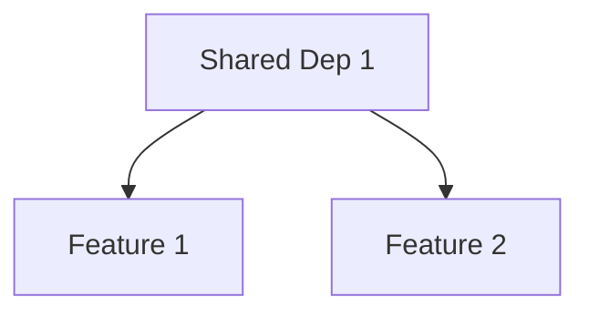

# Writing Plans

## Overview

Write comprehensive implementation plans assuming the engineer has zero context for our codebase and questionable taste. Document everything they need to know: which files to touch for each task, code, testing, docs they might need to check, how to test it. Give them the whole plan as bite-sized tasks. DRY. YAGNI. TDD. Frequent commits.

Assume they are a skilled developer, but know almost nothing about our toolset or problem domain. Assume they don't know good test design very well.

**Announce at start:** "I'm using the writing-plans skill to create the implementation plan."

**Context:** This should be run in a dedicated worktree (created by brainstorming skill).

**Save plans to:** `docs/plans/YYYY-MM-DD-<feature-name>.md`

## Bite-Sized Task Granularity

**Each step is one action (2-5 minutes):**
- "Write the failing test" - step
- "Run it to make sure it fails" - step
- "Implement the minimal code to make the test pass" - step
- "Run the tests and make sure they pass" - step
- "Commit" - step

## Plan Document Header

**Every plan MUST start with this header:**

```markdown
# [Feature Name] Implementation Plan

> **For Claude:** REQUIRED SUB-SKILL: Use superpowers:executing-plans to implement this plan task-by-task.

**Goal:** [One sentence describing what this builds]

**Architecture:** [2-3 sentences about approach]

**Tech Stack:** [Key technologies/libraries]

---
```

## Task Structure

````markdown
### Task N: [Component Name]

**Files:**
- Create: `exact/path/to/file.py`
- Modify: `exact/path/to/existing.py:123-145`
- Test: `tests/exact/path/to/test.py`

**Step 1: Write the failing test**

```python
def test_specific_behavior():
    result = function(input)
    assert result == expected
```

**Step 2: Run test to verify it fails**

Run: `pytest tests/path/test.py::test_name -v`
Expected: FAIL with "function not defined"

**Step 3: Write minimal implementation**

```python
def function(input):
    return expected
```

**Step 4: Run test to verify it passes**

Run: `pytest tests/path/test.py::test_name -v`
Expected: PASS

**Step 5: Commit**

```bash
git add tests/path/test.py src/path/file.py
git commit -m "feat: add specific feature"
```
````

## Remember
- Exact file paths always
- Complete code in plan (not "add validation")
- Exact commands with expected output
- Reference relevant skills with @ syntax
- DRY, YAGNI, TDD, frequent commits

## Multi-Feature Plans

When brainstorming identifies multiple features (multi-feature mode), writing-plans creates separate plans and a coordination manifest. The single-feature path above still applies to each individual plan.

### Plan Structure

For a multi-feature request with N features and M shared dependencies:

```
docs/plans/
  YYYY-MM-DD-<initiative>-manifest.md       # Coordination manifest
  YYYY-MM-DD-<shared-dep-1>.md              # Shared dependency plan
  YYYY-MM-DD-<shared-dep-2>.md              # (if more than one)
  YYYY-MM-DD-<feature-1>.md                 # Feature 1 plan
  YYYY-MM-DD-<feature-2>.md                 # Feature 2 plan
```

Each feature and shared dependency plan follows the same bite-sized task structure described above.

### Coordination Manifest

The manifest defines execution order and worktree-to-plan mapping:

````markdown
# [Initiative Name] Coordination Manifest

> **For Claude:** REQUIRED SUB-SKILL: Use superpowers:executing-plans or superpowers:subagent-driven-development per worktree. The orchestrator sequences deployments per this manifest.

**Features:**
- Feature 1: [name] — `YYYY-MM-DD-<feature-1>.md`
- Feature 2: [name] — `YYYY-MM-DD-<feature-2>.md`

**Shared Dependencies:**
- Dependency 1: [name] — `YYYY-MM-DD-<shared-dep-1>.md`

## Execution Order


```mermaid
graph TD
    dep1[Shared Dep 1] --> feat1[Feature 1]
    dep1 --> feat2[Feature 2]
```

### Phase 1: Shared Dependencies (sequential or parallel if independent)

| Order | Plan | Worktree Branch | Blocked By |
|-------|------|-----------------|------------|
| 1 | shared-dep-1 | feature/shared-dep-1 | — |

### Phase 2: Features (parallel after dependencies distributed)

| Order | Plan | Worktree Branch | Blocked By |
|-------|------|-----------------|------------|
| 2 | feature-1 | feature/feature-1 | shared-dep-1 |
| 2 | feature-2 | feature/feature-2 | shared-dep-1 |

## Dependency Distribution

When a shared dependency completes:
1. Merge its branch into each dependent feature's worktree branch
2. Verify tests pass in each feature worktree after merge
3. Only then proceed with feature implementation

## Integration Order

After all features complete:
1. Merge features into base branch in dependency order (least dependent first)
2. Resolve conflicts at each merge
3. Verify full test suite after final merge
````

### Key Rules for Multi-Feature Plans

- **One agent per worktree.** An agent works on one plan in one worktree. Never assign cross-feature work to a single agent.
- **Shared dependencies first.** The orchestrator must complete and distribute shared dependencies before starting dependent features.
- **Feature plans are independent.** Each feature plan must be self-contained — an agent reading only that plan and working in its worktree should have everything needed.
- **Integration points documented.** Where features interact (e.g., feature B calls an API from feature A), document the contract in both plans so agents implement compatible interfaces.

## Execution Handoff

After saving the plan, offer execution choice:

### Single-Feature Handoff

**"Plan complete and saved to `docs/plans/<filename>.md`. Two execution options:**

**1. Subagent-Driven (this session)** - I dispatch fresh subagent per task, review between tasks, fast iteration

**2. Parallel Session (separate)** - Open new session with executing-plans, batch execution with checkpoints

**Which approach?"**

**If Subagent-Driven chosen:**
- **REQUIRED SUB-SKILL:** Use superpowers:subagent-driven-development
- Stay in this session
- Fresh subagent per task + code review

**If Parallel Session chosen:**
- Guide them to open new session in worktree
- **REQUIRED SUB-SKILL:** New session uses superpowers:executing-plans

### Multi-Feature Handoff

When a coordination manifest exists:

**"Multi-feature plan complete. Manifest and per-feature plans saved to `docs/plans/`. Execution options:**

**1. Orchestrated (this session)** - I act as orchestrator: create worktrees, sequence shared dependencies first, distribute to feature worktrees, then dispatch one agent per feature

**2. Manual coordination** - I save the plans; you manage worktrees and execution order yourself

**Which approach?"**

**If Orchestrated chosen:**
- Create one worktree per shared dependency and per feature (using superpowers:using-git-worktrees)
- Execute shared dependencies first per manifest order, one agent per worktree (using superpowers:subagent-driven-development)
- After each dependency completes, distribute it to dependent feature worktrees (see superpowers:using-git-worktrees dependency distribution)
- Execute features in parallel (one agent per worktree) only after their dependencies are distributed
- After all features complete, integrate per manifest integration order (using superpowers:finishing-a-development-branch per worktree)
