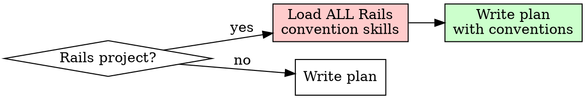

# Writing Plans

## Overview

Write implementation plans as bite-sized tasks. Document which files to touch, what to build, how to test it. DRY. YAGNI. TDD. Frequent commits.

Assume the executor is a skilled developer with access to the codebase and convention skills. They can read existing code, infer patterns, and write idiomatic implementations. They need to know WHAT to build and WHERE, not HOW to write every line.

**Announce at start:** "I'm using the writing-plans skill to create the implementation plan."

## Rails Projects - MANDATORY


```dot
digraph rails_check {
    rankdir=LR;
    check [label="Rails project?", shape=diamond];
    load [label="Load ALL Rails\nconvention skills", shape=box, style=filled, fillcolor="#ffcccc"];
    write [label="Write plan\nwith conventions", shape=box, style=filled, fillcolor="#ccffcc"];
    proceed [label="Write plan", shape=box];

    check -> load [label="yes"];
    check -> proceed [label="no"];
    load -> write;
}
```

**Before writing ANY task code for a Rails project, you MUST load ALL convention skills:**

```
superpowers:rails-controller-conventions
superpowers:rails-model-conventions
superpowers:rails-view-conventions
superpowers:rails-policy-conventions
superpowers:rails-job-conventions
superpowers:rails-migration-conventions
superpowers:rails-stimulus-conventions
superpowers:rails-testing-conventions
```

The executor will load these skills and apply them. Plans reference conventions by name, not by duplicating their content.

| Rationalization | Reality |
|-----------------|---------|
| "I already know Rails conventions" | These are PROJECT conventions. Load them. |
| "I only need controller conventions" | Tasks touch multiple files. Load all. |
| "Too many skills" | ~2500 words total. 10 seconds to load. |

**Context:** This should be run in a dedicated worktree (created by brainstorming skill).

**Save plans to:** `docs/superpowers/plans/YYYY-MM-DD-<feature-name>.md`
- (User preferences for plan location override this default)

## Scope Check

If the spec covers multiple independent subsystems, it should have been broken into sub-project specs during brainstorming. If it wasn't, suggest breaking this into separate plans — one per subsystem. Each plan should produce working, testable software on its own.

## File Structure

Before defining tasks, map out which files will be created or modified and what each one is responsible for. This is where decomposition decisions get locked in.

- Design units with clear boundaries and well-defined interfaces. Each file should have one clear responsibility.
- You reason best about code you can hold in context at once, and your edits are more reliable when files are focused. Prefer smaller, focused files over large ones that do too much.
- Files that change together should live together. Split by responsibility, not by technical layer.
- In existing codebases, follow established patterns. If the codebase uses large files, don't unilaterally restructure - but if a file you're modifying has grown unwieldy, including a split in the plan is reasonable.

This structure informs the task decomposition. Each task should produce self-contained changes that make sense independently.

## Bite-Sized Task Granularity

**Each step is one action (2-5 minutes):**
- "Write the failing test" - step
- "Run it to make sure it fails" - step
- "Implement the minimal code to make the test pass" - step
- "Run the tests and make sure they pass" - step
- "Commit" - step

## Plan Document Header

**Every plan MUST start with this header:**

```markdown
# [Feature Name] Implementation Plan

> **For agentic workers:** REQUIRED: Use superpowers:subagent-driven-development (if subagents available) or superpowers:executing-plans to implement this plan. Steps use checkbox (`- [ ]`) syntax for tracking.

**Goal:** [One sentence describing what this builds]

**Architecture:** [2-3 sentences about approach]

**Tech Stack:** [Key technologies/libraries]

---
```

## Task Structure

````markdown
### Task N: [Component Name]

**Files:**
- Create: `exact/path/to/file.rb`
- Modify: `exact/path/to/existing.rb`
- Test: `spec/exact/path/to/file_spec.rb`

- [ ] **Step 1: Write the failing test**
Test that [specific behavior] works: [describe what to test and key assertions]

- [ ] **Step 2: Run test to verify it fails**
Run: `bundle exec rspec spec/path/file_spec.rb`
Expected: FAIL with "message"

- [ ] **Step 3: Write minimal implementation**
[Describe what to implement — intent-level for routine code, exact code for fragile ops]

- [ ] **Step 4: Run test to verify it passes**
Run: `bundle exec rspec spec/path/file_spec.rb`
Expected: PASS

- [ ] **Step 5: Commit**
```bash
git add [files]
git commit -m "feat: description"
```
````

**When to include exact code in a step:**
- Migrations and data migrations (wrong code = data loss, hard to reverse)
- Destructive operations (rm, DROP, truncate)
- Non-obvious config (cron syntax, external API specifics, env vars, middleware registration)

**When intent is enough:**
- Model validations, associations, scopes
- Controller actions, strong params
- Policy methods
- Job structure
- Test structure (describe what to test, not every line)

## Remember
- Exact file paths always
- Intent-level steps by default ("add presence validation for email", "add index action with search filtering")
- Exact code ONLY for: migrations (including data migrations), destructive operations, non-obvious config (cron syntax, middleware registration, API-specific error handling)
- Exact commands with expected output
- Reference relevant skills with @ syntax
- DRY, YAGNI, TDD, frequent commits

## Plan Review Loop

After completing each chunk of the plan:

1. Dispatch plan-document-reviewer subagent (see plan-document-reviewer-prompt.md) with precisely crafted review context — never your session history. This keeps the reviewer focused on the plan, not your thought process.
   - Provide: chunk content, path to spec document
2. If ❌ Issues Found:
   - Fix the issues in the chunk
   - Re-dispatch reviewer for that chunk
   - Repeat until ✅ Approved
3. If ✅ Approved: proceed to next chunk (or execution handoff if last chunk)

**Chunk boundaries:** Use `## Chunk N: <name>` headings to delimit chunks. Each chunk should be ≤1000 lines and logically self-contained.

**Review loop guidance:**
- Same agent that wrote the plan fixes it (preserves context)
- If loop exceeds 5 iterations, surface to human for guidance
- Reviewers are advisory - explain disagreements if you believe feedback is incorrect

## Execution Handoff

After saving the plan:

**"Plan complete and saved to `docs/superpowers/plans/<filename>.md`. Ready to execute?"**

**Execution path depends on harness capabilities:**

**If harness has subagents (Claude Code, etc.):**
- **REQUIRED:** Use superpowers:subagent-driven-development
- Do NOT offer a choice - subagent-driven is the standard approach
- Fresh subagent per task + two-stage review

**If harness does NOT have subagents:**
- Execute plan in current session using superpowers:executing-plans
- Batch execution with checkpoints for review
