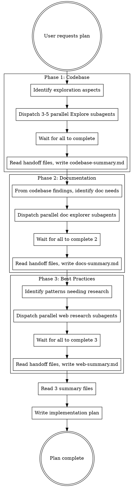

# Writing Plans

## Overview

Write comprehensive implementation plans assuming the engineer has zero context for our codebase and questionable taste. Document everything they need to know: which files to touch for each task, code, testing, docs they might need to check, how to test it. Give them the whole plan as bite-sized tasks. DRY. YAGNI. TDD. Frequent commits.

Assume they are a skilled developer, but know almost nothing about our toolset or problem domain. Assume they don't know good test design very well.

**Announce at start:** "I'm using the writing-plans skill to create the implementation plan."

**Context:** This should be run in a dedicated worktree (created by brainstorming skill).

**Save plans to:** `docs/plans/YYYY-MM-DD-<feature-name>.md`

## Context Gathering Phases

**Before writing ANY plan, complete these three phases:**

### Phase 1: Codebase Exploration (Parallel Subagents)

Dispatch 3-5 parallel subagents to explore code related to the task:
- Each subagent explores one aspect (architecture, similar features, tests, dependencies)
- Subagents write findings to `docs/handoffs/context-codebase-{aspect}.md`
- Orchestrator reads all handoff files, synthesizes into `docs/handoffs/context-codebase-summary.md`

### Phase 2: Documentation Exploration (Parallel Subagents)

From codebase findings, identify documentation needs, then dispatch parallel subagents:
- Framework/library docs (MCP or WebFetch)
- API references
- Configuration guides
- Subagents write findings to `docs/handoffs/context-docs-{topic}.md`
- Orchestrator synthesizes into `docs/handoffs/context-docs-summary.md`

### Phase 3: Best Practices & Examples (Parallel Web Subagents)

Dispatch parallel subagents to search web for:
- Current best practices for the pattern/approach
- Real-world examples and implementations
- Common pitfalls and solutions
- Subagents write findings to `docs/handoffs/context-web-{topic}.md`
- Orchestrator synthesizes into `docs/handoffs/context-web-summary.md`

**After all three phases:** Read the three summary files and proceed to plan writing.

## Context Gathering Workflow



### Subagent Dispatch Guidelines

**Phase 1 - Codebase Exploration:**
- Identify 3-5 aspects relevant to the feature (e.g., "existing auth patterns", "test structure", "related components", "data layer")
- Use `Explore` subagent type with `model: haiku`
- Use template: `./codebase-explorer-prompt.md`

**Phase 2 - Documentation:**
- Based on codebase findings, identify what docs to research
- Use `general-purpose` subagent with `model: haiku`
- Use template: `./docs-explorer-prompt.md`
- Prefer MCP tools when available for specific libraries

**Phase 3 - Best Practices:**
- Identify patterns/approaches that need current best practices research
- Use `general-purpose` subagent with `model: haiku`
- Use template: `./best-practices-explorer-prompt.md`
- Focus on 2024-2025 content for freshness

### Synthesis Between Phases

After each phase completes:
1. Read all handoff files from that phase
2. Write phase summary using template: `./context-synthesis-prompt.md`
3. Use summary to inform next phase's exploration targets

## Bite-Sized Task Granularity

**Each step is one action (2-5 minutes):**
- "Write the failing test" - step
- "Run it to make sure it fails" - step
- "Implement the minimal code to make the test pass" - step
- "Run the tests and make sure they pass" - step
- "Commit" - step

## Plan Document Header

**Every plan MUST start with this header:**

```markdown
# [Feature Name] Implementation Plan

> **For Claude:** REQUIRED SUB-SKILL: Use superpowers:subagent-driven-development to implement this plan task-by-task.

**Goal:** [One sentence describing what this builds]

**Architecture:** [2-3 sentences about approach]

**Tech Stack:** [Key technologies/libraries]

---
```

## Task Structure

```markdown
### Task N: [Component Name]

**Files:**
- Create: `exact/path/to/file.py`
- Modify: `exact/path/to/existing.py:123-145`
- Test: `tests/exact/path/to/test.py`

**Step 1: Write the failing test**

```python
def test_specific_behavior():
    result = function(input)
    assert result == expected
```

**Step 2: Run test to verify it fails**

Run: `pytest tests/path/test.py::test_name -v`
Expected: FAIL with "function not defined"

**Step 3: Write minimal implementation**

```python
def function(input):
    return expected
```

**Step 4: Run test to verify it passes**

Run: `pytest tests/path/test.py::test_name -v`
Expected: PASS

**Step 5: Commit**

```bash
git add tests/path/test.py src/path/file.py
git commit -m "feat: add specific feature"
```
```

## Remember
- Exact file paths always
- Complete code in plan (not "add validation")
- Exact commands with expected output
- Reference relevant skills with @ syntax
- DRY, YAGNI, TDD, frequent commits

## Execution Handoff

After saving the plan, announce completion and begin execution:

**"Plan complete and saved to `docs/plans/<filename>.md`. Ready to execute using Subagent-Driven Development."**

Then:
- **REQUIRED SUB-SKILL:** Use superpowers:subagent-driven-development
- Stay in this session
- Fresh subagent per task + two-stage code review
