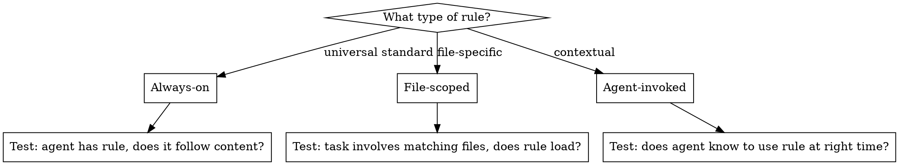
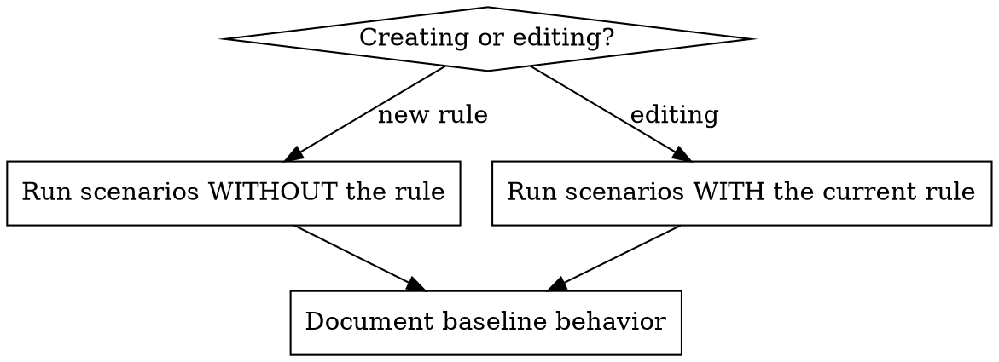

# Writing Agent Rules (TDD)

## Overview

**Writing agent rules IS Test-Driven Development applied to agent configuration.**

Rules live in the project's rules directory as markdown files with YAML frontmatter. You write test scenarios (subagent tasks), watch them fail or pass (baseline behavior), write the rule, verify agents comply, and close loopholes.

**Core principle:** If you didn't observe agent behavior before your change, you don't know if the rule teaches the right thing.

## What is an Agent Rule?

A markdown file with YAML frontmatter that configures agent behavior. Rules are **project-specific conventions** that shape how agents work in this codebase.

**Rules are:** Project conventions, coding standards, agent behavior constraints, tool preferences, workflow patterns

**Rules are NOT:** Reusable cross-project techniques (those are skills)

## Rule Types and How to Test Each



### Always-On Rules

Loaded in every conversation. Test whether the agent **follows the content**, not whether it "sees" the rule.

```yaml
---
description: Core coding standards
# platform-specific field to enable always-on loading
---
```

**Test approach:** Give natural coding tasks; check if output matches rule conventions.

### File-Scoped Rules

Loaded when matching files are in scope. Test with tasks that involve those file types.

```yaml
---
description: TypeScript conventions
# platform-specific field for file glob pattern, e.g. "**/*.ts"
---
```

**Test approach:** Give tasks involving matching files; check if rule content is applied.

### Agent-Invoked Rules

No always-on or file-scoping configured. Agent must decide to load them. Test whether agent discovers and applies them.

```yaml
---
description: Migration guide for legacy tables
---
```

**Test approach:** Give tasks where rule is relevant; check if agent finds and uses it.

## The Iron Law

```
NO RULE CHANGE WITHOUT BASELINE TESTING FIRST
```

This applies to NEW rules AND EDITS to existing rules.

Write rule before testing baseline? Delete it. Start over.
Edit rule without testing the current version first? Revert. Start over.

**No exceptions:**
- Not for "obvious conventions"
- Not for "just adding an example"
- Not for "minor wording changes"
- Delete means delete

## RED Phase — Baseline Testing

**Goal:** Run realistic task scenarios with subagents against the **current state** of the rule (or its absence for new rules). This captures the "before" snapshot that your change must improve.

### New Rule vs. Editing an Existing Rule



**New rule:** Run scenarios without it. Does the agent already do the right thing? If yes, you may not need the rule.

**Editing a rule:** Run scenarios with the current version. Where does it fall short? Those gaps are what your edit must fix.

### The Observer Bias Problem

**CRITICAL:** Never contaminate test prompts with rule awareness.

| Contaminated Prompt | Clean Prompt |
|---------------------|--------------|
| "Create a component following our styling rules" | "Create a card component with a shadow and blue heading" |
| "Write a test. Check the testing rules for patterns" | "Write a test for the UserProfile component" |
| "Which rule files did you consult?" | *(ask this as a post-hoc follow-up after task is done, never in the original prompt)* |
| "Make sure to follow our API conventions" | "Add an endpoint that returns paginated user records" |

**Why this matters:** Asking "which rules did you use?" primes the agent to go look for rules. This changes the result. You are testing natural behavior, not prompted behavior.

### How to Write Test Scenarios

Write prompts exactly as a user would — natural task descriptions with no hints about rules, conventions, or rule files.

**Good scenarios for each rule type:**

**Always-on (e.g., agent-behavior rule):**
```
Create a detailed plan for adding a new analytics dashboard page
with charts, filters, and data export.
```
*(Tests if agent follows planning conventions without being told to)*

**File-scoped — frontend (e.g., styling rule for *.tsx):**
```
Build a notification banner component with a dismiss button,
warning/error/info variants, and a subtle shadow.
```
*(Tests if styled-components, design tokens, and component library are used)*

**File-scoped — backend (e.g., api-conventions rule for *.py):**
```
Add a REST endpoint that returns paginated user records
with filtering by status and sorting by created date.
```
*(Tests if pagination pattern, error responses, and logging conventions are followed)*

**Agent-invoked:**
```
Refactor this legacy database query module to use the new
ORM patterns we've been adopting across the project.
```
*(Tests if agent discovers the migration guide rule)*

### How to Analyze Results

**All three checks are required.** No single check is sufficient on its own.

**1. Transcript inspection (did the rule load?):**
- Search the subagent transcript for `Read` tool calls on rule files
- Check if the specific rule file was read
- For always-on rules: rule is always present, so check if *referenced* sub-rules were loaded

**2. Follow-up question (which rules were used?):**
After the subagent completes its task, **resume the same subagent** and ask which rule files it read and how they influenced its output. This is safe because the work is already done — the follow-up cannot contaminate the original behavior. It gives you accurate self-reporting to cross-reference with the transcript.

**3. Output quality — per-convention violation audit:**

**CRITICAL: Do not eyeball the output. Enumerate every convention in the rule first, then check each one explicitly.**

**Step 1 — Build the convention checklist.**
Before looking at the subagent output, extract every enforceable rule point from the rule file into a numbered list. Include sub-bullets and negative constraints ("never use raw hex"). Example for a styling rule:

```
1. styled-components only — no CSS files, no inline styles
2. Foundation components (Flex/Stack/Text) for layout-only elements
3. Custom styled-component for any visual property (background, border, shadow, border-radius)
4. Colors: always design tokens — never raw hex/RGB
5. Typography: Text component or typography mixin — never hardcoded font-size
6. Prefer @acme/ui-components over custom implementations
7. Flex source: @acme/ui-components/foundations — never legacy/StyledFlex
8. Workaround components: separate file with comment, not inlined in config files
```

**Step 2 — Check each convention against the output.**
Go line by line in the subagent's output. For each convention:
- ✅ **Compliant** — the output follows it
- ❌ **Violated** — the output breaks it; document the exact line(s) that violate it
- ⚠️ **Ambiguous** — the output is inconsistent or hedges between options; this counts as a soft RED

**Step 3 — Document violations explicitly.**
For each violation or ambiguity, write:
```
Convention N violated: [exact rule text]
Agent output: [quote the offending code or decision]
Why wrong: [why this breaks the rule]
```

Example:
```
Convention 7 violated: "Flex source must be @acme/ui-components/foundations"
Agent output: import { FlexRow } from "legacy/StyledFlex/src/StyledFlex";
Why wrong: FlexRow is from the legacy StyledFlex package, not the Foundation library.

Convention 8 ambiguous: "Workaround components go in separate file"
Agent output: "You could put it inline in config.tsx, or in DataTable.styled.ts"
Why wrong: Agent hedged between two wrong locations instead of creating a components/ file.
```

**Why all three:** An agent might produce correct output by coincidence (good general knowledge) without reading the rule — that's a RED, not a pass. Conversely, an agent might read the rule but misapply it — that's a different kind of RED. The follow-up question catches cases where transcript inspection is ambiguous (e.g., always-on rules that are injected rather than explicitly read).

### Honest Reporting

Not every scenario will fail. **If baseline already passes (rule read AND output correct for every convention), mark it GREEN and move on.**

| Scenario | Rule Read? | Per-Convention Audit | Result | Action |
|----------|-----------|----------------------|--------|--------|
| Agent reads rule and follows all conventions | Yes | All ✅ | GREEN | Skip — no fix needed |
| Agent produces correct output without reading rule | No | All ✅ | RED | Rule failed to load — correct output is coincidental |
| Agent reads rule but violates one or more conventions | Yes | Some ❌ | RED | Rule content is unclear for violated conventions |
| Agent hedges or is inconsistent on a convention | Any | Some ⚠️ | RED (soft) | Rule lacks clarity; agent fell back to guessing |
| Agent ignores rule entirely | No | All ❌ | RED | Address in GREEN phase |

**Ambiguous ("⚠️ Ambiguous") output is always RED.** If the agent presented two or more options and couldn't decide, the rule failed to give clear direction. Do not accept hedging as compliance.

**If a rule should be read, it must be read.** Correct output without rule loading is a false positive — the agent happened to know the convention from training, not from your rule. That means your rule isn't working for that scenario.

**Do not invent problems.** The point is to find real gaps, not justify writing the rule.

## GREEN Phase — Write or Edit the Rule

Address **only** the specific failures observed in RED. Don't add content for hypothetical cases.

**New rule:** Create the rule file addressing the RED scenarios.
**Editing a rule:** Modify the existing rule file to fix the gaps found in RED.

### Rule File Structure

```markdown
---
description: Brief description (shown in rule picker)
# platform-specific scoping fields go here
---

# Rule Title

Content with concrete examples...
```

### Frontmatter Fields

| Field | Type | When to Use |
|-------|------|-------------|
| `description` | string | Always — what the rule does |
| file-scoping field | string | File-specific rules only (platform-specific field name) |
| always-on field | boolean | Universal standards only (platform-specific field name) |

### Writing Effective Rule Content

**Concrete examples beat abstract instructions:**

```markdown
# ❌ BAD: Abstract
Use proper error handling patterns.

# ✅ GOOD: Concrete (frontend)
## Error Handling
\`\`\`typescript
// ❌ BAD
try { await fetchData(); } catch (e) {}

// ✅ GOOD
try {
  await fetchData();
} catch (e) {
  logger.error('Failed to fetch', { error: e });
  throw new DataFetchError('Unable to retrieve data', { cause: e });
}
\`\`\`

# ✅ GOOD: Concrete (backend)
## API Responses
\`\`\`python
# ❌ BAD
return {"error": "something went wrong"}

# ✅ GOOD
raise HTTPException(
    status_code=422,
    detail={"code": "INVALID_DATE_RANGE", "message": "end_date must be after start_date"},
)
\`\`\`
```

**Cross-reference other rules** using platform-specific link syntax where available (see the platform appendix below). These allow agents to discover and load referenced rules.

```markdown
# Related Rules
- [API Conventions](api-conventions) - Endpoint patterns and error responses
```

### Quality Targets

- Under 500 lines (ideally under 100)
- One concern per rule file
- Concrete code examples with bad/good comparisons
- No narrative — just conventions and examples

### Verify GREEN

Re-run **ALL scenarios from the RED phase** (not just the ones that failed) with the new/updated rule in place. Use the same clean prompts, no rule hints. Apply the same analysis and compare before and after.

**Why all scenarios, not just RED ones?** Adding rule content can cause regressions — the agent might over-apply new guidance to scenarios that previously passed. You must verify no regressions.

For each scenario, apply the **same per-convention audit from the RED phase**:

1. **Transcript:** Did the agent read the rule file? Cite the specific `Read` tool call. Did it read any sub-rules referenced via cross-reference links?
2. **Per-convention audit:** Use the same numbered checklist you built in RED. For each convention mark ✅, ❌, or ⚠️. The output must be **unambiguous** — if the agent still hedges between options, that convention is not fixed.
3. **Compare to RED baseline:** For every previously-RED convention, did it flip to ✅? For every previously-GREEN convention, did it stay ✅?
4. **No new violations:** Did fixing one convention introduce a violation of another?

**Document the before/after explicitly.** Do not say "the output is better." Write the same violation format as RED:

```
Convention 7: RED → GREEN ✅
  Before: used FlexRow from legacy/StyledFlex
  After:  used Flex from @acme/ui-components/foundations

Convention 8: RED → GREEN ✅
  Before: hedged between inline config and .styled.ts
  After:  created components/CustomCell.tsx with workaround comment
```

A scenario is GREEN only when:
- The rule was read (confirmed via transcript)
- Every previously-RED convention is now ✅ in the output
- No previously-GREEN convention regressed to ❌ or ⚠️
- The agent made no ambiguous decisions about any convention in the rule

If any convention is still ⚠️ (agent hedged or was inconsistent), the rule content is still unclear for that point — revise and re-test.

## REFACTOR Phase — Close Loopholes

If agents find workarounds or new violations despite the rule:

1. **Capture the specific violation** — what did the agent do wrong?
2. **Add explicit counter** — forbid the specific workaround
3. **Add bad/good example** — make it concrete
4. **Re-test** — same clean prompts

**Keep iterating until no new violations appear.**

## Rule Creation/Editing Checklist

**IMPORTANT: Use TodoWrite to create todos for EACH item below.**

**RED Phase — Baseline (before your change):**
- [ ] Write 3+ natural task scenarios (no rule hints)
- [ ] Run scenarios with readonly subagents (against current state or absence of rule)
- [ ] Resume each subagent to ask which rules it used (safe post-hoc follow-up)
- [ ] **Build per-convention checklist** from every enforceable point in the rule
- [ ] **Audit each convention** in subagent output: mark ✅ compliant, ❌ violated, ⚠️ ambiguous/hedging
- [ ] **Document violations explicitly** (convention N, offending code quote, why wrong)
- [ ] Mark each scenario RED (any ❌ or ⚠️) or GREEN (all ✅ AND rule was read) honestly

**GREEN Phase — Apply change (only for RED scenarios):**
- [ ] Create or edit rule file with correct frontmatter (`description` plus platform-specific scoping fields)
- [ ] Concrete bad/good code examples for each RED convention (not just each RED scenario)
- [ ] Under 500 lines, one concern per rule
- [ ] Cross-references to related rules where appropriate (using platform-specific link syntax)
- [ ] Re-run ALL scenarios (not just RED) with new/updated rule
- [ ] **Re-apply per-convention audit** for every scenario using the same checklist
- [ ] **Document before/after** for each previously-RED convention — confirm it flipped to ✅
- [ ] **Verify no regressions** — previously-GREEN conventions still ✅, no new ⚠️ introduced

**REFACTOR Phase:**
- [ ] Identify any remaining violations
- [ ] Add explicit counters for each
- [ ] Re-test until clean

## Common Mistakes

### Contaminating test prompts
Mentioning rules, conventions, or rule files in subagent prompts. This primes the agent to seek out rules and changes the result.
**Fix:** Write prompts as a real user would — just the task, nothing meta.

### Fixing GREEN scenarios
A scenario already passes in RED. You "fix" it anyway by adding redundant content to the rule.
**Fix:** If it's GREEN, skip it. Only address actual failures.

### Abstract instructions without examples
"Use proper patterns" teaches nothing. Agents need concrete bad/good comparisons.
**Fix:** Every convention needs a code example showing what NOT to do and what TO do.

### Overstuffing a single rule file
Cramming styling, testing, API patterns, and TypeScript conventions into one file.
**Fix:** One concern per rule. Split and cross-reference using platform-specific link syntax.

### Not testing before AND after edits
Editing a rule without capturing baseline behavior first, or not re-testing after the change.
**Fix:** Every edit gets a full cycle — test current version (RED), apply change (GREEN), verify improvement by comparing before/after.

### Accepting "correct output without rule read" as a pass
The agent produces good code but never loaded the rule. You mark it as "Soft GREEN" and move on. This is a false positive — the agent used training knowledge, not your rule.
**Fix:** If the rule should be read for that scenario, it must be read. Correct output without rule loading is RED.

### Sloppy transcript analysis
Claiming the rule was "mentioned" or "referenced" without specific evidence. Saying the agent "acknowledged" the rule when the transcript shows nothing.
**Fix:** Only claim "rule was read" if you find a specific Read tool call on the exact file in the transcript. Quote the evidence.

### Eyeballing instead of auditing per-convention
Reading the subagent output holistically and concluding "looks right." This causes violations to slip through — especially for conventions that are easy to miss (wrong import source, wrong file location, a single wrong token choice).
**Fix:** Before reading the output, write out every enforceable convention as a numbered list. Then check each one individually. A violation of convention 7 can coexist with correct output on conventions 1-6 and 8 — holistic review misses it every time.

### Accepting hedging as compliance
The agent said "you could do X or Y" or "either approach works." You count this as GREEN because the output contains correct code somewhere.
**Fix:** Ambiguous output is always RED. The rule failed to give clear direction. If the agent couldn't decide, add an explicit ruling to the rule and re-test.

### Only re-running RED scenarios in GREEN phase
Skipping previously-GREEN scenarios when verifying after a rule change. Rule additions can cause regressions.
**Fix:** Re-run ALL scenarios from RED phase, not just the ones that failed.

## Anti-Patterns

### ❌ Rule-aware test prompts
"Create a component following our styling rule conventions" — tests prompted compliance, not natural behavior.

### ❌ Self-report in the original prompt
"Which rules did you use?" in the task prompt — changes the experiment by priming the agent to look for rules. (Post-hoc follow-up via resume is fine because the work is already done.)

### ❌ Narrative rules
"We decided in Q3 2024 that..." — rules should be conventions and examples, not history.

### ❌ Duplicate content across rules
Same pattern documented in multiple rule files — use cross-references instead.

## Quick Reference

| Aspect | Approach |
|--------|----------|
| **Test prompts** | Natural user tasks, zero rule hints |
| **Analysis method** | Transcript inspection + post-hoc follow-up question + output quality |
| **New rule RED** | Run scenarios without the rule |
| **Editing rule RED** | Run scenarios with the current rule version |
| **Always-on rules** | Test if content is followed |
| **File-scoped rules** | Test with tasks involving matching files |
| **Agent-invoked rules** | Test if agent discovers and applies them |
| **GREEN already?** | Skip it — don't invent problems |
| **Rule not read but output correct?** | RED — correct output without rule loading is a false positive |
| **Verify GREEN** | Re-run ALL scenarios (not just RED) after change, compare before/after |
| **Cross-references** | Use platform-specific link syntax where available |
| **Rule size** | Under 500 lines, one concern per file |
| **Examples** | Always concrete bad/good code comparisons |

## Cursor

Cursor stores rules in `.cursor/rules/` as `.mdc` files.

### Frontmatter Fields

| Field | Type | When to Use |
|-------|------|-------------|
| `description` | string | Always — shown in rule picker |
| `globs` | string | File-scoped rules (e.g. `**/*.ts`) |
| `alwaysApply` | boolean | Always-on rules loaded in every conversation |

### Glob Loading Behavior

Glob-scoped rules load when matching files are **open or being edited** in the IDE. Test with tasks that open those file types.

### `mdc:` Cross-Reference Links

Cursor natively resolves `mdc:` links — agents can follow them to discover and load referenced rules:

```markdown
# Related Rules
- [API Conventions](mdc:api-conventions.mdc) - Endpoint patterns and error responses
```

These are not decorative markdown — they are first-class references that agents use to navigate the rule graph.
