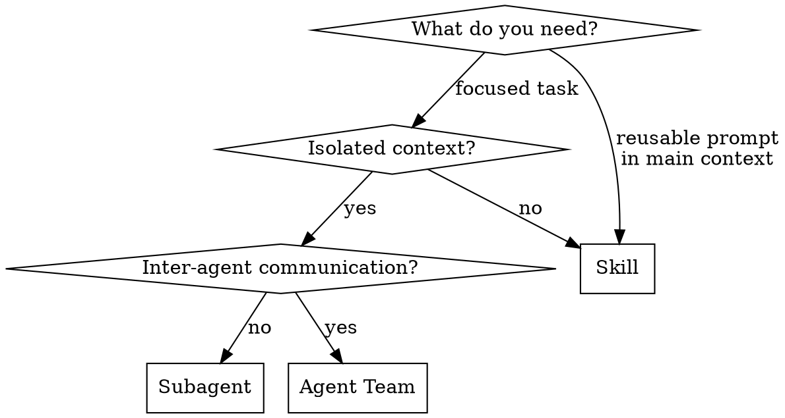

# Writing Subagents

## Overview

Subagents are specialized AI assistants that run in isolated context windows with custom prompts, tool restrictions, and independent permissions. They preserve main conversation context by handling focused tasks separately and returning summaries.

**Core principle:** Each subagent should excel at one specific task with the minimum tools required.

**Key constraint:** Subagents cannot spawn other subagents. For nested delegation, chain subagents from the main conversation or use skills.

## When to Use



| Choose | When |
|--------|------|
| **Subagent** | Verbose output, enforced tool restrictions, self-contained work |
| **Skill** | Reusable prompt running in main conversation context |
| **Agent Team** | Multiple workers communicating, sustained parallelism, cross-layer coordination |

## Quickstart

**Interactive:** `/agents` → Create new agent → choose scope → configure

**Manual:** Create a markdown file with YAML frontmatter + system prompt body:

```markdown
---
name: my-agent
description: When Claude should delegate to this agent
tools: Read, Grep, Glob
model: sonnet
---

System prompt goes here. The subagent receives ONLY this prompt
(plus basic environment details), not the full Claude Code system prompt.
```

**CLI (ephemeral):**

```bash
claude --agents '{
  "my-agent": {
    "description": "When to use this agent",
    "prompt": "System prompt here",
    "tools": ["Read", "Grep", "Glob"],
    "model": "sonnet"
  }
}'
```

## Scope and Priority

| Priority | Location | Scope | Survives sessions |
|:--------:|----------|-------|--------------------|
| 1 | `--agents` CLI flag | Current session only | No |
| 2 | `.claude/agents/` | Current project | Yes (check into VCS) |
| 3 | `~/.claude/agents/` | All your projects | Yes |
| 4 | Plugin `agents/` dir | Where plugin enabled | Yes |

Higher priority wins when names collide. Project agents are ideal for team-shared configs. User agents are personal defaults.

## Configuration Reference

### Required Fields

| Field | Description |
|-------|-------------|
| `name` | Unique identifier — lowercase letters and hyphens |
| `description` | When Claude should delegate. Drives routing decisions |

**Description MUST describe triggering conditions, not capabilities.** Claude reads descriptions to decide when to delegate. Include "Use proactively" for agents that should run without being asked.

### Capability Fields

| Field | Default | Description |
|-------|---------|-------------|
| `tools` | Inherit all | Allowlist — restricts to only these tools |
| `disallowedTools` | None | Denylist — removed from inherited or specified set |
| `model` | `inherit` | `sonnet`, `opus`, `haiku`, or `inherit` |
| `permissionMode` | `default` | How permission prompts are handled |
| `maxTurns` | Unlimited | Budget control — stops after N agentic turns |

### Context Fields

| Field | Default | Description |
|-------|---------|-------------|
| `skills` | None | Full skill content injected at startup (not just available) |
| `mcpServers` | None | Server names or inline definitions |
| `memory` | None | Persistent cross-session storage: `user`, `project`, or `local` |

### Lifecycle Fields

| Field | Default | Description |
|-------|---------|-------------|
| `hooks` | None | Lifecycle hooks scoped to this subagent |
| `background` | `false` | Run concurrently with main conversation |
| `isolation` | None | `worktree` for git worktree isolation |

## Tool Configuration

### Allowlist vs Denylist

**Allowlist (`tools`)** — only these tools available:

```yaml
tools: Read, Grep, Glob, Bash
```

**Denylist (`disallowedTools`)** — everything EXCEPT these:

```yaml
disallowedTools: Write, Edit
```

Use allowlist when you know exactly what's needed. Use denylist when you want "everything except X" — cleaner for agents that need most tools.

### Controlling Subagent Spawning

Main-thread agents (`claude --agent`) can restrict which subagents they spawn:

```yaml
tools: Agent(worker, researcher), Read, Bash  # Only these types
tools: Agent, Read, Bash                       # Any subagent
# Omit Agent entirely = cannot spawn subagents
```

### Disabling Subagents via Settings

```json
{ "permissions": { "deny": ["Agent(Explore)", "Agent(my-agent)"] } }
```

### Common Tool Gotcha

**`Bash` bypasses tool-level restrictions.** An agent with `Bash` but without `Write` can still write files via shell commands. For true read-only enforcement, either:
- Remove `Bash` entirely
- Add a `PreToolUse` hook to validate Bash commands
- Use `permissionMode: plan` which enforces read-only globally

## Model Selection

| Model | Use When |
|-------|----------|
| `haiku` | File search, simple lookups, high-volume tasks |
| `sonnet` | Code review, analysis, domain expertise (recommended default for specialized agents) |
| `opus` | Complex reasoning, architectural decisions |
| `inherit` | Match parent conversation (default if omitted) |

**SHOULD** set `model` explicitly for specialized agents rather than relying on `inherit`. This prevents wasting opus tokens on tasks sonnet handles well.

## Permission Modes

| Mode | Behavior | Use When |
|------|----------|----------|
| `default` | Standard permission prompts | General purpose |
| `acceptEdits` | Auto-accept file edits | Trusted code modification |
| `dontAsk` | Auto-deny permission prompts | Read-only with explicit allows |
| `bypassPermissions` | Skip all checks | Fully trusted automation |
| `plan` | Read-only exploration | Research, analysis, review |

**MUST NOT** use `bypassPermissions` without clear justification. Parent's `bypassPermissions` overrides everything — cannot be restricted by child.

## Preloading Skills

Inject full skill content into the subagent's context at startup. Subagents do NOT inherit skills from the parent conversation.

```yaml
skills:
  - coding-standards
  - error-handling-patterns
```

**SHOULD** preload skills for domain knowledge the agent needs every invocation. Saves discovery time and ensures consistent behavior.

**Note:** This is distinct from running a skill in a subagent via `context: fork` in skill frontmatter. Here the subagent controls the system prompt and loads skill content. With `context: fork`, the skill content drives the session.

## Memory

Persistent storage that survives across conversations. When enabled, the subagent receives the first 200 lines of `MEMORY.md` at startup plus read/write instructions.

| Scope | Location | Use When |
|-------|----------|----------|
| `user` | `~/.claude/agent-memory/<name>/` | Cross-project learnings (recommended default) |
| `project` | `.claude/agent-memory/<name>/` | Project-specific, shareable via VCS |
| `local` | `.claude/agent-memory-local/<name>/` | Project-specific, private |

**SHOULD** set `memory: user` on agents that build expertise over time (reviewers, domain experts). Include memory maintenance instructions in the system prompt:

```markdown
Update your agent memory as you discover patterns, conventions, and
key architectural decisions. Write concise notes about what you found.
```

## Hooks

### In Subagent Frontmatter

Hooks scoped to the subagent's lifetime. All hook events supported.

```yaml
hooks:
  PreToolUse:
    - matcher: "Bash"
      hooks:
        - type: command
          command: "./scripts/validate-command.sh"
  PostToolUse:
    - matcher: "Edit|Write"
      hooks:
        - type: command
          command: "./scripts/run-linter.sh"
```

`Stop` hooks in frontmatter auto-convert to `SubagentStop` events.

### In settings.json

Respond to subagent lifecycle events in the main session:

| Event | Matcher | When |
|-------|---------|------|
| `SubagentStart` | Agent type name | Subagent begins execution |
| `SubagentStop` | Agent type name | Subagent completes |

### Hook Validation Pattern

Exit code 2 blocks the operation. Error message on stderr feeds back to Claude:

```bash
#!/bin/bash
INPUT=$(cat)
COMMAND=$(echo "$INPUT" | jq -r '.tool_input.command // empty')
if echo "$COMMAND" | grep -iE '\b(DROP|DELETE|TRUNCATE)\b' > /dev/null; then
  echo "Blocked: destructive operation" >&2
  exit 2
fi
exit 0
```

## Patterns

### Read-Only Reviewer

```yaml
name: reviewer
description: Reviews code for quality. Use proactively after code changes.
tools: Read, Grep, Glob
permissionMode: plan
model: sonnet
memory: user
skills:
  - coding-standards
```

Enforce read-only with `permissionMode: plan`. No `Bash` — avoids the write-via-shell escape hatch.

### Implementation Expert

```yaml
name: api-expert
description: Implement API endpoints following team conventions.
tools: Read, Write, Edit, Bash, Grep, Glob
model: sonnet
memory: user
skills:
  - api-conventions
  - error-handling-patterns
```

Match tools to what the expert actually needs. Include `Edit`/`Write` if it implements, not just advises.

### Conditional Validator

```yaml
name: db-reader
description: Execute read-only database queries for analysis and reports.
tools: Bash
hooks:
  PreToolUse:
    - matcher: "Bash"
      hooks:
        - type: command
          command: "./scripts/validate-readonly-query.sh"
```

When tool-level restrictions aren't granular enough, use `PreToolUse` hooks for command-level validation.

## Evaluation Checklist

Review existing subagents against these criteria:

**Identity:**
- [ ] `name` and `description` present
- [ ] Description describes WHEN to delegate, not WHAT it does
- [ ] Only valid frontmatter fields used
- [ ] No duplicate agents with overlapping responsibilities

**Tools:**
- [ ] Tool list matches actual needs — no unnecessary tools
- [ ] Read-only intent enforced via `disallowedTools` AND/OR `permissionMode`, not just omission
- [ ] `Bash` access accounted for — it bypasses tool restrictions
- [ ] `Edit`/`Write` included if agent is expected to implement (not just advise)

**Context:**
- [ ] `skills` preloads domain knowledge needed every invocation
- [ ] `memory: user` set for agents that build expertise over time
- [ ] `model` explicitly set — don't inherit opus for sonnet-level tasks

**Lifecycle:**
- [ ] `permissionMode` set for read-only agents (`plan` or `dontAsk`)
- [ ] `hooks` used where tool lists aren't granular enough
- [ ] `background: true` for agents that don't need user interaction
- [ ] `maxTurns` set for expensive agents to cap runaway costs

## Anti-Patterns

| Anti-Pattern | Problem | Fix |
|---|---|---|
| Missing `Edit`/`Write` on implementation agents | Can advise but not implement | Add tools or change description to advisory-only |
| `Bash` on "read-only" agents without guards | Bash writes files, bypassing restrictions | Remove Bash, add hook, or use `permissionMode: plan` |
| Duplicate agents with different names | Both load, Claude picks unpredictably | Consolidate into one, delete the other |
| No `memory` on specialized agents | Loses learned patterns every session | Add `memory: user` |
| No `skills` on domain agents | Re-discovers domain knowledge each invocation | Preload relevant skills |
| No `model` specified | Inherits opus when sonnet suffices | Set explicitly |
| Description summarizes capabilities | Claude may shortcut instead of reading full prompt | Describe triggering conditions only |
| Overly broad tool access | Agent can do more than intended, harder to reason about | Use minimal allowlist |

## Context Management

### Resuming Subagents

Each invocation starts fresh. To continue previous work, ask Claude to resume — it retains full conversation history from the prior run.

Subagent transcripts persist at `~/.claude/projects/{project}/{sessionId}/subagents/agent-{agentId}.jsonl`. They survive main conversation compaction and session restarts.

### Auto-Compaction

Subagents compact at ~95% capacity (configurable via `CLAUDE_AUTOCOMPACT_PCT_OVERRIDE`). Set lower for long-running agents that accumulate verbose output.

### Background Subagents

Background subagents run concurrently. Claude pre-prompts for permissions before launching. `AskUserQuestion` calls fail silently in background — the agent continues without answers.

If a background agent fails on permissions, resume it in foreground to retry interactively.
