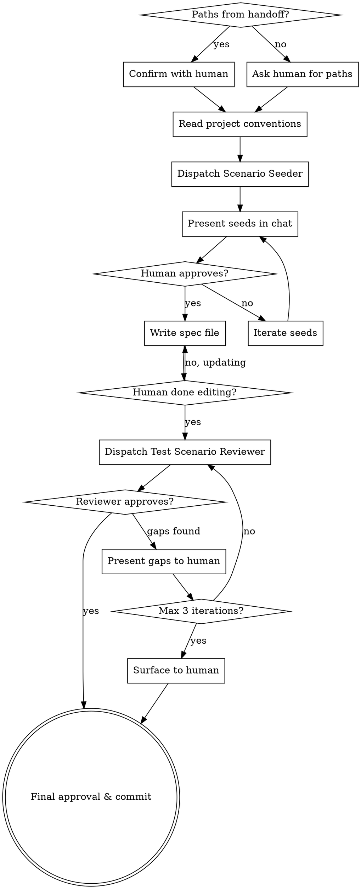

# Writing Test Scenario Specs

Author human-controlled acceptance criteria as scenario tables before implementation begins. Seeds scenarios from the design doc, validates coverage against the implementation plan.

**Where in the workflow:** brainstorming → writing-plans → **writing-test-scenario-specs** → subagent-driven-development

**What it produces:** A scenario spec file (structured markdown tables) — not test code.

**Announce at start:** "I'm using the writing-test-scenario-specs skill to author your test scenario spec."

<HARD-GATE>
Do NOT generate pytest code, invoke subagent-driven-development, or take any
implementation action. This skill produces a scenario specification document —
not test code. Test code generation is a separate concern.

If you find yourself writing `def test_`, `assert`, or `@pytest.mark` — STOP.
Delete the code. Return to the spec flow.
</HARD-GATE>

## Checklist

You MUST create a task for each item and complete them in order:

1. **Collect inputs** — confirm or request design doc and plan paths, read project conventions
2. **Seed scenarios** — dispatch Scenario Seeder subagent
3. **Coarse approval** — present seeds in chat, iterate with human
4. **Write spec file** — write to docs, wait for human fine-tuning
5. **Review against plan** — dispatch Test Scenario Reviewer, handle gaps
6. **Final approval & commit** — commit spec, announce next step

## Process Flow

## Step 1: Collect Inputs

Check if design doc and implementation plan paths are already in conversation context from a prior skill handoff.

- **If found:** Confirm with the human: "I see the design doc at `<path>` and plan at `<path>`. Correct?"
- **If not found:** Ask the human for both paths.

Then read the project's CLAUDE.md and scan the test directory for conventions — pytest markers, fixture patterns, naming style, line length. These conventions are passed to the Scenario Seeder so scenario language matches the project.

## Step 2: Seed Scenarios

Dispatch a **Scenario Seeder** subagent using the template in `scenario-seeder-prompt.md`.

Pass to the subagent:
- Design doc path
- Scenario spec template (from `scenario-spec-template.md`)
- Project test conventions discovered in Step 1

The seeder reads the design doc end-to-end and returns populated scenario tables (sections 1.0–1.4).

## Step 3: Coarse Approval

Present the seeded scenarios in chat as markdown tables. Ask:

> "Review these scenarios. Add, remove, or change anything — or say 'looks good' to proceed."

Iterate until the human says the scenarios look roughly right. Do not demand perfection — the human can fine-tune in their editor next.

## Step 4: Write Spec File

Write the approved scenarios to `docs/superpowers/specs/YYYY-MM-DD-<feature>-test-scenarios.md`.
(User preferences for spec location override this default.)

Tell the human:

> "Spec written to `<path>`. Open it in your editor to fine-tune wording, add details, or reorder scenarios. Let me know when you're done."

**Wait for the human to confirm** before proceeding. Do not rush past this step.

## Step 5: Review Against Plan

Dispatch a **Test Scenario Reviewer** subagent using the template in `test-scenario-reviewer-prompt.md`.

Pass to the subagent:
- Scenario spec file path
- Implementation plan file path

**If Approved:** Proceed to Step 6.

**If Gaps Found:** Present each gap with the reviewer's draft scenario rows. For each gap, ask the human to:
- **Accept** — add the suggested row to the spec
- **Modify** — edit the draft row before adding
- **Reject** — skip this gap

Update the spec file. Re-dispatch the reviewer. Repeat until approved or 3 iterations reached.

**After 3 iterations:** Surface remaining gaps to the human:

> "The reviewer still finds gaps after 3 rounds. Here they are — would you like to address them or proceed as-is?"

The human decides. Do not block indefinitely.

## Step 6: Final Approval & Commit

Ask:

> "Scenario spec is complete. Ready to commit?"

Commit the spec file. Announce:

> "Spec committed. Next step: begin implementation with `superpowers:subagent-driven-development`."

## Anti-Patterns

| Rationalization | Counter |
|-----------------|---------|
| "The plan already covers testing" | Plan covers tasks. Spec covers acceptance criteria. Different artifacts. |
| "This is too simple to need a spec" | Simple features drift silently. Present the template. |
| "I'll write the spec after implementation" | Spec-after is post-hoc justification, not acceptance criteria. |
| "Skip the spec, just implement" | Refuse. Re-present the template. |
| Agent writes test code before spec | This skill does not generate code. Delete and restart. |
| Agent invents scenarios not in design doc | Remove them. Only design-doc-derived scenarios in the seed. |

## Red Flags — STOP

If you catch yourself doing any of these, stop and return to the spec flow:

- Writing `def test_` or `assert` statements
- Invoking subagent-driven-development before the spec is committed
- Adding scenarios the design doc does not mention
- Skipping human approval at Steps 3, 4, or 6
- Presenting the spec without waiting for human confirmation

## Project Adaptation

This skill is not tied to a specific project. At activation (Step 1), it reads:
- The project's `CLAUDE.md` for test conventions, code style, and patterns
- The test directory structure for naming and fixture patterns
- These conventions are passed to the Scenario Seeder subagent so that scenario names, precondition descriptions, and step language match the project
