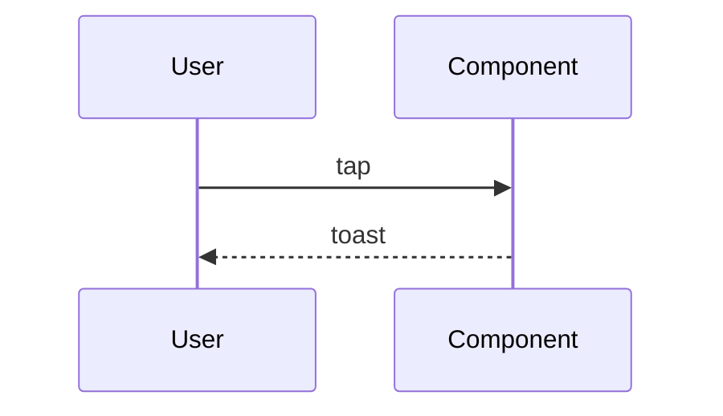

# Fixture Feature Spec

## §1 产品视角（owner: PM）

### 产品逻辑

Fixture spec 用于验证 `generate-spec-html.mjs` 渲染。

### 验收标准（AC）

- [ ] AC-1：用户可看到 feature 入口
- [ ] AC-2：feature 开关在 settings 中可关闭

## §2 设计视角（owner: 设计师）

### 关键交互

`tap` → reveal toast 2s → fade out。

## §3 研发视角（owner: 研发）

### 技术架构

### Test plan 骨架

- 单测：`describe('FixtureFeature')` 覆盖 happy + edge
- 集成：Playwright `fixture-feature.spec.ts`

## §4 Cross-viewpoint Open Issues

- [ ] 配色与品牌 token 一致性待 designer 确认

## §5 L1 Impact

### Affected capabilities

- `docs/reference/capabilities/playback.md`

### ADDED Requirements

- The system MUST surface the fixture feature toast.

### MODIFIED Requirements

- 原 "{old}" → "{new}"（理由：fixture 演示 diff 渲染）

### REMOVED Requirements

- 无

## §6 Pipeline Tier

**决策**：Normal

**Rationale**：
- 命中 "§5 含 ADDED 项"
- 未命中 Large

## §7 Doc Impact

### 受影响文档

- `docs/reference/architecture.md`

### 不影响的明确声明

- AGENTS.md - 不需要

## §K Knowledge References

- **Async error handling** ([K-guidelines-014](../../reference/guidelines/error-handling-async.md)) — 应用于 §3 实现策略
