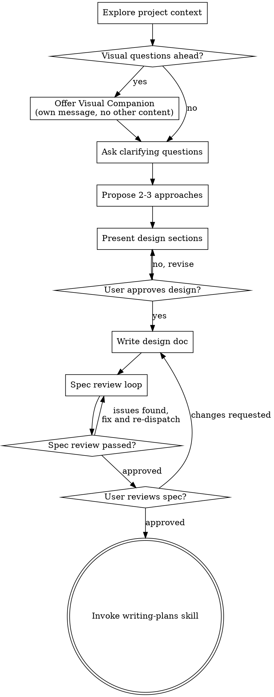

# 将构思转化为设计

通过自然的协作对话，帮助将想法转化为完整的设计和规格说明。

首先了解当前项目背景，然后逐一提问以完善想法。一旦明确要构建什么，便呈现设计并获得用户批准。

<HARD-GATE>
在展示设计并获得用户批准之前，切勿调用任何实现技能、编写任何代码、搭建任何项目或采取任何实现行动。无论项目看起来多么简单，这都适用于每一个项目。
</HARD-GATE>

## 反模式：“这太简单了，不需要设计”

每个项目都会经历这个过程。待办事项列表、单功能工具、配置更改——所有这些都是如此。“简单”的项目正是未经验证的假设导致最多无用功的地方。设计可以简短（对于真正简单的项目，几句话即可），但你必须呈现它并获得批准。

## 检查清单

你必须为以下每一项创建任务，并按顺序完成：

1. **探索项目背景** — 检查文件、文档、近期提交记录
2. **提供视觉辅助**（如果主题涉及视觉问题）— 这是独立的消息，不与澄清问题合并。请参阅下方的视觉辅助部分。
3. **提出澄清问题** — 一次一个，理解目的/约束/成功标准
4. **提出2-3种方案** — 包括权衡利弊和你的建议
5. **呈现设计** — 按复杂度分节呈现，每节后获取用户批准
6. **撰写设计文档** — 保存至 `docs/superpowers/specs/YYYY-MM-DD-<topic>-design.md` 并提交
7. **规范评审循环** — 派遣规范文档评审子代理，附带精确构建的评审上下文（切勿使用你的会话历史）；修复问题并重新派遣直至批准（最多3次迭代，然后提交给人工处理）
8. **用户评审书面规范** — 请用户在继续前评审规范文件
9. **过渡到实施阶段** — 调用写作计划技能以创建实施计划

## 流程

**终端状态是调用 writing-plans。** 在头脑风暴之后，请勿调用 frontend-design、mcp-builder 或任何其他实施技能。头脑风暴后调用的唯一技能是 writing-plans。

## 流程详解

**理解想法：**

* 首先查看当前项目状态（文件、文档、最近的提交记录）
* 在提出详细问题之前，评估范围：如果请求描述了多个独立的子系统（例如，“构建一个包含聊天、文件存储、计费和数据分析的平台”），请立即指出这一点。不要花费问题去细化一个需要首先分解的项目细节。
* 如果项目对于单个规格来说太大，帮助用户分解为子项目：哪些是独立的部分，它们如何关联，应该按什么顺序构建？然后通过正常的设计流程对第一个子项目进行头脑风暴。每个子项目都有自己的规格 → 计划 → 实施周期。
* 对于范围合适的项目，逐一提问以完善想法
* 可能的情况下，优先使用多项选择题，但开放式问题也可以
* 每条消息只提一个问题 - 如果一个主题需要更多探索，将其分解为多个问题
* 专注于理解：目的、约束、成功标准

**探索方案：**

* 提出 2-3 种不同的方案，附带权衡分析
* 以对话方式呈现选项，并给出你的建议和理由
* 首先介绍你推荐的选项并解释原因

**呈现设计：**

* 一旦确信理解了要构建什么，便呈现设计
* 根据复杂性调整每个章节：如果直接明了，几句话即可；如果复杂，最多 200-300 字
* 在每个章节后询问是否看起来正确
* 涵盖：架构、组件、数据流、错误处理、测试
* 准备好返回澄清任何不清楚的地方

**为隔离性和清晰性而设计：**

* 将系统分解为更小的单元，每个单元都有一个明确的目的，通过定义良好的接口进行通信，并且可以独立理解和测试
* 对于每个单元，你应该能够回答：它做什么，如何使用它，以及它依赖什么？
* 是否有人无需阅读其内部实现就能理解一个单元的功能？是否可以在不破坏消费者的情况下更改其内部实现？如果不能，那么边界需要改进。
* 更小、边界清晰的单元也更容易让你处理——你能更好地推理那些可以一次性把握上下文的代码，并且当文件聚焦时，你的编辑更可靠。当一个文件变得庞大时，这通常是它承担过多职责的信号。

**在现有代码库中工作：**

* 在提出更改之前，探索当前结构。遵循现有模式。
* 如果现有代码存在影响当前工作的问题（例如，文件变得过于庞大、边界不清晰、职责纠缠），将有针对性的改进作为设计的一部分——就像优秀的开发人员会改进他们正在工作的代码一样。
* 不要提出无关的重构。专注于服务于当前目标的内容。

## 设计之后

**文档：**

* 将验证过的设计（规格）写入 `docs/superpowers/specs/YYYY-MM-DD-<topic>-design.md`
  * （用户对规格文件位置的偏好会覆盖此默认设置）
* 如果可用，使用 elements-of-style:writing-clearly-and-concisely 技能
* 将设计文档提交到 git

**规格审查循环：**
编写规格文档后：

1. 派遣规范文档评审子代理（参见 spec-document-reviewer-prompt.md）
2. 如果发现问题：修复、重新派遣、重复直至批准
3. 如果循环超过3次迭代，提交给人工指导

**用户审查关卡：**
在规格审查循环通过后，请用户在继续之前审查书面规格：

> “规格已编写并提交到 `<path>`。请在开始编写实施计划之前审查它，并告知是否需要进行任何更改。”

等待用户的回应。如果他们要求更改，进行更改并重新运行规格审查循环。只有在用户批准后才继续。

**实施：**

* 调用 writing-plans 技能来创建详细的实施计划
* 请勿调用任何其他技能。writing-plans 是下一步。

## 关键原则

* **一次一个问题** —— 不要用多个问题压倒对方
* **优先多项选择** —— 可能的情况下，比开放式问题更容易回答
* **无情地应用 YAGNI** —— 从所有设计中移除不必要的功能
* **探索替代方案** —— 在确定方案前，始终提出 2-3 种方法
* **增量验证** —— 呈现设计，获得批准后再继续
* **保持灵活** —— 当某些内容不清楚时，返回澄清

## 视觉辅助工具

一个基于浏览器的辅助工具，用于在头脑风暴期间展示线框图、图表和视觉选项。作为工具提供——而非模式。接受辅助工具意味着它可用于那些受益于视觉处理的问题；这并不意味着每个问题都要通过浏览器处理。

**提供辅助工具：** 当你预期即将到来的问题会涉及视觉内容（线框图、布局、图表）时，为征求同意提供一次：

> “我们正在处理的一些内容，如果能通过网页浏览器向你展示，可能会更容易解释。我可以随时准备线框图、图表、比较和其他视觉效果。这个功能还比较新，可能会消耗较多 token。想试试吗？（需要打开本地 URL）”

**此提议必须是独立的消息。** 不要将其与澄清问题、背景摘要或任何其他内容合并。消息应仅包含上述提议，别无其他。在继续之前等待用户的回应。如果他们拒绝，则继续进行纯文本头脑风暴。

**按问题决定：** 即使用户接受了，也要为每个问题决定是使用浏览器还是终端。判断标准是：**用户通过看到它比通过阅读它更能理解吗？**

* **使用浏览器** 处理**是**视觉的内容 —— 线框图、布局比较、架构图、并排视觉设计
* **使用终端** 处理文本内容 —— 需求问题、概念选择、权衡列表、A/B/C/D 文本选项、范围决策

关于 UI 主题的问题不自动成为视觉问题。“在这种情况下，‘个性’意味着什么？”是一个概念问题——使用终端。“哪个向导布局效果更好？”是一个视觉问题——使用浏览器。

如果他们同意使用辅助工具，请在继续之前阅读详细指南：
`skills/brainstorming/visual-companion.md`
