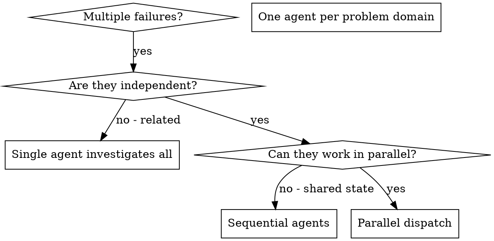

# 调度并行智能体

## 概述

您将任务委派给具有隔离上下文的专业智能体。通过精心设计它们的指令和上下文，确保它们保持专注并成功完成任务。它们绝不应继承您会话的上下文或历史记录——您精确地构建它们所需的一切。这也有助于保留您自己的上下文以进行协调工作。

当您遇到多个不相关的故障（不同的测试文件、不同的子系统、不同的错误）时，按顺序调查它们会浪费时间。每项调查都是独立的，可以并行进行。

**核心原则：** 为每个独立的问题领域调度一个智能体。让它们并发工作。

## 何时使用



**在以下情况使用：**

* 3个以上测试文件因不同的根本原因而失败
* 多个子系统独立损坏
* 每个问题无需其他问题的上下文即可理解
* 调查之间没有共享状态

**不要在以下情况使用：**

* 故障是相关的（修复一个可能修复其他）
* 需要理解完整的系统状态
* 智能体会相互干扰

## 模式

### 1. 识别独立领域

按损坏内容对故障进行分组：

* 文件 A 测试：工具审批流程
* 文件 B 测试：批处理完成行为
* 文件 C 测试：中止功能

每个领域都是独立的——修复工具审批不会影响中止测试。

### 2. 创建专注的智能体任务

每个智能体获得：

* **特定范围：** 一个测试文件或子系统
* **明确目标：** 使这些测试通过
* **约束：** 不要更改其他代码
* **预期输出：** 发现和修复的内容摘要

### 3. 并行调度

```typescript
// In Claude Code / AI environment
Task("Fix agent-tool-abort.test.ts failures")
Task("Fix batch-completion-behavior.test.ts failures")
Task("Fix tool-approval-race-conditions.test.ts failures")
// All three run concurrently
```

### 4. 审查与集成

当智能体返回时：

* 阅读每个摘要
* 验证修复没有冲突
* 运行完整的测试套件
* 集成所有更改

## 智能体提示结构

好的智能体提示是：

1. **专注的** - 一个明确的问题领域
2. **自包含的** - 理解问题所需的所有上下文
3. **输出具体** - 智能体应返回什么？

```markdown
修复 `src/agents/agent-tool-abort.test.ts` 中 3 个失败的测试：

1. **"should abort tool with partial output capture"** - 预期消息中包含 'interrupted at'
2. **"should handle mixed completed and aborted tools"** - 快速工具被中止而非完成
3. **"should properly track pendingToolCount"** - 预期 3 个结果但得到 0

这些是时序/竞态条件问题。你的任务：

1. 阅读测试文件并理解每个测试的验证内容
2. 识别根本原因 - 是时序问题还是实际错误？
3. 通过以下方式修复：
   - 将任意超时替换为基于事件的等待
   - 如果发现错误，修复中止实现中的问题
   - 如果测试行为改变，调整测试预期

不要仅仅增加超时时间 - 找出真正的问题。

返回：总结你发现的问题以及修复的内容。
```

## 常见错误

**❌ 范围太广：** "修复所有测试" - 智能体迷失方向
**✅ 具体明确：** "修复 agent-tool-abort.test.ts" - 专注的范围

**❌ 没有上下文：** "修复竞态条件" - 智能体不知道在哪里
**✅ 提供上下文：** 粘贴错误消息和测试名称

**❌ 没有约束：** 智能体可能会重构所有内容
**✅ 设置约束：** "请勿更改生产代码" 或 "仅修复测试"

**❌ 输出模糊：** "修复它" - 您不知道改变了什么
**✅ 具体输出：** "返回根本原因和更改的摘要"

## 何时不应使用

**相关故障：** 修复一个可能修复其他——先一起调查
**需要完整上下文：** 理解需要查看整个系统
**探索性调试：** 您还不知道哪里坏了
**共享状态：** 智能体会相互干扰（编辑相同文件，使用相同资源）

## 会话中的真实示例

**场景：** 重大重构后，3个文件出现6个测试失败

**故障：**

* agent-tool-abort.test.ts：3个故障（时序问题）
* batch-completion-behavior.test.ts：2个故障（工具未执行）
* tool-approval-race-conditions.test.ts：1个故障（执行计数 = 0）

**决策：** 独立领域——中止逻辑独立于批处理完成，批处理完成独立于竞态条件

**调度：**

```
Agent 1 → 修复 agent-tool-abort.test.ts
Agent 2 → 修复 batch-completion-behavior.test.ts
Agent 3 → 修复 tool-approval-race-conditions.test.ts
```

**结果：**

* 智能体 1：用基于事件的等待替换了超时
* 智能体 2：修复了事件结构错误（threadId 位置错误）
* 智能体 3：添加了等待异步工具执行完成的逻辑

**集成：** 所有修复都是独立的，没有冲突，完整套件通过

**节省的时间：** 并行解决3个问题 vs 顺序解决

## 主要优势

1. **并行化** - 多项调查同时进行
2. **专注** - 每个智能体范围狭窄，需要跟踪的上下文更少
3. **独立性** - 智能体互不干扰
4. **速度** - 解决3个问题的时间相当于解决1个问题

## 验证

智能体返回后：

1. **审查每个摘要** - 了解更改了什么
2. **检查冲突** - 智能体是否编辑了相同的代码？
3. **运行完整套件** - 验证所有修复协同工作
4. **抽查** - 智能体可能会犯系统性错误

## 实际影响

来自调试会话（2025-10-03）：

* 3个文件出现6个故障
* 并行调度了3个智能体
* 所有调查并发完成
* 所有修复成功集成
* 智能体更改之间零冲突
