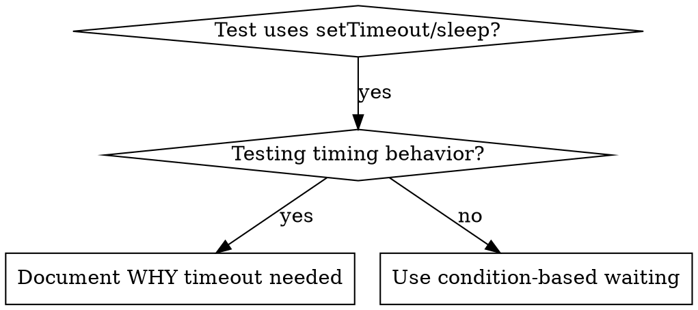

# 基于条件的等待

## 概述

不稳定的测试通常通过任意延迟来猜测时机。这会导致竞态条件：测试在快速机器上通过，但在负载下或 CI 环境中失败。

**核心原则：** 等待你真正关心的条件，而不是猜测需要多长时间。

## 何时使用



**在以下情况使用：**

* 测试中存在任意延迟（`setTimeout`，`sleep`，`time.sleep()`）
* 测试不稳定（有时通过，在负载下失败）
* 并行运行时测试超时
* 等待异步操作完成

**不要在以下情况使用：**

* 测试实际的计时行为（防抖、节流间隔）
* 如果使用任意超时，务必记录原因

## 核心模式

```typescript
// ❌ BEFORE: Guessing at timing
await new Promise(r => setTimeout(r, 50));
const result = getResult();
expect(result).toBeDefined();

// ✅ AFTER: Waiting for condition
await waitFor(() => getResult() !== undefined);
const result = getResult();
expect(result).toBeDefined();
```

## 快速模式

| 场景 | 模式 |
|----------|---------|
| 等待事件 | `waitFor(() => events.find(e => e.type === 'DONE'))` |
| 等待状态 | `waitFor(() => machine.state === 'ready')` |
| 等待计数 | `waitFor(() => items.length >= 5)` |
| 等待文件 | `waitFor(() => fs.existsSync(path))` |
| 复杂条件 | `waitFor(() => obj.ready && obj.value > 10)` |

## 实现

通用轮询函数：

```typescript
async function waitFor<T>(
  condition: () => T | undefined | null | false,
  description: string,
  timeoutMs = 5000
): Promise<T> {
  const startTime = Date.now();

  while (true) {
    const result = condition();
    if (result) return result;

    if (Date.now() - startTime > timeoutMs) {
      throw new Error(`Timeout waiting for ${description} after ${timeoutMs}ms`);
    }

    await new Promise(r => setTimeout(r, 10)); // Poll every 10ms
  }
}
```

完整实现请参阅本目录中的 `condition-based-waiting-example.ts`，其中包含来自实际调试会话的领域特定助手（`waitForEvent`，`waitForEventCount`，`waitForEventMatch`）。

## 常见错误

**❌ 轮询过快：** `setTimeout(check, 1)` - 浪费 CPU
**✅ 修复：** 每 10ms 轮询一次

**❌ 没有超时：** 如果条件从未满足，则无限循环
**✅ 修复：** 始终包含超时并给出明确的错误信息

**❌ 陈旧数据：** 在循环前缓存状态
**✅ 修复：** 在循环内调用获取器以获取最新数据

## 何时使用任意超时是正确的

```typescript
// Tool ticks every 100ms - need 2 ticks to verify partial output
await waitForEvent(manager, 'TOOL_STARTED'); // First: wait for condition
await new Promise(r => setTimeout(r, 200));   // Then: wait for timed behavior
// 200ms = 2 ticks at 100ms intervals - documented and justified
```

**要求：**

1. 首先等待触发条件
2. 基于已知的计时（而非猜测）
3. 注释说明原因

## 实际影响

来自调试会话（2025-10-03）：

* 修复了 3 个文件中的 15 个不稳定测试
* 通过率：60% → 100%
* 执行时间：加快 40%
* 不再出现竞态条件
